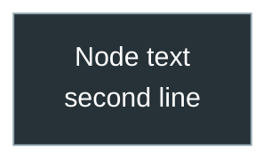

# CLAUDE.md — Agent-Oriented Guide: PY-Course-Victor-Nikoriak-22-09-2026

> Authoritative entry point for AI agents working in this repository.
> Read this file entirely before touching code, notebooks, or tooling.
> This repo is the **v5.0 migration target**, replacing `PY-Course-Victor-Nikoriak-23_02`. See `data/plan_md/migration_plan.md` for the full migration plan and current phase.

---

## Course Identity

| Field | Value |
|-------|-------|
| **Name** | PY Course — Viktor Nikoriak |
| **Language** | Ukrainian (primary), English (technical terms) |
| **Level** | Beginner → Intermediate Python |
| **Instructor** | Viktor Nikoriak (Hydrologist, PhD student, Python Developer) |
| **GitHub** | https://github.com/NikoriakViktot/PY-Course-Victor-Nikoriak-22-09-2026 |
| **Audience** | Ukrainian-speaking students, groups 1–4 |
| **Architecture** | Theory lives as an MkDocs "book" under `docs/` (see `mkdocs.yml`); lesson notebooks keep short in-context explanation + task, not full theory. |

---

## Repository Structure (current — not aspirational)

```
PY-Course-Victor-Nikoriak-22-09-2026/
├── CLAUDE.md                   ← this file (gitignored — instructor-local only)
├── README.md                   ← short student-facing entry point (Ukrainian)
├── course.yaml                 ← Course/module config (source of truth; used by Django LMS sync)
├── course.json                 ← Course/module config (generated mirror of course.yaml)
├── mkdocs.yml                  ← book config (MkDocs Material)
├── requirements-docs.txt       ← deps for building the book (mkdocs-material)
├── architecture.md, instructor.md
│
├── docs/                       ← the book (docs_dir for mkdocs)
│   ├── index.md
│   ├── 00_getting_started/     ← git/environment/homework-workflow/troubleshooting + github/ subsection
│   ├── modules/                ← per-module stub pages (М1–М6 + AI bonus), content pending
│   └── 00_python_mental_model.md, 01_zen_of_python.md, git-cheatsheet.md
│
├── module_1/                   ← Module 1 (copied from the old repo, not yet re-audited against v5.0)
│   ├── docs/                   ← Module 1 reference notebooks (separate from the top-level docs/ book)
│   └── lessons/                ← lesson_03_… through lesson_12_…
│
├── assignments/                ← empty — homework not migrated yet
├── certificates/                ← beetroot_python_2021.md only
│
├── data/                       ← gitignored — planning/source material, not published
│   ├── plan_md/migration_plan.md
│   ├── PY_UKR_Navigation_table_5 [UPDATE].xlsx   ← authoritative v5.0 curriculum source
│   └── v.5.0/, Модуль 1. Python core/            ← legacy raw source material
│
└── .github/workflows/docs.yml  ← builds/publishes docs/ to GitHub Pages on push
```

**Not yet migrated from the old repo** (planned, not present): `module_2/`–`module_4/`, `requirements.txt`, `SETUP.md`, `install_course.*`/`start_course.*`, `dashboard.ipynb`, `tools/`, `generator/`, `run_data/`, `docker-compose.yml`. The old `module_5` (Django/DevOps content) is **deliberately not migrated** — it isn't part of the v5.0 navigation table; see `data/plan_md/migration_plan.md` §0. Do not assume any of these exist without checking.

---

## Lesson Structure & Naming Convention

### Folder naming
```
module_<N>/lessons/lesson_<NN>_<topic_slug>/
```
Example: `module_1/lessons/lesson_04_boolean_logic_and_control/`

### Files inside each lesson

| File pattern | Purpose |
|---|---|
| `*_student.ipynb` | Student-facing notebook (solutions stripped) |
| `konspekt_*.ipynb` or `notes_*.ipynb` | Instructor lecture notes |
| `python_lesson_*_grup_N.ipynb` | Group-specific variant (groups 1–4) |
| `final_project_auto.ipynb` | Automated final project for the lesson |
| `*.py` modules | Example modules taught in the lesson |
| `<project>/` subfolder | Mini-project (e.g., `calculator_project/`) |

### Notebook cell conventions

```python
# Protected system cell (do NOT remove or reorder)
# Cell has metadata: {"tags": ["instructor"]} + {"hide_input": true}
SYSTEM_READY = True
COMPLETED_TASKS = []

def require_system():
    ...

def require_student(student_name):
    ...
```

- **🔒 protected cells** — `"tags": ["instructor"]` — students cannot edit
- **Solution blocks** — wrapped in `# BEGIN SOLUTION … # END SOLUTION`
- `tools/generate_student.py` strips solution blocks to produce `*_student.ipynb`

### Kernel metadata (all notebooks must use this)
```json
{
  "kernelspec": {
    "display_name": "Python Course (.venv)",
    "name": "python-course"
  },
  "language_info": { "name": "python", "version": "3.10.0" }
}
```

---

## Tools & Automation

> ⚠️ None of `tools/`, `generator/`, `dashboard.ipynb` have been migrated into this repo yet — this section documents the intended tooling from the old repo for when that migration phase happens. Don't reference these paths as if they exist here.

### generate_student.py — Create student notebooks
```bash
# Strip solutions from all master notebooks
python tools/generate_student.py --all

# Strip a specific notebook
python tools/generate_student.py lessons/04_boolean_logic_and_control/konspekt_bool_logic.ipynb
```
- Removes all `# BEGIN SOLUTION … # END SOLUTION` blocks
- Removes cells tagged `"instructor"`
- Output: `*_student.ipynb` in same folder

### qa_suite.py — QA & load testing
```bash
python tools/qa_suite.py --unit        # Unit tests for API
python tools/qa_suite.py --lesson4     # Tests for lesson 4
python tools/qa_suite.py --lesson5     # Tests for lesson 5
python tools/qa_suite.py --progress    # Progress tracking tests
python tools/qa_suite.py --load        # Simulate 20 concurrent students (10 workers)
```

### config.json — Active lesson control
```json
{
  "lessons": {
    "04_exam": { "active": true,  "task_ids": [...] },
    "05_exam": { "active": false, "task_ids": [...] }
  }
}
```
Set `active: true` to enable a lesson's API submission endpoint.

### dashboard.ipynb — Admin scoreboard
- Run with Jupyter (not Voila)
- Fetches live data from Google Apps Script
- Shows leaderboard with Bronze/Silver/Gold/Platinum levels
- Color coding: 🟢 ≥70% · 🟡 40–69% · 🔴 <40%

---

## Student GitHub Workflow (Submission Process)

```
Instructor repo (upstream)
        │  fork
        ▼
Student repo (origin)
        │  clone locally
        ▼
git checkout -b homework-04
        │  work on assignment
        ▼
git add . && git commit -m "Homework 04"
git push origin homework-04
        │  open PR: homework-04 → main
        ▼
Instructor reviews → comments in PR
        │  student fixes
        ▼
git add . && git commit -m "Fix after review"
(PR updates automatically)
```

---

## Environment Setup

```bash
# Install (creates .venv)
python install_course.py          # cross-platform
install_course.bat                # Windows shortcut

# Launch (Voila test mode)
python start_course.py            # interactive menu → opens http://localhost:8891
start_course.bat                  # Windows shortcut

# Manual Jupyter editing mode
.venv/Scripts/activate            # Windows
source .venv/bin/activate         # macOS/Linux
jupyter notebook
```

**Python version:** 3.10+
**Key dependencies:** voila, ipywidgets, numpy, pandas, matplotlib, seaborn, scikit-learn, requests, sympy

---

## API & Backend

- **Backend:** Google Apps Script (URL in `tools/config.json`)
- **Auth:** `ADMIN_KEY` from `.env` (64-char hash, keep secret)
- **Submission endpoint:** POST — student task results
- **Progress endpoint:** GET — per-student completion data
- **Client:** `tools/client.py` (token-based session management)

**Rule:** Never hardcode the `ADMIN_KEY` in notebooks or source files.

---

## Pedagogical Philosophy (for content generation)

### 5 Core Python Mental Model Concepts (from `module_1/docs/00_python_mental_model.md`)
1. **Interpreter** — Python is a program that runs `.py` files
2. **pip** — package manager; installs into the active environment
3. **venv** — isolated environment; always activate before installing
4. **IDE** — a tool, not the language (PyCharm, VS Code)
5. **Notebook** — interface to a running kernel (not a standalone program)

**Golden Rule for students:** Activate env → Install → Run

### Zen of Python (from `module_1/docs/01_zen_of_python.md`)
Integrate these principles in all new lesson content:
- Beautiful > ugly · Explicit > implicit · Simple > complex
- Readability counts · One obvious way · Errors should never pass silently

---

## LMS Metadata — Required in Every Notebook

> ⚠️ **Not connected yet.** The Django 5 LMS (`Python_Curse`) still points `GITHUB_COURSE_REPO` at the old repo (`PY-Course-Victor-Nikoriak-23_02`), not this one — switching it over is the last phase of the migration (see `data/plan_md/migration_plan.md`). The block below documents the metadata contract this repo must eventually satisfy, not something already wired up here.
>
> Once connected: this repository becomes a **Django 5 LMS** (Python_Curse project) source. Students log in via GitHub OAuth and access notebooks through the LMS. `main` branch is the **single source of truth** for the LMS sync.

### How sync works

```
GitHub push → webhook → Django server
    → sync_lessons  reads notebooks from repo → creates ContentNode per lesson
    → sync_exams    reads server-side JSON files → links Exam to ContentNode
```

`sync_lessons` uses `metadata.lms.lesson_slug` to set `ContentNode.slug`.
`sync_exams` matches `exam_json.lesson_id` to `ContentNode.slug`.
**These two must match for exams to work.**

### Required `lms` block in every notebook's metadata

```json
{
  "lms": {
    "course": "python-course",
    "stream": "spring-2026",
    "lesson_number": 3,
    "lesson_slug": "variables_and_data_types",
    "lesson_title": "Variables And Data Types",
    "notebook_type": "notes",
    "version": 1
  }
}
```

| Field | Required | Value pattern |
|-------|----------|---------------|
| `course` | ✅ | always `"python-course"` |
| `stream` | ✅ | always `"spring-2026"` |
| `lesson_number` | ✅ | integer (3–N) |
| `lesson_slug` | ✅ | must match `lesson_id` in the server-side exam JSON |
| `lesson_title` | ✅ | human-readable title in English |
| `notebook_type` | ✅ | `"notes"` for lecture notebooks |
| `version` | ✅ | `1` |

### Exam JSON (`data/lesson_NN_exam.json`) — server-side

```json
{
  "lesson_id": "variables_and_data_types",
  "title": "Exam Title",
  "version": 2,
  "questions": [ ... ]
}
```

`lesson_id` MUST match `lms.lesson_slug` in the corresponding notebook.

### Current lesson slugs

| Lesson | Directory | `lesson_slug` |
|--------|-----------|---------------|
| 03 | `lesson_03_variables_and_data_types` | `variables_and_data_types` |
| 04 | `lesson_04_boolean_logic_and_control` | `boolean_logic_and_control` |
| 05 | `lesson_05_modules_imports_cli` | `modules_imports_cli` |
| 06 | `lesson_06_lists_tuples_sets` | `lists_tuples_sets` |
| 07 | `lesson_07_loops_dicts_comprehensions` | `loops_dicts_comprehensions` |
| 08 | `lesson_08_functions` | `functions` |
| 09 | `lesson_09_modules_standard_library` | `modules_standard_library` |
| 10 | `lesson_10_exceptions_error_handling` | `exceptions_error_handling` |
| 11 | `lesson_11_file_io_json` | `file_io_json` |
| 12 | `lesson_12_module1_review` | `module_01_final_exam` |

> ⚠️ Lesson 12 uses slug `module_01_final_exam` (not the directory name pattern)
> because the server-side `lesson_12_exam.json` uses `"lesson_id": "module_01_final_exam"`.

### After adding metadata — run on server

```bash
make sync-lessons   # creates/updates ContentNode in Django DB
make sync-exams     # links exam JSON to ContentNode
```

### Troubleshooting sync

If `sync_exams` says "Lesson not found for lesson_id":
1. Check `lesson_slug` in notebook metadata matches `lesson_id` in exam JSON
2. Run `make sync-lessons` first, then `make sync-exams`
3. Query actual slugs in DB:
   ```bash
   docker compose exec web python manage.py shell -c "
   from apps.courses.models import ContentNode
   print(list(ContentNode.objects.filter(type='lesson').values_list('slug', flat=True).order_by('order')))
   "
   ```

---

## Adding a New Lesson

1. Create `module_N/lessons/lesson_NN_topic_slug/` following the naming convention
2. Create `__init__.py` (empty)
3. Write **master notebook** (instructor version with full solutions)
4. **Add `lms` metadata block** (see LMS Metadata section above) — **required for Django sync**
   - Set `module_number`, `module_slug`, `module_title` to match the parent module
   - Set `notebook_path` to the relative repo path of the notebook file
5. Add protected system cell with `SYSTEM_READY`, `COMPLETED_TASKS`, `require_system()`, `require_student()`
6. Wrap solutions in `# BEGIN SOLUTION … # END SOLUTION`
7. Tag instructor-only cells with `"tags": ["instructor"]`
8. Run `python tools/generate_student.py module_N/lessons/lesson_NN_topic_slug/` to produce `*_student.ipynb`
9. Add lesson config to `tools/config.json`
10. Update `course.yaml` and `course.json` — add lesson number to the module's `lessons` array
11. Run `python tools/qa_suite.py --unit` to verify API integration
12. Push to `main` → webhook triggers `sync_lessons` automatically

---

## Mermaid Diagram Standards

> Apply to every `diagrams_lesson_NN_*.md` file and any Mermaid block inside notebooks.

### Dark-theme color system (mandatory)

```
classDef step     fill:#263238,stroke:#90a4ae,color:#ffffff;
classDef decision fill:#37474f,stroke:#64b5f6,color:#ffffff;
classDef success  fill:#1b5e20,stroke:#4CAF50,color:#ffffff;
classDef error    fill:#4e1f1f,stroke:#f44336,color:#ffffff;
classDef warning  fill:#4a3b00,stroke:#ff9800,color:#ffffff;
```

**Semantic usage:**

| Class | Use when |
|-------|----------|
| `step` | Normal algorithm steps, neutral tree nodes, regular flow |
| `decision` | Condition/question nodes (`{...}`), neutral comparison panels |
| `success` | Correct result, valid structure, recommended approach |
| `error` | Mistake, invalid case, dangerous operation, deprecated pattern |
| `warning` | Important architectural rule, gotcha, critical note, trick |

### Absolute prohibitions

- **Never** use `style NodeID fill:#...` inline — only `classDef` + `class NodeID className`
- **Never** use light backgrounds: `#e3f2fd`, `#fff9c4`, `#c8e6c9`, `#ffebee`, `#e8f5e9`, etc.
- **Never** use `mindmap` — convert to `flowchart TD` (mindmap is unstable in renderers)
- **Never** use `\n` inside node labels — use `<br>` instead
- **Never** style subgraphs with `style SUBGRAPH_ID fill:#...`

### Text rules

- Max 2 lines per node
- Remove filler prefixes ("Крок 1:", "Step 2:") — use content directly
- Lowercase conditionals: `так` / `ні` (not `ТАК` / `НІ`)
- One node = one idea; split long sentences into chained nodes

### Diagram type conventions

| Use case | Diagram type |
|----------|-------------|
| Algorithm steps / flow | `flowchart TD` |
| Component comparison (side by side) | `graph LR` |
| Tree / hierarchy structure | `graph TD` |
| Taxonomy / categories | `flowchart TD` (not mindmap) |

### Template — every diagram starts with



---

## Agent Decision Guide

| Task | Where to start |
|------|----------------|
| Add new lesson content | `module_N/lessons/` → follow naming convention → run generate_student.py |
| Strip solutions from notebook | `tools/generate_student.py` |
| Check/change active lesson | `tools/config.json` |
| Test API backend | `tools/qa_suite.py --unit` |
| Load test (concurrent students) | `tools/qa_suite.py --load` |
| View student progress | `dashboard.ipynb` (run in Jupyter) |
| Update repo/GitHub workflow docs | `architecture.md` |
| Update Python mental model doc | `module_1/docs/00_python_mental_model.md` |
| Add reference doc for a topic | `module_1/docs/<topic>_docs.ipynb` |
| Fix submission client | `tools/client.py` |
| Change launcher behavior | `start_course.py` |
| Update instructor bio | `instructor.md` |

---

## Critical Rules

- **Never** expose `ADMIN_KEY` from `.env` in notebooks or commits
- **Never** modify `*_student.ipynb` files manually — they are always generated via `tools/generate_student.py`
- **Always** use the `.venv` kernel (`python-course`) in notebooks — not the system Python
- **Never** remove or reorder the protected system cell (🔒) in lesson notebooks
- Lesson numbering starts at **03** (lessons 01–02 are intro/setup, not yet in repo)
- All lessons live under `module_N/lessons/` — **not** in a root-level `lessons/` folder
- `assignments/` folder structure mirrors lesson numbering (HW3 ↔ lesson 03)
- When adding a lesson, always update `course.yaml` and `course.json` module `lessons` arrays