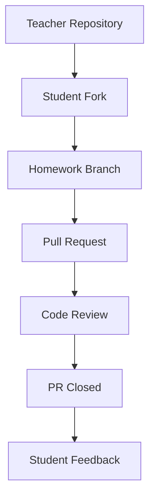
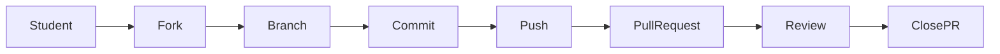

# Архітектура репозиторію

Цей документ описує структуру та робочий процес репозиторію курсу.

Мета репозиторію — організувати матеріали курсу Python, домашні завдання
та взаємодію студентів через GitHub.

---

# Структура репозиторію

```
PY-Course-Victor-Nikoriak-22-09-2026
│
├── module_1/                        ← М1. Python Core (уроки 1–17 за програмою v5.0)
│   ├── docs/                        ← Довідкові ноутбуки модуля 1 (*_docs.ipynb)
│   └── lessons/                     ← Уроки модуля 1: lesson_NN_<тема>, NN = номер уроку v5.0
│       ├── lesson_01_intro_and_course_format/
│       ├── lesson_02_first_steps_environment_setup/
│       ├── lesson_03_variables_and_data_types/
│       ├── lesson_04_conditions_and_control/
│       ├── lesson_05_lists_tuples_sets/
│       ├── lesson_06_dicts_loops_comprehensions/
│       ├── lesson_07_functions/
│       ├── lesson_08_practicum_big_o/
│       ├── lesson_09_decorators/
│       ├── lesson_10_iterators_generators/
│       ├── lesson_11_practicum_search/
│       ├── lesson_12_modules_stdlib/
│       ├── lesson_13_exceptions/
│       ├── lesson_14_file_io_json/
│       ├── lesson_15_git_github_system/
│       ├── lesson_16_practicum_hashing/
│       └── lesson_17_module1_review/
│
├── module_2/                        ← М2. Python Advanced (уроки 18–28)
│   └── lessons/
│       └── lesson_18_functions_first_class/
│
├── assignments/                     ← Домашні завдання (HW3/, HW4/ …)
│   ├── HW3/
│   │   └── README.md
│   └── HW4/
│       └── README.md
│
├── tools/                           ← Автоматизація курсу
│   ├── sync_notebook_metadata.py    ← Colab-кнопка + metadata.lms для всіх ноутбуків
│   └── lessons_v5.json              ← Програма v5.0: номери й назви уроків, потік
│
├── course.yaml                      ← Конфіг курсу та модулів
├── course.json                      ← Конфіг курсу (JSON)
├── requirements.txt                 ← Python залежності
├── architecture.md                  ← цей файл
├── instructor.md                    ← Профіль викладача
└── README.md                        ← Інструкція для студентів
```

### Пояснення

| Папка / файл | Призначення |
|---|---|
| `module_1/lessons/` | матеріали уроків та приклади коду (Модуль 1) |
| `module_2/lessons/` | уроки Модуля 2 (наповнюються) |
| `assignments/` | домашні завдання |
| `tools/` | допоміжні скрипти (`sync_notebook_metadata.py`) |
| `module_1/docs/` | довідкові ноутбуки модуля 1 |
| `course.yaml` / `course.json` | конфігурація модулів для Django LMS |
| `README.md` | основна інформація про курс |

---

# Структура уроку

Кожен урок знаходиться у власній папці всередині модуля:

```
module_N/lessons/lesson_NN_topic_slug/     ← NN = номер уроку за програмою v5.0
├── note_lesson_NN_*.ipynb ← Основний ноутбук заняття (v5.0)
├── notes_*.ipynb          ← Конспект викладача (зокрема зі старого курсу 23_02)
├── *_student.ipynb        ← Версія для студентів
└── *.py                   ← Приклади модулів
```

Перша клітинка кожного ноутбука — кнопка **Open in Colab**, а в `metadata.lms` записано
потік, модуль, номер і назву уроку та шлях до файлу. Обидва генерує
`tools/sync_notebook_metadata.py` з розташування файлу, тому після того як додали,
перенесли або перейменували ноутбук, треба запустити:

```bash
python tools/sync_notebook_metadata.py          # виправити
python tools/sync_notebook_metadata.py --check  # лише перевірити (так робить CI)
```

Як працювати з ноутбуками в Colab (і як зберігати з Colab, не зламавши посилання) —
[docs/00_getting_started/colab.md](docs/00_getting_started/colab.md).

---

# Структура домашніх завдань

Кожне домашнє завдання має окрему папку:

```
assignments/HW4/README.md
```

Приклад змісту:

```markdown
# Homework 4 — Boolean Logic

## Task 1
Напишіть програму, яка повертає перші два та останні два символи рядка.

Приклад:
helloworld → held
my → mymy
x → ""

---

## Task 2
Зробіть перевірку номера телефону.

Умови:
- довжина = 10
- тільки цифри
```

---

# GitHub workflow

Студенти взаємодіють з репозиторієм через стандартний GitHub workflow.



---

# Робочий процес студента



---

# Навіщо така архітектура

Така структура допомагає:

* організувати матеріали курсу по модулях
* відокремити уроки від домашніх завдань
* підтримувати чисту структуру репозиторію
* використовувати реальний GitHub workflow
* навчити студентів працювати з Pull Request

---
