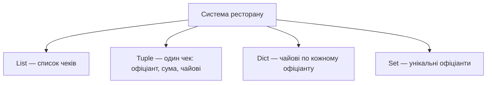
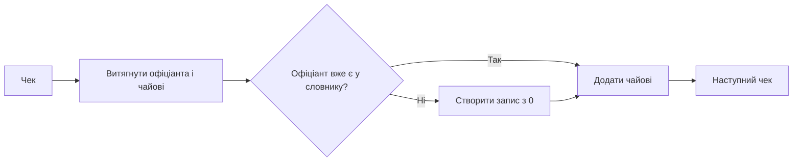
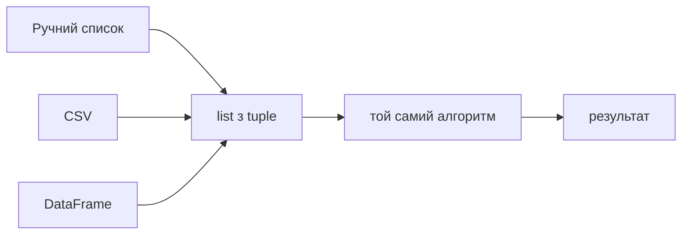

# Урок 5. Списки, кортежі та множини

**Передумови:** уроки 3–4 (типи даних, умови). **Розв'язує:** інформаційну модель — який контейнер обрати під яку задачу, і як зберігати дані, що накопичуються під час обробки.

## RETRIEVE

Коротке пригадування без підглядання: типи з уроку 3, умови й `while` з уроку 4.

## CONCEPT

### Три контейнери, три різні призначення

| | `list` | `tuple` | `set` |
|---|---|---|---|
| Змінність | змінний | незмінний | змінний |
| Порядок | зберігає | зберігає | не гарантує |
| Дублікати | дозволені | дозволені | видаляються автоматично |
| Типове призначення | послідовність, що змінюється | фіксований запис («факт, що вже відбувся») | унікальність, швидка перевірка належності |

**Чому кортеж для запису, що не буде змінюватись?** Якщо дані вже зафіксовані — наприклад, виписаний чек — їх не потрібно (і не повинно бути можливо випадково) редагувати. Кортеж захищає їх від зміни, а не просто «економить символи» порівняно зі списком.

### Списки: індексація та зрізи

```python
fruits = ['яблуко', 'банан', 'апельсин', 'ківі', 'манго']

fruits[0]     # 'яблуко' — перший
fruits[-1]    # 'манго' — останній
fruits[1:4]   # зріз: банан, апельсин, ківі
fruits[::-1]  # розворот
```

### Кортежі: пакування, розпакування, `NamedTuple`

```python
point = (10, 20, 30)          # звичайний кортеж
x, y, z = point                # розпакування
```

Проблема звичайного кортежу — доступ за індексом нічого не каже про сенс поля:

```python
order[0]   # що це? ім'я? номер столу?
order[2]   # а це? чайові? знижка?
```

`NamedTuple` вирішує це, залишаючись тим самим кортежем — незмінним, з тим самим розміром у пам'яті, з підтримкою розпакування й індексації — але з іменованими полями:

```python
from typing import NamedTuple

class Order(NamedTuple):
    waiter: str
    bill: float
    tip: float

order = Order('Олексій', 450, 90)
order.waiter   # 'Олексій' — одразу зрозуміло, на відміну від order[0]
order.tip      # 90 — не треба рахувати індекси

isinstance(order, tuple)   # True — це досі кортеж
order.waiter = 'Хтось'     # AttributeError — захист від випадкової зміни
```

**Правило:** якщо поля кортежу мають зрозумілий сенс — використовуйте `NamedTuple`.

*Примітка щодо прикладів нижче:* тут і в наступному розділі використано спрощений `Order` (лише `waiter`/`bill`/`tip`) — щоб зосередитись на самій ідеї накопичувального словника без зайвих полів. Практичний ноутбук уроку працює з повною, реальною схемою `Order` (7 полів: `total_bill`, `tip`, `sex`, `smoker`, `day`, `time`, `size`) на реальному датасеті — та сама ідея, застосована до справжніх 244 чеків.

### Множини: унікальність без ручної перевірки

```python
s = set()
s.add('Олексій')
s.add('Олексій')   # дублікат — нічого не станеться
len(s)              # 1
```

`{}` — це порожній `dict`, а не порожня множина; порожня множина — тільки `set()`. Множини підтримують математичні операції: об'єднання (`|`), перетин (`&`), різницю (`-`), симетричну різницю (`^`) — корисно, наприклад, для задач на кшталт «спільні підписники двох каналів».

## PREDICT → RUN → INVESTIGATE: накопичувальний словник на прикладі системи чайових

Задача: вечір у ресторані, є список чеків, потрібно порахувати чайові по кожному офіціанту, знайти лідера і порахувати унікальних офіціантів.



Кожен чек — кортеж `(офіціант, сума_рахунку, чайові)`. **Передбачте**, а потім перевірте, що виведе:

```python
orders = [
    ('Олексій', 450, 90),
    ('Марія',   820, 150),
    ('Олексій', 310, 60),
]
print(len(orders))
print(orders[0][0])   # ?
```

Тепер дослідіть, як накопичується словник крок за кроком — це один із найважливіших патернів у програмуванні, **«накопичувальний словник»**:

```python
tips_by_waiter = {}
for waiter, bill, tip in orders:
    if waiter not in tips_by_waiter:
        tips_by_waiter[waiter] = 0
    tips_by_waiter[waiter] += tip
```



Трейс перших кроків:

```text
('Олексій', 450, 90) → 'Олексій' немає → {'Олексій': 0} → +90 → {'Олексій': 90}
('Марія', 820, 150)  → 'Марія' немає   → {..., 'Марія': 0} → +150 → {..., 'Марія': 150}
('Олексій', 310, 60) → 'Олексій' є     → +60 → {'Олексій': 150, ...}
```

## MODIFY: та сама ідея, коротший код

```python
# ① new у навчальних цілях: явний if
if waiter not in tips: tips[waiter] = 0
tips[waiter] += tip

# ② dict.get() — прибирає if
tips[waiter] = tips.get(waiter, 0) + tip

# ③ defaultdict — мінімум коду
from collections import defaultdict
tips = defaultdict(int)
tips[waiter] += tip
```

Усі три варіанти дають однаковий результат — рухаємось від зрозумілого до компактного, не навпаки.

**Пошук лідера** («поточний чемпіон» — класичний алгоритм максимуму):

```python
leader = max(tips, key=tips.get)
```

**Унікальні офіціанти** — тут ідеально підходить `set`: просто додавайте ім'я щоразу, дублікати відсіються самі:

```python
unique_waiters = {waiter for waiter, bill, tip in orders}   # set comprehension
```

## CREATE / TRANSFER

**Ключовий момент уроку:** алгоритм не знає й не піклується, звідки прийшли дані. Ті самі три рядки коду, які порахували чайові з 12 вручну введених чеків, працюють без жодної зміни на реальному датасеті з 244 чеків (`seaborn.load_dataset("tips")`) — достатньо, щоб дані мали ту саму структуру `(офіціант, сума, чайові)`.



Це і є перевірка перенесення навички (TRANSFER): структура рішення однакова, джерело даних — інше.

Наскрізний приклад «ресторан» — повноцінний навчальний матеріал цього уроку, побудований на реальному датасеті `seaborn.load_dataset("tips")` (244 чеки). Він продовжується без розриву в Уроці 6 (той самий `orders: list[Order]` агрегується через `dict`) і далі — в Уроці 14 (ті самі дані читаються й записуються з диску).

👉 Повний довідник методів і нюансів — [Списки](../../reference/python_core/lists.md), [Кортежі й `NamedTuple`](../../reference/python_core/tuples.md), [Множини](../../reference/python_core/sets.md).

**Спробуйте самі — де практикуватись:**

- [`note_lesson_05_lists_tuples_sets.ipynb`](https://github.com/NikoriakViktot/PY-Course-Victor-Nikoriak-22-09-2026/blob/main/module_1/lessons/lesson_06_lists_tuples_sets/note_lesson_05_lists_tuples_sets.ipynb) — повний конспект: tuple → `NamedTuple` → реальний датасет → `set`/`Counter` → дві самостійні задачі (Dinner Analytics, великі столи)
- [`notes_lists_tuples_sets.ipynb`](https://github.com/NikoriakViktot/PY-Course-Victor-Nikoriak-22-09-2026/blob/main/module_1/lessons/lesson_06_lists_tuples_sets/notes_lists_tuples_sets.ipynb) — додатковий конспект + TODO 1–5 (список, унікальні слова, `NamedTuple`, спільні підписники, bubble sort)
