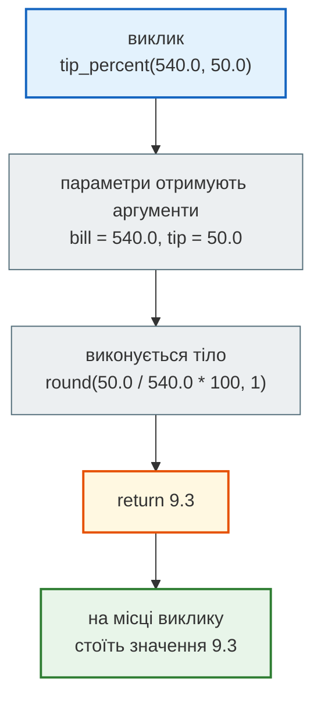
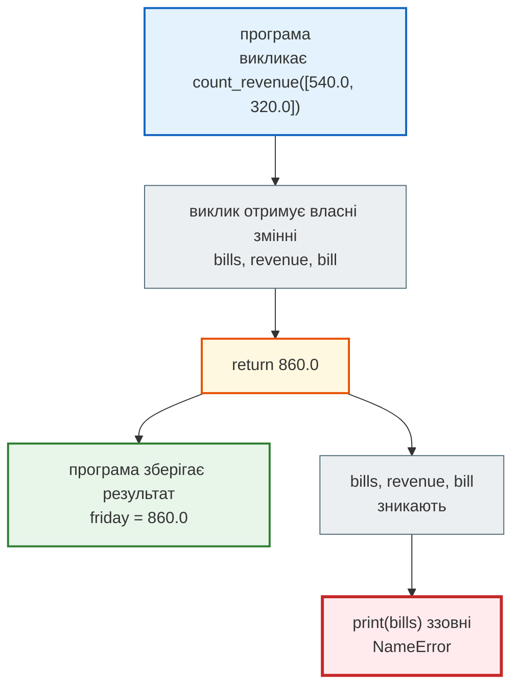
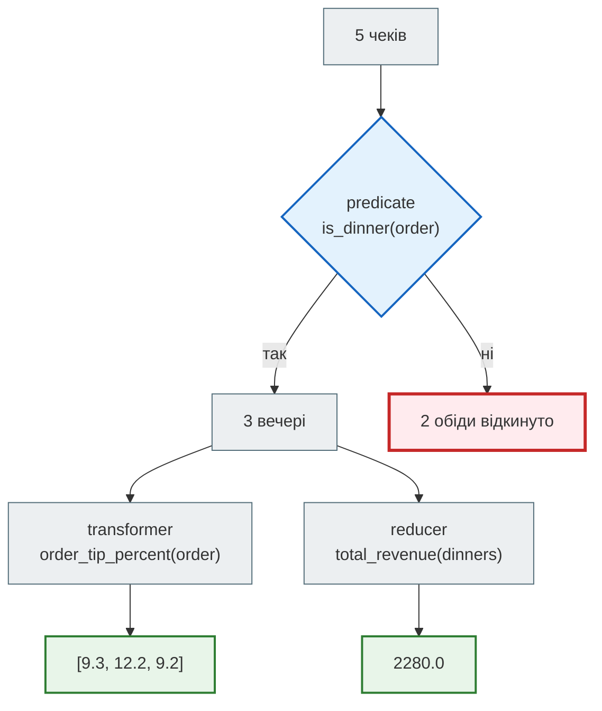
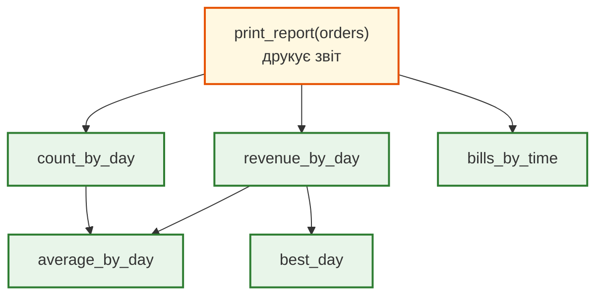

# Урок 7. Функції

В уроці 6 кафе отримало повний звіт: кількість чеків, виторг і середній чек за днями, найкращий день, чеки за прийомом їжі. Програма працює, але це один суцільний блок коду на тридцять рядків. Щоб зробити такий самий звіт за інший тиждень, його доведеться скопіювати. Щоб перевірити, чи правильно рахується лише виторг, доведеться запускати все. А щоб зрозуміти, що робить рядок 26, треба прочитати всі попередні.

**Функція** — це шматок коду з іменем, входом і результатом. Її пишуть один раз, а викликають скільки завгодно разів з різними даними. У цьому уроці ми розкладемо звіт кафе на функції так, щоб він давав **той самий** результат, але читався як перелік кроків.

**Що потрібно з попередніх уроків:** `if` і `while` (урок 4), списки, кортежі і `NamedTuple Order` (урок 5), цикл `for`, словники й comprehensions (урок 6).

**Після уроку ти зможеш:**

- оголошувати функцію через `def` і викликати її з позиційними та іменованими аргументами;
- задавати параметрам значення за замовчуванням і уникати пастки зі змінюваним значенням;
- розрізняти `return` і `print()` та пояснювати, звідки береться `None`;
- пояснювати, чому змінні всередині функції не видно ззовні;
- писати чисті функції трьох ролей — перевірка (predicate), перетворення (transformer), згортка (reducer);
- розкладати довгу програму на функції й перевіряти, що результат не змінився.

**Задача розділу.** Переписати звіт кафе з уроку 6 як набір функцій і отримати ідентичний вивід. Повний код — у розділі [«Практика»](#practice).

**Ноутбук заняття:** [`note_lesson_07_functions.ipynb`](https://github.com/NikoriakViktot/PY-Course-Victor-Nikoriak-22-09-2026/blob/main/module_1/lessons/lesson_07_functions/note_lesson_07_functions.ipynb) [](https://colab.research.google.com/github/NikoriakViktot/PY-Course-Victor-Nikoriak-22-09-2026/blob/main/module_1/lessons/lesson_07_functions/note_lesson_07_functions.ipynb)

## Пригадай

Дай відповідь подумки, нічого не запускаючи:

1. Що потрапить у `day` і `revenue` у циклі `for day, revenue in revenue_by_day.items():`?
2. Що побудує `[order.total_bill for order in orders if order.time == "обід"]`?
3. Навіщо у звіті уроку 6 перед пошуком найкращого дня стоїть `best_day = None`?

??? success "Відповіді"

    1. На кожному кроці — одна пара словника: `day` отримує ключ (день), `revenue` — значення (виторг цього дня).
    2. Новий список сум лише тих чеків, де прийом їжі — обід. Для чеків уроку 6 це `[320.0, 450.0]`.
    3. Це позначка «лідера ще немає». Перший день стає лідером без порівняння, далі кожен наступний порівнюється з поточним лідером.

## Навіщо функції

Кафе хоче знати частку чайових у кількох чеках. Без функцій формула повторюється:

```python
tip_1 = round(50.0 / 540.0 * 100, 1)
tip_2 = round(120.0 / 980.0 * 100, 1)
tip_3 = round(70.0 / 760.0 * 100, 1)
print(tip_1, tip_2, tip_3)
```

```text
9.3 12.2 9.2
```

Три копії однієї ідеї. Якщо кафе вирішить рахувати чайові з точністю до цілого, доведеться знайти й виправити кожну копію — і легко пропустити одну. Функція збирає формулу в одне місце:

```python
def tip_percent(bill, tip):
    return round(tip / bill * 100, 1)


print(tip_percent(540.0, 50.0), tip_percent(980.0, 120.0), tip_percent(760.0, 70.0))
```

```text
9.3 12.2 9.2
```

Тепер формула записана один раз, а в кожному рядку, де вона потрібна, стоїть **ім'я**, яке пояснює, що рахується. Функції розв'язують три проблеми одразу:

- **повторення** — логіку змінюють в одному місці;
- **читабельність** — `tip_percent(540.0, 50.0)` зрозуміліше, ніж `round(50.0 / 540.0 * 100, 1)`;
- **перевірка частинами** — функцію можна випробувати окремо, не запускаючи всю програму.

## Оголошення і виклик

### Будова функції

```python
def tip_percent(bill, tip):
    return round(tip / bill * 100, 1)
```

| Частина | Що означає |
|---|---|
| `def` | ключове слово: «оголошую функцію» |
| `tip_percent` | ім'я функції — за тими самими правилами, що й імена змінних |
| `(bill, tip)` | **параметри** — імена, під якими функція отримає вхідні дані |
| `:` і відступ | тіло функції — усі рядки з відступом під `def` |
| `return …` | **результат**: значення, яке функція віддає туди, звідки її викликали |

Рядок `tip_percent(540.0, 50.0)` — це **виклик**. Значення в дужках — **аргументи**: `540.0` потрапляє в параметр `bill`, `50.0` — у `tip`. Після виконання тіла весь вираз виклику замінюється значенням з `return`.



### Оголошення не запускає код

`def` лише створює функцію і прив'язує її до імені. Тіло виконується тоді, коли функцію **викликають**, і стільки разів, скільки її викликають.

```python
def greet_guest(name):
    print("Вітаємо,", name)


print("Кафе відкрито")
greet_guest("Олена")
greet_guest("Тарас")
```

```text
Кафе відкрито
Вітаємо, Олена
Вітаємо, Тарас
```

Хоча `def` стоїть першим, перший рядок виводу — «Кафе відкрито»: на момент `def` Python лише запам'ятав, що робити, коли покличуть `greet_guest`.

!!! warning "Виклик без дужок"
    `greet_guest` без дужок — це сама функція як значення, а не її виклик. Рядок `greet_guest` нічого не надрукує, а `print(greet_guest)` покаже щось на зразок `<function greet_guest at 0x7f...>`. Якщо функція «не спрацювала» — перевір, чи є дужки.

Функцію треба оголосити **до** першого виклику: Python читає файл згори донизу, і виклик імені, якого ще немає, дає `NameError`.

## Параметри й аргументи

### Позиційні та іменовані аргументи

Позиційні аргументи розподіляються за порядком: перший — у перший параметр, другий — у другий. Переплутаний порядок Python не помітить:

```python
print(tip_percent(540.0, 50.0))
print(tip_percent(50.0, 540.0))
```

```text
9.3
1080.0
```

Чайові 1080 % — безглуздя, але помилки немає: обидва аргументи — числа. Коли параметрів кілька, аргументи можна передати **за іменем**, і тоді порядок не важливий:

```python
print(tip_percent(tip=50.0, bill=540.0))
```

```text
9.3
```

### Значення за замовчуванням

Параметр може мати значення, яке використовується, якщо аргумент не передали. Наприклад, плата за обслуговування зазвичай 10 %:

```python
def price_with_service(bill, service=10):
    return bill + bill * service / 100


print(price_with_service(500.0))
print(price_with_service(500.0, 5))
print(price_with_service(500.0, service=0))
```

```text
550.0
525.0
500.0
```

Параметри зі значенням за замовчуванням пишуть **після** обов'язкових: `def f(service=10, bill):` — це `SyntaxError`.

Python перевіряє кількість аргументів у момент виклику. Забутий обов'язковий аргумент:

```python
price_with_service()
```

```text
TypeError: price_with_service() missing 1 required positional argument: 'bill'
```

Зайвий аргумент:

```python
price_with_service(500.0, 5, 3)
```

```text
TypeError: price_with_service() takes from 1 to 2 positional arguments but 3 were given
```

!!! warning "Список як значення за замовчуванням"
    Значення за замовчуванням створюється **один раз** — коли виконується `def`, а не при кожному виклику. Для числа чи рядка це непомітно, а для списку — пастка:

    ```python
    def add_item(item, items=[]):
        items.append(item)
        return items


    print(add_item("кава"))
    print(add_item("чай"))
    ```

    ```text
    ['кава']
    ['кава', 'чай']
    ```

    Другий виклик «пам'ятає» каву з першого: обидва працюють з одним і тим самим списком. Правильний запис — `None` за замовчуванням і новий список усередині:

    ```python
    def add_item(item, items=None):
        if items is None:
            items = []
        items.append(item)
        return items


    print(add_item("кава"))
    print(add_item("чай"))
    ```

    ```text
    ['кава']
    ['чай']
    ```

## return і print

### Для людини чи для програми

`print()` показує значення **людині** на екрані. `return` віддає значення **програмі**, щоб його можна було зберегти в змінну й використати далі. Функція без `return` усе одно щось повертає — спеціальне значення `None`, «нічого».

```python
def show_revenue(bills):
    revenue = 0
    for bill in bills:
        revenue += bill
    print("Виторг:", revenue)


def count_revenue(bills):
    revenue = 0
    for bill in bills:
        revenue += bill
    return revenue
```

Обидві функції рахують однаково. Різниця — у тому, що отримає код, який їх викликав.

```python
shown = show_revenue([540.0, 320.0])
counted = count_revenue([540.0, 320.0])
print(shown)
print(counted)
print(counted * 2)
```

??? question "Що надрукує цей код?"

    Зверни увагу: скільки рядків надрукує `show_revenue`, а скільки — останні три `print()`?

??? success "Відповідь і пояснення"

    ```text
    Виторг: 860.0
    None
    860.0
    1720.0
    ```

    Перший рядок друкує сама `show_revenue` під час виклику. Але в `shown` потрапляє `None`: у функції немає `return`. `count_revenue` нічого не друкує, зате її результат — число `860.0`, з яким можна рахувати далі.

Спроба рахувати з результатом `show_revenue` закінчується помилкою:

```python
print(shown * 2)
```

```text
TypeError: unsupported operand type(s) for *: 'NoneType' and 'int'
```

Правило: функція, яка **рахує**, повертає результат через `return`. Друкує той код, якому результат потрібно показати.

### return завершує функцію

Щойно виконується `return`, функція закінчує роботу — решта тіла пропускається. Тому в одній функції може бути кілька `return` у різних гілках:

```python
def bill_size(bill):
    if bill >= 800:
        return "великий"
    if bill >= 400:
        return "середній"
    return "малий"


print(bill_size(980.0), bill_size(540.0), bill_size(320.0))
```

```text
великий середній малий
```

Для `980.0` перша умова істинна, і функція завершується одразу — до інших `if` справа не доходить. Тому другу умову не треба писати як `400 <= bill < 800`.

Але той самий механізм дає одну з найчастіших помилок — `return` з зайвим відступом, усередині циклу:

```python
def broken_revenue(bills):
    revenue = 0
    for bill in bills:
        revenue += bill
        return revenue


print(broken_revenue([540.0, 320.0, 980.0]))
```

```text
540.0
```

| Крок | Що відбувається | `revenue` |
|---|---|---|
| старт | `revenue = 0` | `0` |
| перший чек | `revenue += 540.0` | `540.0` |
| той самий крок | `return revenue` — функція завершується | `540.0` |

Цикл не дійшов до другого чека. `return` має стояти **після** циклу, на рівні `for`, — як у `count_revenue`.

### Кілька результатів

Функція повертає одне значення, але це значення може бути кортежем. Розпакування з уроку 5 розкладає його на змінні:

```python
def day_summary(bills):
    return len(bills), sum(bills)


count, revenue = day_summary([540.0, 320.0])
print(count, revenue)
print(day_summary([450.0]))
```

```text
2 860.0
(1, 450.0)
```

Запис `return len(bills), sum(bills)` — це `return (len(bills), sum(bills))`: кома створює кортеж.

## Змінні всередині функції

Параметри й змінні, створені в тілі функції, — **локальні**. Вони з'являються під час виклику й зникають, коли функція повертає результат. Кожен виклик отримує свій окремий набір локальних змінних.

```python
friday = count_revenue([540.0, 320.0])
print(friday)
print(bills)
```

```text
860.0
NameError: name 'bills' is not defined
```

`bills` і `revenue` існували лише всередині виклику `count_revenue`. Ззовні доступний тільки результат — його ми зберегли в `friday`.



З цього випливають дві корисні речі:

- **однакові імена не конфліктують.** Змінна `revenue` у `count_revenue` і змінна `revenue` у `show_revenue` — різні змінні. Не треба вигадувати унікальні імена для кожного шматка програми;
- **функція залежить лише від того, що їй передали.** Дані потрапляють у функцію через параметри, а виходять через `return`. Так функцію легко перевірити окремо.

!!! note "А якщо функція читає змінну ззовні?"
    Прочитати змінну, створену поза функцією, Python дозволяє — він шукає ім'я спочатку серед локальних, потім у файлі. Але така функція непомітно залежить від решти програми: змінив змінну вгорі — змінився результат функції. Передавай дані параметрами. Як саме Python шукає імена, розібрано в довіднику [Простори імен / LEGB](../../reference/python_core/namespaces_legb.md).

## Чисті функції

Функція може не лише повертати результат, а й змінювати щось поза собою — наприклад, список, який їй передали. Це називають **побічним ефектом**. Згадай урок 5: параметр отримує посилання на той самий список, а не копію.

```python
def add_service_in_place(bills, service):
    for i in range(len(bills)):
        bills[i] = bills[i] + bills[i] * service / 100


def with_service(bills, service):
    return [bill + bill * service / 100 for bill in bills]


friday_bills = [540.0, 320.0]
new_bills = with_service(friday_bills, 10)
print(friday_bills, new_bills)

add_service_in_place(friday_bills, 10)
print(friday_bills)
```

```text
[540.0, 320.0] [594.0, 352.0]
[594.0, 352.0]
```

`with_service` будує **новий** список і не чіпає вхідний. `add_service_in_place` переписує список, який їй дали: після виклику первинні суми чеків утрачено.

Функцію називають **чистою**, якщо:

1. за однакових аргументів вона завжди повертає однаковий результат;
2. вона не змінює нічого поза собою: ні переданих списків і словників, ні зовнішніх змінних, і нічого не друкує.

Чисту функцію найпростіше перевірити: викликав — порівняв результат з очікуваним. Тому функції, що **рахують**, пишемо чистими, а друк збираємо в одну окрему функцію звіту. Функції зі змінюванням на місці теж бувають потрібні (як метод `.sort()` у списку), але тоді це має бути зрозуміло з імені та опису.

## Три ролі функцій

Більшість функцій, що обробляють дані, належать до однієї з трьох ролей:

| Роль | Питання | Що повертає |
|---|---|---|
| **predicate** (перевірка) | чи підходить цей елемент? | `True` або `False` |
| **transformer** (перетворення) | яким стане цей елемент? | нове значення для одного елемента |
| **reducer** (згортка) | що вийде з усіх разом? | одне значення з багатьох |

Візьмемо чеки кафе з уроку 6:

```python
from typing import NamedTuple


class Order(NamedTuple):
    total_bill: float
    tip: float
    day: str
    time: str
    size: int


orders = [
    Order(540.0, 50.0, "пт", "вечеря", 2),
    Order(320.0, 30.0, "пт", "обід", 1),
    Order(980.0, 120.0, "сб", "вечеря", 4),
    Order(760.0, 70.0, "сб", "вечеря", 3),
    Order(450.0, 0.0, "нд", "обід", 5),
]
```

Три маленькі функції — по одній на кожну роль:

```python
def is_dinner(order):
    return order.time == "вечеря"


def order_tip_percent(order):
    return tip_percent(order.total_bill, order.tip)


def total_revenue(orders):
    revenue = 0
    for order in orders:
        revenue += order.total_bill
    return revenue


dinners = [order for order in orders if is_dinner(order)]
print("Вечерь:", len(dinners))
print("Чайові, %:", [order_tip_percent(order) for order in dinners])
print("Виторг вечерь:", total_revenue(dinners))
```

```text
Вечерь: 3
Чайові, %: [9.3, 12.2, 9.2]
Виторг вечерь: 2280.0
```

Зверни увагу на `order_tip_percent`: вона не повторює формулу, а викликає вже готову `tip_percent`. Функції складаються з інших функцій так само, як програма складається з функцій.



Predicate і transformer працюють з **одним** елементом, тому їх зручно ставити в comprehension. Reducer отримує **весь** список. Вбудовані `sum()`, `len()`, `max()` — теж reducer-и.

??? question "Яка це роль?"

    1. `def is_big_table(order): return order.size >= 4`
    2. `def to_dollars(bill): return round(bill / 41.5, 2)`
    3. `def max_bill(orders): …` — найбільша сума серед чеків

??? success "Відповіді"

    1. Predicate: для одного чека відповідає «так» чи «ні».
    2. Transformer: одна сума в гривнях → одна сума в доларах.
    3. Reducer: зі списку чеків отримуємо одне число.

## Як розкласти програму на функції

Повернімося до звіту з уроку 6. Щоб знайти майбутні функції, шукай у довгому коді шматки, які:

- відповідають на **одне** питання — «скільки чеків за днями?», «який найкращий день?»;
- мають зрозумілий **вхід** (що їм потрібно) і **вихід** (що вони дають далі).

| Шматок звіту уроку 6 | Функція | Вхід → вихід |
|---|---|---|
| лічильник чеків за днями | `count_by_day(orders)` | чеки → `{день: кількість}` |
| виторг за днями | `revenue_by_day(orders)` | чеки → `{день: сума}` |
| середній чек | `average_by_day(counts, revenue)` | два словники → `{день: середнє}` |
| пошук лідера | `best_day(revenue)` | `{день: сума}` → день |
| групування за прийомом їжі | `bills_by_time(orders)` | чеки → `{прийом: [суми]}` |
| друк | `print_report(orders)` | чеки → текст на екрані |

Перші п'ять функцій лише рахують і повертають результат — вони чисті. Друкує тільки `print_report`: вона викликає решту і показує їхні результати.



Три правила, які допомагають:

1. **Одна функція — одна задача.** Якщо функцію важко назвати, не вживши «і», — вона робить забагато.
2. **Ім'я описує результат або дію:** `count_by_day`, `best_day`, `print_report`, а не `func1` чи `process`.
3. **Спершу перевір кожну функцію окремо**, потім збирай їх разом. Помилку в маленькій функції знайти легше, ніж у тридцяти рядках.

!!! note "Рядок документації"
    Перший рядок у тілі функції можна зробити рядком у лапках — **docstring**. Він коротко пояснює, що функція робить. Python зберігає його, і `help(count_by_day)` або підказка в редакторі покаже цей опис. У прикладі нижче в кожної функції є docstring.

## Практика { #practice }

### Розібраний приклад: звіт кафе з функцій

Той самий звіт, що в уроці 6, але розкладений на функції.

```python linenums="1" hl_lines="12 20 28 33 42 50 69"
from typing import NamedTuple


class Order(NamedTuple):
    total_bill: float
    tip: float
    day: str
    time: str
    size: int


def count_by_day(orders):
    """Кількість чеків у кожен день."""
    counts = {}
    for order in orders:
        counts[order.day] = counts.get(order.day, 0) + 1
    return counts


def revenue_by_day(orders):
    """Сума чеків за кожен день."""
    revenue = {}
    for order in orders:
        revenue[order.day] = revenue.get(order.day, 0) + order.total_bill
    return revenue


def average_by_day(counts, revenue):
    """Середній чек за кожен день."""
    return {day: revenue[day] / counts[day] for day in revenue}


def best_day(revenue):
    """День з найбільшим виторгом."""
    best = None
    for day, amount in revenue.items():
        if best is None or amount > revenue[best]:
            best = day
    return best


def bills_by_time(orders):
    """Суми чеків, згруповані за прийомом їжі."""
    groups = {}
    for order in orders:
        groups.setdefault(order.time, []).append(order.total_bill)
    return groups


def print_report(orders):
    """Друкує звіт кафе за списком чеків."""
    counts = count_by_day(orders)
    revenue = revenue_by_day(orders)
    average = average_by_day(counts, revenue)
    for day in revenue:
        print(day, "— чеків:", counts[day], "виторг:", revenue[day], "середній:", average[day])
    print("Найкращий день:", best_day(revenue))
    print("За прийомом їжі:", bills_by_time(orders))


orders = [
    Order(540.0, 50.0, "пт", "вечеря", 2),
    Order(320.0, 30.0, "пт", "обід", 1),
    Order(980.0, 120.0, "сб", "вечеря", 4),
    Order(760.0, 70.0, "сб", "вечеря", 3),
    Order(450.0, 0.0, "нд", "обід", 5),
]

print_report(orders)
```

```text
пт — чеків: 2 виторг: 860.0 середній: 430.0
сб — чеків: 2 виторг: 1740.0 середній: 870.0
нд — чеків: 1 виторг: 450.0 середній: 450.0
Найкращий день: сб
За прийомом їжі: {'вечеря': [540.0, 980.0, 760.0], 'обід': [320.0, 450.0]}
```

Вивід збігається з уроком 6 символ у символ — рефакторинг не змінив поведінку програми.

Що відбувається в ключових рядках:

- **рядки 12, 20, 42** — кожен накопичувальний словник з уроку 6 тепер живе у власній функції: створюється всередині, заповнюється циклом і повертається через `return`;
- **рядок 28** — `average_by_day` не проходить чеки заново, а отримує два вже готові словники;
- **рядок 33** — пошук лідера з уроку 6 без змін, але тепер `best` — локальна змінна, а результат повертається;
- **рядок 50** — `print_report` — єдина функція, яка друкує: вона збирає результати інших;
- **рядки 52–58** — тіло `print_report` читається як перелік кроків звіту: порахувати, порахувати, обчислити середнє, надрукувати;
- **рядок 69** — увесь звіт — один виклик.

Перевага видна одразу, щойно з'являються **інші дані**. Звіт за інший вікенд — це один виклик, без копіювання коду:

```python
next_weekend = [
    Order(610.0, 60.0, "сб", "обід", 2),
    Order(1200.0, 150.0, "нд", "вечеря", 6),
]
print_report(next_weekend)
```

```text
сб — чеків: 1 виторг: 610.0 середній: 610.0
нд — чеків: 1 виторг: 1200.0 середній: 1200.0
Найкращий день: нд
За прийомом їжі: {'обід': [610.0], 'вечеря': [1200.0]}
```

А кожну функцію можна перевірити окремо, на маленьких даних, де відповідь відома заздалегідь:

```python
print(best_day({"пт": 100.0, "сб": 300.0, "нд": 200.0}))
print(count_by_day([]))
print(best_day({}))
```

```text
сб
{}
None
```

!!! note "Три проходи замість одного"
    В уроці 6 один цикл заповнював усі словники одразу. Тепер `count_by_day`, `revenue_by_day` і `bills_by_time` проходять чеки кожна окремо — три проходи. Для сотень чи тисяч чеків різниці не видно, а код читається й перевіряється частинами. Як оцінювати, скільки роботи робить програма, розберемо в [уроці 8](lesson_08.md).

### Зміни приклад: звіт про вечері

Додай до програми з розібраного прикладу функції трьох ролей (дві з них ти вже бачив у розділі «Три ролі функцій» — напиши їх заново, не підглядаючи):

- `is_dinner(order)` — predicate: чи чек за вечерю;
- `order_tip_percent(order)` — transformer: частка чайових чека у відсотках, округлена до одного знака;
- `average(values)` — reducer: середнє значення списку чисел.

І функцію `print_dinner_report(orders)`, яка з їхньою допомогою друкує:

```text
Вечерь: 3
Чайові на вечері, %: [9.3, 12.2, 9.2]
Середні чайові на вечері: 10.2 %
```

**Критерії перевірки:**

- `is_dinner`, `order_tip_percent` і `average` нічого не друкують, лише повертають результат;
- `average([])` повертає `0.0`, а не падає з `ZeroDivisionError`;
- середнє округлюється лише під час друку, `average` повертає неокруглене значення;
- `print_dinner_report(next_weekend)` друкує 1 вечерю з чайовими `12.5` %.

??? tip "Підказка"
    Список вечерь — comprehension з `if is_dinner(order)`, список відсотків — comprehension з `order_tip_percent(order)` по вечерях. В `average` спершу перевір, чи список порожній, а для суми й кількості скористайся `sum()` і `len()`.

### Спробуй самостійно: журнал оцінок

В уроці 6 ти писав програму для журналу оцінок одним блоком. Тепер розклади її на функції. Записи ті самі — кортежі `(студент, предмет, оцінка)`:

```python
grades = [
    ("Олена", "математика", 10),
    ("Тарас", "математика", 7),
    ("Олена", "фізика", 12),
    ("Марта", "математика", 11),
    ("Тарас", "фізика", 9),
    ("Олена", "математика", 8),
]
```

Напиши функції:

- `count_by_student(grades)` → `{студент: кількість оцінок}`;
- `average_by_student(grades)` → `{студент: середній бал}`;
- `subjects_by_student(grades)` → `{студент: відсортований список предметів без повторів}`;
- `best_student(averages)` → ім'я студента з найвищим середнім балом;
- `print_journal(grades)` — друкує звіт, викликаючи функції вище.

Виклик `print_journal(grades)` має надрукувати:

```text
Кількість оцінок: {'Олена': 3, 'Тарас': 2, 'Марта': 1}
Середній бал: {'Олена': 10.0, 'Тарас': 8.0, 'Марта': 11.0}
Предмети: {'Олена': ['математика', 'фізика'], 'Тарас': ['математика', 'фізика'], 'Марта': ['математика']}
Найкращий середній бал: Марта
```

**Критерії перевірки:**

- друкує лише `print_journal`, усі інші функції повертають результат;
- жодна функція не змінює список `grades`;
- `best_student({})` повертає `None`, а `print_journal([])` не падає;
- якщо додати запис `("Марта", "фізика", 5)`, найкращою стане Олена — без змін у коді функцій.

## Підсумок

| Що потрібно | Як записати |
|---|---|
| оголосити функцію | `def name(param1, param2):` + тіло з відступом |
| повернути результат | `return value` (без `return` — `None`) |
| кілька результатів | `return a, b` → `x, y = f(...)` |
| значення за замовчуванням | `def f(bill, service=10):` |
| іменований аргумент | `f(500.0, service=0)` |
| порожній список за замовчуванням | `items=None`, а в тілі `if items is None: items = []` |
| predicate | `def is_dinner(order): return order.time == "вечеря"` |
| transformer | `[order_tip_percent(o) for o in orders]` |
| reducer | функція, що зі списку повертає одне значення |
| опис функції | рядок у лапках першим рядком тіла (docstring) |

### Самоперевірка

1. Чим параметр відрізняється від аргументу?
2. Що буде в `result` після `result = print("Привіт")`?
3. Функція має `return` усередині `for`, на одному рівні з рядками тіла циклу. Скільки елементів вона встигне опрацювати?
4. Чому `def add_item(item, items=[])` — пастка?
5. Чи є функція `add_service_in_place` з цього уроку чистою? Чому?
6. Навіщо у звіті кафе друкує лише одна функція `print_report`?

??? success "Відповіді"

    1. Параметр — ім'я в дужках при оголошенні (`def f(bill):`), аргумент — конкретне значення при виклику (`f(540.0)`).
    2. `None`: `print()` показує текст на екрані, але повертає `None`.
    3. Один: на першому ж кроці циклу виконується `return`, і функція завершується.
    4. Список за замовчуванням створюється один раз при виконанні `def`, тому всі виклики без другого аргументу дописують в один і той самий список.
    5. Ні: вона змінює переданий їй список, тобто має побічний ефект, і нічого не повертає.
    6. Функції, що рахують, лишаються чистими: їх можна перевірити окремо й використати ще раз — наприклад, для звіту в файл чи на веб-сторінці, де `print()` не потрібен.

### Що далі

- Ноутбук заняття: [`note_lesson_07_functions.ipynb`](https://github.com/NikoriakViktot/PY-Course-Victor-Nikoriak-22-09-2026/blob/main/module_1/lessons/lesson_07_functions/note_lesson_07_functions.ipynb) [](https://colab.research.google.com/github/NikoriakViktot/PY-Course-Victor-Nikoriak-22-09-2026/blob/main/module_1/lessons/lesson_07_functions/note_lesson_07_functions.ipynb) — покроковий рефакторинг звіту кафе з перевірками після кожного кроку.
- Додатковий конспект: [`notes_functions.ipynb`](https://github.com/NikoriakViktot/PY-Course-Victor-Nikoriak-22-09-2026/blob/main/module_1/lessons/lesson_07_functions/notes_functions.ipynb) [](https://colab.research.google.com/github/NikoriakViktot/PY-Course-Victor-Nikoriak-22-09-2026/blob/main/module_1/lessons/lesson_07_functions/notes_functions.ipynb) — ті самі теми ширше, з типовими помилками й шпаргалкою.
- Довідник: [Функції та функціональне програмування](../../reference/python_core/functions.md), [Простори імен / LEGB](../../reference/python_core/namespaces_legb.md).
- Наступне заняття: [Практикум 1. Big O та базові задачі](lesson_08.md). Кожна задача практикуму — окрема функція з параметрами й `return`, а нове питання — скільки кроків вона робить.

## Документація

- Туторіал: [оголошення функцій](https://docs.python.org/3/tutorial/controlflow.html#defining-functions), [значення за замовчуванням](https://docs.python.org/3/tutorial/controlflow.html#default-argument-values), [іменовані аргументи](https://docs.python.org/3/tutorial/controlflow.html#keyword-arguments), [рядки документації](https://docs.python.org/3/tutorial/controlflow.html#documentation-strings)
- Довідник мови: [визначення функції](https://docs.python.org/3/reference/compound_stmts.html#function-definitions), [інструкція `return`](https://docs.python.org/3/reference/simple_stmts.html#the-return-statement)
- Глосарій: [параметр](https://docs.python.org/3/glossary.html#term-parameter), [аргумент](https://docs.python.org/3/glossary.html#term-argument)
- FAQ: [чому значення за замовчуванням спільні між викликами](https://docs.python.org/3/faq/programming.html#why-are-default-values-shared-between-objects), [різниця між аргументами й параметрами](https://docs.python.org/3/faq/programming.html#what-is-the-difference-between-arguments-and-parameters)
