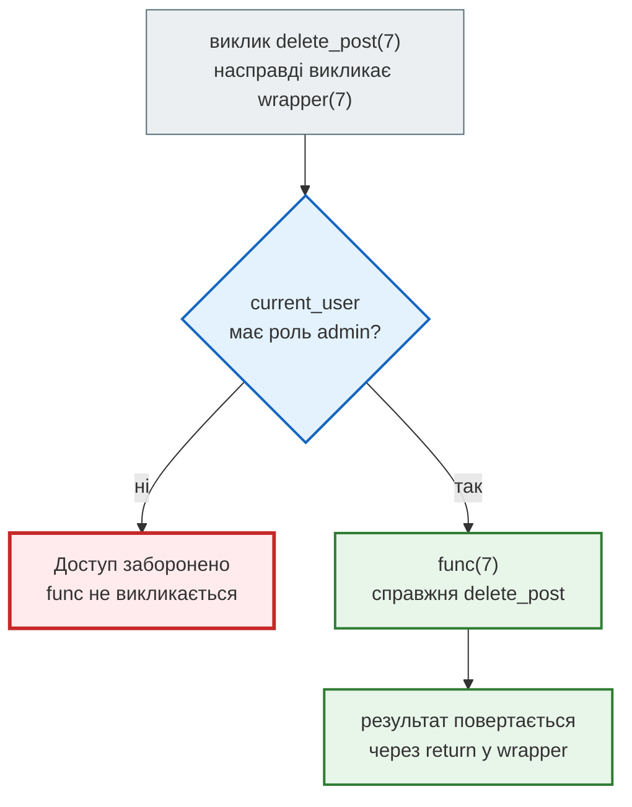
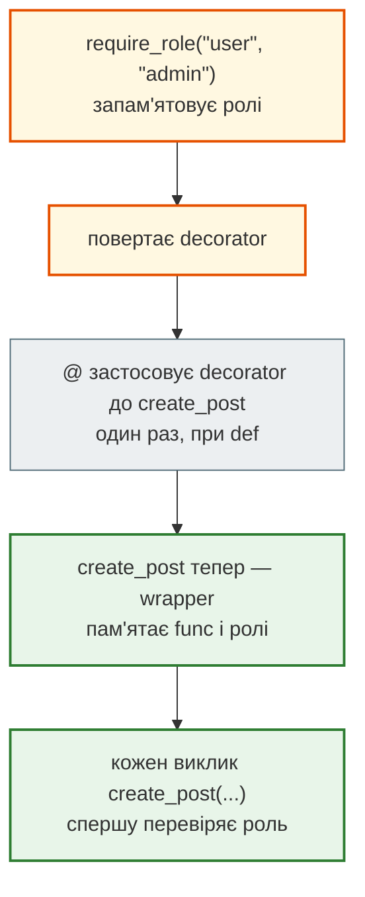

# Урок 9. Декоратори

Уяви блог, де є гості, звичайні користувачі й адміністратори. Гість може лише читати, користувач — ще й писати пости, адміністратор — усе, включно з видаленням. Кожна функція блогу має спершу перевірити роль, а вже потім робити свою справу.

Якщо писати цю перевірку в кожній функції, одна й та сама логіка опиниться в шести місцях. А коли з'явиться нова роль, доведеться правити всі шість. У цьому уроці ми навчимося виносити таку спільну поведінку в **декоратор** — функцію, яка «загортає» іншу функцію і додає до неї поведінку, не змінюючи її коду.

**Що потрібно з попередніх уроків:** функції, параметри, `return`, локальні змінні (урок 7), словники (урок 6), підрахунок кроків (урок 8).

**Після уроку ти зможеш:**

- передавати функцію як значення і повертати функцію з іншої функції;
- пояснювати, що таке замикання, і змінювати зовнішню змінну через `nonlocal`;
- писати декоратор з обгорткою `wrapper`, яка приймає будь-які аргументи й повертає результат;
- розуміти запис `@decorator` і порядок кількох декораторів над однією функцією;
- писати декоратор з параметрами, наприклад `@require_role("admin")`;
- зберігати ім'я й опис функції через `functools.wraps` і кешувати результати через `functools.lru_cache`.

**Задача розділу.** Блог із ролями: перевірка прав має жити в одному місці, а функції блогу — лише робити свою справу. Повний рефакторинг — у розділі [«Практика»](#practice).

**Ноутбук заняття:** [`note_lesson_09_decorators.ipynb`](https://github.com/NikoriakViktot/PY-Course-Victor-Nikoriak-22-09-2026/blob/main/module_1/lessons/lesson_09_decorators/note_lesson_09_decorators.ipynb) [](https://colab.research.google.com/github/NikoriakViktot/PY-Course-Victor-Nikoriak-22-09-2026/blob/main/module_1/lessons/lesson_09_decorators/note_lesson_09_decorators.ipynb)

## Пригадай

Дай відповідь подумки, нічого не запускаючи:

1. Що поверне функція, у якої немає `return`?
2. Змінна створена всередині функції. Чи можна прочитати її після виклику, ззовні?
3. Що надрукує `print(greet_guest)` без дужок, якщо `greet_guest` — функція?

??? success "Відповіді"

    1. `None`.
    2. Ні: локальні змінні зникають, коли функція завершується. Ззовні це `NameError`.
    3. Щось на зразок `<function greet_guest at 0x7f...>`: без дужок це сама функція, а не її виклик. Саме ця властивість — функція як значення — стане основою уроку.

## Одна перевірка в шести місцях

Поточний користувач блогу зберігається у словнику, а кожна функція перевіряє його роль:

```python
current_user = {"name": "Іван", "role": "guest"}


def view_post(post_id):
    if current_user["role"] not in ["guest", "user", "admin"]:
        print("Доступ заборонено")
        return
    print(current_user["name"], "переглядає пост", post_id)


def create_post(title):
    if current_user["role"] not in ["user", "admin"]:
        print("Доступ заборонено")
        return
    print(current_user["name"], "створює пост:", title)


def delete_post(post_id):
    if current_user["role"] not in ["admin"]:
        print("Доступ заборонено")
        return
    print(current_user["name"], "видаляє пост", post_id)


view_post(1)
create_post("Мій перший пост")
delete_post(1)

current_user = {"name": "Оля", "role": "admin"}
delete_post(1)
```

```text
Іван переглядає пост 1
Доступ заборонено
Доступ заборонено
Оля видаляє пост 1
```

У справжньому блозі функцій шість: ще `edit_post`, `publish_post`, `archive_post`.

| Функція | Хто має доступ |
|---|---|
| `view_post` | guest, user, admin |
| `create_post`, `edit_post` | user, admin |
| `publish_post`, `delete_post`, `archive_post` | admin |

Тепер менеджер просить: «Додайте роль `moderator` — може редагувати й публікувати, але не видаляти». Треба зайти в кожну функцію, знайти рядок з перевіркою і дописати роль. Шість правок, і в кожній можна помилитися. Перевірка прав — не справа функції «видалити пост», але вона займає половину її тіла.

Хотілося б записати так: «ось функція `delete_post`, а перевірку для неї зроби окремо». Для цього знадобляться дві властивості функцій, якими ми ще не користувалися.

## Функція — теж значення

Функцію можна присвоїти іншому імені, передати в іншу функцію як аргумент і повернути з функції — так само, як число чи список.

```python
def say_hello(name):
    return "Привіт, " + name


greet = say_hello
print(greet("Оля"))


def run_twice(func, value):
    return func(value) + " / " + func(value)


print(run_twice(say_hello, "Тарас"))
```

```text
Привіт, Оля
Привіт, Тарас / Привіт, Тарас
```

`greet = say_hello` — без дужок: ми не викликаємо функцію, а даємо їй друге ім'я. `run_twice` отримує функцію як звичайний аргумент і викликає її всередині.

Функція може також **створити** нову функцію і повернути її:

```python
def make_greeter(greeting):
    def greeter(name):
        return greeting + ", " + name
    return greeter


morning = make_greeter("Доброго ранку")
evening = make_greeter("Доброго вечора")
print(morning("Оля"))
print(evening("Тарас"))
```

```text
Доброго ранку, Оля
Доброго вечора, Тарас
```

`make_greeter` нічого не друкує. Вона будує функцію `greeter` і повертає її — без дужок, як значення.

## Замикання

Подивись уважно на `greeter`: вона використовує `greeting` — параметр функції `make_greeter`. Але `make_greeter` уже завершилась, а в уроці 7 ми казали, що локальні змінні після цього зникають. Чому `morning("Оля")` досі пам'ятає «Доброго ранку»?

Бо вкладена функція **запам'ятовує** змінні навколишньої функції, які вона використовує. Таку функцію разом з її запам'ятованими змінними називають **замиканням** (closure). `morning` і `evening` — два замикання з різними значеннями `greeting`.

Замикання може не лише читати змінну, а й змінювати її — для цього потрібне слово `nonlocal`:

```python
def make_counter():
    count = 0

    def increment():
        nonlocal count
        count += 1
        return count

    return increment


views = make_counter()
likes = make_counter()
print(views(), views(), views())
print(likes())
```

```text
1 2 3
1
```

| Виклик | `count` у `views` | `count` у `likes` |
|---|---|---|
| `views()` | 1 | 0 |
| `views()` | 2 | 0 |
| `views()` | 3 | 0 |
| `likes()` | 3 | 1 |

Кожен виклик `make_counter()` створює новий `count`, тому лічильники незалежні.

!!! warning "Без `nonlocal` — помилка"
    Рядок `count += 1` — це присвоєння `count = count + 1`. Без `nonlocal` Python вирішує, що `count` — нова **локальна** змінна `increment`, і при спробі прочитати її до присвоєння зупиняється:

    ```python
    def broken_counter():
        count = 0

        def increment():
            count += 1
            return count

        return increment


    broken_counter()()
    ```

    У Python 3.11 і новіших повідомлення таке (у 3.10 — `local variable 'count' referenced before assignment`):

    ```text
    UnboundLocalError: cannot access local variable 'count' where it is not associated with a value
    ```

    `nonlocal count` каже Python: «це не нова змінна, а `count` з навколишньої функції».

## Перша обгортка

Тепер є все, щоб винести перевірку прав з функції. Напишемо функцію, яка **отримує** функцію блогу і **повертає** нову функцію — з перевіркою перед викликом:

```python
def require_admin(func):
    def wrapper(post_id):
        if current_user["role"] != "admin":
            print("Доступ заборонено")
            return
        return func(post_id)
    return wrapper


def delete_post(post_id):
    print(current_user["name"], "видаляє пост", post_id)


delete_post = require_admin(delete_post)

current_user = {"name": "Іван", "role": "guest"}
delete_post(7)
current_user = {"name": "Оля", "role": "admin"}
delete_post(7)
```

```text
Доступ заборонено
Оля видаляє пост 7
```

Сама `delete_post` тепер займається лише видаленням. Перевірка живе в `require_admin`, а `wrapper` — замикання, яке пам'ятає, яку саме функцію `func` воно захищає.



Ось що таке **декоратор**: функція, яка приймає функцію і повертає нову функцію з додатковою поведінкою. Код самої функції при цьому не змінюється.

!!! warning "`func()` має бути всередині `wrapper`"
    Якщо написати виклик `func(...)` на рівні `require_admin`, а не всередині `wrapper`, функція виконається **одразу**, в момент обгортання, ще до будь-якої перевірки. `require_admin` лише готує обгортку; справжня робота відбувається, коли викликають `wrapper`.

## Запис через @

Рядок `delete_post = require_admin(delete_post)` трапляється так часто, що для нього є коротший запис — `@` над оголошенням функції:

```python
@require_admin
def archive_post(post_id):
    print(current_user["name"], "архівує пост", post_id)


archive_post(3)
```

```text
Оля архівує пост 3
```

`@require_admin` над `def` означає рівно те саме, що `archive_post = require_admin(archive_post)` одразу після нього. Обгортання відбувається **один раз**, коли Python виконує `def`. Далі кожен виклик `archive_post(...)` іде через `wrapper`.

## Аргументи й результат

### Будь-які аргументи

Наша `wrapper(post_id)` приймає рівно один аргумент. Спробуймо обгорнути функцію з іншою кількістю параметрів:

```python
@require_admin
def rename_post(post_id, title):
    print("Пост", post_id, "тепер називається", title)


rename_post(3, "Нова назва")
```

```text
TypeError: require_admin.<locals>.wrapper() takes 1 positional argument but 2 were given
```

Декоратор не повинен знати, скільки аргументів у функції, яку він обгортає. Для цього є два спеціальні параметри:

- `*args` збирає всі позиційні аргументи в **кортеж**;
- `**kwargs` збирає всі іменовані аргументи в **словник**.

У виклику ті самі зірочки роблять навпаки — розкладають кортеж і словник назад в аргументи:

```python
def show_args(*args, **kwargs):
    print(args, kwargs)


show_args(3, "Нова назва", draft=True)
```

```text
(3, 'Нова назва') {'draft': True}
```

Тому універсальна обгортка виглядає так:

```python
def require_admin(func):
    def wrapper(*args, **kwargs):
        if current_user["role"] != "admin":
            print("Доступ заборонено")
            return
        return func(*args, **kwargs)
    return wrapper


@require_admin
def rename_post(post_id, title):
    print("Пост", post_id, "тепер називається", title)


rename_post(3, title="Нова назва")
```

```text
Пост 3 тепер називається Нова назва
```

Ще більше про `*args` і `**kwargs` — в уроці 18, де функції розглядаються як об'єкти першого класу.

### Не загуби результат

??? question "Що надрукує останній рядок?"

    ```python
    def shout(func):
        def wrapper(*args, **kwargs):
            func(*args, **kwargs).upper()
        return wrapper


    @shout
    def title_of(post_id):
        return "пост " + str(post_id)


    print(title_of(5))
    ```

??? success "Відповідь і пояснення"

    ```text
    None
    ```

    `wrapper` обчислює `"ПОСТ 5"`, але не повертає його: у ньому немає `return`. А функція без `return` повертає `None` (урок 7). Декоратор мовчки «з'їв» результат. Правильно: `return func(*args, **kwargs).upper()`.

Звідси правило: обгортка майже завжди закінчується на `return func(*args, **kwargs)` або повертає змінений результат.

## Ім'я функції: functools.wraps

Після обгортання функція «забуває», як її звати:

```python
print(rename_post.__name__)
```

```text
wrapper
```

`rename_post` тепер — це `wrapper`. Ім'я й опис (`__doc__`) функції видно в повідомленнях про помилки, у `help()` і в редакторі, тож така підміна заважає. Стандартний модуль `functools` має для цього готовий декоратор `wraps`, який ставлять над `wrapper`:

```python
import functools


def require_admin(func):
    @functools.wraps(func)
    def wrapper(*args, **kwargs):
        if current_user["role"] != "admin":
            print("Доступ заборонено")
            return
        return func(*args, **kwargs)
    return wrapper


@require_admin
def rename_post(post_id, title):
    """Змінює назву поста."""
    print("Пост", post_id, "тепер називається", title)


print(rename_post.__name__)
print(rename_post.__doc__)
```

```text
rename_post
Змінює назву поста.
```

`@functools.wraps(func)` копіює ім'я, опис та інші дані `func` на `wrapper`. Став його в кожному своєму декораторі.

## Декоратор з параметрами

`require_admin` вміє лише одне: пропускати адміна. Для блогу потрібно по-різному: `view_post` — трьом ролям, `create_post` — двом, `delete_post` — одній. Хочеться передати ролі прямо в рядку з `@`:

```python
@require_role("user", "admin")
def create_post(title):
    ...
```

Для цього потрібен ще один рівень: функція, яка отримує ролі і **повертає декоратор**.

```python
def require_role(*allowed_roles):
    def decorator(func):
        @functools.wraps(func)
        def wrapper(*args, **kwargs):
            if current_user["role"] not in allowed_roles:
                print("Доступ заборонено, потрібна роль:", " або ".join(allowed_roles))
                return
            return func(*args, **kwargs)
        return wrapper
    return decorator


@require_role("user", "admin")
def create_post(title):
    print(current_user["name"], "створює пост:", title)


current_user = {"name": "Іван", "role": "guest"}
create_post("Привіт")
current_user = {"name": "Марта", "role": "user"}
create_post("Привіт")
```

```text
Доступ заборонено, потрібна роль: user або admin
Марта створює пост: Привіт
```

| Рівень | Отримує | Повертає |
|---|---|---|
| `require_role` | ролі `*allowed_roles` | `decorator` |
| `decorator` | функцію `func` | `wrapper` |
| `wrapper` | аргументи виклику | результат `func` або `None` |



Запис `@require_role("user", "admin")` — це `create_post = require_role("user", "admin")(create_post)`. Спершу виклик `require_role(...)` повертає декоратор, потім `@` застосовує його до функції. Кожен рівень — замикання: `wrapper` пам'ятає і `func`, і `allowed_roles`.

!!! note "Дужки мають значення"
    `@require_role("admin")` — з дужками, бо `require_role` спершу треба викликати, щоб отримати декоратор. `@require_admin` — без дужок, бо `require_admin` уже сам є декоратором. Якщо переплутати, Python спробує обгорнути функцію не тим рівнем, і помилка з'явиться при першому виклику.

## Кілька декораторів

Над функцією можна поставити кілька декораторів. Ось ще один — він пише в журнал кожен виклик:

```python
def log_call(func):
    @functools.wraps(func)
    def wrapper(*args, **kwargs):
        print("виклик", func.__name__, args)
        return func(*args, **kwargs)
    return wrapper


@log_call
@require_role("admin")
def delete_post(post_id):
    print(current_user["name"], "видаляє пост", post_id)


current_user = {"name": "Іван", "role": "guest"}
delete_post(9)
```

```text
виклик delete_post (9,)
Доступ заборонено, потрібна роль: admin
```

Декоратори застосовуються **знизу вгору**: спершу `require_role("admin")` обгортає `delete_post`, потім `log_call` обгортає результат. А під час виклику шар, що стоїть **вище**, спрацьовує **першим** — як обгортки подарунка: останню надягнули, першою знімають.

??? question "Що зміниться, якщо поміняти декоратори місцями?"

    ```python
    @require_role("admin")
    @log_call
    def delete_post(post_id):
        print(current_user["name"], "видаляє пост", post_id)


    delete_post(9)
    ```

??? success "Відповідь"

    ```text
    Доступ заборонено, потрібна роль: admin
    ```

    Тепер зовні стоїть перевірка ролі. Вона не пропускає гостя далі, тож `log_call` навіть не дізнається про спробу. Порядок декораторів — рішення: чи хочемо ми записувати в журнал і заборонені спроби.

## Готовий декоратор: lru_cache

У стандартній бібліотеці є декоратори, які вже написали за нас. Один з найкорисніших — `functools.lru_cache`: він запам'ятовує результати функції для аргументів, з якими її вже викликали.

Візьмемо числа Фібоначчі: кожне дорівнює сумі двох попередніх. Рекурсивна функція (функція, що викликає саму себе) записує це буквально. Щоб порахувати, скільки роботи вона робить, напишемо ще один декоратор — лічильник викликів, як лічильник кроків в уроці 8:

```python
calls = {}


def count_calls(func):
    @functools.wraps(func)
    def wrapper(*args, **kwargs):
        calls[func.__name__] = calls.get(func.__name__, 0) + 1
        return func(*args, **kwargs)
    return wrapper


@count_calls
def fib(n):
    if n < 2:
        return n
    return fib(n - 1) + fib(n - 2)


print(fib(20), calls["fib"])
```

```text
6765 21891
```

21 891 виклик, щоб порахувати двадцяте число. `fib(20)` викликає `fib(19)` і `fib(18)`, але `fib(19)` знову викликає `fib(18)` — ту саму роботу рахують знову і знову. Кожне наступне n майже подвоює кількість викликів.

Додамо кеш — `lru_cache` зверху, лічильник під ним, щоб рахувати лише справжні обчислення, а не відповіді з кешу:

```python
@functools.lru_cache(maxsize=None)
@count_calls
def fib_cached(n):
    if n < 2:
        return n
    return fib_cached(n - 1) + fib_cached(n - 2)


print(fib_cached(20), calls["fib_cached"])
```

```text
6765 21
```

21 обчислення замість 21 891: кожне значення від `fib(0)` до `fib(20)` рахується один раз, далі береться з кешу. Мовою уроку 8: кількість викликів росла експоненційно, а з кешем росте як `O(n)`. Ціна — пам'ять під збережені результати.

!!! note "Коли кеш не підходить"
    Кешувати можна лише функції, які для тих самих аргументів завжди повертають той самий результат і нічого не змінюють ззовні — чисті функції з уроку 7. Функцію, що залежить від `current_user` або друкує, кешувати не можна: вона «відповідатиме» старим результатом.

## Практика { #practice }

### Розібраний приклад: блог без повторень

Шість функцій блогу, перевірка прав — у декораторі, журнал викликів — в іншому. Роль `moderator` додано так, як просив менеджер.

```python linenums="1" hl_lines="4 5 8 16 21 26 31 36 41 52"
import functools


def require_role(*allowed_roles):
    def decorator(func):
        @functools.wraps(func)
        def wrapper(*args, **kwargs):
            if current_user["role"] not in allowed_roles:
                print("Доступ заборонено:", func.__name__)
                return
            return func(*args, **kwargs)
        return wrapper
    return decorator


@require_role("guest", "user", "moderator", "admin")
def view_post(post_id):
    print(current_user["name"], "переглядає пост", post_id)


@require_role("user", "admin")
def create_post(title):
    print(current_user["name"], "створює пост:", title)


@require_role("user", "moderator", "admin")
def edit_post(post_id):
    print(current_user["name"], "редагує пост", post_id)


@require_role("moderator", "admin")
def publish_post(post_id):
    print(current_user["name"], "публікує пост", post_id)


@require_role("admin")
def delete_post(post_id):
    print(current_user["name"], "видаляє пост", post_id)


@require_role("admin")
def archive_post(post_id):
    print(current_user["name"], "архівує пост", post_id)


users = [
    {"name": "Іван", "role": "guest"},
    {"name": "Марко", "role": "moderator"},
    {"name": "Оля", "role": "admin"},
]
for user in users:
    current_user = user
    print("---", user["name"], "---")
    view_post(1)
    edit_post(1)
    publish_post(1)
    delete_post(1)
```

```text
--- Іван ---
Іван переглядає пост 1
Доступ заборонено: edit_post
Доступ заборонено: publish_post
Доступ заборонено: delete_post
--- Марко ---
Марко переглядає пост 1
Марко редагує пост 1
Марко публікує пост 1
Доступ заборонено: delete_post
--- Оля ---
Оля переглядає пост 1
Оля редагує пост 1
Оля публікує пост 1
Оля видаляє пост 1
```

Що відбувається в ключових рядках:

- **рядки 4–5** — два рівні фабрики: ролі потрапляють у `require_role`, функція — у `decorator`;
- **рядок 8** — перевірка ролі, **єдине** місце на весь блог. Щоб змінити текст повідомлення чи логіку перевірки, досить змінити цей рядок;
- **рядки 16–43** — кожна функція блогу займається лише своєю справою. Хто має до неї доступ, видно одразу над `def`;
- **рядок 52** — `current_user` змінюється, а функції блогу — ні. Декоратор читає `current_user` у момент **виклику**, а не в момент обгортання.

Додати роль `moderator` — це дописати слово в три рядки з `@`, а не переписувати тіла функцій. Нова роль `superuser`, що може все, — одне слово в кожному `@require_role`.

### Зміни приклад: лічильник викликів

Напиши декоратор `count_views`, який рахує, скільки разів кожну функцію блогу викликали, **навіть коли доступ заборонено**. Результат зберігай у словнику `views`:

```text
{'view_post': 3, 'edit_post': 3, 'publish_post': 3, 'delete_post': 3}
```

(для циклу з трьома користувачами з розібраного прикладу).

**Критерії перевірки:**

- `count_views` використовує `functools.wraps`, тож `delete_post.__name__ == "delete_post"`;
- обгортка приймає будь-які аргументи й повертає результат функції;
- лічильник рахує і заборонені спроби, тож стоїть у правильному місці відносно `@require_role`.

??? tip "Підказка"
    Візьми за зразок `count_calls` з розділу про `lru_cache`. Подумай, який з двох декораторів має бути зверху, щоб до лічильника доходили навіть виклики гостя.

### Спробуй самостійно: заборонені ролі

Інший контекст: платформа онлайн-курсу, ролі `guest`, `student`, `mentor`. Тут зручніше перелічити, кому **не можна**, ніж кому можна. Напиши декоратор з параметрами `deny_role(*blocked_roles)`: він не пускає перелічені ролі, а всім іншим дозволяє.

```python
current_user = {"name": "Гість", "role": "guest"}


@deny_role("guest")
def open_homework(number):
    return "Домашнє завдання " + str(number)
```

Очікувана поведінка:

```text
роль guest   → open_homework(3) друкує повідомлення про заборону і повертає None
роль student → open_homework(3) повертає 'Домашнє завдання 3'
роль mentor  → open_homework(3) повертає 'Домашнє завдання 3'
```

**Критерії перевірки:**

- `open_homework.__name__ == "open_homework"`;
- працюють і позиційні, і іменовані аргументи: `open_homework(number=4)`;
- `@deny_role("guest", "student")` над іншою функцією пускає лише `mentor`;
- роль перевіряється під час **виклику**: зміна `current_user` після `def` змінює результат.

## Підсумок

```python
import functools


def my_decorator(func):                      # декоратор без параметрів
    @functools.wraps(func)
    def wrapper(*args, **kwargs):
        # ... до виклику
        result = func(*args, **kwargs)
        # ... після виклику
        return result
    return wrapper


def my_factory(*settings):                   # декоратор з параметрами
    def decorator(func):
        @functools.wraps(func)
        def wrapper(*args, **kwargs):
            return func(*args, **kwargs)     # settings доступні тут
        return wrapper
    return decorator
```

| Що потрібно | Як |
|---|---|
| передати функцію як значення | ім'я без дужок: `run_twice(say_hello, "Оля")` |
| змінити змінну навколишньої функції | `nonlocal count` |
| обгорнути функцію | `f = my_decorator(f)` або `@my_decorator` над `def` |
| прийняти будь-які аргументи | `def wrapper(*args, **kwargs)` |
| не загубити результат | `return func(*args, **kwargs)` |
| зберегти ім'я та опис | `@functools.wraps(func)` над `wrapper` |
| декоратор з параметрами | три рівні: фабрика → `decorator` → `wrapper` |
| кілька декораторів | застосовуються знизу вгору, спрацьовують згори вниз |
| кешувати чисту функцію | `@functools.lru_cache(maxsize=None)` |

### Самоперевірка

1. Чим `greet = say_hello` відрізняється від `greet = say_hello()`?
2. Що таке замикання?
3. Навіщо `nonlocal` і що буде без нього в `count += 1`?
4. Що означає `@require_admin` над `def delete_post`?
5. Чому обгортка має приймати `*args, **kwargs` і закінчуватися `return`?
6. Навіщо `functools.wraps`?
7. Чому `@require_role("admin")` пишуть з дужками, а `@require_admin` — без?
8. Декоратори `@log_call` і `@require_role("admin")` стоять над функцією саме в такому порядку. Що спрацює першим при виклику?

??? success "Відповіді"

    1. `say_hello` без дужок — сама функція, `greet` стає її другим ім'ям. `say_hello()` — виклик, `greet` отримає результат (і без аргументу буде `TypeError`).
    2. Вкладена функція разом зі змінними навколишньої функції, які вона запам'ятала й може використовувати після того, як навколишня функція завершилась.
    3. Щоб змінити змінну навколишньої функції. Без `nonlocal` присвоєння робить `count` локальною змінною, і читання до присвоєння дає `UnboundLocalError`.
    4. `delete_post = require_admin(delete_post)` одразу після `def`: ім'я `delete_post` тепер вказує на обгортку.
    5. Щоб декоратор працював з функцією будь-якої сигнатури і не «з'їдав» її результат: без `return` виклик повертатиме `None`.
    6. Щоб обгорнута функція зберегла власне ім'я `__name__` і опис `__doc__`, а не видавала себе за `wrapper`.
    7. `require_role` — фабрика: її спершу викликають з ролями, і вона повертає декоратор. `require_admin` уже є декоратором.
    8. `log_call`: він стоїть вище, тобто обгортає все інше, і спрацьовує першим — навіть для заборонених викликів.

### Що далі

- Ноутбук заняття: [`note_lesson_09_decorators.ipynb`](https://github.com/NikoriakViktot/PY-Course-Victor-Nikoriak-22-09-2026/blob/main/module_1/lessons/lesson_09_decorators/note_lesson_09_decorators.ipynb) [](https://colab.research.google.com/github/NikoriakViktot/PY-Course-Victor-Nikoriak-22-09-2026/blob/main/module_1/lessons/lesson_09_decorators/note_lesson_09_decorators.ipynb) — блог з ролями крок за кроком і завдання `deny_role` з перевірками.
- Живе кодування: [`live_coding_decorators_blog.ipynb`](https://github.com/NikoriakViktot/PY-Course-Victor-Nikoriak-22-09-2026/blob/main/module_1/lessons/lesson_09_decorators/live_coding_decorators_blog.ipynb) [](https://colab.research.google.com/github/NikoriakViktot/PY-Course-Victor-Nikoriak-22-09-2026/blob/main/module_1/lessons/lesson_09_decorators/live_coding_decorators_blog.ipynb) — той самий блог від дублювання до декоратора, плюс `@timer`.
- Поглиблення: [`note_lesson_09_decorators_architecture.ipynb`](https://github.com/NikoriakViktot/PY-Course-Victor-Nikoriak-22-09-2026/blob/main/module_1/lessons/lesson_09_decorators/note_lesson_09_decorators_architecture.ipynb) [](https://colab.research.google.com/github/NikoriakViktot/PY-Course-Victor-Nikoriak-22-09-2026/blob/main/module_1/lessons/lesson_09_decorators/note_lesson_09_decorators_architecture.ipynb) — логер, таймер, стек декораторів як middleware, міні-проєкт обробки платежів, декоратори у FastAPI і pytest.
- Довідник: [Функції та функціональне програмування](../../reference/python_core/functions.md), [Простори імен / LEGB](../../reference/python_core/namespaces_legb.md).
- Наступний урок: [Урок 10. Ітератори й генератори](lesson_10.md). Функції навчаться віддавати результати по одному, не тримаючи всі дані в пам'яті.

## Документація

- Глосарій: [декоратор](https://docs.python.org/3/glossary.html#term-decorator)
- Туторіал: [довільні аргументи `*args`](https://docs.python.org/3/tutorial/controlflow.html#arbitrary-argument-lists), [іменовані аргументи і `**kwargs`](https://docs.python.org/3/tutorial/controlflow.html#keyword-arguments)
- Довідник мови: [визначення функції і декоратори](https://docs.python.org/3/reference/compound_stmts.html#function-definitions), [інструкція `nonlocal`](https://docs.python.org/3/reference/simple_stmts.html#the-nonlocal-statement)
- Модуль `functools`: [`wraps`](https://docs.python.org/3/library/functools.html#functools.wraps), [`lru_cache`](https://docs.python.org/3/library/functools.html#functools.lru_cache)
- [PEP 318 — декоратори для функцій і методів](https://peps.python.org/pep-0318/)
