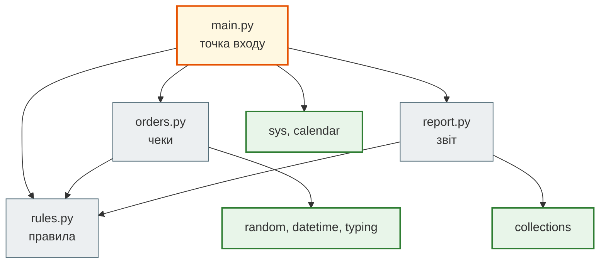
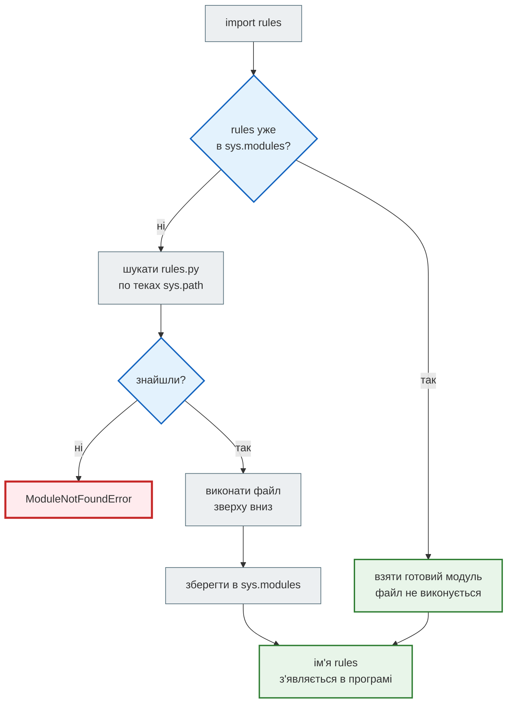

# Урок 12. Модулі та стандартна бібліотека

В уроці 7 звіт кафе розклали на функції. Відтоді кафе підключило касу, і тепер вона віддає чеки не з готовими «пт» і «вечеря», а з **міткою часу**: `2024-07-19 18:30`. Власниця хоче звіт за будь-який місяць, а адміністратор — запускати його сам, з термінала, без ноутбука.

Ноутбук з усім кодом уже на кілька екранів: генерація чеків, правила «яка година — який прийом їжі», функції звіту. Щоб знайти потрібну функцію, його доводиться гортати. Щоб скористатися звітом в іншій програмі, код доведеться копіювати. У цьому уроці ми розкладемо кафе на **модулі** — окремі файли, які імпортують один одного. А дати, підрахунки й календар візьмемо зі **стандартної бібліотеки**: вона вже встановлена разом з Python.

**Що потрібно з попередніх уроків:** `NamedTuple Order` (урок 5), словники й `dict.get` (урок 6), функції та звіт кафе (урок 7). Ти вже писав `from bisect import bisect_left` (урок 11) і `from functools import wraps` (урок 9), тож сьогодні розберемося, що саме відбувається в цьому рядку.

**Після уроку ти зможеш:**

- розкладати програму на модулі й імпортувати з них функції трьома способами;
- пояснювати, де Python шукає модуль і чому файл модуля виконується лише один раз;
- захищати код перевірок у модулі через `if __name__ == "__main__":`;
- розпізнавати затінення (shadowing), коли твій файл має ім'я стандартного модуля;
- працювати з датами через `datetime` і `timedelta`, рахувати через `Counter`, користуватися `calendar`, `statistics` і `random`;
- приймати аргументи з командного рядка через `sys.argv`.

**Задача розділу.** Перетворити ноутбук кафе на проєкт з чотирьох модулів, який друкує звіт за місяць командою `python main.py 2024 7`. Повний код — у розділі [«Практика»](#practice), готовий проєкт — у теці [`cafe_report/`](https://github.com/NikoriakViktot/PY-Course-Victor-Nikoriak-22-09-2026/tree/main/module_1/lessons/lesson_12_modules_stdlib/cafe_report).

**Ноутбук заняття:** [`note_lesson_12_modules_stdlib.ipynb`](https://github.com/NikoriakViktot/PY-Course-Victor-Nikoriak-22-09-2026/blob/main/module_1/lessons/lesson_12_modules_stdlib/note_lesson_12_modules_stdlib.ipynb) [](https://colab.research.google.com/github/NikoriakViktot/PY-Course-Victor-Nikoriak-22-09-2026/blob/main/module_1/lessons/lesson_12_modules_stdlib/note_lesson_12_modules_stdlib.ipynb)

## Пригадай

Дай відповідь подумки, нічого не запускаючи:

1. В уроці 10 ми писали `from collections import deque`, а в уроці 8 — `import time` і потім `time.perf_counter()`. Чому в першому випадку пишемо просто `deque(...)`, а в другому — з префіксом `time.`?
2. Які поля має `Order` у звіті кафе з уроку 7?
3. `print`, `len` і `sorted` ми ніколи не імпортували. Звідки вони беруться?

??? success "Відповіді"

    1. `from collections import deque` бере з модуля одне ім'я і кладе його в нашу програму. `import time` дає лише ім'я модуля, тому до функцій звертаємося через крапку.
    2. `total_bill`, `tip`, `day`, `time`, `size`.
    3. Це **вбудовані** (built-in) функції: вони доступні завжди, без імпорту. Усе інше, навіть зі стандартної бібліотеки, треба імпортувати.

## Модуль — це файл

**Модуль** — це звичайний файл `.py`. Нічого особливого в ньому немає: ті самі `def`, `class` і змінні, що й у ноутбуці. Ім'я модуля — ім'я файлу без `.py`.

Розкладемо код кафе за ролями, як у уроці 7 розкладали звіт на функції:

```text
cafe_report/
├── rules.py    ← правила: мітка часу → день тижня, година → прийом їжі
├── orders.py   ← чеки: RawOrder з каси, Order для звіту, генерація даних
├── report.py   ← звіт: функції з уроку 7
└── main.py     ← точка входу: python main.py 2024 7
```

Найпростіший модуль — правила кафе. У ньому немає жодного імпорту:

```python title="rules.py"
"""Правила кафе: як мітка часу перетворюється на день тижня і прийом їжі."""

DAYS = ("пн", "вт", "ср", "чт", "пт", "сб", "нд")
MONTHS = ("", "січень", "лютий", "березень", "квітень", "травень", "червень",
          "липень", "серпень", "вересень", "жовтень", "листопад", "грудень")


def day_from_timestamp(ts):
    """Короткий день тижня: datetime(2024, 7, 19, ...) -> 'пт'."""
    return DAYS[ts.weekday()]


def meal_type_from_hour(hour):
    """Прийом їжі за годиною замовлення."""
    if 11 <= hour <= 15:
        return "обід"
    if 17 <= hour <= 23:
        return "вечеря"
    return "інше"
```

Інший файл, що лежить у тій самій теці, користується ним через `import`:

```python
import rules

print(rules.meal_type_from_hour(19))
print(rules.meal_type_from_hour(16))
print(rules.DAYS[4])
```

```text
вечеря
інше
пт
```

`rules.meal_type_from_hour` читається як «функція `meal_type_from_hour` з модуля `rules`». Кожен модуль — окремий **простір імен** (namespace): у `rules.py` і в `report.py` можуть бути змінні з однаковими іменами, і вони не заважатимуть одна одній. Префікс завжди показує, звідки ім'я.

Модулі проєкту імпортують один одного і стандартну бібліотеку. Стрілка — «імпортує»:



Зелені блоки — стандартна бібліотека. `rules.py` нікого не імпортує, тому його найлегше перевіряти: даєш годину — отримуєш рядок.

## Три способи імпорту

| Спосіб | Як викликати | Коли зручно |
|---|---|---|
| `import rules` | `rules.meal_type_from_hour(19)` | імен багато, важливо бачити, звідки кожне |
| `from rules import meal_type_from_hour` | `meal_type_from_hour(19)` | одне-два імені, які часто використовуються |
| `import statistics as st` | `st.mean(bills)` | довга назва або домовленість (`import pandas as pd`) |

Є й четвертий спосіб, `from math import *`: він забирає з модуля **всі** імена. Так не пишуть, бо незрозуміло, звідки взялося ім'я, а чуже ім'я може непомітно замінити твоє або вбудоване:

```python
print(pow(2, 3))

from math import *

print(pow(2, 3))
```

```text
8
8.0
```

Вбудована `pow` повертала ціле число, а після `import *` той самий виклик дає `8.0`: `math.pow` мовчки замінила вбудовану функцію. [PEP 8](https://peps.python.org/pep-0008/#imports) радить уникати таких імпортів.

!!! warning "`datetime` — і модуль, і клас"
    У модулі `datetime` є клас з тим самим іменем. Після `import datetime` ім'я `datetime` означає **модуль**, і викликати його не можна:

    ```python
    import datetime

    ts = datetime(2024, 7, 19)
    ```

    ```text
    TypeError: 'module' object is not callable. Did you mean: 'datetime.datetime(...)'?
    ```

    Підказку «Did you mean» друкує Python 3.12 і новіші.

    Або `datetime.datetime(2024, 7, 19)`, або `from datetime import datetime`. У цьому уроці — другий варіант.

```python
from datetime import datetime

print(datetime(2024, 7, 19))
```

```text
2024-07-19 00:00:00
```

**Порядок імпортів** за PEP 8 — на початку файлу, трьома групами через порожній рядок: стандартна бібліотека, сторонні пакети (`pip install`), модулі твого проєкту. Так на початку `orders.py`:

```python title="orders.py — початок"
import random
from datetime import datetime, timedelta
from typing import NamedTuple

from rules import day_from_timestamp, meal_type_from_hour
```

## Що робить import

Коли Python бачить `import rules`, він виконує чотири кроки:



1. **Кеш.** Якщо модуль уже імпортували, Python бере його зі словника `sys.modules` і нічого не виконує повторно.
2. **Пошук.** Інакше перебирає теки зі списку `sys.path` по черзі, доки не знайде `rules.py`.
3. **Виконання.** Виконує файл модуля зверху вниз, як звичайну програму: `def` створюють функції, присвоєння — змінні, `print` друкує.
4. **Збереження.** Кладе готовий модуль у `sys.modules`, а в програмі з'являється ім'я `rules`.

Кеш легко побачити:

```python
import sys
import collections

print("collections" in sys.modules)
print(type(sys.modules["collections"]))
```

```text
True
<class 'module'>
```

### Де Python шукає: sys.path

`sys.path` — звичайний список тек. Порядок пошуку:

1. **тека скрипта**, який запустили (`python main.py` — тека, де лежить `main.py`); у ноутбуці — поточна тека;
2. теки зі змінної оточення `PYTHONPATH`, якщо вона задана;
3. стандартна бібліотека;
4. `site-packages` — пакети, встановлені через `pip`.

Перша ж тека, де знайшовся файл, перемагає. Тому `main.py` бачить `rules.py`, що лежить поруч, без жодних налаштувань. І тому ж з'являється пастка, про яку далі.

### Виконання лише один раз

Файл модуля виконується **при першому імпорті**. Усе, що стоїть на верхньому рівні файлу, спрацює в цей момент — навіть якщо імпортуючий хотів лише одну функцію.

Коли `report.py` переносили з ноутбука, в кінець файлу за звичкою потрапила перевірка з уроку 7:

```python title="report.py — перша версія (кінець файлу)"
orders = [
    Order(540.0, 50.0, "пт", "вечеря", 2),
    Order(320.0, 30.0, "пт", "обід", 1),
    Order(980.0, 120.0, "сб", "вечеря", 4),
]
print_report(orders)
```

Адміністратор запускає звіт за липень і бачить **два** звіти. Перший — з трьох тестових чеків:

```bash
python main.py 2024 7
```

```text
пт — чеків:  2, виторг:    860.00, середній: 430.00
сб — чеків:  1, виторг:    980.00, середній: 980.00
Найкращий день: сб
За прийомом їжі: {'вечеря': 2, 'обід': 1}
Звіт кафе: липень 2024, днів: 31, чеків: 86
пн — чеків: 17, виторг:  14561.67, середній: 856.57
...
```

`main.py` виконав `from report import print_report` → Python виконав `report.py` зверху вниз → разом з функціями виконався і тестовий `print_report(orders)`. Це **побічний ефект імпорту**. А от другий `import report` у тій самій програмі вже нічого не надрукує: модуль у кеші.

## `if __name__ == "__main__":`

Тестовий звіт у `report.py` корисний: ним зручно перевірити модуль окремо, командою `python report.py`. Потрібно, щоб він спрацьовував **лише** тоді, коли файл запускають напряму, а не імпортують.

Для цього в кожного модуля є змінна `__name__`:

| Як використали файл | Значення `__name__` всередині нього |
|---|---|
| `python report.py` — запустили напряму | `"__main__"` |
| `import report` з іншого файлу | `"report"` — ім'я модуля |

Отже, тестовий код ховаємо під умову:

```python title="report.py — кінець файлу"
if __name__ == "__main__":
    from orders import Order

    demo = [
        Order(540.0, 50.0, "пт", "вечеря", 2),
        Order(320.0, 30.0, "пт", "обід", 1),
        Order(980.0, 120.0, "сб", "вечеря", 4),
    ]
    print_report(demo)
```

Тепер `python report.py` друкує тестовий звіт, а `python main.py 2024 7` — лише звіт за липень. Так само закінчується і `main.py`: `main(sys.argv)` стоїть під тією ж умовою, тож `main.py` можна імпортувати в тести, і звіт при цьому не запуститься.

У ноутбуці `__name__` завжди `"__main__"`: ноутбук — це програма, яку запускають напряму.

```python
print(__name__)
```

```text
__main__
```

!!! tip "Модуль без побічних ефектів"
    На верхньому рівні модуля лишай тільки імпорти, константи (`DAYS`), `def` і `class`. Усе, що друкує, читає файли чи довго рахує, — у функції або під `if __name__ == "__main__":`. Тоді `import` нічого не робить, крім того, що дає імена.

## Затінення: коли твій файл заважає стандартному

Адміністраторка кафе вирішила зберігати графік змін у тій самій теці і назвала файл логічно — `calendar.py`:

```python title="calendar.py"
STAFF = {"пн": ["Оксана", "Тарас"], "сб": ["Ірина"]}
```

Наступний запуск звіту падає:

```bash
python main.py 2024 7
```

```text
Traceback (most recent call last):
  ...
    days_in_month = calendar.monthrange(year, month)[1]
                    ^^^^^^^^^^^^^^^^^^^
AttributeError: module 'calendar' has no attribute 'monthrange'
```

`main.py` пише `import calendar`, маючи на увазі стандартний модуль. Але першою в `sys.path` стоїть тека скрипта, а там тепер лежить `calendar.py` з графіком. Python знайшов **його** і далі не шукав. Стандартний `calendar` **затінено** (shadowing).

Python 3.13 підказує прямо:

```text
AttributeError: module 'calendar' has no attribute 'monthrange' (consider renaming '.../cafe_report/calendar.py' since it has the same name as the standard library module named 'calendar' and prevents importing that standard library module)
```

Старіші версії такої підказки не дають. Ліки однакові: перейменувати свій файл, наприклад на `staff_schedule.py`, і видалити теку `__pycache__` поруч, якщо вона з'явилася.

!!! warning "Не називай файли іменами стандартних модулів"
    `random.py`, `math.py`, `calendar.py`, `statistics.py`, `test.py`, `email.py` — усе це імена модулів стандартної бібліотеки. Помилка при цьому з'являється не у твоєму файлі, а в чужому коді, який чекав на справжній модуль. Швидка перевірка: `print(calendar.__file__)` показує, який саме файл завантажено.

## Стандартна бібліотека: батарейки в комплекті

Python постачається з сотнями готових модулів. Про це кажуть «batteries included» — батарейки в комплекті. Перш ніж писати щось самому чи шукати пакет для `pip install`, варто перевірити [перелік модулів](https://docs.python.org/3/library/index.html). Кафе знадобиться п'ять.

### datetime: дата і час одним об'єктом

Каса віддає мітку часу як об'єкт `datetime`. З нього дістаємо все, що потрібно звіту:

```python
from datetime import datetime, timedelta

ts = datetime(2024, 7, 19, 18, 30)
print(ts)
print(ts.year, ts.month, ts.day, ts.hour, ts.minute)
print(ts.weekday())
```

```text
2024-07-19 18:30:00
2024 7 19 18 30
4
```

`weekday()` рахує дні з нуля: 0 — понеділок, 6 — неділя. Тому `rules.DAYS[ts.weekday()]` — це `"пт"`.

**Рядок ↔ дата.** `strftime` (string **f**rom time) перетворює дату на рядок за шаблоном, `strptime` (string **p**arse time) — навпаки:

```python
print(ts.strftime("%d.%m.%Y %H:%M"))
print(ts.strftime("%Y-%m"))

parsed = datetime.strptime("15.07.2024", "%d.%m.%Y")
print(parsed)
```

```text
19.07.2024 18:30
2024-07
2024-07-15 00:00:00
```

**Проміжки часу.** `timedelta` — «скільки часу»: його додають до дати, а різниця двох дат теж дає `timedelta`. Дати порівнюються, як числа:

```python
print(ts + timedelta(hours=2))
period = datetime(2025, 1, 1) - datetime(2023, 1, 1)
print(period.days)
print(datetime(2024, 7, 1) <= ts < datetime(2024, 8, 1))
```

```text
2024-07-19 20:30:00
731
True
```

731 день, бо 2024 рік високосний. Саме так `orders.py` генерує мітки часу: початок періоду плюс випадкова кількість днів, годин і хвилин.

!!! note "Назви днів і місяців англійською"
    `ts.strftime("%A")` дасть `Friday`: назви залежать від **локалі** системи. Модуль `locale` вміє перемкнути її на українську, але лише якщо українська локаль встановлена на конкретному комп'ютері. У Colab чи на сервері її може не бути, і `locale.setlocale` впаде з `locale.Error`. Тому кафе тримає власні кортежі `DAYS` і `MONTHS` у `rules.py`: вони працюють однаково всюди.

### random: відтворювані випадкові дані

Справжньої каси в нас немає, тому чеки генеруємо. Щоб звіт щоразу виходив однаковим, генератор створюємо з **зерном** (seed):

```python
import random

rng = random.Random(42)
print(rng.randint(1, 6), rng.randint(1, 6), rng.randint(1, 6))

rng = random.Random(42)
print(rng.randint(1, 6), rng.randint(1, 6), rng.randint(1, 6))
```

```text
6 1 1
6 1 1
```

Те саме зерно дає ту саму послідовність. Числа лише **псевдовипадкові**: їх обчислює формула. Для навчальних даних і тестів це саме те, що треба, для паролів — ні (для них є модуль [`secrets`](https://docs.python.org/3/library/secrets.html)).

`random.Random(seed)` — окремий генератор, який належить лише функції `generate_raw_orders`. Виклик `random.seed(42)` змінив би спільний генератор для всієї програми, а це побічний ефект.

### collections.Counter: підрахунок одним рядком

В уроці 6 чеки за днями рахували вручну: `counts[day] = counts.get(day, 0) + 1`. `Counter` робить те саме одним рядком:

```python
from collections import Counter

times = ["вечеря", "обід", "вечеря", "інше", "вечеря", "обід"]
counts = Counter(times)
print(counts)
print(counts["вечеря"], counts["сніданок"])
print(counts.most_common(1))
```

```text
Counter({'вечеря': 3, 'обід': 2, 'інше': 1})
3 0
[('вечеря', 3)]
```

`Counter` — це словник, тож усе, що вміє `dict`, вміє і він. Відсутній ключ дає `0`, а не `KeyError`. `most_common(k)` повертає k найчастіших значень. У `report.py` функція `count_by_day` тепер займає один рядок: `return Counter(order.day for order in orders)`.

### calendar: скільки днів у місяці

Щоб порахувати «чеків на день», треба знати, скільки днів у місяці. Для лютого це залежить від року:

```python
import calendar

first_weekday, days = calendar.monthrange(2024, 2)
print(days, first_weekday == 3)
print(calendar.monthrange(2023, 2)[1])
print(calendar.isleap(2024))
print(calendar.month_name[7], repr(calendar.month_name[0]))
```

```text
29 True
28
True
July ''
```

`monthrange` повертає пару: день тижня першого числа (3 — четвер, нумерація як у `weekday()`) і кількість днів. `month_name` нумерує місяці з 1, тому під індексом 0 — порожній рядок. Кортеж `MONTHS` у `rules.py` влаштований так само: `MONTHS[7] == "липень"`.

### statistics: середнє і медіана

```python
import statistics as st

bills = [320, 540, 760, 980, 4500]
print(st.mean(bills))
print(st.median(bills))
```

```text
1420
760
```

Один банкет на 4500 грн підняв середній чек до 1420, хоча чотири з п'яти чеків менші за тисячу. Медіана — середнє значення **за порядком** — такому викиду не піддається. Коли власниця питає «скільки зазвичай витрачає гість», чесніша відповідь — медіана.

### Як знайти потрібний модуль

- Перелік модулів з описами: [The Python Standard Library](https://docs.python.org/3/library/index.html).
- Що є в модулі: `dir(module)` і `help(module.function)` прямо в інтерпретаторі.
- Який файл завантажено: `module.__file__`.

```python
import rules

print([name for name in dir(rules) if not name.startswith("_")])
print(rules.meal_type_from_hour.__doc__)
```

```text
['DAYS', 'MONTHS', 'day_from_timestamp', 'meal_type_from_hour']
Прийом їжі за годиною замовлення.
```

Рядок документації (docstring), який ти пишеш під `def`, — це саме те, що покаже `help()`.

## sys.argv: аргументи з командного рядка

Адміністратор запускає звіт так:

```bash
python main.py 2024 7
```

Усе, що написано після `python`, Python кладе в список `sys.argv`:

| Індекс | Значення | Тип |
|---|---|---|
| `sys.argv[0]` | `"main.py"` — ім'я скрипта | `str` |
| `sys.argv[1]` | `"2024"` | `str` |
| `sys.argv[2]` | `"7"` | `str` |

**Усі** аргументи — рядки, навіть якщо схожі на числа. Тому `main.py` перетворює їх через `int()`:

```python title="main.py"
"""Звіт кафе за місяць: python main.py РІК МІСЯЦЬ"""
import calendar
import sys

from orders import generate_raw_orders, in_month, to_order
from report import print_report
from rules import MONTHS


def main(args):
    if len(args) != 3:
        print("Використання: python main.py РІК МІСЯЦЬ, наприклад: python main.py 2024 7")
        return
    year, month = int(args[1]), int(args[2])
    raw_orders = generate_raw_orders(2000, seed=42)
    orders = [to_order(raw) for raw in raw_orders if in_month(raw, year, month)]
    days_in_month = calendar.monthrange(year, month)[1]
    print(f"Звіт кафе: {MONTHS[month]} {year}, днів: {days_in_month}, чеків: {len(orders)}")
    print_report(orders)


if __name__ == "__main__":
    main(sys.argv)
```

`main` отримує список аргументів параметром, а не читає `sys.argv` сама. Так її легко перевірити в тестах: `main(["main.py", "2024", "7"])`.

```bash
python main.py
```

```text
Використання: python main.py РІК МІСЯЦЬ, наприклад: python main.py 2024 7
```

А якщо ввести місяць словом?

```bash
python main.py 2024 липень
```

```text
ValueError: invalid literal for int() with base 10: 'липень'
```

Програма падає з трасуванням. Як перехоплювати такі помилки й відповідати людині зрозуміло — тема [уроку 13](lesson_13.md). Для складніших програм зі стандартної бібліотеки є [`argparse`](https://docs.python.org/3/library/argparse.html): він сам друкує довідку `--help` і перевіряє типи аргументів.

## Практика { #practice }

### Розібраний приклад: звіт кафе з чотирьох модулів

Готовий проєкт лежить у теці [`cafe_report/`](https://github.com/NikoriakViktot/PY-Course-Victor-Nikoriak-22-09-2026/tree/main/module_1/lessons/lesson_12_modules_stdlib/cafe_report). `rules.py` і `main.py` ти вже бачив вище. Ось два інші модулі повністю:

```python title="orders.py" linenums="1" hl_lines="9 17 28 30 33 34 35 42 47"
"""Чеки кафе: сирі записи з каси і перетворення на Order з уроку 7."""
import random
from datetime import datetime, timedelta
from typing import NamedTuple

from rules import day_from_timestamp, meal_type_from_hour


class RawOrder(NamedTuple):
    """Чек, як його віддає каса: з міткою часу."""
    total_bill: float
    tip: float
    size: int
    timestamp: datetime


class Order(NamedTuple):
    """Чек, як його рахує звіт з уроку 7."""
    total_bill: float
    tip: float
    day: str
    time: str
    size: int


def generate_raw_orders(n, seed=None):
    """n випадкових чеків за 2023–2024 роки, кафе працює з 9:00 до 23:00."""
    rng = random.Random(seed)
    start = datetime(2023, 1, 1)
    days = (datetime(2025, 1, 1) - start).days
    raw_orders = []
    for _ in range(n):
        timestamp = start + timedelta(days=rng.randrange(days),
                                      hours=rng.randint(9, 22),
                                      minutes=rng.randint(0, 59))
        bill = round(rng.uniform(150, 1500), 2)
        tip = round(bill * rng.uniform(0, 0.15), 2)
        raw_orders.append(RawOrder(bill, tip, rng.randint(1, 6), timestamp))
    return raw_orders


def in_month(raw, year, month):
    """Чи належить чек до вказаного місяця."""
    return raw.timestamp.year == year and raw.timestamp.month == month


def to_order(raw):
    """RawOrder -> Order: день і прийом їжі обчислюються з мітки часу."""
    return Order(
        total_bill=raw.total_bill,
        tip=raw.tip,
        day=day_from_timestamp(raw.timestamp),
        time=meal_type_from_hour(raw.timestamp.hour),
        size=raw.size,
    )
```

```python title="report.py" linenums="1" hl_lines="2 4 8 33 38"
"""Звіт кафе: функції з уроку 7, тепер в окремому модулі."""
from collections import Counter

from rules import DAYS


def count_by_day(orders):
    """Кількість чеків у кожен день."""
    return Counter(order.day for order in orders)


def revenue_by_day(orders):
    """Сума чеків за кожен день."""
    revenue = {}
    for order in orders:
        revenue[order.day] = revenue.get(order.day, 0) + order.total_bill
    return revenue


def best_day(revenue):
    """День з найбільшим виторгом."""
    best = None
    for day, amount in revenue.items():
        if best is None or amount > revenue[best]:
            best = day
    return best


def print_report(orders):
    """Друкує звіт кафе за списком чеків."""
    counts = count_by_day(orders)
    revenue = revenue_by_day(orders)
    for day in DAYS:
        if day in revenue:
            average = revenue[day] / counts[day]
            print(f"{day} — чеків: {counts[day]:>2}, виторг: {revenue[day]:>9.2f}, середній: {average:.2f}")
    print("Найкращий день:", best_day(revenue))
    print("За прийомом їжі:", dict(Counter(order.time for order in orders).most_common()))


if __name__ == "__main__":
    from orders import Order

    demo = [
        Order(540.0, 50.0, "пт", "вечеря", 2),
        Order(320.0, 30.0, "пт", "обід", 1),
        Order(980.0, 120.0, "сб", "вечеря", 4),
    ]
    print_report(demo)
```

Запуск з теки `cafe_report/`:

```bash
python main.py 2024 7
```

```text
Звіт кафе: липень 2024, днів: 31, чеків: 86
пн — чеків: 17, виторг:  14561.67, середній: 856.57
вт — чеків:  9, виторг:   8332.69, середній: 925.85
ср — чеків: 17, виторг:  14020.64, середній: 824.74
чт — чеків: 14, виторг:  10434.54, середній: 745.32
пт — чеків: 12, виторг:   8032.91, середній: 669.41
сб — чеків:  6, виторг:   3416.60, середній: 569.43
нд — чеків: 11, виторг:  10220.77, середній: 929.16
Найкращий день: пн
За прийомом їжі: {'вечеря': 39, 'обід': 27, 'інше': 20}
```

Що відбувається в ключових рядках:

- **`orders.py`, рядки 9 і 17** — два види чека. `RawOrder` — те, що дає каса, з міткою часу. `Order` — той самий `NamedTuple`, що в уроці 7, тож функції звіту не довелося переписувати;
- **рядки 28 і 30** — власний генератор із зерном і довжина періоду як різниця двох дат: `.days` у `timedelta`;
- **рядки 33–35** — мітка часу = початок періоду + `timedelta` з випадковими днями, годиною роботи кафе (9–22) і хвилинами;
- **рядки 42 і 47** — дві маленькі функції замість одного великого циклу: `in_month` відбирає чеки, `to_order` перетворює `RawOrder → Order` за правилами з `rules.py`;
- **`report.py`, рядки 2, 4 і 8** — `Counter` замінив ручний підрахунок з уроку 7. **Рядок 33** — порядок днів береться з `rules.DAYS`: звіт іде від понеділка до неділі, хоч би в якому порядку прийшли чеки;
- **рядки 29–38** — `print_report` майже не змінилася. Вона не знає ні про касу, ні про мітки часу: її вхід — список `Order`, як і раніше.

Перевірки проєкту — у [`test_cafe_report.py`](https://github.com/NikoriakViktot/PY-Course-Victor-Nikoriak-22-09-2026/blob/main/module_1/lessons/lesson_12_modules_stdlib/cafe_report/test_cafe_report.py). Це теж модуль: він імпортує `rules`, `orders`, `report` і `main` і перевіряє їх `assert`-ами, зокрема що `import report` нічого не друкує. Запуск: `python test_cafe_report.py`.

### Зміни приклад: чайові за прийомом їжі

Власниця хоче знати, коли гості залишають щедріші чайові. Додай у `report.py` дві функції:

- `tip_percent(order)` — частка чайових у чеку, у відсотках;
- `tips_by_time(orders)` — словник «прийом їжі → середній відсоток чайових», округлений до одного знака. Середнє порахуй через `statistics.mean`.

І рядок у кінці `print_report`:

```text
Чайові, %: {'обід': 7.6, 'вечеря': 7.3, 'інше': 6.2}
```

**Критерії перевірки:**

- `python main.py 2024 7` друкує рядок, як вище, останнім;
- `tips_by_time([])` повертає `{}`, а не падає;
- імпорт `statistics` стоїть на початку `report.py`, у групі стандартної бібліотеки, над `from rules import DAYS`;
- `python report.py` теж друкує рядок про чайові — для трьох тестових чеків.

??? tip "Підказка"
    Групуй, як `bills_by_time` в уроці 7: `groups.setdefault(order.time, []).append(tip_percent(order))`. Потім dict comprehension: `{time: round(mean(values), 1) for time, values in groups.items()}`. Для порожнього списку чеків цикл не виконається жодного разу, і comprehension поверне порожній словник.

### Спробуй самостійно: звіт за тиждень

Бухгалтер просить звіт не за місяць, а за тиждень, що починається з указаної дати:

```bash
python week.py 2024-07-15
```

```text
Звіт кафе: тиждень з 2024-07-15 до 2024-07-21, чеків: 21
пн — чеків:  4, виторг:   3586.74, середній: 896.68
ср — чеків:  4, виторг:   3609.78, середній: 902.45
чт — чеків:  3, виторг:   2465.85, середній: 821.95
пт — чеків:  5, виторг:   3284.45, середній: 656.89
сб — чеків:  4, виторг:   2436.49, середній: 609.12
нд — чеків:  1, виторг:   1291.95, середній: 1291.95
Найкращий день: ср
За прийомом їжі: {'інше': 9, 'вечеря': 8, 'обід': 4}
```

Створи в теці `cafe_report/` новий модуль `week.py`. Правила:

- `rules.py`, `orders.py` і `report.py` не змінюються: `week.py` лише імпортує з них;
- дату з `sys.argv[1]` розбери через `datetime.strptime`, кінець тижня — `start + timedelta(days=7)`;
- чек потрапляє у звіт, якщо `start <= raw.timestamp < end`: 22 липня 00:00 вже не входить;
- у заголовку — останній день тижня (`end - timedelta(days=1)`), дату виводь через `.date()` або `strftime("%Y-%m-%d")`;
- без аргументу `week.py` друкує підказку, як у `main.py`;
- код запуску — під `if __name__ == "__main__":`.

У звіті немає вівторка: за цей тиждень у згенерованих даних не було жодного вівторкового чека, і `print_report` пропускає такі дні.

## Підсумок

| Поняття | Що запам'ятати |
|---|---|
| Модуль | файл `.py`; його ім'я — простір імен: `rules.DAYS` |
| `import` | шукає по `sys.path`, виконує файл один раз, кешує в `sys.modules` |
| `__name__` | `"__main__"` при запуску напряму, ім'я модуля при імпорті |
| Затінення | свій `calendar.py` у теці скрипта ховає стандартний `calendar` |
| `datetime` | `.year`, `.weekday()`, `strftime`/`strptime`, `timedelta`, порівняння |
| `Counter` | `Counter(values)`, `most_common(k)`, відсутній ключ — `0` |
| `sys.argv` | список рядків; `[0]` — ім'я скрипта |

### Самоперевірка

1. Чим `import rules` відрізняється від `from rules import meal_type_from_hour` з погляду того, як далі викликати функцію?
2. У `report.py` на верхньому рівні стоїть `print("звіт завантажено")`. Що побачить користувач, який запускає `main.py`, де `report` імпортується двічі?
3. Чому тестовий код модуля ховають під `if __name__ == "__main__":`?
4. Поруч з `main.py` лежить твій файл `random.py`. Що станеться з `orders.py`, який робить `import random`?
5. Що надрукує `print(type(sys.argv[1]))` для `python main.py 2024 7`?
6. Чому `generate_raw_orders` створює `random.Random(seed)`, а не викликає `random.seed(seed)`?
7. Власниця каже: «Середній чек у липні — 800 грн, але більшість гостей платить менше». Як таке можливо і який показник їй краще показати?

??? success "Відповіді"

    1. Після `import rules` викликаємо з префіксом: `rules.meal_type_from_hour(19)`. Після `from rules import meal_type_from_hour` — без нього: `meal_type_from_hour(19)`, але ім'я `rules` у програмі не з'являється.
    2. Один рядок «звіт завантажено»: файл модуля виконується лише при першому імпорті, другий `import` бере модуль із `sys.modules`.
    3. Щоб він виконувався, лише коли файл запускають напряму (`python report.py`), і не виконувався, коли модуль імпортують.
    4. Python знайде твій `random.py` першим (тека скрипта стоїть першою в `sys.path`) і завантажить його замість стандартного. Виклик `random.Random` впаде з `AttributeError`.
    5. `<class 'str'>`: усі аргументи командного рядка — рядки.
    6. `random.seed` змінює спільний генератор усієї програми, тобто має побічний ефект. Власний `random.Random(seed)` належить лише функції: результат відтворюваний, а інший код не зачеплено.
    7. Кілька великих чеків (банкетів) підтягують середнє вгору. Медіана (`statistics.median`) показує «типовий» чек і до таких викидів не чутлива.

### Що далі

- Ноутбук заняття: [`note_lesson_12_modules_stdlib.ipynb`](https://github.com/NikoriakViktot/PY-Course-Victor-Nikoriak-22-09-2026/blob/main/module_1/lessons/lesson_12_modules_stdlib/note_lesson_12_modules_stdlib.ipynb) [](https://colab.research.google.com/github/NikoriakViktot/PY-Course-Victor-Nikoriak-22-09-2026/blob/main/module_1/lessons/lesson_12_modules_stdlib/note_lesson_12_modules_stdlib.ipynb) — та сама історія кафе: модулі створюються прямо з ноутбука через `%%writefile`, з вправами й перевірками.
- Довідник: [`notes_modules.ipynb`](https://github.com/NikoriakViktot/PY-Course-Victor-Nikoriak-22-09-2026/blob/main/module_1/lessons/lesson_12_modules_stdlib/notes_modules.ipynb) [](https://colab.research.google.com/github/NikoriakViktot/PY-Course-Victor-Nikoriak-22-09-2026/blob/main/module_1/lessons/lesson_12_modules_stdlib/notes_modules.ipynb) — пакети й `__init__.py`, відносні імпорти та ще десяток модулів стандартної бібліотеки: `pathlib`, `re`, `itertools`, `functools`, `json`, `timeit`.
- Наступне заняття: [Урок 13. Винятки](lesson_13.md). `python main.py 2024 липень` падає з `ValueError`, а `python main.py 2024 13` — з помилкою `calendar`. Навчимося перехоплювати такі помилки.
- Урок 14 — файли й JSON: каса віддаватиме чеки не з генератора, а з файлу, і `datetime.strptime` знадобиться знову.

## Документація і джерела

- Туторіал Python: [Modules](https://docs.python.org/3/tutorial/modules.html) — модулі, `__name__`, `sys.path`, пакети
- Довідник мови: [The import system](https://docs.python.org/3/reference/import.html); [`sys.path`](https://docs.python.org/3/library/sys.html#sys.path), [`sys.modules`](https://docs.python.org/3/library/sys.html#sys.modules), [`sys.argv`](https://docs.python.org/3/library/sys.html#sys.argv)
- [`__main__` — Top-level code environment](https://docs.python.org/3/library/__main__.html)
- Модулі уроку: [`datetime`](https://docs.python.org/3/library/datetime.html) (коди форматів — [strftime() and strptime() Format Codes](https://docs.python.org/3/library/datetime.html#format-codes)), [`collections.Counter`](https://docs.python.org/3/library/collections.html#collections.Counter), [`calendar`](https://docs.python.org/3/library/calendar.html), [`statistics`](https://docs.python.org/3/library/statistics.html), [`random`](https://docs.python.org/3/library/random.html), [`argparse`](https://docs.python.org/3/library/argparse.html)
- Перелік усіх модулів: [The Python Standard Library](https://docs.python.org/3/library/index.html)
- Стиль імпортів: [PEP 8 — Imports](https://peps.python.org/pep-0008/#imports)
- Для охочих:
    - Harvard CS50P, [лекція 4 «Libraries»](https://cs50.harvard.edu/python/weeks/4/) — модулі, `random`, `statistics`, `sys.argv`, власні модулі;
    - Princeton, *Introduction to Programming in Python*, [розділ 2.2 «Modules and Clients»](https://introcs.cs.princeton.edu/python/22module/) — програма з кількох модулів, `if __name__ == '__main__'` для тестування модуля;
    - Doug Hellmann, [Python 3 Module of the Week](https://pymotw.com/3/) — приклади до кожного модуля стандартної бібліотеки.
