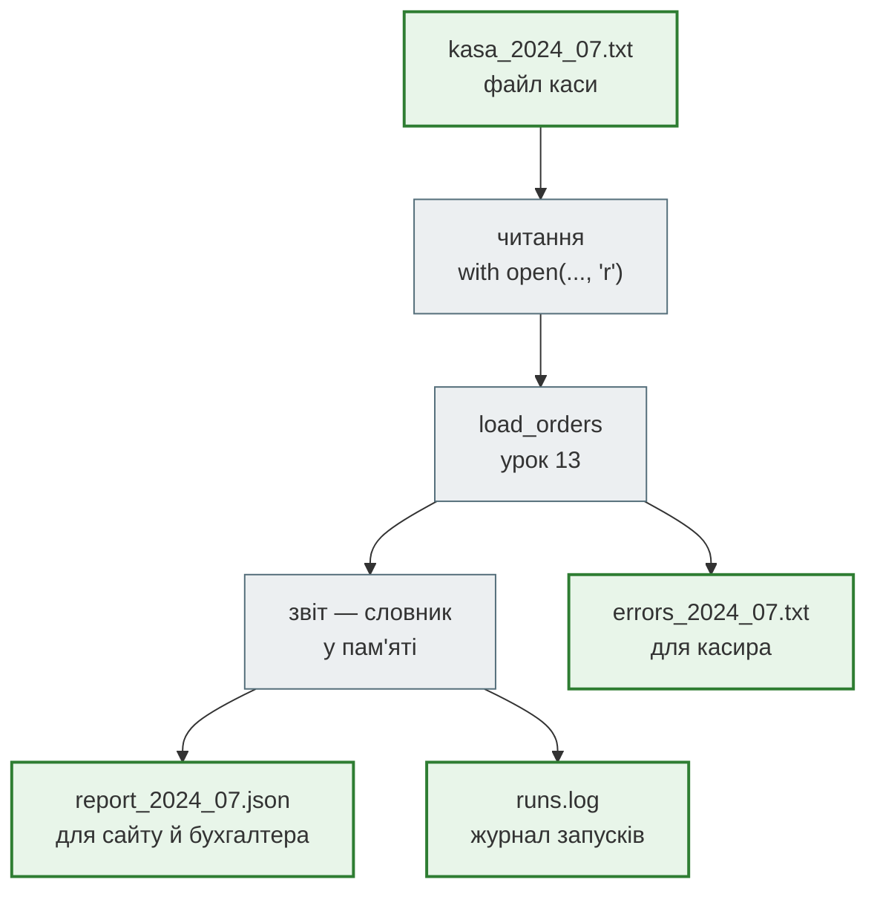

# Урок 14. Файли, менеджери контексту та JSON

В уроці 13 програма навчилася розбирати рядки каси: чотири правильні чеки приймає, п'ять зіпсованих пропускає й пояснює чому. Але рядки були вписані прямо в код, а результат жив лише доти, доки працювала програма. Закрив ноутбук — звіту немає.

Наприкінці липня каса вивантажила місячний файл `kasa_2024_07.txt`. Власниця хоче, щоб програма сама його прочитала, склала звіт і **зберегла** його у файл, який відкриє сайт кафе чи бухгалтер. Касирові — окремий файл з переліком зіпсованих рядків, щоб їх виправити. А щоб знати, коли звіт запускали, — журнал запусків.

**Що потрібно з попередніх уроків:** рядки й f-strings (урок 3), словники (урок 6), функції (урок 7), ітератори й `for` (урок 10), `datetime` і `Counter` (урок 12), `try` / `except`, `parse_line` і `load_orders` (урок 13).

**Після уроку ти зможеш:**

- читати текстовий файл цілком і рядок за рядком через `with open(...)`;
- пояснювати, чому `with` закриває файл навіть тоді, коли всередині стався виняток;
- обирати режим відкриття: `r` — читати, `w` — перезаписати, `a` — дописати в кінець;
- розбиратися з відносними шляхами й `FileNotFoundError`, користуватися `pathlib.Path`;
- зберігати словники у JSON і читати їх назад, знати, які типи JSON не підтримує;
- тримати налаштування програми в JSON-файлі, а не в коді; читати CSV модулем `csv`.

**Задача розділу.** Прочитати `kasa_2024_07.txt`, зберегти звіт у `report_2024_07.json`, зіпсовані рядки — в `errors_2024_07.txt`, а запуск — у журнал `runs.log`. Повний код — у розділі [«Практика»](#practice).

**Ноутбук заняття:** [`note_lesson_14_file_io_json.ipynb`](https://github.com/NikoriakViktot/PY-Course-Victor-Nikoriak-22-09-2026/blob/main/module_1/lessons/lesson_14_file_io_json/note_lesson_14_file_io_json.ipynb) [](https://colab.research.google.com/github/NikoriakViktot/PY-Course-Victor-Nikoriak-22-09-2026/blob/main/module_1/lessons/lesson_14_file_io_json/note_lesson_14_file_io_json.ipynb)

## Пригадай

Дай відповідь подумки, нічого не запускаючи:

1. Що повертає `load_orders(lines)` з уроку 13?
2. У програмі є словник `report`. Програма завершилась. Де тепер `report`?
3. Що надрукує цикл `for x in iterator:`, якщо ітератор уже вичерпали раніше?

??? success "Відповіді"

    1. Пару: список прийнятих чеків `RawOrder` і список пояснень до пропущених рядків, наприклад `"рядок 3: could not convert string to float: '540,00'"`.
    2. Ніде. Змінні живуть в оперативній пам'яті процесу, а після завершення програми цю пам'ять віддають системі.
    3. Нічого: вичерпаний ітератор більше нічого не дає (урок 10). Відкритий файл поводиться так само.

## Пам'ять і диск



Зелені блоки — файли на диску: вони переживають завершення програми. Сірі — робота в пам'яті: змінні, списки, словники. Програма читає файл у пам'ять, працює з даними і записує результат назад на диск.

Python не працює з диском сам. `open()` просить операційну систему відкрити файл і отримує **файловий об'єкт** — «ручку», через яку читають і пишуть. Коли роботу закінчено, ручку треба повернути: **закрити** файл.

## Читаємо файл каси

Ось що вивантажила каса. Це ті самі рядки, що в уроці 13, тепер у файлі:

```text title="kasa_2024_07.txt"
2024-07-19 18:30;540.00;50;2
2024-07-19 12:10;320.00;30;1
2024-07-19 19:05;540,00;40;3
2024-07-20 20:15;980.00;120;4
2024-07-20 13:40;760.00
2024-02-30 19:00;450.00;0;5
2024-07-21 18:00;-120.00;0;2
2024-07-21 14:20;610.00;60;0
2024-07-21 21:30;1200.00;150;6
```

Файл лежить у тій самій теці, що й програма. Прочитаємо його цілком:

```python
with open("kasa_2024_07.txt", "r", encoding="utf-8") as file:
    text = file.read()

print(type(text), len(text))
print(text.splitlines()[0])
```

```text
<class 'str'> 258
2024-07-19 18:30;540.00;50;2
```

- **`open(шлях, режим, encoding=...)`** відкриває файл. Режим `"r"` (read) — читання, він стоїть за замовчуванням;
- **`encoding="utf-8"`** — як перетворювати байти на букви. Без нього Python візьме кодування системи, і на Windows кирилиця може перетворитися на `РЇ` чи впасти з `UnicodeDecodeError`. Для текстових файлів курсу завжди пишемо `utf-8`;
- **`file.read()`** повертає весь вміст одним рядком `str`. Для файлу каси на 258 символів це нормально, для файлу на гігабайт — ні.

### Рядок за рядком

Відкритий файл — **ітератор** рядків, як генератор з уроку 10. Цикл `for` читає по одному рядку і не тримає в пам'яті весь файл:

```python
with open("kasa_2024_07.txt", encoding="utf-8") as file:
    for number, line in enumerate(file, start=1):
        if number <= 2:
            print(repr(line))
```

```text
'2024-07-19 18:30;540.00;50;2\n'
'2024-07-19 12:10;320.00;30;1\n'
```

Кожен рядок закінчується символом переходу на новий рядок `\n`. Якщо його не прибрати, останнє поле буде `"2\n"`. `int("2\n")` таке пробачить, а порівняння рядків чи ключ словника — ні. Тому рядок з файлу спершу чистять: `line.rstrip("\n")` або просто `line.strip()`.

Загорнемо читання у функцію. Порожні рядки (наприклад, зайвий `Enter` у кінці файлу) пропускаємо: це не зіпсовані чеки, їх просто немає.

```python
def read_kasa(path):
    """Непорожні рядки файлу каси без символу нового рядка."""
    lines = []
    with open(path, encoding="utf-8") as file:
        for line in file:
            line = line.strip()
            if line:
                lines.append(line)
    return lines


lines = read_kasa("kasa_2024_07.txt")
print(len(lines), lines[-1])
```

```text
9 2024-07-21 21:30;1200.00;150;6
```

### Навіщо with

`with open(...) as file:` відкриває файл, а коли блок з відступом закінчується, **сам його закриває**:

```python
with open("kasa_2024_07.txt", encoding="utf-8") as file:
    first = file.readline()

print(file.closed)
```

```text
True
```

Без `with` файл закривають вручну, `file.close()`. Але якщо між `open` і `close` станеться виняток, до `close` черга не дійде, і файл лишиться відкритим. `with` закриває файл **за будь-якого виходу** з блоку, так само як `finally` з уроку 13:

```python
try:
    with open("kasa_2024_07.txt", encoding="utf-8") as file:
        first = file.readline()
        average = 860.0 / 0
except ZeroDivisionError:
    print("виняток усередині with")

print(file.closed)
```

```text
виняток усередині with
True
```

Незакриті файли — це **витік ресурсів**: операційна система дає програмі обмежену кількість відкритих файлів. Найнеприємніше з записом: дані, які не встигли записатися до закриття, можуть не потрапити на диск. `with` називають **менеджером контексту** (context manager): він сам виконує дію на вході в блок і дію на виході з нього.

## Розбираємо і записуємо

`parse_line` і `load_orders` беремо з уроку 13 без змін:

??? note "Код з уроку 13: `RawOrder`, `parse_line`, `load_orders`"

    ```python
    from datetime import datetime
    from typing import NamedTuple


    class RawOrder(NamedTuple):
        total_bill: float
        tip: float
        size: int
        timestamp: datetime


    def parse_line(line):
        """Рядок каси -> RawOrder. Зіпсований рядок -> ValueError з поясненням."""
        fields = line.split(";")
        if len(fields) != 4:
            raise ValueError(f"очікували 4 поля, а маємо {len(fields)}")
        time_text, bill_text, tip_text, size_text = fields
        timestamp = datetime.strptime(time_text, "%Y-%m-%d %H:%M")
        bill, tip, size = float(bill_text), float(tip_text), int(size_text)
        if bill <= 0:
            raise ValueError(f"сума чека має бути більшою за 0, а маємо {bill}")
        if tip < 0:
            raise ValueError(f"чайові не можуть бути від'ємними: {tip}")
        if size < 1:
            raise ValueError(f"гостей має бути хоча б один, а маємо {size}")
        return RawOrder(bill, tip, size, timestamp)


    def load_orders(lines):
        """Правильні чеки і список пояснень до пропущених рядків."""
        orders = []
        errors = []
        for number, line in enumerate(lines, start=1):
            try:
                orders.append(parse_line(line))
            except ValueError as error:
                errors.append(f"рядок {number}: {error}")
        return orders, errors
    ```

```python
orders, errors = load_orders(read_kasa("kasa_2024_07.txt"))
print(len(orders), len(errors))
```

```text
4 5
```

### Режим w: файл для касира

Режим `"w"` (write) створює файл, а якщо він уже є — **стирає** його вміст і пише з нуля. Для переліку помилок за місяць це саме те, що треба: кожен запуск дає свіжий перелік.

```python
with open("errors_2024_07.txt", "w", encoding="utf-8") as file:
    for message in errors:
        file.write(message + "\n")

with open("errors_2024_07.txt", encoding="utf-8") as file:
    print(file.read(), end="")
```

```text
рядок 3: could not convert string to float: '540,00'
рядок 5: очікували 4 поля, а маємо 2
рядок 6: day is out of range for month
рядок 7: сума чека має бути більшою за 0, а маємо -120.0
рядок 8: гостей має бути хоча б один, а маємо 0
```

Дві особливості `write`:

- він **не додає** `\n` сам, на відміну від `print`. Забудеш — усі повідомлення зліпляться в один рядок;
- він приймає лише рядки: `file.write(5)` дасть `TypeError`. Число спершу перетворюють: `file.write(str(5))` або f-string.

Замість `write` можна писати звичним `print` з параметром `file`: `print(message, file=file)`. Він сам додасть `\n` і перетворить числа на текст.

### Режим a: журнал запусків

Журнал має **накопичуватися**: кожен запуск додає рядок у кінець і не стирає попередні. Для цього режим `"a"` (append):

```python
from pathlib import Path

Path("runs.log").unlink(missing_ok=True)   # починаємо з чистого журналу


def log_run(message, path="runs.log"):
    with open(path, "a", encoding="utf-8") as file:
        print(message, file=file)


log_run("2024-07: прийнято 4, пропущено 5")
log_run("2024-07: прийнято 4, пропущено 5")

with open("runs.log", encoding="utf-8") as file:
    print(file.read(), end="")
```

```text
2024-07: прийнято 4, пропущено 5
2024-07: прийнято 4, пропущено 5
```

Два запуски — два рядки. З режимом `"w"` лишився б один: кожен запуск стирав би журнал.

| Режим | Файл є | Файлу немає | Для чого в кафе |
|---|---|---|---|
| `"r"` | читає з початку | `FileNotFoundError` | файл каси, налаштування |
| `"w"` | **стирає** і пише з нуля | створює | звіт і помилки за місяць |
| `"a"` | дописує в кінець | створює | журнал запусків |

!!! warning "`w` не питає"
    `open("kasa_2024_07.txt", "w")` миттєво стирає файл каси, навіть якщо ти нічого не записав. Перш ніж відкривати файл на запис, перевір ім'я: вхідні дані й результати краще називати по-різному.

## Шляхи і FileNotFoundError

`"kasa_2024_07.txt"` — **відносний шлях**: Python шукає файл у **поточній теці** (current working directory). Це тека, з якої запустили програму, а не обов'язково та, де лежить `.py`-файл:

- `python report.py` з теки проєкту — поточна тека проєкту;
- `python cafe/report.py` з теки вище — поточна тека вище, і `open("kasa_2024_07.txt")` шукатиме файл там;
- у Jupyter — тека ноутбука, у Colab — `/content`, куди потрапляють файли з панелі 📁.

Коли файлу немає, `open` у режимі `"r"` піднімає `FileNotFoundError`. Як і в уроці 13, ловимо його там, де знаємо, що відповісти людині:

```python
path = Path("kasa_2024_08.txt")
print(path.exists())

try:
    read_kasa(path)
except FileNotFoundError as error:
    print("Каса ще не вивантажила файл:", error.filename)
```

```text
False
Каса ще не вивантажила файл: kasa_2024_08.txt
```

`FileNotFoundError` — різновид `OSError`, як і `PermissionError` («немає прав на файл»). `Path.cwd()` покаже поточну теку, якщо не зрозуміло, де Python шукає файли.

**`pathlib.Path`** — шлях як об'єкт, а не рядок. Частини шляху з'єднують оператором `/`, і Python сам поставить правильний роздільник для системи:

```python
folder = Path("kasa")
path = folder / "kasa_2024_07.txt"
print(path.name, path.stem, path.suffix)
print(path.parent.name)
```

```text
kasa_2024_07.txt kasa_2024_07 .txt
kasa
```

`open` приймає і рядок, і `Path`. `Path` має й зручні методи: `path.exists()`, `path.read_text(encoding="utf-8")`, `path.write_text(text, encoding="utf-8")`.

## JSON: звіт, який прочитає інша програма

Звіт — це словник. Чому б не записати його через `str()`?

```python
report = {"cafe": "Смачно", "orders": 4, "revenue": 3040.0, "open": True, "note": None}

with open("report.txt", "w", encoding="utf-8") as file:
    file.write(str(report))

with open("report.txt", encoding="utf-8") as file:
    back = file.read()

print(type(back))
print(back[:12])
```

```text
<class 'str'>
{'cafe': 'См
```

Назад повертається **рядок**, а не словник: `back["orders"]` не спрацює. А сайт кафе, написаний не на Python, взагалі не знає, що таке `True` і `None`. Потрібен формат, який розуміють усі мови й з якого словник збирається назад.

**JSON** (JavaScript Object Notation) — текстовий формат, схожий на словники й списки Python. Його розуміє практично кожна мова програмування, і саме ним обмінюються сайти й сервери. Модуль [`json`](https://docs.python.org/3/library/json.html) зі стандартної бібліотеки перетворює Python ↔ JSON:

```python
import json

text = json.dumps(report, ensure_ascii=False)
print(text)
print(json.loads(text) == report)
```

```text
{"cafe": "Смачно", "orders": 4, "revenue": 3040.0, "open": true, "note": null}
True
```

Лапки в JSON лише подвійні, `True` став `true`, `None` — `null`. `json.loads` зібрав з тексту **той самий** словник.

| Функція | Що робить |
|---|---|
| `json.dumps(obj)` | об'єкт → рядок JSON (s — string) |
| `json.loads(text)` | рядок JSON → об'єкт |
| `json.dump(obj, file)` | об'єкт → у відкритий файл |
| `json.load(file)` | з відкритого файлу → об'єкт |

Два параметри для людей: `ensure_ascii=False` залишає кирилицю кирилицею, а `indent=2` розбиває JSON на рядки з відступами. Без `ensure_ascii=False` українські літери стануть кодами:

```python
print(json.dumps({"cafe": "Смачно"}))
```

```text
{"cafe": "\u0421\u043c\u0430\u0447\u043d\u043e"}
```

Це теж правильний JSON, і `json.loads` поверне «Смачно», але людина такий файл не прочитає.

### Що JSON вміє, а що ні

| Python | JSON |
|---|---|
| `dict` | об'єкт `{...}`, ключі — лише рядки |
| `list`, `tuple` | масив `[...]` |
| `str` | рядок у подвійних лапках |
| `int`, `float` | число |
| `True`, `False`, `None` | `true`, `false`, `null` |

**Прогноз:** що повернеться після запису й читання?

```python
from collections import Counter

data = {"best_day": ("сб", 980.0), 7: "липень", "by_time": Counter({"вечеря": 3, "обід": 1})}
back = json.loads(json.dumps(data, ensure_ascii=False))
print(back)
```

```text
{'best_day': ['сб', 980.0], '7': 'липень', 'by_time': {'вечеря': 3, 'обід': 1}}
```

Три тихі зміни: кортеж повернувся **списком**, ключ `7` — **рядком** `'7'`, а `Counter` — звичайним словником. Помилки немає, але `back[7]` дасть `KeyError`. Для звіту кафе це не страшно, якщо про це пам'ятати.

А `datetime` JSON не знає зовсім:

```python
json.dumps({"first_order": datetime(2024, 7, 19, 12, 10)})
```

```text
TypeError: Object of type datetime is not JSON serializable
```

Дату записують рядком у стандартному форматі ISO 8601 і відновлюють з нього:

```python
stamp = datetime(2024, 7, 19, 12, 10).isoformat()
print(stamp)
print(datetime.fromisoformat(stamp))
```

```text
2024-07-19T12:10:00
2024-07-19 12:10:00
```

### Зіпсований JSON

Якщо в JSON-файлі помилка (одинарні лапки, зайва кома, файл записали через `str()`), `json.loads` / `json.load` піднімає `json.JSONDecodeError`. Це різновид `ValueError`, тож обробляється так само, як в уроці 13:

```python
try:
    json.loads("{'orders': 4}")
except json.JSONDecodeError as error:
    print(isinstance(error, ValueError))
    print(error)
```

```text
True
Expecting property name enclosed in double quotes: line 1 column 2 (char 1)
```

Повідомлення вказує рядок і позицію: у колонці 2 чекали `"`, а стоїть `'`.

## Налаштування у файлі

У коді звіту досі вшиті назва кафе й імена файлів. Щоб перейменувати файл каси, доведеться лізти в код. Налаштування краще тримати окремо, у JSON:

```json title="cafe_config.json"
{
  "cafe": "Кафе «Смачно»",
  "currency": "грн",
  "kasa_file": "kasa_{year}_{month:02d}.txt",
  "report_file": "report_{year}_{month:02d}.json",
  "errors_file": "errors_{year}_{month:02d}.txt",
  "log_file": "runs.log"
}
```

```python
with open("cafe_config.json", encoding="utf-8") as file:
    config = json.load(file)

print(config["cafe"])
print(config["kasa_file"].format(year=2024, month=7))
```

```text
Кафе «Смачно»
kasa_2024_07.txt
```

`"kasa_{year}_{month:02d}.txt"` — **шаблон**: `str.format` підставляє значення в `{}` за тими самими правилами, що f-string (`:02d` — два знаки з нулем попереду). f-string тут не підійде: його значення обчислюються одразу в коді, а шаблон приходить з файлу як звичайний рядок.

Тепер касир може змінити назву файлу, а бухгалтер — валюту, не відкриваючи Python.

## CSV: таблиця в тексті

Сайт замовлень кафе вивантажує дані в інший формат — **CSV** (comma-separated values): перший рядок — назви колонок, далі по рядку на запис, значення через кому:

```text title="orders.csv (перші рядки)"
order_id,customer_name,dish,price,order_date,city
1,Anna,Pizza,320,2026-03-10 12:30,Kyiv
2,Oleh,Burger,210,2026-03-10 13:10,Lviv
```

Розбирати такий файл через `split(",")` ризиковано: кома може трапитися всередині значення, у лапках. Модуль [`csv`](https://docs.python.org/3/library/csv.html) робить це правильно. `csv.DictReader` віддає кожен рядок словником з ключами-назвами колонок:

```python
import csv

with open("orders.csv", encoding="utf-8", newline="") as file:
    rows = list(csv.DictReader(file))

print(len(rows))
print(rows[0]["dish"], repr(rows[0]["price"]))
print(sum(float(row["price"]) for row in rows))
```

```text
12
Pizza '320'
2900.0
```

Усі значення з CSV — **рядки**, навіть `'320'`: перетворювати їх на числа й дати — наша робота, з тими самими `ValueError`, що в уроці 13. `newline=""` радить документація модуля `csv`: так він сам правильно обробляє переходи на новий рядок.

Для великих таблиць зазвичай беруть бібліотеку pandas: `pd.read_csv("orders.csv")`. Приклад — у ноутбуці заняття викладача [`file_json_example.ipynb`](https://github.com/NikoriakViktot/PY-Course-Victor-Nikoriak-22-09-2026/blob/main/module_1/lessons/lesson_14_file_io_json/file_json_example.ipynb) [](https://colab.research.google.com/github/NikoriakViktot/PY-Course-Victor-Nikoriak-22-09-2026/blob/main/module_1/lessons/lesson_14_file_io_json/file_json_example.ipynb).

## Практика { #practice }

### Розібраний приклад: місячний звіт кафе

Зберемо все разом. Правила з уроку 12 (день тижня і прийом їжі) — у згорнутому блоці:

??? note "Правила з уроку 12: `DAYS`, `meal_type_from_hour`"

    ```python
    DAYS = ("пн", "вт", "ср", "чт", "пт", "сб", "нд")


    def meal_type_from_hour(hour):
        if 11 <= hour <= 15:
            return "обід"
        if 17 <= hour <= 23:
            return "вечеря"
        return "інше"
    ```

```python linenums="1" hl_lines="1 6 7 14 20 21 22 25 26 29 30 32 33"
def build_report(config, period, orders, errors):
    """Звіт за місяць — лише типи, які розуміє JSON."""
    revenue = sum(order.total_bill for order in orders)
    average = revenue / len(orders) if orders else 0.0
    by_time = Counter(meal_type_from_hour(order.timestamp.hour) for order in orders)
    first = min(order.timestamp for order in orders).isoformat() if orders else None
    return {
        "cafe": config["cafe"],
        "currency": config["currency"],
        "period": period,
        "orders": len(orders),
        "skipped": len(errors),
        "revenue": round(revenue, 2),
        "average": round(average, 2),
        "by_time": dict(by_time.most_common()),
        "first_order": first,
    }


def month_report(config, year, month):
    names = {key: config[key].format(year=year, month=month)
             for key in ("kasa_file", "report_file", "errors_file")}
    orders, errors = load_orders(read_kasa(names["kasa_file"]))
    report = build_report(config, f"{year}-{month:02d}", orders, errors)

    with open(names["report_file"], "w", encoding="utf-8") as file:
        json.dump(report, file, ensure_ascii=False, indent=2)
    with open(names["errors_file"], "w", encoding="utf-8") as file:
        for message in errors:
            print(message, file=file)
    log_run(f"{report['period']}: прийнято {report['orders']}, пропущено {report['skipped']}",
            config["log_file"])
    return names["report_file"]


def main(year, month):
    with open("cafe_config.json", encoding="utf-8") as file:
        config = json.load(file)
    try:
        report_file = month_report(config, year, month)
    except FileNotFoundError as error:
        print("Немає файлу каси:", error.filename)
        return 1
    print("Звіт збережено:", report_file)
    return 0


main(2024, 7)
main(2024, 8)
```

```text
Звіт збережено: report_2024_07.json
Немає файлу каси: kasa_2024_08.txt
```

Що вийшло у файлі звіту — його побачить сайт кафе:

```python
with open("report_2024_07.json", encoding="utf-8") as file:
    print(file.read())
```

```text
{
  "cafe": "Кафе «Смачно»",
  "currency": "грн",
  "period": "2024-07",
  "orders": 4,
  "skipped": 5,
  "revenue": 3040.0,
  "average": 760.0,
  "by_time": {
    "вечеря": 3,
    "обід": 1
  },
  "first_order": "2024-07-19T12:10:00"
}
```

Що відбувається в ключових рядках:

- **рядок 1** — `build_report` лише рахує і повертає словник, файлів не торкається. Її легко перевірити на кількох чеках;
- **рядки 6 і 14** — усе, що JSON не знає, перетворюється заздалегідь: `datetime` → рядок ISO, `Counter` → `dict`. `if orders else` захищає від порожнього місяця: `min()` порожнього списку підняв би `ValueError`;
- **рядки 20–22** — імена файлів з шаблонів конфігу, жодного вшитого імені;
- **рядки 25–26** — `json.dump` пише просто у відкритий файл, `ensure_ascii=False` і `indent=2` — для людей;
- **рядки 29–30** — перелік помилок перезаписується (`"w"`), журнал дописується (`"a"`, всередині `log_run`);
- **рядки 32–33** — `main` ловить `FileNotFoundError` і відповідає людською мовою, як `main` в уроці 13. `month_report` про людей нічого не знає.

А тепер програма, якою бухгалтер відкриє звіт, — теж Python, хоча могла б бути будь-якою мовою:

```python
with open("report_2024_07.json", encoding="utf-8") as file:
    saved = json.load(file)

print(f"{saved['cafe']}, {saved['period']}: {saved['revenue']:.2f} {saved['currency']}")
print("Вечері:", saved["by_time"]["вечеря"])
```

```text
Кафе «Смачно», 2024-07: 3040.00 грн
Вечері: 3
```

### Зміни приклад: найкращий день і чайові

Додай до `build_report` два ключі:

- `"best_day"` — день тижня (`"пн"`…`"нд"`) з найбільшим виторгом;
- `"tips_percent"` — чайові як відсоток від виторгу, округлені до одного знака.

І перший рядок у файлі помилок: `Пропущено рядків: 5`.

Очікувані значення для липня:

```text
best_day: нд
tips_percent: 11.5
```

**Критерії перевірки:**

- `report_2024_07.json` після запуску містить обидва нові ключі;
- для місяця без жодного правильного чека `build_report` не падає: `"best_day"` — `null`, `"tips_percent"` — `0.0`;
- `errors_2024_07.txt` після двох запусків поспіль містить заголовок **один** раз.

??? tip "Підказка"
    Виторг за днями — словник, як `revenue_by_day` в уроці 7, тільки ключ — `DAYS[order.timestamp.weekday()]`. Найкращий день — `max(revenue_by_day, key=revenue_by_day.get)`, але лише якщо словник непорожній. Заголовок пиши першим `print` у тому самому `with open(..., "w")`.

### Спробуй самостійно: картка постійного гостя

Кафе запускає картки лояльності: за кожен візит гість отримує бал. Бали мають зберігатися між запусками програми в `loyalty.json`, наприклад:

```json
{"Оксана": 3, "Тарас": 1}
```

Напиши три функції:

- `load_loyalty(path)` — словник з файлу; якщо файлу ще немає (перший запуск) — порожній словник `{}`;
- `add_visit(cards, name)` — додає гостеві бал, новому гостю створює картку з балом 1;
- `save_loyalty(cards, path)` — записує словник у файл, кирилицею і з відступами.

Перевірка — «запуск програми двічі»:

```text
перший запуск:  {}  →  після двох візитів Оксани і одного Тараса  →  {'Оксана': 2, 'Тарас': 1}
другий запуск:  {'Оксана': 2, 'Тарас': 1}  →  ще візит Оксани  →  {'Оксана': 3, 'Тарас': 1}
```

**Правила:**

- відсутній файл — через `try` / `except FileNotFoundError`, а не `Path.exists()` (EAFP з уроку 13);
- файл читається й пишеться лише через `with`;
- `add_visit` не торкається файлів.

### Знайди помилку

У кожному фрагменті одна помилка. Що піде не так?

```python
# 1 — журнал
with open("runs.log", "w", encoding="utf-8") as file:
    file.write("2024-07: прийнято 4, пропущено 5")

# 2 — перелік помилок
with open("errors_2024_07.txt", "w", encoding="utf-8") as file:
    for message in errors:
        file.write(message)

# 3 — звіт
with open("report_2024_07.json", encoding="utf-8") as file:
    saved = json.loads(file)
```

??? success "Відповіді"

    1. Режим `"w"` стирає журнал при кожному запуску: лишиться лише останній рядок. Для журналу потрібен `"a"`, а ще `\n` в кінці рядка.
    2. `write` не додає `\n`: п'ять повідомлень зліпляться в один рядок. Треба `file.write(message + "\n")` або `print(message, file=file)`.
    3. `json.loads` чекає **рядок**, а отримує файловий об'єкт: `TypeError`. Для файлу — `json.load(file)` без `s`.

## Підсумок

| Поняття | Що запам'ятати |
|---|---|
| `with open(path, mode, encoding="utf-8")` | файл закриється сам, навіть після винятку |
| `read()` і `for line in file` | весь текст одним рядком або рядок за рядком; `strip()` прибирає `\n` |
| `"r"`, `"w"`, `"a"` | читати; стерти й записати; дописати в кінець |
| Відносний шлях | шукається від поточної теки; немає файлу — `FileNotFoundError` |
| JSON | `dump`/`load` — файл, `dumps`/`loads` — рядок; кортеж → список, ключі → рядки |
| `datetime` у JSON | `isoformat()` і `datetime.fromisoformat()` |
| CSV | `csv.DictReader`; усі значення — рядки |

### Самоперевірка

1. Чим `with open(...) as file:` кращий за `file = open(...)` і `file.close()`?
2. Файл відкрили в режимі `"w"`, але нічого не записали. Що сталося з його вмістом?
3. Чому `file.read()` вдруге поспіль повертає порожній рядок?
4. Програма `cafe/report.py` відкриває `"kasa_2024_07.txt"`, файл лежить поруч з нею, а виходить `FileNotFoundError`. Чому?
5. Чому звіт зберігають у JSON, а не через `str(report)`?
6. У звіті був ключ `7`. Як дістати значення після `json.load`?
7. Чим `json.load` відрізняється від `json.loads`?

??? success "Відповіді"

    1. `with` закриває файл за будь-якого виходу з блоку, зокрема після винятку. Ручний `close()` після винятку не виконається.
    2. Вміст стерто: `"w"` очищає файл одразу під час відкриття.
    3. Файл — ітератор з курсором. Перший `read()` дочитав до кінця, і курсор лишився там. Потрібно відкрити файл знову (або `file.seek(0)`).
    4. Відносний шлях шукається від поточної теки, з якої запустили програму, а не від теки файлу `.py`. Запусти програму з теки `cafe` або побудуй шлях від `Path(__file__).parent`.
    5. `str()` дає текст, з якого словник назад не збирається, і його не прочитає програма іншою мовою. JSON відновлюється через `json.load` у той самий словник і зрозумілий будь-якій мові.
    6. `saved["7"]`: ключі в JSON — лише рядки.
    7. `json.load(file)` читає з відкритого файлу, `json.loads(text)` — з рядка.

### Що далі

- Ноутбук заняття: [`note_lesson_14_file_io_json.ipynb`](https://github.com/NikoriakViktot/PY-Course-Victor-Nikoriak-22-09-2026/blob/main/module_1/lessons/lesson_14_file_io_json/note_lesson_14_file_io_json.ipynb) [](https://colab.research.google.com/github/NikoriakViktot/PY-Course-Victor-Nikoriak-22-09-2026/blob/main/module_1/lessons/lesson_14_file_io_json/note_lesson_14_file_io_json.ipynb) — той самий місяць каси: ноутбук сам створює файл каси й конфіг, далі прогнози, вправи й перевірки.
- Довідник: [`notes_file_io_json.ipynb`](https://github.com/NikoriakViktot/PY-Course-Victor-Nikoriak-22-09-2026/blob/main/module_1/lessons/lesson_14_file_io_json/notes_file_io_json.ipynb) [](https://colab.research.google.com/github/NikoriakViktot/PY-Course-Victor-Nikoriak-22-09-2026/blob/main/module_1/lessons/lesson_14_file_io_json/notes_file_io_json.ipynb) — курсор файлу (`tell`, `seek`), типи JSON докладно, форматування таблиць, телефонна книга. Стислий повтор — [File I/O та JSON](../../reference/python_core/file_io_json.md).
- Наступне заняття: [Урок 15. Git + GitHub](lesson_15.md). Файли проєкту кафе вже є — час зберігати їхню історію і показувати код іншим.

## Документація і джерела

- Туторіал Python: [Reading and Writing Files](https://docs.python.org/3/tutorial/inputoutput.html#reading-and-writing-files), [Saving structured data with json](https://docs.python.org/3/tutorial/inputoutput.html#saving-structured-data-with-json)
- [`open()`](https://docs.python.org/3/library/functions.html#open) — режими й параметри; [`pathlib`](https://docs.python.org/3/library/pathlib.html)
- [`json`](https://docs.python.org/3/library/json.html), [`csv`](https://docs.python.org/3/library/csv.html), [`datetime.isoformat`](https://docs.python.org/3/library/datetime.html#datetime.datetime.isoformat)
- Глосарій: [context manager](https://docs.python.org/3/glossary.html#term-context-manager); оператор [`with`](https://docs.python.org/3/reference/compound_stmts.html#the-with-statement)
- Специфікація JSON: [json.org](https://www.json.org/json-uk.html) (українською)
- Для охочих:
    - Harvard CS50P, [лекція 6 «File I/O»](https://cs50.harvard.edu/python/weeks/6/) — `open`, `with`, CSV, `csv.DictReader`;
    - Princeton, *Introduction to Programming in Python*, [розділ 1.5 «Input and Output»](https://introcs.cs.princeton.edu/python/15inout/) — стандартний ввід/вивід, перенаправлення у файли.
