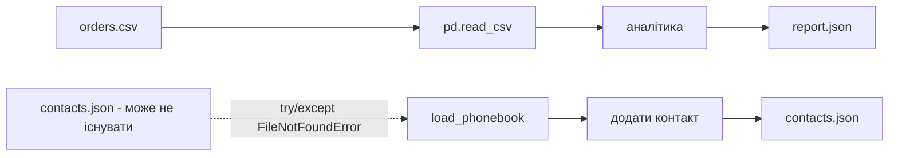

# Урок 14. Файли I/O, менеджери контексту, JSON

**Передумови:** уроки 3 (f-strings), 6 (`.get()`, comprehensions), 13 (`try`/`except`). **Розв'язує:** організацію логіки й дані, що переживають виконання програми — до цього уроку все, що робив студент, зникало разом із завершенням скрипта.

У Уроках 5–6 ми вже рахували аналітику ресторану — середні чеки, лідера дня, чайові по офіціантах — але тільки в оперативній пам'яті: закриваєш ноутбук, і весь `report` зникає. Цей урок додає відсутню частину: не нову аналітику, а її збереження — той самий тип звіту (`report.json`), який тепер переживає завершення програми.

## RETRIEVE

Коротке пригадування без підглядання: що поверне `{"name": "Alice"}["age"]` і як цього уникнути через `.get()`? Як записати f-string `"Ціна: 320.00 грн"` зі змінних `price = 320`, `currency = "грн"`? Чим list comprehension `{d["city"] for d in orders}` відрізняється від звичайного списку — яка структура даних вийде?

Це не нові теми — `.get()` (урок 6) і f-strings (урок 3) сьогодні просто застосовуються в новому контексті: читанні й записі файлів.

## CONCEPT

### Ментальна модель: RAM проти диска

Коли Python-програма завершується, усі її змінні зникають — вони жили в **RAM** (оперативній пам'яті), тимчасово. Файли на диску — постійні: залишаються між запусками програми.

```
RAM (оперативна пам'ять)              DISK (диск)
scores = {"Alice": 150}  → зникає     orders.csv   → залишається
df = DataFrame(...)      → зникає     report.json  → залишається
```

Сценарій уроку: менеджер ресторану надсилає `orders.csv` — список замовлень за тиждень. Задача — **прочитати** файл (диск → RAM), обробити дані (у RAM), **записати** результат (RAM → диск) у форматі, який потім прочитає інша програма (frontend сайту чи мобільний застосунок).

### Що таке файл у Python

Python не звертається до диска напряму — він просить **операційну систему (OS)** відкрити з'єднання до файлу. OS повертає **file object** (file handle) — об'єкт-посилання, через який Python читає або пише дані.

```python
file_object = open("orders.csv", "r")
#              ім'я файлу      режим (r = read)
```

| Режим | Що робить | Ризик |
|---|---|---|
| `r` | Читання | `FileNotFoundError`, якщо файл відсутній |
| `w` | Запис | **Стирає** весь наявний вміст; якщо файлу нема — створює |
| `a` | Дописування в кінець | Якщо файлу нема — створює |

Завжди вказуйте `encoding="utf-8"` — інакше кирилиця та інші не-ASCII символи можуть прочитатись некоректно.

### `with open(...)` — навіщо

Ручне закриття файлу небезпечне: якщо між `open()` і `f.close()` станеться помилка, `close()` ніколи не виконається — файл лишиться заблокованим (*resource leak*, той самий клас проблем, що обговорювався на уроці 13 для інших ресурсів).

```python
# НЕБЕЗПЕЧНО:
f = open("orders.csv", "r")
data = f.read()
result = 10 / 0     # виняток — f.close() нижче вже не виконається
f.close()
```

`with` — контекстний менеджер: закриває файл автоматично, навіть якщо всередині блоку сталася помилка.

```python
with open("orders.csv", "r", encoding="utf-8") as f:
    data = f.read()
# файл закрито тут — гарантовано
```

### Чому `str()` не годиться для збереження словника

```python
my_data = {"name": "Alice", "score": 150, "active": True}

with open("bad_data.txt", "w", encoding="utf-8") as f:
    f.write(str(my_data))

with open("bad_data.txt", "r", encoding="utf-8") as f:
    loaded = f.read()

print(loaded, type(loaded))   # рядок, НЕ словник
```

`loaded` — це `str`, не словник. Три проблеми: одинарні лапки (Python-синтаксис, не універсальний формат), `True` з великої літери (інші мови очікують `true`), і головне — тип даних втрачено, назад у `dict` без ручного парсингу не повернути.

### JSON вирішує цю проблему

```python
import json

# dict → JSON-рядок → dict, повний цикл
json_text = json.dumps(my_data)          # dict → str (у JSON-синтаксисі)
restored = json.loads(json_text)         # str → dict, з правильними типами
assert restored == my_data
```

`json.dump(obj, file)` / `json.load(file)` — те саме, але напряму у файл/з файлу. Суфікс `s` (`dumps`/`loads`) = робота з рядком (*string*) у пам'яті; без `s` — робота з файлом.

### `config.json` — налаштування замість хардкоду

```python
# Хардкод — погано: щоб змінити файл, треба лізти в код
df = pd.read_csv("orders.csv")

# Через конфіг — добре: щоб змінити файл, достатньо відредагувати JSON
with open("pipeline_config.json", "r", encoding="utf-8") as f:
    config = json.load(f)
df = pd.read_csv(config["input_file"])
```

### `orders.csv` через pandas

```python
import pandas as pd

df = pd.read_csv(config["input_file"])
```

**PREDICT.** Поки `order_date` — рядок (`object`), спробуйте `df["order_date"].dt.day_name()` — і передбачте результат до запуску.

**RUN / INVESTIGATE.** Дата в CSV — завжди текст, доки явно не перетворена:

```python
df[config["date_column"]] = pd.to_datetime(df[config["date_column"]])
df["day_name"] = df["order_date"].dt.day_name()   # тепер .dt.* працює
```

### Типова помилка: numpy-тип у `json.dumps()`

```python
import numpy as np

raw_sum = df["price"].sum()          # numpy.float64, НЕ Python float
json.dumps({"total": raw_sum})       # TypeError: Object of type int64/float64 is not JSON serializable

fixed = json.dumps({"total": float(raw_sum)})   # виправлення — явний float()
```

`pandas`/`numpy` повертають власні числові типи (`numpy.int64`, `numpy.float64`) — стандартний модуль `json` уміє серіалізувати лише вбудовані типи Python, тому кожне число, що потрапляє у звіт, потрібно явно пропустити через `float()`/`int()`.

## CREATE / TRANSFER

Зібраний пайплайн: `pipeline_config.json` → `pd.read_csv` → `pd.to_datetime` → аналітика (`revenue_by_city`, `top_dishes`) → `report.json`, який читається назад і перевіряється. Практичні завдання в ноутбуці розширюють цю саму схему: `revenue_by_dish`, `revenue_by_month`, `report_extended.json`.

Четверте завдання навмисно змінює патерн: замість «порахувати і перезаписати звіт заново» — **дозавантажити** те, що вже є на диску, і дописати. Це інший, не менш поширений сценарій персистентності (нотатки, контакти, кошик покупок), де файл може ще не існувати при першому запуску:

```python
def load_phonebook(path):
    try:
        with open(path, "r", encoding="utf-8") as f:
            return json.load(f)
    except FileNotFoundError:
        return {}    # перший запуск — файла ще нема, це не аварія
```

**Ключовий момент уроку:** `try`/`except FileNotFoundError` перетворює «файла ще нема» з аварійної зупинки програми (урок 13) на очікуваний, оброблений сценарій — той самий принцип EAFP, застосований до збереження стану застосунку, а не до одноразового звіту.



Це і є перевірка перенесення навички (TRANSFER): один і той самий інструментарій (`open`, `with`, `json.dump`/`json.load`) обслуговує два різні по суті сценарії — «побудувати звіт з нуля» і «дозавантажити та доповнити стан».

👉 Швидкий довідник для повторення — [File I/O та JSON](../../reference/python_core/file_io_json.md).

**Спробуйте самі — де практикуватись:**

- [`note_lesson_14_file_io_json.ipynb`](https://github.com/NikoriakViktot/PY-Course-Victor-Nikoriak-22-09-2026/blob/main/module_1/lessons/lesson_14_file_io_json/note_lesson_14_file_io_json.ipynb) [](https://colab.research.google.com/github/NikoriakViktot/PY-Course-Victor-Nikoriak-22-09-2026/blob/main/module_1/lessons/lesson_14_file_io_json/note_lesson_14_file_io_json.ipynb) — повний конспект уроку з поступовим нарощуванням коду, поясненнями і чотирма практичними завданнями (`revenue_by_dish`, `revenue_by_month`, `report_extended.json`, телефонна книга з fallback-завантаженням)
- [`notes_file_io_json.ipynb`](https://github.com/NikoriakViktot/PY-Course-Victor-Nikoriak-22-09-2026/blob/main/module_1/lessons/lesson_14_file_io_json/notes_file_io_json.ipynb) [](https://colab.research.google.com/github/NikoriakViktot/PY-Course-Victor-Nikoriak-22-09-2026/blob/main/module_1/lessons/lesson_14_file_io_json/notes_file_io_json.ipynb) — додатковий матеріал: File Pointer (`.tell()`/`.seek()`), режими `open()` детальніше, JSON проти XML/REST API в реальних системах
