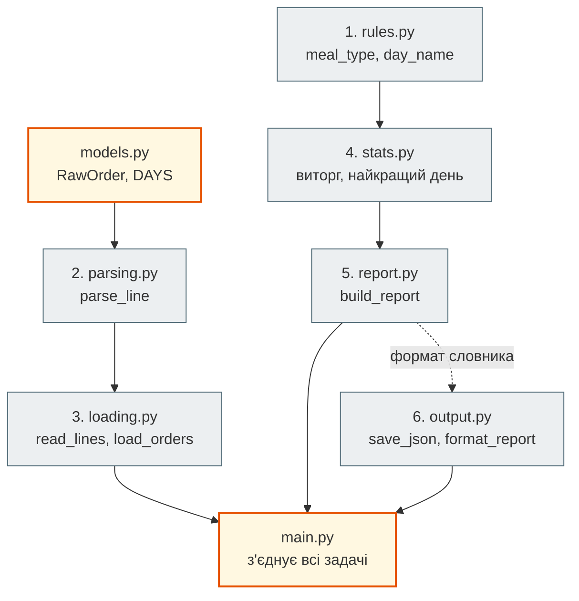
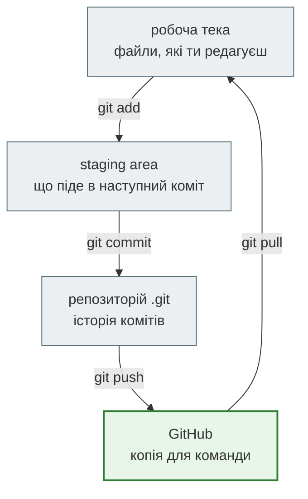
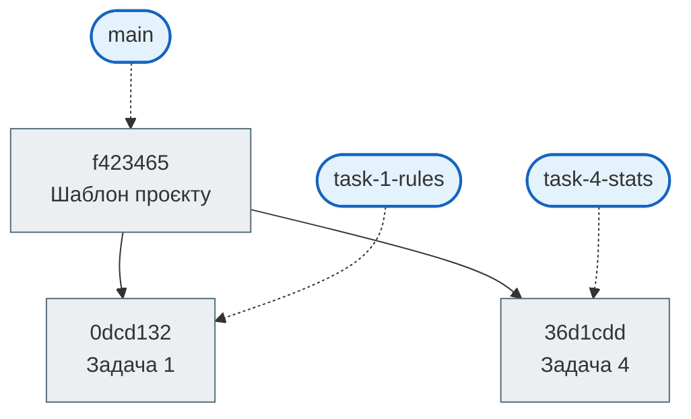
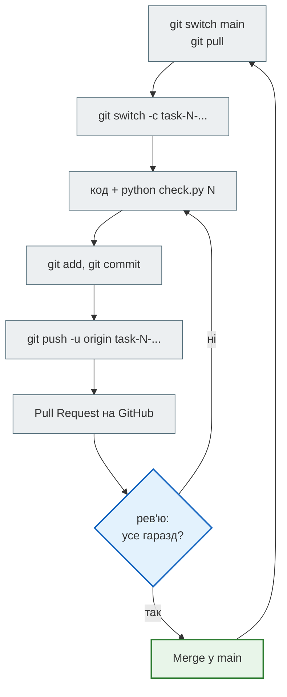

# Урок 15. Git + GitHub: командний проєкт

За уроки 12–14 кожен з вас сам зібрав звіт каси кафе: правила, розбір рядків, читання файлу, підрахунки, JSON. Тепер кафе хоче той самий звіт, але робитиме його **команда**. Шість людей, шість частин, один проєкт, який після злиття всіх частин має запрацювати одразу, без «у мене працювало».

Як зробити, щоб шість людей не затирали файли одне одного? Щоб кожен міг працювати, не чекаючи інших? І щоб після злиття не з'ясувалося, що один повертає `"orders"`, а другий читає `"count"`? Відповідь складається з двох частин: **Git і GitHub** — для історії, гілок і злиття, і **контракти з тестами** — щоб частини пасували одна до одної.

Це не перше знайомство з Git: з уроку 1 ти здаєш домашні через `commit → push → Pull Request`. Сьогодні розберемо, що насправді відбувається за цими командами, і вперше попрацюємо **разом в одному репозиторії**.

**Що потрібно з попередніх уроків:** функції й докстрінги (урок 7), модулі та `import` (урок 12), винятки (урок 13), файли й JSON (урок 14), Git-процес здачі домашніх ([інструкція](../../00_getting_started/homework_workflow.md)).

**Після уроку ти зможеш:**

- пояснювати, де живуть файли: робоча тека, staging area, репозиторій — і що переносить кожна команда;
- писати зрозумілі коміти й не пускати в репозиторій згенеровані файли через `.gitignore`;
- працювати в окремій гілці на задачу й відкривати Pull Request у командний репозиторій;
- розв'язувати конфлікт злиття й пояснювати, чому код різних людей не конфліктує, коли кожен працює у своєму файлі;
- писати функцію за контрактом так, щоб проєкт працював після злиття всіх частин.

**Задача розділу.** Командою з 4–6 людей зібрати проєкт [`team_project/`](https://github.com/NikoriakViktot/PY-Course-Victor-Nikoriak-22-09-2026/tree/main/module_1/lessons/lesson_15_git_github_system/team_project) — шість взаємозалежних задач — так, щоб у `main` пройшло `python check.py all`. Інструкція — у розділі [«Практика»](#practice).

**Ноутбук заняття:** [`note_lesson_15_git_github_system.ipynb`](https://github.com/NikoriakViktot/PY-Course-Victor-Nikoriak-22-09-2026/blob/main/module_1/lessons/lesson_15_git_github_system/note_lesson_15_git_github_system.ipynb) [](https://colab.research.google.com/github/NikoriakViktot/PY-Course-Victor-Nikoriak-22-09-2026/blob/main/module_1/lessons/lesson_15_git_github_system/note_lesson_15_git_github_system.ipynb)

## Пригадай

Дай відповідь подумки:

1. Які команди ти виконуєш між «код домашньої написано» і «PR відкрито»?
2. Що показує `git status`?
3. Чим `origin` відрізняється від `upstream` у твоєму fork курсу?

??? success "Відповіді"

    1. `git switch -c homework-NN` (або `checkout -b`), `git add`, `git commit -m "..."`, `git push origin homework-NN`, далі кнопка **Compare & pull request** на GitHub.
    2. Які файли змінено, які вже підготовлено до коміту, які Git ще не відстежує, і в якій ти гілці.
    3. `origin` — твій fork на GitHub, куди ти робиш `push`. `upstream` — репозиторій викладача, звідки ти отримуєш нові уроки. Обидва — лише імена для адрес.

## Проєкт: шість задач, які залежать одна від одної

Команда збирає той самий конвеєр, що в уроках 12–14, але кожну ланку пише інша людина:



| № | Файл | Що зробити | Використовує |
|---|---|---|---|
| 1 | `rules.py` | `meal_type(hour)`, `day_name(timestamp)` | — |
| 2 | `parsing.py` | `parse_line(line)` | `models.py` |
| 3 | `loading.py` | `read_lines(path)`, `load_orders(lines)` | задача 2 |
| 4 | `stats.py` | `revenue_by_day`, `best_day`, `count_by_meal` | задача 1 |
| 5 | `report.py` | `build_report(orders, errors)` | задача 4 |
| 6 | `output.py` | `save_json`, `format_report` | формат звіту задачі 5 |

Викладач дає готові `models.py`, `main.py`, файл каси, тести й перевірку `check.py`. Коли всі шість задач злито, програма працює:

```bash
python main.py kasa_2024_07.txt
```

```text
Чеків: 4, пропущено рядків: 5
Виторг: 3040.00 грн, середній чек: 760.00 грн
Найкращий день: нд
За днями: пт 860.00, сб 980.00, нд 1200.00
За прийомом їжі: вечеря 3, обід 1
```

Задача 4 викликає функції задачі 1, задача 5 — задачі 4. Як тоді Тарасові писати задачу 4, якщо Оксана ще не дописала задачу 1? Про це — розділ «Контракт». Спершу — як Git тримає код команди.

## Три місця, де живуть файли



- **Робоча тека** (working tree) — звичайні файли, які ти відкриваєш у редакторі.
- **Staging area** (індекс) — «кошик» наступного коміту. `git add rules.py` кладе туди поточний стан файлу.
- **Репозиторій** — тека `.git`: усі коміти, гілки, історія. `git commit` робить знімок того, що лежить у staging.

Навіщо проміжний крок? Щоб у коміт потрапило лише те, що стосується однієї зміни. Оксана виправила `rules.py` і водночас щось пробувала в `main.py`. Вона додає лише `rules.py`, а експерименти лишаються в робочій теці.

Ірина, лідерка команди, створює репозиторій проєкту. Вивід — справжній, git 2.43:

```bash
git init -b main
git status --short
```

```text
?? .gitignore
?? README.md
?? TEAM.md
?? check.py
?? kasa_2024_07.txt
?? loading.py
?? main.py
?? models.py
...
?? tests/
```

`??` — файл є в робочій теці, але Git його ще не відстежує. Додаємо все й робимо перший коміт:

```bash
git add .
git commit -m "Шаблон проєкту: контракти, тести, заглушки"
```

```text
[main (root-commit) f423465] Шаблон проєкту: контракти, тести, заглушки
 22 files changed, 609 insertions(+)
 create mode 100644 .gitignore
 create mode 100644 README.md
 ...
```

**Коміт** — знімок усіх відстежуваних файлів плюс автор, час, повідомлення і посилання на попередній коміт («батька»). `f423465` — початок його **хешу**, унікального ідентифікатора. У тебе хеш буде інший: він залежить від автора, часу і вмісту.

### Добре повідомлення коміту

Повідомлення читатимуть інші люди, коли шукатимуть, звідки взялася зміна. Добре повідомлення каже, **що** і **навіщо** змінено:

| Погано | Добре |
|---|---|
| `fix` | `Задача 3: пропускати порожні рядки файлу каси` |
| `update` | `Задача 1: 16:00 — не обід, як у контракті` |
| `asdf`, `зміни`, `ще раз` | `Задача 6: кирилиця в report.json без \u-кодів` |

Один коміт — одна логічна зміна. Якщо в повідомленні хочеться написати «і ще», це два коміти.

### .gitignore: що не потрапляє в репозиторій

Після запуску програми в теці з'являються `__pycache__/` (кеш Python, урок 12), `report.json` і `errors.txt` (результати `main.py`, урок 14). Їх генерує програма, у кожного вони свої, а в спільному репозиторії вони лише створюють конфлікти. Файл `.gitignore` проєкту каже Git їх не помічати:

```text title=".gitignore"
# Python
__pycache__/
*.pyc
.venv/
.env

# Результати запуску main.py — генеруються, не зберігаємо
report.json
errors.txt
```

Після запусків тек і файлів побільшало, а `git status --short` мовчить: ігноровані файли він не показує. Чому саме файл ігнорується, пояснить `git check-ignore -v`:

```bash
git check-ignore -v __pycache__/rules.cpython-312.pyc report.json
```

```text
.gitignore:2:__pycache__/	__pycache__/rules.cpython-312.pyc
.gitignore:8:report.json	report.json
```

!!! warning "`.env` — ніколи в репозиторій"
    Паролі, токени, ключі API тримають у файлі `.env`, і він завжди в `.gitignore`. Файл, який потрапив на GitHub хоч на хвилину, вважай скомпрометованим: історія комітів зберігає його навіть після видалення.

## Гілка — рухомий вказівник

Гілка не копіює файли. Це **ім'я, яке вказує на коміт**. Коли ти комітиш у гілці, вказівник пересувається на новий коміт. `HEAD` показує, в якій гілці ти зараз.

Оксана бере задачу 1:

```bash
git switch -c task-1-rules
```

```text
Switched to a new branch 'task-1-rules'
```

Вона пише `meal_type` і `day_name` у `rules.py`, перевіряє свою задачу і дописує себе в `TEAM.md`:

```bash
python check.py 1
```

```text
Задача 1: rules.py — день тижня і прийом їжі
  test_meal_type_borders: OK
  test_day_name: OK
```

```bash
git add rules.py TEAM.md
git status --short
git commit -m "Задача 1: meal_type і day_name"
```

```text
M  TEAM.md
M  rules.py
[task-1-rules 0dcd132] Задача 1: meal_type і day_name
 2 files changed, 7 insertions(+), 2 deletions(-)
```

`M` у першій колонці — файл змінено й додано в staging. Якби `M` стояло в другій колонці, файл було б змінено, але ще не додано.

У той самий час Тарас від `main` створює свою гілку `task-4-stats`, пише `stats.py`, дописує себе в `TEAM.md` і комітить. Тепер історія розгалужена:



Прямокутники — коміти, овали — гілки-вказівники. `main` досі на шаблоні: Оксана й Тарас нічого в ньому не змінили.

## Контракт: як працювати, не чекаючи інших

Тарасова `revenue_by_day` викликає Оксанину `day_name`. Якщо Тарас чекатиме, поки Оксана закінчить, команда працюватиме по черзі, а не разом. Щоб працювати паралельно, в кожної функції є **контракт** — докстрінг, який точно описує вхід, вихід і межові випадки. Ось заглушка, яку Тарас отримав у шаблоні:

```python title="stats.py — заглушка з шаблону"
from rules import day_name, meal_type


def revenue_by_day(orders):
    """Виторг за днями тижня: {"пт": 860.0, ...}. Лише дні, у які були чеки."""
    raise NotImplementedError("задача 4: напиши revenue_by_day()")


def best_day(revenue):
    """День з найбільшим виторгом; для порожнього словника — None."""
    raise NotImplementedError("задача 4: напиши best_day()")
```

Тарас знає, **що** повертає `day_name` (з її контракту), і пише свою функцію, спираючись лише на це. А тести задачі 4 підставляють замість Оксаниної функції **заглушку** — крихітну функцію, яка знає відповіді лише для тестових дат:

```python title="tests/test_task4.py — фрагмент"
def fake_day_name(timestamp):
    """Заглушка задачі 1: знає лише 19 і 20 липня."""
    return {19: "пт", 20: "сб"}[timestamp.day]


def test_revenue_by_day():
    with replaced(stats, day_name=fake_day_name):
        assert revenue_by_day(ORDERS) == {"пт": 860.0, "сб": 980.0}, revenue_by_day(ORDERS)
        assert revenue_by_day([]) == {}
```

`replaced` — допоміжний менеджер контексту з `tests/helpers.py`: на час блоку `with` модуль `stats` бачить заглушку замість справжньої `day_name`, а потім усе повертається. Тому `python check.py 4` проходить, навіть коли `rules.py` ще заглушка. Так само влаштовані тести задач 3 і 5.

Стан усієї команди показує `check.py` без аргументів:

```bash
python check.py
```

```text
✅ 1. rules.py — день тижня і прийом їжі: 2/2
⏳ 2. parsing.py — розбір рядка каси: 0/3
⏳ 3. loading.py — читання файлу і всіх рядків: 0/3
✅ 4. stats.py — підрахунки за днями і прийомами їжі: 3/3
⏳ 5. report.py — словник звіту: 0/2
⏳ 6. output.py — JSON і текст звіту: 0/3
```

`⏳` — задачу ще не почато (заглушка піднімає `NotImplementedError`), `✅` — усі тести задачі пройдено, `❌` — задачу написано, але тести падають.

!!! tip "Контракт — це домовленість, а тест — її перевірка"
    Докстрінг каже, що має бути. Тест перевіряє, що так і є. Поки обидві сторони дотримуються контракту, їм не треба бачити код одне одного.

## Pull Request і злиття

У командному репозиторії ніхто не комітить у `main` напряму. Кожна задача проходить однаковий шлях:



`git push -u origin task-1-rules` відправляє гілку на GitHub. `-u` запам'ятовує зв'язок, далі досить `git push`. На GitHub з'являється кнопка **Compare & pull request**, як у домашніх. Різниця одна: PR іде в `main` **командного** репозиторію, а не в репозиторій викладача. Хтось із команди переглядає код і натискає **Merge pull request**.

Натискання Merge робить на GitHub те саме, що локальна команда:

```bash
git switch main
git merge --no-ff task-1-rules -m "Merge pull request #1 from task-1-rules"
```

```text
Merge made by the 'ort' strategy.
 TEAM.md  | 1 +
 rules.py | 8 ++++++--
 2 files changed, 7 insertions(+), 2 deletions(-)
```

Git створив **коміт злиття** з двома батьками: попереднім `main` і останнім комітом гілки. Якби в `main` за цей час нічого не змінилося, Git міг би просто пересунути вказівник `main` вперед (**fast-forward**). Кнопка GitHub за замовчуванням завжди створює коміт злиття, щоб в історії було видно кожен PR.

`git pull` — це `git fetch` (забрати нові коміти з GitHub) плюс `git merge` (злити їх у поточну гілку). Тому після кожного злиття всі в команді роблять `git switch main` і `git pull`.

## Конфлікт злиття

Задача 1 уже в `main`. Тарас хоче, щоб його PR злився чисто, тож спершу підтягує `main` у свою гілку:

```bash
git switch task-4-stats
git merge main
```

```text
Auto-merging TEAM.md
CONFLICT (content): Merge conflict in TEAM.md
Automatic merge failed; fix conflicts and then commit the result.
```

Оксана й Тарас обоє дописали рядок **в одне й те саме місце** `TEAM.md` — у кінець таблиці. Git не знає, чий рядок має бути першим, і питає людину. `rules.py` і `stats.py` злилися самі: кожен змінював **свій** файл.

```bash
git status --short
cat TEAM.md
```

```text
UU TEAM.md
M  rules.py
```

```text
| Задача | Файл | Хто |
|---|---|---|
<<<<<<< HEAD
| 4 | stats.py | Тарас |
=======
| 1 | rules.py | Оксана |
>>>>>>> main
```

`UU` — файл з конфліктом. Між маркерами — дві версії:

- від `<<<<<<< HEAD` до `=======` — твоя версія, з поточної гілки `task-4-stats`;
- від `=======` до `>>>>>>> main` — версія, яку ти зливаєш.

**Чотири кроки розв'язання:**

1. Відкрити файл і вирішити, яким він має бути. Тут потрібні обидва рядки: спершу задача 1, потім 4.
2. Видалити **всі три** маркери: `<<<<<<<`, `=======`, `>>>>>>>`.
3. `git add TEAM.md` — позначити конфлікт розв'язаним.
4. `git commit` — завершити злиття.

```text
| Задача | Файл | Хто |
|---|---|---|
| 1 | rules.py | Оксана |
| 4 | stats.py | Тарас |
```

```bash
git add TEAM.md
git commit --no-edit
```

```text
[task-4-stats b6d8e2c] Merge branch 'main' into task-4-stats
```

Тепер PR Тараса зливається в `main` без конфлікту. Якщо розв'язувати конфлікт зараз не хочеться, `git merge --abort` повертає все, як було до `git merge`.

Історія після двох PR:

```bash
git log --oneline --graph
```

```text
*   b209e80 Merge pull request #2 from task-4-stats
|\
| *   b6d8e2c Merge branch 'main' into task-4-stats
| |\
| |/
|/|
* |   a3740d5 Merge pull request #1 from task-1-rules
|\ \
| * | 0dcd132 Задача 1: meal_type і day_name
|/ /
| * 36d1cdd Задача 4: виторг за днями, найкращий день, прийоми їжі
|/
* f423465 Шаблон проєкту: контракти, тести, заглушки
```

!!! note "Чому код не конфліктує"
    Конфлікт виникає, лише коли дві гілки змінили **ті самі рядки** одного файлу. У проєкті кожна задача — окремий файл, тож код шести людей зливається автоматично. Конфлікт у `TEAM.md` закладено навмисно: безпечне місце, щоб уперше зустріти конфлікт і не боятися його.

## Злиття без конфлікту, але проєкт зламано

Відсутність конфлікту ще не означає, що проєкт працює. Git порівнює рядки тексту, а не сенс коду.

Уяви: автор задачі 6 не прочитав контракт задачі 5 і в `format_report` написав `report['count']` замість `report['orders']`. Свої тести він не запустив, і PR злили. Git не бачить жодної проблеми: це інший файл. Але `check.py` бачить:

```bash
python check.py all
```

```text
...
Задача 6: output.py — JSON і текст звіту
  test_save_json: OK
  test_format_report: ПОМИЛКА KeyError: 'count' (output.py, рядок 25)
  test_format_empty_report: ПОМИЛКА KeyError: 'count' (output.py, рядок 25)
Інтеграційний тест: увесь проєкт разом
  test_full_report: ПОМИЛКА KeyError: 'count' (output.py, рядок 25)
  test_missing_file: OK
❌ Проєкт ще не працює — дивись рядки вище
```

Тести задачі 6 побудовані на тому самому словнику, що описаний у контракті задачі 5. Тому помилку знайшли б ще до PR, якби автор виконав `python check.py 6`. Звідси два правила команди:

- **перед push** — `python check.py N` для своєї задачі;
- **після кожного злиття** — `python check.py all` у `main`. Інтеграційний тест запускає весь `main.py` на справжньому файлі каси.

## Практика { #practice }

### Розібраний приклад: двоє в одному репозиторії

Увесь шлях з цього розділу — від `git init` до двох злитих PR — можна пройти самому в ноутбуці заняття: він створює тимчасовий репозиторій, і ти по черзі граєш Оксану й Тараса. Git у Colab уже встановлено.

Коротко послідовність:

```bash
# Ірина (лідерка): шаблон проєкту
git init -b main
git add .
git commit -m "Шаблон проєкту: контракти, тести, заглушки"

# Оксана: задача 1
git switch -c task-1-rules
python check.py 1
git add rules.py TEAM.md
git commit -m "Задача 1: meal_type і day_name"

# Тарас: задача 4, від main
git switch main
git switch -c task-4-stats
python check.py 4
git add stats.py TEAM.md
git commit -m "Задача 4: виторг за днями, найкращий день, прийоми їжі"

# PR #1 злито
git switch main
git merge --no-ff task-1-rules

# Тарас підтягує main, розв'язує конфлікт у TEAM.md
git switch task-4-stats
git merge main
git add TEAM.md
git commit --no-edit

# PR #2 злито
git switch main
git merge --no-ff task-4-stats
```

### Зміни приклад: файл, який не мав потрапити в коміт

Хтось із команди запустив `main.py`, а потім зробив `git add .`, коли `.gitignore` ще не мав рядка `report.json`. Тепер `report.json` у репозиторії, і кожен запуск програми «змінює» відстежуваний файл.

Виправ у своїй гілці:

1. Переконайся, що в `.gitignore` є `report.json`.
2. Прибери файл з репозиторію, але не з диска: `git rm --cached report.json`.
3. Закоміть: `git commit -m "Не зберігати report.json: його генерує main.py"`.

**Критерії перевірки:**

- `git status --short` після запуску `main.py` порожній;
- `git ls-files` не показує `report.json`;
- файл `report.json` на диску лишився.

??? tip "Підказка"
    `.gitignore` діє лише на файли, які Git **ще не відстежує**. Файл, що вже є в коміті, спершу треба прибрати з індексу — саме це робить `git rm --cached`.

### Командна задача: звіт каси кафе

Команда з 4–6 людей. У маленькій команді хтось бере дві задачі.

1. **Лідер** створює новий публічний репозиторій на GitHub ([інструкція](../../00_getting_started/github/create_repository.md), сценарій B), копіює туди **вміст** теки [`team_project/`](https://github.com/NikoriakViktot/PY-Course-Victor-Nikoriak-22-09-2026/tree/main/module_1/lessons/lesson_15_git_github_system/team_project) **без** теки `solution/` і робить перший коміт.
2. Лідер додає команду: **Settings → Collaborators → Add people** ([документація GitHub](https://docs.github.com/en/repositories/managing-your-repositorys-settings-and-features/repository-access-and-collaboration/inviting-collaborators-to-a-personal-repository)). Кожен приймає запрошення й клонує репозиторій.
3. Команда розподіляє задачі 1–6. Кожен:
    - `git switch main` і `git pull`, потім `git switch -c task-N-назва`;
    - читає контракт у докстрінгах свого файлу, пише код;
    - `python check.py N` — поки всі тести не `OK`;
    - дописує свій рядок у `TEAM.md`;
    - `git add` лише свої файли, `git commit` з добрим повідомленням, `git push -u origin task-N-назва`;
    - відкриває PR у `main` свого командного репозиторію.
4. Кожен PR переглядає інша людина: чи дотримано контракту, чи зрозумілий код, чи немає зайвих файлів. Merge — лише після схвалення.
5. Конфлікт у `TEAM.md` розв'язує автор PR: `git merge main` у своїй гілці, чотири кроки, `git push`.
6. **Готово**, коли в `main` після `git pull`:

```text
✅ Проєкт працює!
```

— останній рядок `python check.py all`, а `python main.py kasa_2024_07.txt` друкує звіт, як на початку уроку.

**Що надіслати викладачеві:** посилання на командний репозиторій. Там має бути видно шість PR, кожен від своєї людини, з рев'ю.

### Знайди помилку

Що піде не так у кожній ситуації?

1. Тарас виконав `git add .` одразу після `python main.py kasa_2024_07.txt`, а в `.gitignore` немає `report.json`.
2. Оксана відкрила проєкт, одразу написала код і закомітила в `main`.
3. Ірина тиждень не робила `git pull`, створила гілку для виправлення і відкрила PR.

??? success "Відповіді"

    1. `report.json` потрапить у репозиторій. У кожного він різний, тож кожен PR змінюватиме цей файл і конфліктуватиме з іншими. Спершу `.gitignore`, потім `git add` конкретних файлів.
    2. Коміт у `main` оминає PR і рев'ю, і всі інші при `git pull` отримають неперевірений код. Спершу `git switch -c task-...`.
    3. Гілка створена від застарілого `main`: у ній немає тижня чужих змін. PR, найімовірніше, матиме конфлікти, а тести можуть падати через уже виправлені речі. Перед новою гілкою — `git switch main` і `git pull`.

## Підсумок

| Поняття | Що запам'ятати |
|---|---|
| Три місця | робоча тека → `git add` → staging → `git commit` → репозиторій → `git push` → GitHub |
| Коміт | знімок + автор + повідомлення + батько; один коміт — одна зміна |
| `.gitignore` | згенеровані файли й секрети не потрапляють у репозиторій |
| Гілка | вказівник на коміт; одна задача — одна гілка |
| PR | запит злити гілку в `main` з рев'ю; `pull` = `fetch` + `merge` |
| Конфлікт | ті самі рядки в обох гілках; прибрати маркери → `add` → `commit` |
| Контракт | докстрінг + тести; дає працювати паралельно і злити без сюрпризів |

### Самоперевірка

1. Що робить `git add` і навіщо він окремо від `git commit`?
2. Що таке гілка технічно? Чи копіює `git switch -c` файли?
3. Чому `rules.py` і `stats.py` злилися автоматично, а `TEAM.md` — ні?
4. Що означають маркери `<<<<<<<`, `=======`, `>>>>>>>`? Що з ними робити?
5. Git злив усі PR без конфліктів. Чи означає це, що проєкт працює?
6. Як Тарас перевіряє задачу 4, якщо задача 1 ще не готова?
7. Чому `report.json` у `.gitignore`, а `kasa_2024_07.txt` — ні?

??? success "Відповіді"

    1. Кладе поточний стан файлу в staging area — набір того, що піде в наступний коміт. Окремий крок дозволяє закомітити лише частину змін.
    2. Іменований вказівник на коміт. Файли не копіюються; змінюється лише те, на що вказує `HEAD`.
    3. Кожен файл змінювала лише одна гілка. У `TEAM.md` обидві гілки дописали рядок в одне місце.
    4. Межі двох версій: від `<<<<<<<` до `=======` — поточна гілка, від `=======` до `>>>>>>>` — та, що зливається. Залишити правильний варіант, прибрати всі маркери, `git add`, `git commit`.
    5. Ні. Git порівнює текст, а не сенс. Перевіряє `python check.py all` з інтеграційним тестом.
    6. Тести задачі 4 підставляють заглушку `fake_day_name`, яка знає відповіді для тестових дат. Задача 4 спирається лише на контракт `day_name`.
    7. `report.json` генерує програма, у кожного свій. `kasa_2024_07.txt` — вхідні дані, однакові для всієї команди, без них проєкт не запуститься.

### Що далі

- Ноутбук заняття: [`note_lesson_15_git_github_system.ipynb`](https://github.com/NikoriakViktot/PY-Course-Victor-Nikoriak-22-09-2026/blob/main/module_1/lessons/lesson_15_git_github_system/note_lesson_15_git_github_system.ipynb) [](https://colab.research.google.com/github/NikoriakViktot/PY-Course-Victor-Nikoriak-22-09-2026/blob/main/module_1/lessons/lesson_15_git_github_system/note_lesson_15_git_github_system.ipynb) — двоє в одному репозиторії: гілки, злиття, конфлікт, `.gitignore`, з перевірками.
- Інструкції: [Як створити свій репозиторій](../../00_getting_started/github/create_repository.md), [Pull Request](../../00_getting_started/github/pull_request.md), [Git шпаргалка](../../git-cheatsheet.md).
- Наступне заняття: [Урок 16. Практикум 3. Хеш-структури](lesson_16.md). А капстоун-проєкт [уроку 17](lesson_17.md) ти так само вестимеш у власному репозиторії з гілками й комітами.

## Документація і джерела

- Pro Git українською: [книга](https://git-scm.com/book/uk/v2) — розділи 2 (основи: коміти, `.gitignore`) і 3 (гілки та злиття)
- Довідка Git: [`gitignore`](https://git-scm.com/docs/gitignore), [`git merge`](https://git-scm.com/docs/git-merge), [`git switch`](https://git-scm.com/docs/git-switch)
- GitHub Docs: [Pull requests](https://docs.github.com/en/pull-requests/collaborating-with-pull-requests), [Resolving a merge conflict on GitHub](https://docs.github.com/en/pull-requests/how-tos/merge-and-close-pull-requests/resolving-a-merge-conflict-on-github)
- Для охочих: MIT, *The Missing Semester of Your CS Education*, [«Version Control (Git)»](https://missing.csail.mit.edu/2020/version-control/) — модель даних Git знизу вгору: знімки, коміти, вказівники.
