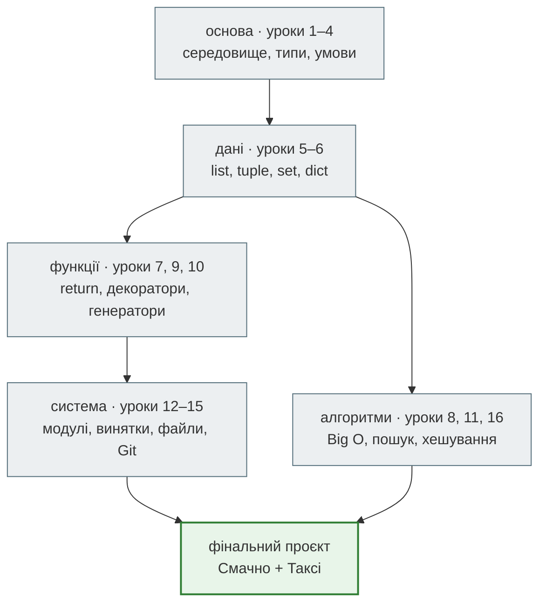
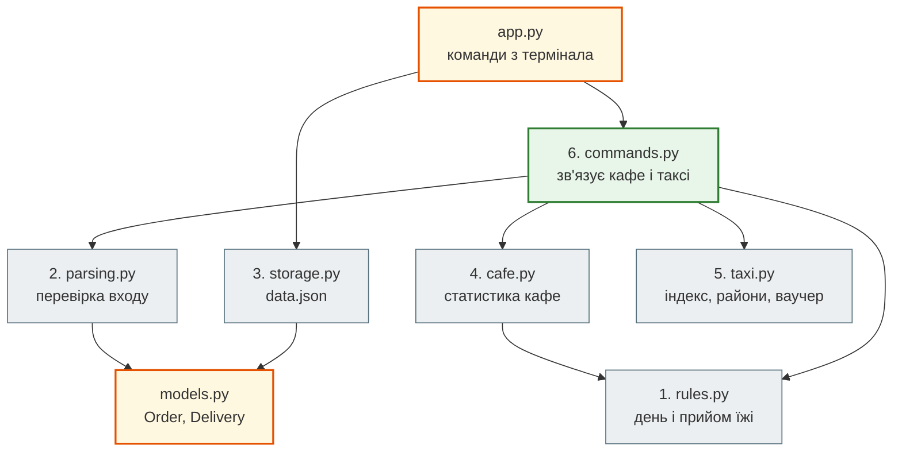

# Урок 17. Узагальнення модуля 1 і фінальний проєкт

Модуль 1 мав дві історії. **Кафе «Смачно»**: від змінних з сумою чека (урок 3) до звіту з функцій (урок 7), модулів і командного рядка (урок 12), винятків (урок 13), файлів і JSON (урок 14) та командного проєкту на GitHub (урок 15). **Диспетчерська таксі**: три практикуми про ціну рішення (урок 8), вибір стратегії пошуку (урок 11) і хеш-структури (урок 16).

Тепер кафе запускає **доставку**, а возять замовлення водії таксі. Потрібна одна система, яка знає і про чеки, і про доставки. Це фінальний проєкт модуля: ти збереш його сам, за день чи два, і в ньому знадобиться майже все, що було в модулі.

**Що потрібно:** уроки 1–16.

**Після уроку ти зможеш:**

- пояснити, як теми модуля пов'язані між собою і навіщо кожна з них знадобилась;
- проєктувати програму зверху вниз: задача → дані → стан → операції → перетворення → модулі → код;
- зібрати консольну систему з шести модулів, яка зберігає стан у JSON, пояснює помилки людською мовою і перевіряється тестами;
- вести проєкт у власному репозиторії: гілки, коміти, Pull Request, README.

**Задача розділу.** Фінальний проєкт [«Смачно + Таксі»](#project) у теці [`capstone/`](https://github.com/NikoriakViktot/PY-Course-Victor-Nikoriak-22-09-2026/tree/main/module_1/lessons/lesson_17_module1_review/capstone).

**Ноутбук заняття:** [`note_lesson_17_review.ipynb`](https://github.com/NikoriakViktot/PY-Course-Victor-Nikoriak-22-09-2026/blob/main/module_1/lessons/lesson_17_module1_review/note_lesson_17_review.ipynb) [](https://colab.research.google.com/github/NikoriakViktot/PY-Course-Victor-Nikoriak-22-09-2026/blob/main/module_1/lessons/lesson_17_module1_review/note_lesson_17_review.ipynb)

## Карта модуля



| Урок | Що дав | Де знадобиться в проєкті |
|---|---|---|
| 3–4 | типи, перетворення, умови | `float("540.00")`, перевірки сум і кількості гостей |
| 5–6 | `NamedTuple`, списки, словники | `Order`, `Delivery`, лічильники |
| 7 | функції з контрактом | кожна частина — набір маленьких функцій |
| 8, 11, 16 | Big O, пошук, `dict` / `set` / `Counter` | пошук замовлення за номером, райони, ваучер |
| 12 | модулі, `datetime`, `sys.argv` | шість файлів, дати, команди з термінала |
| 13 | винятки, `raise` | зрозумілі помилки замість трасувань |
| 14 | `with open`, JSON | стан у `data.json` між запусками |
| 15 | Git, гілки, PR, тести | власний репозиторій, `check.py` |

## Десять ідей модуля

Коротко — те, що варто пам'ятати й через рік:

1. **Змінна — ярлик, а не коробка** (урок 3). `b = a` для списку — два ярлики на один об'єкт.
2. **Python динамічний, але строгий** (урок 3). `"Чек: " + 540` — `TypeError`: перетворюй явно.
3. **Структура даних визначає алгоритм** (уроки 8, 11, 16). Той самий пошук — `O(n)` у списку, `O(log n)` у відсортованому, `O(1)` у словнику.
4. **Функція — рівень абстракції** (урок 7). `print_report(orders)` читається як крок, а не як 30 рядків.
5. **Чиста функція передбачувана** (урок 7). Той самий вхід — той самий результат, без змін чужих даних.
6. **Помилки — це нормально, якщо їх обробляти** (урок 13). Ловити там, де знаєш, що відповісти людині, і ніколи не мовчки.
7. **Дані живуть поза програмою** (урок 14). Змінні зникають, файли лишаються.
8. **Стандартна бібліотека — перший ресурс** (урок 12). `datetime`, `collections`, `json`, `csv` — уже встановлені.
9. **Git — спосіб мислення** (урок 15). Маленькі осмислені кроки, історія, гілки, рев'ю.
10. **Середовище — фундамент** (урок 2). Активуй середовище → встанови → запускай.

## Перевір себе: прогнози

Спершу скажи, що надрукує кожен фрагмент, потім розгорни відповідь. У ноутбуці заняття ці самі прогнози можна запустити.

**1.** Урок 3:

```python
a = [540, 320]
b = a
b.append(980)
print(a)
```

**2.** Урок 4:

```python
print(bool("0"), bool(0), bool([]))
```

**3.** Урок 6:

```python
counts = {}
for day in ["пт", "сб", "пт"]:
    counts[day] = counts.get(day, 0) + 1
print(counts)
```

**4.** Урок 7:

```python
def add_order(bill, orders=[]):
    orders.append(bill)
    return orders


add_order(540)
print(add_order(320))
```

**5.** Урок 10:

```python
doubled = (bill * 2 for bill in [100, 200])
print(list(doubled), list(doubled))
```

**6.** Урок 13:

```python
try:
    int("7.5")
except ValueError:
    print("A")
else:
    print("B")
finally:
    print("C")
```

**7.** Урок 14:

```python
import json

print(json.loads(json.dumps({7: ("пт", 540)})))
```

**8.** Урок 16:

```python
routes = {}
routes[["Поділ", "Оболонь"]] = 1
```

??? success "Відповіді"

    1. `[540, 320, 980]` — `a` і `b` — ярлики одного списку.
    2. `True False False` — непорожній рядок істинний, навіть `"0"`; нуль і порожній список — хибні.
    3. `{'пт': 2, 'сб': 1}`.
    4. `[540, 320]` — список за замовчуванням створюється **один раз**, при оголошенні функції. Правильно: `orders=None` і `if orders is None: orders = []`.
    5. `[200, 400] []` — генератор вичерпується після першого проходу.
    6. `A`, потім `C`: `else` лише без винятку, `finally` — завжди.
    7. `{'7': ['пт', 540]}` — ключ став рядком, кортеж — списком.
    8. `TypeError: unhashable type: 'list'` — ключ має бути незмінним; маршрут — кортежем.

??? note "Чекліст модуля 1: чи можу я пояснити…"

    - різницю між інтерпретатором, `pip`, `venv` і IDE; навіщо активувати середовище;
    - чим `int`, `float`, `str`, `bool` відрізняються і як їх перетворювати; чому `0.1 + 0.2 != 0.3`;
    - порядок `if` / `elif` / `else` і коли `while` зупиняється;
    - коли брати `list`, `tuple`, `set`, `dict`; як розпакувати кортеж;
    - `return` проти `print`; значення за замовчуванням; область видимості;
    - що робить декоратор і `functools.wraps`; чим генератор відрізняється від списку;
    - що таке `O(1)`, `O(log n)`, `O(n)`, `O(n²)` і як їх упізнати в коді;
    - що робить `import`; навіщо `if __name__ == "__main__":`;
    - `try` / `except` / `else` / `finally`, `raise`, чому не можна голий `except:`;
    - `with open(...)`, режими `r` / `w` / `a`, `json.dump` / `json.load`;
    - `git add` / `commit` / `push`, гілка, Pull Request, конфлікт.

    Якщо якийсь пункт не пояснюється — повернися до уроку з карти вище, перш ніж братися за проєкт.

## Фінальний проєкт: Смачно + Таксі { #project }

Доставка працює так. Каса кафе, як і раніше, дає замовлення рядками. Адміністратор додає до замовлення доставку: район, вартість, водія. Власниця хоче спільний звіт: скільки замовлень, скільки з доставкою, виторг кафе й таксі, найкращий день, популярні райони. А служба підтримки — знайти пару доставок під ваучер.

Великі програми не пишуть «з першого рядка коду». Їх **проєктують зверху вниз**, і лише потім пишуть код. Пройдемо ці кроки для нашої системи.

### 1. Задача — одним реченням

> Консольна програма, яка зберігає замовлення кафе й доставки таксі між запусками і відповідає на питання власниці, адміністратора й служби підтримки.

### 2. Дані — які записи існують

| Запис | Поля | Звідки взявся |
|---|---|---|
| `Order` | `id`, `time` (`datetime`), `bill`, `tip`, `guests` | каса, уроки 13–14 |
| `Delivery` | `order_id`, `district`, `fare`, `driver` | таксі, уроки 8, 11, 16 |

Зв'язок між ними — `Delivery.order_id`: номер замовлення, яке доставляють. У кожного замовлення щонайбільше одна доставка.

### 3. Стан — що треба пам'ятати між запусками

Два списки, `orders` і `deliveries`. Між запусками вони живуть у `data.json` (урок 14): кожна команда спершу читає стан, потім, якщо щось змінила, записує його назад. Перший запуск — файлу ще немає, стан порожній.

### 4. Операції — що вміє система

| Команда | Що робить | Змінює стан? |
|---|---|---|
| `import ФАЙЛ` | усі правильні рядки каси — у замовлення, про зіпсовані пояснення | так |
| `add-order "РЯДОК"` | одне замовлення в тому самому форматі | так |
| `add-delivery НОМЕР РАЙОН ВАРТІСТЬ ВОДІЙ` | доставка існуючого замовлення | так |
| `find НОМЕР` | замовлення та його доставка | ні |
| `report` | спільний звіт кафе й таксі | ні |
| `voucher СУМА` | дві доставки на суму ваучера | ні |

### 5. Перетворення — як дані змінюють форму

```text
рядок каси "2024-07-19 18:30;540.00;50;2"  →  parse_order   →  Order
аргументи ["1", "Оболонь", "230", "D-3"]    →  parse_delivery →  Delivery
Order / Delivery                           →  save_state    →  JSON  →  load_state  →  Order / Delivery
orders + deliveries                        →  cafe_stats, taxi-функції  →  текст звіту
```

Будь-які неправильні дані зупиняються на вході й перетворюються на `ValueError` з поясненням (урок 13). Далі в системі живуть лише правильні `Order` і `Delivery`.

### 6. Модулі — як розділити систему



Помаранчеві модулі дає викладач: `models.py` з двома записами і `app.py`, який розбирає `sys.argv`, читає й записує стан, ловить `ValueError` і друкує `Помилка: …`. Шість сірих і зелений — твої. Контракт кожної функції — у її докстрінгу, як у командному проєкті уроку 15.

| № | Файл | Функції | Урок |
|---|---|---|---|
| 1 | `rules.py` | `meal_type`, `day_name` | 12 |
| 2 | `parsing.py` | `parse_order`, `parse_delivery` | 13 |
| 3 | `storage.py` | `save_state`, `load_state` | 14 |
| 4 | `cafe.py` | `cafe_stats` | 6, 7, 12 |
| 5 | `taxi.py` | `delivery_index`, `top_districts`, `voucher_pair` | 11, 16 |
| 6 | `commands.py` | `add_order`, `import_kasa`, `add_delivery`, `find_order`, `report`, `voucher` | 7, 13 |

`commands.py` — місце, де кафе і таксі стають однією системою. Наприклад, `add_delivery` перевіряє, що замовлення **існує** (множина номерів, урок 16) і ще **не має** доставки (словник-індекс), і лише потім додає доставку.

### 7. Код — і як перевірити

Коли все зроблено, сесія адміністратора виглядає так (справжній вивід еталонного розв'язку):

```bash
python app.py import kasa_2024_07.txt
```

```text
Імпортовано: 4, пропущено: 5
  рядок 3: could not convert string to float: '540,00'
  рядок 5: очікували 4 поля, а маємо 2
  рядок 6: day is out of range for month
  рядок 7: сума чека має бути більшою за 0, а маємо -120.0
  рядок 8: гостей має бути хоча б один, а маємо 0
```

```bash
python app.py add-delivery 1 Оболонь 230 D-3
python app.py add-delivery 2 Поділ 180 D-1
python app.py add-delivery 3 Оболонь 270 D-3
python app.py add-delivery 3 Печерськ 150 D-2
```

```text
Доставка №1: Оболонь, 230 грн, водій D-3
Доставка №2: Поділ, 180 грн, водій D-1
Доставка №3: Оболонь, 270 грн, водій D-3
Помилка: замовлення №3 вже має доставку
```

```bash
python app.py find 3
python app.py find три
```

```text
№3 2024-07-20 20:15, 980.00 грн, гостей: 4, доставка: Оболонь (270 грн)
Помилка: номер замовлення має бути цілим числом, а маємо три
```

```bash
python app.py report
python app.py voucher 500
```

```text
Замовлень: 4, з доставкою: 3
Кафе: 3040.00 грн, середній чек 760.00 грн, найкращий день: нд
Таксі: 680 грн за доставки
Райони: Оболонь 2, Поділ 1
Разом: 3720.00 грн
Ваучер 500 грн: доставки замовлень №1 і №3
```

Кожна команда — окремий запуск програми, але `report` бачить доставки, додані раніше: стан пережив завершення програми в `data.json`.

Перевірка — `check.py`, як в уроці 15:

```bash
python check.py        # таблиця: яка частина готова
python check.py 2      # тести частини 2
python check.py all    # усі частини + ця сесія адміністратора
```

Частини роби **по порядку**: 4 використовує 1, а 6 — майже все. Якщо тест частини 6 пише `ще не зроблено — частина 2: напиши parse_order()`, спершу допиши частину 2.

### Як здавати

1. Власний публічний репозиторій на GitHub ([інструкція](../../00_getting_started/github/create_repository.md)), у ньому вміст теки [`capstone/`](https://github.com/NikoriakViktot/PY-Course-Victor-Nikoriak-22-09-2026/tree/main/module_1/lessons/lesson_17_module1_review/capstone) **без** `solution/`.
2. Кожна частина — окрема гілка `part-N-…`, осмислені коміти, Pull Request у свій `main`, злиття. Так історія покаже, як система росла.
3. `README.md` твого репозиторію: що вміє система, як запустити, приклад виводу `report`.
4. Посилання на репозиторій — викладачеві.

Можна командою, як в уроці 15: шість частин — шість людей, контракти ті самі.

**Критерії оцінювання:**

| Критерій | Як перевіряється |
|---|---|
| система працює | `python check.py all` → `✅ Система працює!` |
| помилки пояснені | неправильні команди дають `Помилка: …`, а не трасування |
| стан зберігається | `data.json` після перезапуску; `data.json` — у `.gitignore` |
| історія | гілка й PR на кожну частину, зрозумілі повідомлення комітів |
| README | опис, запуск, приклад виводу |

**Для охочих** — розширення, яких немає в тестах:

- команда `list` — усі замовлення в таблиці через f-string з вирівнюванням (урок 3);
- `drivers` — виторг кожного водія, від більшого до меншого (`Counter`);
- `export report.json` — звіт у JSON для сайту кафе (урок 14);
- доставки за датою: `report 2024-07-20` — лише замовлення цього дня.

## Підсумок

| Крок проєктування | Питання | У проєкті |
|---|---|---|
| Задача | що і для кого? | система доставки для кафе й таксі |
| Дані | які записи? | `Order`, `Delivery` |
| Стан | що пам'ятати? | два списки в `data.json` |
| Операції | що вміє? | шість команд |
| Перетворення | як дані змінюють форму? | рядок → запис → JSON → звіт |
| Модулі | як розділити? | шість модулів з контрактами |
| Код і перевірка | чи працює? | `check.py all`, Git, README |

### Що далі

- Ноутбук заняття: [`note_lesson_17_review.ipynb`](https://github.com/NikoriakViktot/PY-Course-Victor-Nikoriak-22-09-2026/blob/main/module_1/lessons/lesson_17_module1_review/note_lesson_17_review.ipynb) [](https://colab.research.google.com/github/NikoriakViktot/PY-Course-Victor-Nikoriak-22-09-2026/blob/main/module_1/lessons/lesson_17_module1_review/note_lesson_17_review.ipynb) — прогнози з усього модуля і запуск фінального проєкту в Colab.
- Довідник: [`notes_module1_review.ipynb`](https://github.com/NikoriakViktot/PY-Course-Victor-Nikoriak-22-09-2026/blob/main/module_1/lessons/lesson_17_module1_review/notes_module1_review.ipynb) [](https://colab.research.google.com/github/NikoriakViktot/PY-Course-Victor-Nikoriak-22-09-2026/blob/main/module_1/lessons/lesson_17_module1_review/notes_module1_review.ipynb) — докладний конспект усього модуля: велика картина, ментальна модель Python, чекліст. Нумерація уроків у ньому — зі старого курсу.
- [Модуль 2](../m2_python_advanced.md) починається з уроку 18 «Функції як об'єкти першого класу»: функції, які приймають і повертають функції — те, що вже трапилося в декораторах уроку 9, стане основним інструментом.

## Документація і джерела

- Python Tutorial — повторення модуля одним читанням: [An Informal Introduction](https://docs.python.org/3/tutorial/introduction.html) → [Data Structures](https://docs.python.org/3/tutorial/datastructures.html) → [Modules](https://docs.python.org/3/tutorial/modules.html) → [Errors and Exceptions](https://docs.python.org/3/tutorial/errors.html) → [Input and Output](https://docs.python.org/3/tutorial/inputoutput.html)
- [`typing.NamedTuple`](https://docs.python.org/3/library/typing.html#typing.NamedTuple), [`json`](https://docs.python.org/3/library/json.html), [`sys.argv`](https://docs.python.org/3/library/sys.html#sys.argv)
- Для охочих: Harvard CS50P, [фінальний проєкт](https://cs50.harvard.edu/python/project/) — вимоги до власного проєкту в тому самому дусі: задача, код, тести, README.
