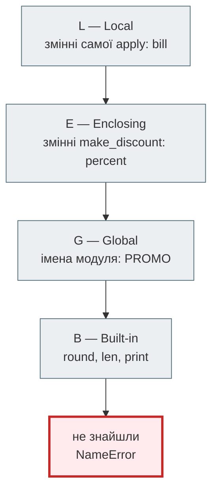
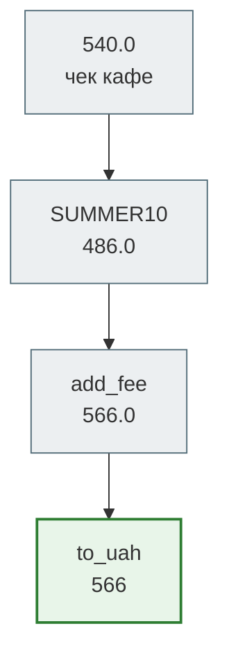

# Урок 18. Функції як об'єкти першого класу

Карантин 2020-го минув, а доставка лишилася. Система «Смачно + Таксі» з фінального проєкту модуля 1 працює щодня, і власниця щотижня просить щось нове. Нова команда `drivers`. Промокод `SUMMER10` на літо, `STUDENT15` для студентів, `NIGHT5` для нічних замовлень. Сортувати доставки то за вартістю, то за районом. Надсилати клієнтові SMS, коли водій виїхав, а тепер ще й у Telegram.

Кожне таке прохання в коді модуля 1 означає ще один `elif` в `app.py`, ще одну майже однакову функцію `apply_summer10`, ще один `if channel == "sms"`. Код росте не від нових ідей, а від копіювання.

Усе це розв'язує одна ідея, з якої починається модуль 2: **функція — це такий самий об'єкт, як число чи рядок**. Її можна покласти у змінну, у словник, передати в іншу функцію, повернути з функції. Декоратори з [уроку 9](../m1/lesson_09.md) вже спиралися на цю ідею — сьогодні розберемо її повністю.

**Що потрібно з попередніх уроків:** функції й `return` (урок 7), декоратори (урок 9), генератори (урок 10), словники й `Counter` (уроки 6, 12, 16), фінальний проєкт модуля 1 (урок 17).

**Після уроку ти зможеш:**

- зберігати функції в змінних, списках і словниках, будувати словник команд замість ланцюжка `if`;
- передавати функцію як аргумент: `key=` для `sorted` і `max`, зворотні виклики (callback);
- створювати функції іншою функцією — фабрики й замикання, змінювати захоплену змінну через `nonlocal`;
- писати `lambda` і обирати між `map` / `filter` і comprehension;
- збирати конвеєр з функцій і пояснювати, чому його кроки мають бути чистими.

**Задача розділу.** Оформлення замовлення: промокод із реєстру, вартість доставки за районом і округлення — як конвеєр з функцій, а команди системи — як словник. Повний код — у розділі [«Практика»](#practice).

**Ноутбук заняття:** [`note_lesson_18_functions_first_class.ipynb`](https://github.com/NikoriakViktot/PY-Course-Victor-Nikoriak-22-09-2026/blob/main/module_2/lessons/lesson_18_functions_first_class/note_lesson_18_functions_first_class.ipynb) [](https://colab.research.google.com/github/NikoriakViktot/PY-Course-Victor-Nikoriak-22-09-2026/blob/main/module_2/lessons/lesson_18_functions_first_class/note_lesson_18_functions_first_class.ipynb)

## Пригадай

Дай відповідь подумки, нічого не запускаючи:

1. Що отримує на вхід і що повертає декоратор `require_role` з уроку 9?
2. Що робить `max(revenue, key=revenue.get)` з уроку 14?
3. Як `app.py` фінального проєкту вирішує, яку команду виконати?

??? success "Відповіді"

    1. Отримує функцію, повертає нову функцію-обгортку. Уже тоді функція була даними.
    2. Повертає ключ словника з найбільшим значенням: `max` викликає `revenue.get` для кожного ключа і порівнює результати.
    3. Ланцюжком `if command == "add-order" …`, `if command == "import" …` — по одному на кожну команду.

## Функція — це об'єкт

Ім'я функції **без дужок** — це сама функція. **З дужками** — її виклик і результат:

```python
def fee_for(district):
    """Вартість доставки за районом."""
    return {"Поділ": 60, "Оболонь": 80}.get(district, 100)


print(type(fee_for))
print(fee_for.__name__)
print(fee_for("Поділ"))
```

```text
<class 'function'>
fee_for
60
```

`fee_for` — об'єкт типу `function` з іменем і докстрінгом, як `540` — об'єкт типу `int`. А раз це об'єкт, з ним можна робити те саме, що з будь-яким значенням. Покласти в іншу змінну:

```python
delivery_fee = fee_for
print(delivery_fee("Оболонь"), delivery_fee is fee_for)
```

```text
80 True
```

Нової функції не створилося: `delivery_fee` і `fee_for` — два ярлики одного об'єкта, як `b = a` для списку в уроці 3.

Покласти в список і пройти циклом:

```python
bills = [540.0, 320.0, 980.0]
for summary in [len, sum, max]:
    print(summary.__name__, summary(bills))
```

```text
len 3
sum 1840.0
max 980.0
```

Функції, які об'єкт мови дозволяє зберігати, передавати й повертати так само, як будь-яке значення, називають **об'єктами першого класу** (first-class objects). У Python функції саме такі.

## Словник команд замість ланцюжка if

У фінальному проєкті `app.py` вибирав команду ланцюжком `if`. Кожна нова команда — ще одна гілка, і функція `run` росте без кінця. Але якщо функції — дані, то «яку функцію викликати для якої команди» — це просто **словник**:

```python
def cmd_report(orders):
    return f"Замовлень: {len(orders)}, виторг: {sum(orders):.2f} грн"


def cmd_top(orders):
    return f"Найбільший чек: {max(orders):.2f} грн"


COMMANDS = {
    "report": cmd_report,
    "top": cmd_top,
}


def run(command, orders):
    handler = COMMANDS.get(command)
    if handler is None:
        return f"Помилка: невідома команда {command}. Є: {', '.join(COMMANDS)}"
    return handler(orders)


orders = [540.0, 320.0, 980.0]
print(run("report", orders))
print(run("top", orders))
print(run("fly", orders))
```

```text
Замовлень: 3, виторг: 1840.00 грн
Найбільший чек: 980.00 грн
Помилка: невідома команда fly. Є: report, top
```

Нова команда — нова функція і **один рядок** у словнику. `run` не змінюється. Такий словник називають **таблицею диспетчеризації** (dispatch table). Бонус: список доступних команд для підказки береться з того самого словника й ніколи не застаріє.

## Функція як аргумент

Функцію, яка приймає або повертає іншу функцію, називають **функцією вищого порядку**. Ти вже користувався ними: `sorted`, `max`, `min` приймають параметр `key` — функцію, яку викликають для кожного елемента, щоб отримати значення для порівняння.

```python
from typing import NamedTuple


class Delivery(NamedTuple):
    order_id: int
    district: str
    fare: int
    driver: str


deliveries = [
    Delivery(1, "Оболонь", 230, "D-3"),
    Delivery(2, "Поділ", 180, "D-1"),
    Delivery(3, "Оболонь", 270, "D-3"),
    Delivery(4, "Печерськ", 150, "D-2"),
]


def by_fare(delivery):
    return delivery.fare


print([d.order_id for d in sorted(deliveries, key=by_fare)])
print(max(deliveries, key=by_fare).order_id)
```

```text
[4, 2, 1, 3]
3
```

`sorted` нічого не знає про доставки. Він лише викликає `by_fare(d)` для кожного елемента й сортує за результатом. Зміни `key` — зміниться порядок, а сам `sorted` той самий.

Ключ може повертати кортеж — тоді порівняння йде по черзі: спершу район, у межах району — вартість:

```python
def by_district_then_fare(delivery):
    return (delivery.district, delivery.fare)


for d in sorted(deliveries, key=by_district_then_fare):
    print(d.district, d.fare)
```

```text
Оболонь 230
Оболонь 270
Печерськ 150
Поділ 180
```

!!! warning "Функція, а не її результат"
    `key=by_fare` — передаємо **функцію**. `key=by_fare(d)` — передали б **результат** одного виклику, число. `sorted` спробує викликати число як функцію й впаде з `TypeError: 'int' object is not callable`. Та сама пастка — `if word.isupper:` без дужок: це завжди правда, бо функція-об'єкт істинна.

### Callback: що робити, вирішує той, хто викликає

Водій виїхав — клієнта треба повідомити. Як саме — SMS, Telegram чи просто запис у журнал — функція доставки знати не повинна. Вона отримує функцію повідомлення аргументом і **викликає її у потрібний момент**. Таку функцію називають **зворотним викликом** (callback):

```python
def dispatch(delivery, notify):
    """Відправляє водія і повідомляє клієнта через notify(текст)."""
    notify(f"Замовлення №{delivery.order_id}: водій {delivery.driver} виїхав, {delivery.fare} грн")


def notify_sms(text):
    print("SMS:", text)


def notify_telegram(text):
    print("Telegram:", text)


dispatch(deliveries[0], notify_sms)
dispatch(deliveries[1], notify_telegram)
```

```text
SMS: Замовлення №1: водій D-3 виїхав, 230 грн
Telegram: Замовлення №2: водій D-1 виїхав, 180 грн
```

Новий канал — нова функція, `dispatch` не змінюється. А в тестах замість справжнього SMS можна передати `sent.append` і перевірити, що саме пішло б клієнтові:

```python
sent = []
dispatch(deliveries[2], sent.append)
print(sent)
```

```text
['Замовлення №3: водій D-3 виїхав, 270 грн']
```

`sent.append` — теж функція: метод конкретного списку. Передаємо його без дужок, і `dispatch` викликає його як будь-який інший `notify`.

## Функція, що створює функції

Промокоди. Наївно — функція на кожен:

```python
def apply_summer10(bill):
    return bill * 0.9


def apply_student15(bill):
    return bill * 0.85
```

Функції-близнюки відрізняються одним числом. Можна додати параметр — `apply_discount(bill, percent)`, — але тоді кожне місце виклику має знати відсоток, а реєстр «код → знижка» знову стає ланцюжком `if`. Краще **функція, яка створює** функцію-знижку з потрібним відсотком:

```python
def make_discount(percent):
    """Фабрика: повертає функцію, що знижує чек на percent відсотків."""
    def apply(bill):
        return round(bill * (100 - percent) / 100, 2)
    return apply


summer10 = make_discount(10)
student15 = make_discount(15)
print(summer10(540.0), student15(540.0))
print(summer10.__name__)
```

```text
486.0 459.0
apply
```

`make_discount` — **фабрика функцій**: кожен виклик створює нову функцію `apply`. І кожна `apply` **пам'ятає** свій `percent`, хоча `make_discount` давно завершилась. Функцію разом із запам'ятованими змінними зовнішньої функції називають **замиканням** (closure).

Тепер реєстр промокодів — словник, як таблиця команд:

```python
PROMO = {
    "SUMMER10": make_discount(10),
    "STUDENT15": make_discount(15),
    "NIGHT5": make_discount(5),
}

print(PROMO["NIGHT5"](980.0))
```

```text
931.0
```

### Де функція шукає змінні: LEGB

Коли `apply` бачить `percent`, Python шукає ім'я в чотирьох місцях по черзі — правило **LEGB**:



`percent` знайшовся на рівні **E** — у функції, що оточує `apply`. Саме тому `apply` бачить його й після того, як `make_discount` повернула результат.

### nonlocal: змінити захоплену змінну

Читати змінну з оточення можна вільно. А **змінити**? Лічильник номерів замовлень:

```python
def make_counter_broken():
    count = 0

    def next_id():
        count += 1
        return count

    return next_id


try:
    make_counter_broken()()
except UnboundLocalError as error:
    print(type(error).__name__)
```

```text
UnboundLocalError
```

Присвоєння `count += 1` робить `count` **локальною** змінною `next_id`, і Python не шукає її в оточенні. А локальна `count` ще не має значення. `nonlocal` каже: це змінна з оточуючої функції, змінюй її там:

```python
def make_counter(start=0):
    count = start

    def next_id():
        nonlocal count
        count += 1
        return count

    return next_id


new_order_id = make_counter()
print(new_order_id(), new_order_id(), new_order_id())

other = make_counter(100)
print(other(), new_order_id())
```

```text
1 2 3
101 4
```

Кожен виклик `make_counter` створює **свій** лічильник: `other` і `new_order_id` не заважають один одному. Функція, що носить із собою власний стан, — це вже майже об'єкт. Саме туди приведе урок 19 про класи.

!!! warning "Пастка: функції в циклі"
    ```python
    fees = [lambda bill: bill + fee for fee in (60, 80, 100)]
    print([f(500) for f in fees])
    ```

    ```text
    [600, 600, 600]
    ```

    Усі три функції бачать **ту саму** змінну `fee` — і вона вже дорівнює 100, коли функції викликають. Замикання пам'ятає змінну, а не її значення в момент створення. Рішення — фабрика: `[make_fee(fee) for fee in (60, 80, 100)]`, де кожен виклик `make_fee` має свій `fee`.

## lambda, map і filter

Для короткої функції, яка потрібна один раз — зазвичай як `key` — є **lambda**: анонімна функція з одного виразу.

```python
print([d.order_id for d in sorted(deliveries, key=lambda d: d.fare)])
print(max(deliveries, key=lambda d: d.fare).driver)
```

```text
[4, 2, 1, 3]
D-3
```

`lambda d: d.fare` — те саме, що `by_fare`, тільки без імені й без `return`: результат виразу повертається автоматично. Якщо функції потрібне ім'я, докстрінг чи більше одного рядка — пиши звичайний `def`.

`map(функція, дані)` застосовує функцію до кожного елемента, `filter(функція, дані)` лишає елементи, для яких вона повернула `True`. Обидві **ліниві**, як генератори з уроку 10:

```python
fares = [230, 180, 270, 150]
with_fee = map(lambda fare: fare + 20, fares)
print(type(with_fee).__name__)
print(list(with_fee))
print(list(filter(lambda fare: fare >= 200, fares)))
```

```text
map
[250, 200, 290, 170]
[230, 270]
```

Те саме через comprehension з уроку 6 — зазвичай читається легше:

```python
print([fare + 20 for fare in fares])
print([fare for fare in fares if fare >= 200])
```

```text
[250, 200, 290, 170]
[230, 270]
```

!!! tip "Коли що"
    Comprehension — коли пишеш вираз прямо тут. `map` / `filter` — коли функція **вже є** й має ім'я: `list(map(str.upper, districts))`, `list(filter(str.isdigit, codes))`. `lambda` — для коротких `key=`.

## Конвеєр з функцій

Ціна замовлення проходить кілька кроків: знижка за промокодом, вартість доставки за районом, округлення до гривні. Кожен крок — функція «число → число». А раз функції — дані, **список кроків** — теж дані:

```python
def add_fee(bill):
    return bill + 80


def to_uah(bill):
    return round(bill)


def run_pipeline(value, steps):
    for step in steps:
        value = step(value)
    return value


checkout = [PROMO["SUMMER10"], add_fee, to_uah]
print(run_pipeline(540.0, checkout))
print(run_pipeline(540.0, [add_fee, PROMO["SUMMER10"], to_uah]))
```

```text
566
558
```

Той самий чек, ті самі кроки — різний результат. У другому варіанті знижку отримала й доставка. **Порядок кроків — це бізнес-правило**, і тепер воно записане в одному місці: у списку `checkout`, а не розмазане по коду.



### Кроки мають бути чистими

Конвеєр працює, лише якщо кожен крок **чистий** (урок 7): отримує значення, повертає нове й нічого не змінює навколо. Крок, який змінює вхідний список, ламає все, що йде після нього — і все, що використовує той самий список:

```python
def add_packaging_bad(items):
    items.append("пакет")
    return items


def add_packaging(items):
    return items + ["пакет"]


cart = ["борщ", "вареники"]
print(add_packaging(cart), cart)
print(add_packaging_bad(cart), cart)
```

```text
['борщ', 'вареники', 'пакет'] ['борщ', 'вареники']
['борщ', 'вареники', 'пакет'] ['борщ', 'вареники', 'пакет']
```

Чиста версія повернула новий список і не зачепила `cart`. Нечиста змінила кошик клієнта: після другого виклику «пакет» опиниться там двічі.

### Декоратор — це теж фабрика

Декоратор з уроку 9 тепер розкладається на знайомі частини: функція, яка **приймає** функцію (вищого порядку), **створює** нову (фабрика) і **пам'ятає** оригінал (замикання):

```python
from functools import wraps


def log_calls(func):
    @wraps(func)
    def wrapper(*args):
        result = func(*args)
        print(f"{func.__name__}{args} -> {result}")
        return result
    return wrapper


@log_calls
def add_fee_logged(bill):
    return bill + 80


add_fee_logged(486.0)
```

```text
add_fee_logged(486.0,) -> 566.0
```

## Практика { #practice }

### Розібраний приклад: оформлення замовлення

Зберемо все разом: реєстр промокодів, вартість доставки за районом, конвеєр і команди.

```python linenums="1" hl_lines="2 6 7 8 12 13 22 25 31 32 33"
FEES = {"Поділ": 60, "Оболонь": 80, "Печерськ": 90}


def make_fee(district):
    """Фабрика: крок конвеєра, що додає вартість доставки в район."""
    if district not in FEES:
        raise ValueError(f"не доставляємо в район {district}")
    fee = FEES[district]

    def add(bill):
        return bill + fee
    return add


def checkout_steps(promo_code, district):
    """Кроки для замовлення: знижка (якщо є промокод) → доставка → гривні."""
    steps = []
    if promo_code:
        if promo_code not in PROMO:
            raise ValueError(f"промокод {promo_code} не дійсний")
        steps.append(PROMO[promo_code])
    steps.append(make_fee(district))
    steps.append(to_uah)
    return steps


def checkout(bill, promo_code, district):
    return run_pipeline(bill, checkout_steps(promo_code, district))


CHECKOUT_CASES = [(540.0, "SUMMER10", "Оболонь"), (320.0, None, "Поділ"),
                  (980.0, "STUDENT15", "Печерськ"), (540.0, "FREE100", "Поділ"),
                  (540.0, None, "Троєщина")]

for bill, code, district in CHECKOUT_CASES:
    try:
        print(bill, code, district, "->", checkout(bill, code, district))
    except ValueError as error:
        print(bill, code, district, "-> помилка:", error)
```

```text
540.0 SUMMER10 Оболонь -> 566
320.0 None Поділ -> 380
980.0 STUDENT15 Печерськ -> 923
540.0 FREE100 Поділ -> помилка: промокод FREE100 не дійсний
540.0 None Троєщина -> помилка: не доставляємо в район Троєщина
```

Що відбувається в ключових рядках:

- **рядок 2** — вартість доставки — дані, а не `if` для кожного району;
- **рядки 6–8, 12–13** — фабрика `make_fee` перевіряє район один раз, а функція `add` пам'ятає `fee` через замикання;
- **рядки 22, 25** — список кроків збирається з функцій: промокод береться з реєстру `PROMO`, доставка — з фабрики, округлення — готова `to_uah`;
- **рядки 31–33** — `checkout` не знає, які саме кроки виконує. Новий крок — рядок у `checkout_steps`, а не переписаний `checkout`;
- помилки — `ValueError` з поясненням, як у модулі 1: промокод і район перевіряються **до** обчислень.

### Зміни приклад: команда drivers

Додай у таблицю `COMMANDS` з розділу про словник команд нову команду `drivers`. Вона отримує список доставок і повертає рядок з водіями за виторгом, від більшого до меншого:

```text
D-3 500, D-1 180, D-2 150
```

**Критерії перевірки:**

- `run` не змінюється — лише нова функція і рядок у `COMMANDS`;
- виторг рахується за один прохід (`Counter` або словник з `get`);
- сортування — `sorted(..., key=…, reverse=True)` з `lambda` або `dict.get` як ключем;
- `run("fly", deliveries)` у підказці показує й нову команду.

??? tip "Підказка"
    `Counter` уміє додавати: `totals[d.driver] += d.fare`. Потім `sorted(totals, key=totals.get, reverse=True)` дає водіїв у потрібному порядку, а `", ".join(f"{name} {totals[name]}" for name in …)` — рядок.

### Спробуй самостійно: промокод з обмеженням

Маркетинг роздає **обмежені** промокоди: `LUCKY20` діє лише для перших трьох замовлень. Напиши фабрику `make_limited_discount(percent, uses)`:

- повертає функцію `apply(bill)` зі знижкою `percent`, як `make_discount`;
- кожен виклик зменшує кількість використань, що лишилися;
- коли використань не лишилося — `apply` піднімає `ValueError("промокод вичерпано")`.

```text
lucky = make_limited_discount(20, 3)
lucky(500.0)  →  400.0
lucky(500.0)  →  400.0
lucky(250.0)  →  200.0
lucky(500.0)  →  ValueError: промокод вичерпано
```

**Правила:**

- лічильник живе в замиканні, `nonlocal` — без глобальних змінних;
- два промокоди, створені окремими викликами фабрики, мають незалежні лічильники;
- `apply` можна покласти в `PROMO` і використати в `checkout` без змін.

### Знайди помилку

Кожен фрагмент — справжня помилка початківця. Що піде не так?

```python
# 1
sum = sum([540.0, 320.0])
total_fares = sum([230, 180])

# 2
code = "summer10"
if code.isupper:
    print("код у верхньому регістрі")

# 3
districts = ["Оболонь", "Поділ", "Печерськ"]
print(sorted(districts, key=len(districts)))
```

??? success "Відповіді"

    1. Перший рядок **перезаписав** вбудовану функцію `sum` числом `860.0`. Другий рядок пробує викликати число: `TypeError: 'float' object is not callable`. Не називай змінні іменами вбудованих функцій: `total_bills = sum(...)`.
    2. `code.isupper` без дужок — сама функція, а функція завжди істинна. Умова виконається для будь-якого рядка. Потрібен виклик: `code.isupper()`.
    3. `len(districts)` — це `3`, число, а не функція. `sorted` спробує викликати `3(...)` і впаде з `TypeError`. Треба передати саму функцію: `key=len`.

## Підсумок

| Поняття | Що запам'ятати |
|---|---|
| Функція — об'єкт | `f` — функція, `f()` — її результат; можна в змінну, список, словник |
| Словник команд | `COMMANDS[name](...)` замість ланцюжка `if`; нова команда — рядок |
| Функція вищого порядку | приймає чи повертає функцію: `sorted(key=…)`, `max(key=…)`, декоратори |
| Callback | функція-аргумент, яку викликають у потрібний момент |
| Фабрика й замикання | функція створює функцію, а та пам'ятає змінні оточення |
| LEGB, `nonlocal` | порядок пошуку імен; `nonlocal`, щоб змінити змінну оточення |
| `lambda`, `map`, `filter` | коротка анонімна функція; ліниві `map` / `filter` чи comprehension |
| Конвеєр | список функцій-кроків; порядок — правило; кроки — чисті |

### Самоперевірка

1. Чим `fee_for` відрізняється від `fee_for("Поділ")`?
2. Що дає словник команд порівняно з ланцюжком `if`?
3. Навіщо `dispatch` приймає `notify` аргументом, а не викликає SMS сама?
4. Чому `summer10` пам'ятає `percent = 10`, хоча `make_discount` вже завершилась?
5. Чому без `nonlocal` лічильник падає з `UnboundLocalError`?
6. Чому всі функції з `[lambda bill: bill + fee for fee in (60, 80, 100)]` додають 100?
7. Чому порядок кроків у конвеєрі змінює ціну? Що буде, якщо крок змінює вхідний список?

??? success "Відповіді"

    1. `fee_for` — сама функція, об'єкт. `fee_for("Поділ")` — результат виклику, число `60`.
    2. Нова команда — функція й один рядок у словнику, `run` не змінюється; перелік команд для підказки береться з того самого словника.
    3. Щоб спосіб повідомлення обирав той, хто викликає: SMS, Telegram, журнал чи список у тесті. `dispatch` від цього не змінюється.
    4. `apply` — замикання: разом із функцією зберігаються змінні оточуючої функції, які вона використовує.
    5. Присвоєння `count += 1` робить `count` локальною змінною `next_id`, а локальна ще не має значення. `nonlocal` каже шукати й змінювати її в оточуючій функції.
    6. Замикання пам'ятає **змінну** `fee`, а не її значення в момент створення. Коли функції викликають, цикл уже завершився, і `fee` дорівнює 100.
    7. Кожен крок працює з результатом попереднього: знижка до доставки і після — різні суми. Крок, що змінює вхідний список, змінює дані для всіх наступних кроків і для всього коду, який тримає той самий список.

### Що далі

- Ноутбук заняття: [`note_lesson_18_functions_first_class.ipynb`](https://github.com/NikoriakViktot/PY-Course-Victor-Nikoriak-22-09-2026/blob/main/module_2/lessons/lesson_18_functions_first_class/note_lesson_18_functions_first_class.ipynb) [](https://colab.research.google.com/github/NikoriakViktot/PY-Course-Victor-Nikoriak-22-09-2026/blob/main/module_2/lessons/lesson_18_functions_first_class/note_lesson_18_functions_first_class.ipynb) — сервіс доставки: прогнози, вправи з перевірками, три баги і міні-проєкт — конвеєр для промокодів.
- Поглиблення — п'ять патернів покроково, «від проблеми до рішення»: [Callback](https://github.com/NikoriakViktot/PY-Course-Victor-Nikoriak-22-09-2026/blob/main/module_2/lessons/lesson_18_functions_first_class/pattern_01_callback.md), [Function Factory](https://github.com/NikoriakViktot/PY-Course-Victor-Nikoriak-22-09-2026/blob/main/module_2/lessons/lesson_18_functions_first_class/pattern_02_factory.md), [Decorator](https://github.com/NikoriakViktot/PY-Course-Victor-Nikoriak-22-09-2026/blob/main/module_2/lessons/lesson_18_functions_first_class/pattern_03_decorator.md), [Pipeline](https://github.com/NikoriakViktot/PY-Course-Victor-Nikoriak-22-09-2026/blob/main/module_2/lessons/lesson_18_functions_first_class/pattern_04_pipeline.md), [Pure Functions](https://github.com/NikoriakViktot/PY-Course-Victor-Nikoriak-22-09-2026/blob/main/module_2/lessons/lesson_18_functions_first_class/pattern_05_pure_functions.md).
- Наступне заняття — урок 19 «Класи, простір імен». Лічильник `make_counter` — це дані й функція разом. Клас зробить це явно: дані — атрибути, функції — методи.

## Документація і джерела

- [Functional Programming HOWTO](https://docs.python.org/3/howto/functional.html) — функції вищого порядку, `map`, `filter`, `lambda`
- [Sorting Techniques: Key Functions](https://docs.python.org/3/howto/sorting.html#key-functions)
- Туторіал: [Lambda Expressions](https://docs.python.org/3/tutorial/controlflow.html#lambda-expressions); довідник: [`nonlocal`](https://docs.python.org/3/reference/simple_stmts.html#the-nonlocal-statement), [правила пошуку імен](https://docs.python.org/3/reference/executionmodel.html#resolution-of-names)
- [`map`](https://docs.python.org/3/library/functions.html#map), [`filter`](https://docs.python.org/3/library/functions.html#filter), [`functools.wraps`](https://docs.python.org/3/library/functools.html#functools.wraps)
- Для охочих: MIT 6.0001, [лекція 4 «Decomposition, Abstraction, Functions»](https://ocw.mit.edu/courses/6-0001-introduction-to-computer-science-and-programming-in-python-fall-2016/resources/lecture-4-decomposition-abstraction-and-functions/) — функції, специфікації, область видимості, функції як аргументи.
