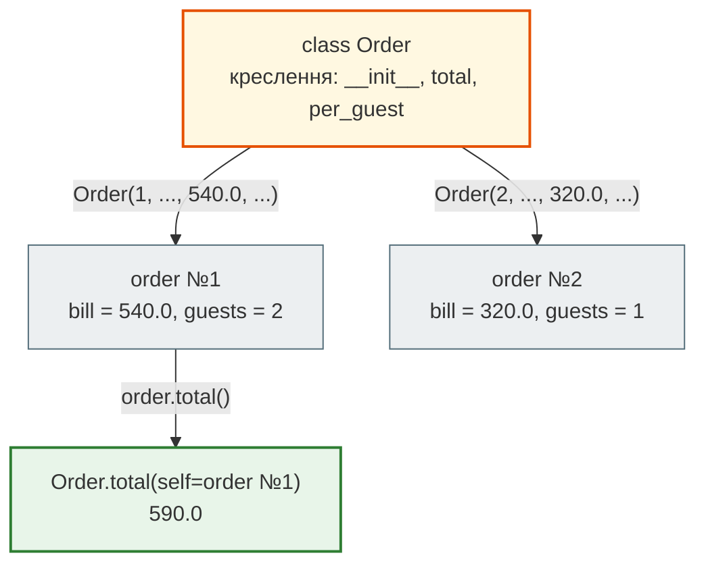
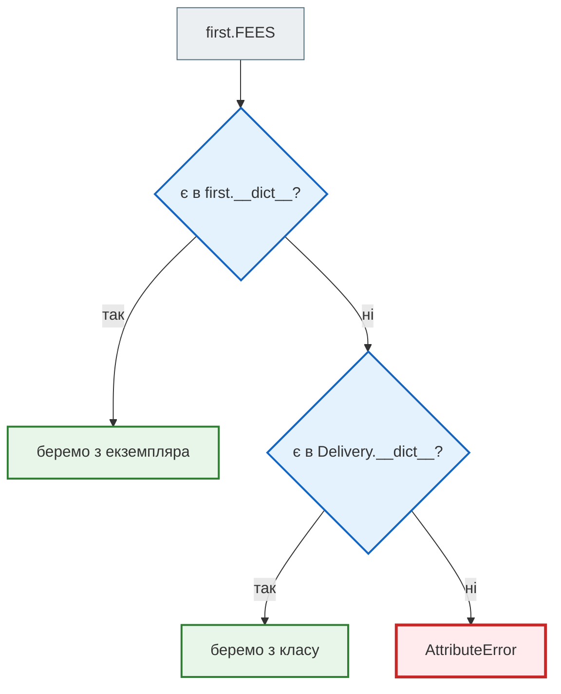
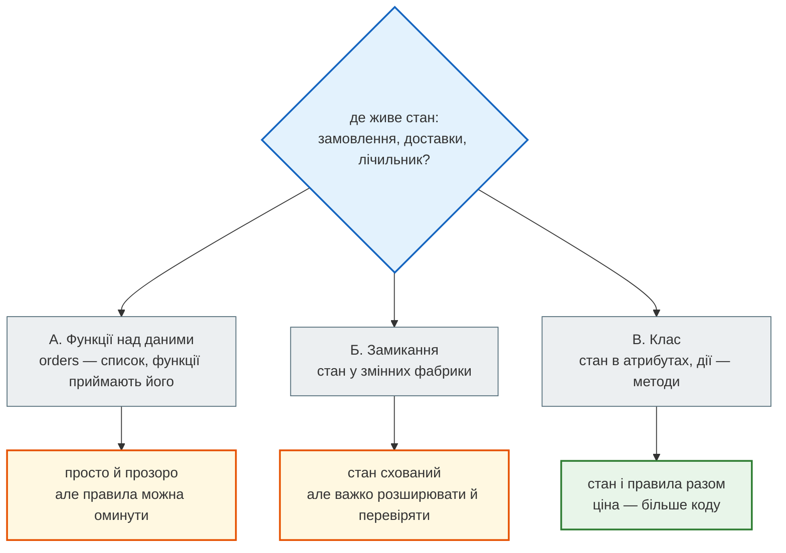
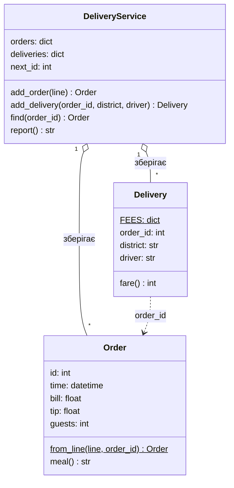
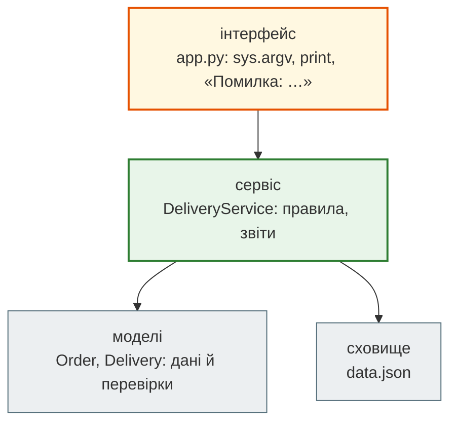

# Урок 19. Класи, простір імен

Сервіс «Смачно + Таксі» з фінального проєкту модуля 1 тримає дані окремо від дій. Є список `orders` з `NamedTuple` і десяток функцій, які цей список приймають: `add_order(orders, …)`, `cafe_stats(orders)`, `find_order(orders, …)`. Працює, поки код пише одна людина, яка пам'ятає правила. А нова розробниця додала замовлення напряму — `orders.append(Order(7, …))` — і в системі з'явилися два замовлення №7. Хоча `add_order` сама рахувала номери, ніщо не змушувало нею користуватися.

В уроці 18 лічильник `make_counter` уже тримав **стан** (`count`) і **поведінку** (`next_id`) разом, у замиканні. Сьогодні зробимо це явно й для всього сервісу. **Клас** описує, які дані має об'єкт і що з ними можна робити, а правила — наприклад, «номери замовлень видає лише сам сервіс» — живуть поруч із даними.

А ще з цього уроку в кожному розділі модуля 2 з'являється **архітектура**: схема з блоків і стрілок, кілька можливих рішень однієї задачі та чесне порівняння їхніх переваг і ціни.

**Що потрібно з попередніх уроків:** `NamedTuple` (урок 5), функції (урок 7), модулі (урок 12), фінальний проєкт (урок 17), замикання й LEGB (урок 18).

**Після уроку ти зможеш:**

- пояснити, що все в Python — об'єкти, і що клас — це теж об'єкт, який створює інші об'єкти;
- оголошувати клас з `__init__`, атрибутами й методами, пояснювати, що таке `self`;
- розрізняти атрибути екземпляра й атрибути класу, передбачати, де Python шукає атрибут;
- писати `__repr__`, `@classmethod` як альтернативний конструктор і `@staticmethod`;
- порівнювати три архітектури одного сервісу — функції над даними, замикання, класи — і малювати схему класів.

**Задача розділу.** Клас `DeliveryService`, який сам видає номери замовлень, не дає додати доставку до неіснуючого замовлення й будує звіт. Повний код — у розділі [«Практика»](#practice).

**Ноутбук заняття:** [`note_lesson_19_classes.ipynb`](https://github.com/NikoriakViktot/PY-Course-Victor-Nikoriak-22-09-2026/blob/main/module_2/lessons/lesson_19_classes_namespace/note_lesson_19_classes.ipynb) [](https://colab.research.google.com/github/NikoriakViktot/PY-Course-Victor-Nikoriak-22-09-2026/blob/main/module_2/lessons/lesson_19_classes_namespace/note_lesson_19_classes.ipynb)

## Пригадай

Дай відповідь подумки:

1. Що надрукує `b = a; b.append(4); print(a)` для списку `a = [1, 2, 3]`?
2. Що зберігає замикання `next_id`, створене `make_counter()` в уроці 18?
3. Чим `Order(1, …)` з `NamedTuple` відрізняється від словника `{"id": 1, …}`?

??? success "Відповіді"

    1. `[1, 2, 3, 4]`: `a` і `b` — ярлики одного об'єкта.
    2. Змінну `count` з оточуючої функції; кожен виклик `make_counter` створює свій лічильник.
    3. Поля фіксовані й доступні через крапку (`order.bill`), кортеж незмінний; у словнику ключі можна додавати й міняти як завгодно.

## Усе — об'єкти, і в кожного є клас

Число, рядок, список, функція — усе це **об'єкти**. У кожного об'єкта є **тип**, або **клас**: він визначає, що з об'єктом можна робити.

```python
print(type(540), type("Поділ"), type([540, 320]))
print(isinstance(540, object), isinstance(len, object))
```

```text
<class 'int'> <class 'str'> <class 'list'>
True True
```

`"Поділ".upper()` працює, бо в класу `str` є метод `upper`. `[540].append(320)` — бо в класу `list` є `append`. Клас — це креслення, а об'єкти (**екземпляри**) — конкретні речі, зроблені за ним: `"Поділ"` і `"Оболонь"` — два екземпляри одного класу `str`.

І сам клас — теж об'єкт. Його клас — `type`:

```python
print(type(int), type(str))
```

```text
<class 'type'> <class 'type'>
```

Досі ми користувалися чужими класами. Тепер напишемо свій.

## Перший клас: Order

```python
from datetime import datetime


class Order:
    """Замовлення кафе."""

    def __init__(self, order_id, time, bill, tip, guests):
        self.id = order_id
        self.time = time
        self.bill = bill
        self.tip = tip
        self.guests = guests

    def total(self):
        """Чек разом з чайовими."""
        return self.bill + self.tip

    def per_guest(self):
        return round(self.bill / self.guests, 2)


order = Order(1, datetime(2024, 7, 19, 18, 30), 540.0, 50.0, 2)
print(order.bill, order.total(), order.per_guest())
```

```text
540.0 590.0 270.0
```

- **`class Order:`** оголошує клас — новий тип, як `int` чи `list`;
- **`Order(1, …)`** створює екземпляр: Python робить порожній об'єкт і викликає `__init__`, щоб його заповнити;
- **`__init__`** — метод-ініціалізатор. Він присвоює **атрибути екземпляра**: `self.bill = bill` кладе значення в конкретний об'єкт;
- **метод** — функція, оголошена в класі. `order.total()` — виклик методу конкретного замовлення.

### Що таке self

`self` — це **той самий об'єкт**, у якого викликали метод. Коли ти пишеш `order.total()`, Python насправді викликає `Order.total(order)`:

```python
print(Order.total(order) == order.total())
```

```text
True
```

Метод — звичайна функція з уроку 7, перший параметр якої — об'єкт. Назва `self` — домовленість, а не ключове слово, але так пишуть усі.



Два екземпляри — два окремі набори атрибутів, але методи в них спільні: вони живуть у класі.

### __repr__: як об'єкт себе показує

```python
print(order)
```

Вивід — щось на кшталт:

```text
<__main__.Order object at 0x7f3a2c1b9d50>
```

Шістнадцяткове число — адреса об'єкта в пам'яті, і вона щоразу інша. Для людини це марно. Метод `__repr__` каже Python, як показувати об'єкт — у `print`, у списках, у налагоджувачі:

```python
class Order:
    """Замовлення кафе."""

    def __init__(self, order_id, time, bill, tip, guests):
        self.id = order_id
        self.time = time
        self.bill = bill
        self.tip = tip
        self.guests = guests

    def __repr__(self):
        return f"Order(№{self.id}, {self.time:%Y-%m-%d %H:%M}, {self.bill:.2f} грн)"

    def total(self):
        return self.bill + self.tip


orders = [Order(1, datetime(2024, 7, 19, 18, 30), 540.0, 50.0, 2),
          Order(2, datetime(2024, 7, 19, 12, 10), 320.0, 30.0, 1)]
print(orders[0])
print(orders)
```

```text
Order(№1, 2024-07-19 18:30, 540.00 грн)
[Order(№1, 2024-07-19 18:30, 540.00 грн), Order(№2, 2024-07-19 12:10, 320.00 грн)]
```

Імена з двома підкресленнями з обох боків — `__init__`, `__repr__` — **спеціальні методи** (dunder methods). Python викликає їх сам у певні моменти. Їм присвячено урок 23.

## Атрибути класу й простір імен

Атрибут можна покласти не лише в екземпляр, а й у **сам клас**. Такий атрибут один на всіх — наприклад, вартість доставки за районами, однакова для всіх доставок:

```python
class Delivery:
    FEES = {"Поділ": 60, "Оболонь": 80, "Печерськ": 90}

    def __init__(self, order_id, district, driver):
        self.order_id = order_id
        self.district = district
        self.driver = driver

    def fare(self):
        return self.FEES[self.district]


first = Delivery(1, "Оболонь", "D-3")
second = Delivery(2, "Поділ", "D-1")
print(first.fare(), second.fare())
print(first.FEES is second.FEES is Delivery.FEES)
```

```text
80 60
True
```

У кожного об'єкта свій **простір імен** — словник атрибутів `__dict__`. У класу теж:

```python
print(first.__dict__)
print("FEES" in Delivery.__dict__, "FEES" in first.__dict__)
```

```text
{'order_id': 1, 'district': 'Оболонь', 'driver': 'D-3'}
True False
```

У `first` немає `FEES`, але `first.FEES` працює. Бо атрибут через крапку Python шукає **спершу в екземплярі, потім у класі**:



### Пастка: присвоєння через self

Лічильник доставок у класі:

```python
class Courier:
    trips = 0

    def __init__(self, name):
        self.name = name

    def deliver(self):
        self.trips += 1


courier = Courier("D-3")
courier.deliver()
courier.deliver()
print(courier.trips, Courier.trips)
print(courier.__dict__)
```

```text
2 0
{'name': 'D-3', 'trips': 2}
```

`self.trips += 1` — це `self.trips = self.trips + 1`. **Читання** `self.trips` знайшло 0 у класі. А **присвоєння** `self.trips = …` завжди пише в екземпляр і створює там власний атрибут, який далі **затінює** класовий. Для особистого лічильника водія це саме те, що треба. А щоб рахувати поїздки **всіх** водіїв разом, пиши в клас явно: `Courier.trips += 1`.

!!! warning "Змінюваний атрибут класу — спільний для всіх"
    ```python
    class Cart:
        items = []

        def add(self, dish):
            self.items.append(dish)


    oksana, taras = Cart(), Cart()
    oksana.add("борщ")
    print(taras.items)
    ```

    ```text
    ['борщ']
    ```

    `self.items.append` — не присвоєння, а зміна **того самого** списку в класі. Кошик Тараса «отримав» борщ Оксани. Власні змінювані дані створюй у `__init__`: `self.items = []`.

### Клас — не оточення для методів

В уроці 18 внутрішня функція бачила змінні зовнішньої — правило LEGB, рівень E. Клас так **не** працює: метод не бачить атрибути класу просто за іменем.

```python
class Menu:
    VAT = 0.2

    def price_with_vat(self, price):
        return price * (1 + VAT)


try:
    Menu().price_with_vat(100)
except NameError as error:
    print(error)
```

```text
name 'VAT' is not defined
```

Метод шукає `VAT` за LEGB: локально, в оточуючих **функціях**, у модулі, серед вбудованих. Простору імен класу серед них немає. До атрибутів класу — лише через крапку: `self.VAT` або `Menu.VAT`.

## Методи класу й статичні методи

Замовлення часто приходять рядком каси (уроки 13–14). Хочеться створювати `Order` одразу з рядка — **альтернативний конструктор**. Для цього є `@classmethod`: метод отримує не екземпляр, а **сам клас** (`cls`) і повертає новий об'єкт. А правило, якому не потрібні ні екземпляр, ні клас — наприклад, «яка година — який прийом їжі», — оформлюють `@staticmethod`:

```python
class Order:
    """Замовлення кафе."""

    def __init__(self, order_id, time, bill, tip, guests):
        if bill <= 0:
            raise ValueError(f"сума чека має бути більшою за 0, а маємо {bill}")
        if guests < 1:
            raise ValueError(f"гостей має бути хоча б один, а маємо {guests}")
        self.id = order_id
        self.time = time
        self.bill = bill
        self.tip = tip
        self.guests = guests

    def __repr__(self):
        return f"Order(№{self.id}, {self.time:%Y-%m-%d %H:%M}, {self.bill:.2f} грн)"

    @classmethod
    def from_line(cls, line, order_id):
        """Рядок каси "2024-07-19 18:30;540.00;50;2" → Order."""
        fields = line.split(";")
        if len(fields) != 4:
            raise ValueError(f"очікували 4 поля, а маємо {len(fields)}")
        time_text, bill, tip, guests = fields
        return cls(order_id, datetime.strptime(time_text, "%Y-%m-%d %H:%M"),
                   float(bill), float(tip), int(guests))

    @staticmethod
    def meal_type(hour):
        if 11 <= hour <= 15:
            return "обід"
        if 17 <= hour <= 23:
            return "вечеря"
        return "інше"

    def meal(self):
        return self.meal_type(self.time.hour)


order = Order.from_line("2024-07-21 21:30;1200.00;150;6", 7)
print(order, order.meal())
print(Order.meal_type(12))
```

```text
Order(№7, 2024-07-21 21:30, 1200.00 грн) вечеря
обід
```

| Вид методу | Перший параметр | Коли |
|---|---|---|
| звичайний | `self` — екземпляр | працює з даними конкретного об'єкта: `order.meal()` |
| `@classmethod` | `cls` — клас | створює об'єкти іншим способом: `Order.from_line(...)` |
| `@staticmethod` | немає | правило, що стосується теми класу, але не потребує його даних |

Перевірки з уроку 13 тепер живуть у `__init__`: неправильне замовлення **неможливо створити**, хоч би звідки воно прийшло — з каси, з CLI чи з тесту.

```python
try:
    Order.from_line("2024-07-21 14:20;610.00;60;0", 8)
except ValueError as error:
    print(error)
```

```text
гостей має бути хоча б один, а маємо 0
```

## isinstance і type

`type(obj)` повертає **точний** клас, `isinstance(obj, клас)` питає, чи є об'єкт екземпляром цього класу **або його нащадка** (урок 20):

```python
print(type(order) is Order, isinstance(order, Order))
print(isinstance(True, int), type(True) is int)
```

```text
True True
True False
```

`bool` — нащадок `int`, тож `True` — теж ціле число. Для перевірок у коді зазвичай беруть `isinstance`: він не зламається, коли з'являться класи-нащадки.

## Архітектура: де живе стан сервісу { #architecture }

Сервіс доставки можна організувати щонайменше трьома способами. Усі три правильні — різниться ціна змін і захищеність правил.



| | А. Функції над даними (модуль 1) | Б. Замикання (урок 18) | В. Клас (сьогодні) |
|---|---|---|---|
| Де стан | списки, які передають у функції | змінні фабрики | атрибути об'єкта |
| Хто стежить за правилами | кожен, хто викликає, має сам пам'ятати | функції фабрики | методи класу |
| Кілька незалежних сервісів | окремі списки | окремі виклики фабрики | окремі екземпляри |
| Додати нову дію | нова функція з тими самими параметрами | змінити фабрику, повернути ще одну функцію | новий метод |
| Коли доречно | скрипт, аналіз даних, одна людина | маленький стан + 1–2 дії: лічильник, промокод | стан + багато дій + правила, які не можна порушити |

Варіант А — не «неправильний». Для звіту за один файл каси функції над списком — найпростіше рішення, і модуль 1 недарма ним користувався. Клас окупається, коли з'являються **правила стану**: номери видає лише сервіс, доставка лише до існуючого замовлення, одна доставка на замовлення.

### Схема класів

Архітектуру зі класів малюють **діаграмою класів**: у кожному блоці — назва, атрибути, методи; стрілки — зв'язки.



- `$` після члена — атрибут чи метод **класу**, а не екземпляра;
- `o--` — **агрегація**: сервіс зберігає багато (`*`) замовлень і доставок;
- пунктир `..>` — **залежність**: доставка посилається на замовлення за номером.

А так виглядає вся система шарами — від людини до файлу:



Стрілки йдуть **в один бік**: інтерфейс знає про сервіс, сервіс — про моделі й сховище, але моделі нічого не знають ні про `print`, ні про `sys.argv`. Тому ті самі класи можна підключити до веб-сайту чи Telegram-бота, не змінивши в них жодного рядка. До цієї думки — **залежності спрямовані від зовнішнього до внутрішнього** — ми повертатимемося весь модуль 2.

## Практика { #practice }

### Розібраний приклад: DeliveryService

```python linenums="1" hl_lines="2 3 4 5 8 10 11 14 16 18 19 24"
class DeliveryService:
    def __init__(self):
        self.orders = {}
        self.deliveries = {}
        self.next_id = 1

    def add_order(self, line):
        order = Order.from_line(line, self.next_id)
        self.orders[order.id] = order
        self.next_id += 1
        return order

    def add_delivery(self, order_id, district, driver):
        if order_id not in self.orders:
            raise ValueError(f"замовлення №{order_id} немає")
        if order_id in self.deliveries:
            raise ValueError(f"замовлення №{order_id} вже має доставку")
        delivery = Delivery(order_id, district, driver)
        self.deliveries[order_id] = delivery
        return delivery

    def report(self):
        cafe = sum(order.bill for order in self.orders.values())
        taxi = sum(delivery.fare() for delivery in self.deliveries.values())
        return (f"Замовлень: {len(self.orders)}, з доставкою: {len(self.deliveries)}; "
                f"кафе {cafe:.2f} грн, таксі {taxi} грн")


smachno = DeliveryService()
smachno.add_order("2024-07-19 18:30;540.00;50;2")
smachno.add_order("2024-07-20 20:15;980.00;120;4")
smachno.add_delivery(1, "Оболонь", "D-3")

for attempt in [(1, "Поділ", "D-1"), (5, "Поділ", "D-1")]:
    try:
        smachno.add_delivery(*attempt)
    except ValueError as error:
        print("Помилка:", error)

print(smachno.orders)
print(smachno.report())
```

```text
Помилка: замовлення №1 вже має доставку
Помилка: замовлення №5 немає
{1: Order(№1, 2024-07-19 18:30, 540.00 грн), 2: Order(№2, 2024-07-20 20:15, 980.00 грн)}
Замовлень: 2, з доставкою: 1; кафе 1520.00 грн, таксі 80 грн
```

Що відбувається в ключових рядках:

- **рядки 2–5** — стан сервісу: словники замовлень і доставок за номером (швидкий пошук, урок 16) і лічильник номерів. Кожен сервіс має свій стан;
- **рядки 8, 10** — номер видає сам сервіс: `next_id` більше ніхто не рахує;
- **рядок 11** — метод повертає створений об'єкт, а не друкує: друкує лише той, хто викликав, як і в модулі 1;
- **рядки 14–19** — правила «замовлення існує» і «одна доставка на замовлення» живуть у **єдиному** місці, через яке проходить кожна доставка;
- **рядок 24** — `fare()` доставки бере ціну з атрибута класу `Delivery.FEES`.

### Зміни приклад: звіт водіїв

Додай у `DeliveryService` метод `drivers()`, який повертає словник «водій → виторг» від більшого до меншого. Для двох доставок D-3 на Оболонь і однієї D-1 на Поділ:

```text
{'D-3': 160, 'D-1': 60}
```

**Критерії перевірки:**

- метод нічого не друкує, лише повертає словник;
- `DeliveryService()` без доставок повертає `{}`;
- `add_delivery` і `report` не змінюються.

??? tip "Підказка"
    `Counter` з уроку 12: `totals[delivery.driver] += delivery.fare()` для кожної доставки з `self.deliveries.values()`, потім `dict(totals.most_common())`.

### Спробуй самостійно: промокод як клас

В уроці 18 обмежений промокод був замиканням `make_limited_discount(percent, uses)`. Перепиши його класом `Promo`:

```text
lucky = Promo("LUCKY20", percent=20, uses=3)
lucky.apply(500.0)  →  400.0
lucky.left          →  2
lucky               →  Promo(LUCKY20, 20%, лишилось 2)
після трьох apply   →  ValueError: промокод LUCKY20 вичерпано
```

**Правила:**

- `code`, `percent`, `left` — атрибути екземпляра; `__repr__` — як у прикладі;
- `Promo.from_text("SUMMER10:10:100")` — `@classmethod`, що створює промокод з рядка «код:відсоток:використань»;
- `percent` поза межами 1–100 → `ValueError` уже в `__init__`;
- два промокоди мають незалежні лічильники.

Порівняй з версією-замиканням: що стало простішим, а що — довшим? Яку версію легше перевірити тестом і чому?

## Підсумок

| Поняття | Що запам'ятати |
|---|---|
| Клас і екземпляр | клас — креслення й тип; `Order(...)` створює екземпляр і викликає `__init__` |
| `self` | об'єкт, у якого викликали метод: `order.total()` = `Order.total(order)` |
| Атрибут екземпляра / класу | `self.bill` — у кожного свій; `Delivery.FEES` — один на всіх |
| Пошук атрибута | спершу екземпляр, потім клас; присвоєння через `self` пише в екземпляр |
| Простір імен класу | не входить у LEGB методів — до атрибутів класу лише через `self.` / `Клас.` |
| `__repr__` | як об'єкт показується в `print` і списках |
| `@classmethod`, `@staticmethod` | альтернативний конструктор з `cls`; правило без `self` і `cls` |
| Архітектура | функції над даними, замикання чи клас — за тим, чи є правила стану |

### Самоперевірка

1. Що відбувається, коли пишеш `Order(1, …)`? Навіщо `__init__`?
2. Що таке `self` і чому `order.total()` і `Order.total(order)` — одне й те саме?
3. Чому `courier.trips` після двох `deliver()` дорівнює 2, а `Courier.trips` — 0?
4. Чому кошик Тараса отримав борщ Оксани? Як виправити?
5. Чому метод не бачить `VAT`, оголошений у класі, без `self.`?
6. Коли потрібен `@classmethod`, а коли `@staticmethod`?
7. Сервіс доставки для одного разового звіту з файлу — клас чи функції? А для системи, в яку додають дані роками?

??? success "Відповіді"

    1. Python створює порожній об'єкт і викликає `__init__`, щоб записати в нього атрибути. Там же зручно перевіряти дані: неправильний об'єкт не з'явиться.
    2. `self` — сам екземпляр. Запис `order.total()` Python перетворює на виклик функції з класу, передаючи `order` першим аргументом.
    3. Присвоєння `self.trips = self.trips + 1` створило атрибут в екземплярі, який затінив класовий. Атрибут класу лишився 0.
    4. `items = []` в класі — один список на всіх, а `append` змінює його, а не створює новий. Список треба створювати в `__init__`: `self.items = []`.
    5. Методи шукають імена за LEGB, а простір імен класу не є оточенням для методів. Потрібно `self.VAT` або `Menu.VAT`.
    6. `@classmethod` — коли метод створює об'єкт класу чи працює з класом (`cls`). `@staticmethod` — правило на тему класу, якому не потрібні ні екземпляр, ні клас.
    7. Для разового звіту — функції над списком: простіше. Для системи, що живе роками, — клас: правила стану зібрані в одному місці, їх не оминути.

### Що далі

- Ноутбук заняття: [`note_lesson_19_classes.ipynb`](https://github.com/NikoriakViktot/PY-Course-Victor-Nikoriak-22-09-2026/blob/main/module_2/lessons/lesson_19_classes_namespace/note_lesson_19_classes.ipynb) [](https://colab.research.google.com/github/NikoriakViktot/PY-Course-Victor-Nikoriak-22-09-2026/blob/main/module_2/lessons/lesson_19_classes_namespace/note_lesson_19_classes.ipynb) — сервіс доставки: прогнози, вправи з перевірками, баги з атрибутами класу.
- Практикум на реальних даних: [`lab_lesson_19_titanic_oop.ipynb`](https://github.com/NikoriakViktot/PY-Course-Victor-Nikoriak-22-09-2026/blob/main/module_2/lessons/lesson_19_classes_namespace/lab_lesson_19_titanic_oop.ipynb) [](https://colab.research.google.com/github/NikoriakViktot/PY-Course-Victor-Nikoriak-22-09-2026/blob/main/module_2/lessons/lesson_19_classes_namespace/lab_lesson_19_titanic_oop.ipynb) — клас `Passenger` для пасажирів «Титаніка», `@classmethod` з рядка таблиці, аналіз виживання; 5 завдань.
- Довідник-схема: [ментальна модель класів](https://github.com/NikoriakViktot/PY-Course-Victor-Nikoriak-22-09-2026/blob/main/module_2/lessons/lesson_19_classes_namespace/classes_mental_model.md).
- Наступне заняття — урок 20 «Наслідування, поліморфізм»: доставка таксі, кур'єром-пішоходом і самовивіз — різні класи з однаковим методом `fare()`.

## Документація і джерела

- Туторіал Python: [Classes](https://docs.python.org/3/tutorial/classes.html) — простори імен, класи й екземпляри, атрибути класу, «Random Remarks» про `self`
- [`@classmethod`](https://docs.python.org/3/library/functions.html#classmethod), [`@staticmethod`](https://docs.python.org/3/library/functions.html#staticmethod), [`object.__repr__`](https://docs.python.org/3/reference/datamodel.html#object.__repr__), [`isinstance`](https://docs.python.org/3/library/functions.html#isinstance)
- [Mermaid: Class diagrams](https://mermaid.js.org/syntax/classDiagram.html) — нотація діаграм класів
- Для охочих: MIT 6.0001, [лекція 8 «Object Oriented Programming»](https://ocw.mit.edu/courses/6-0001-introduction-to-computer-science-and-programming-in-python-fall-2016/resources/lecture-8-object-oriented-programming/); CS50P, [тиждень 8 «Object-Oriented Programming»](https://cs50.harvard.edu/python/weeks/8/).
