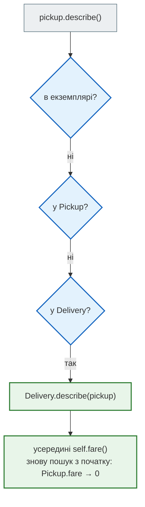
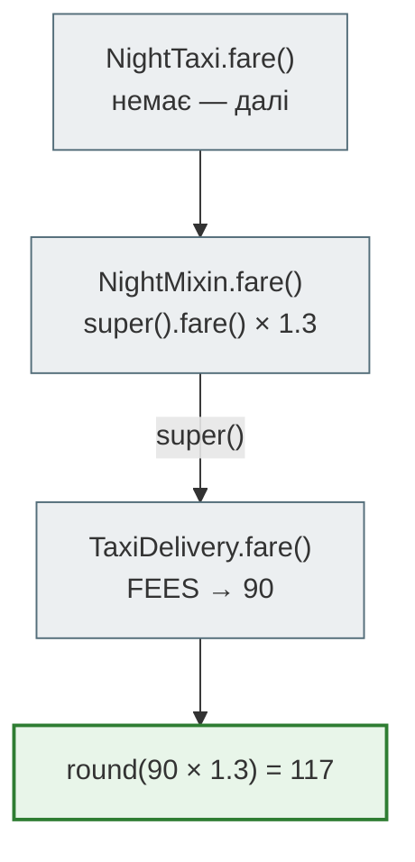
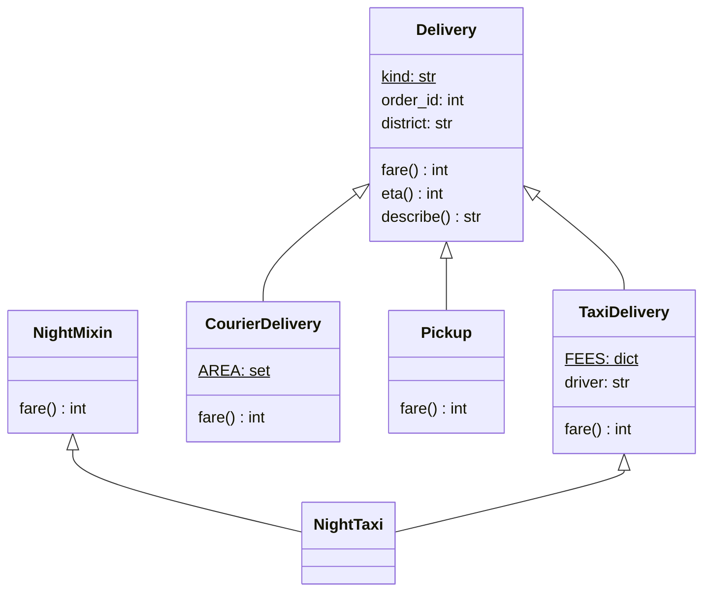
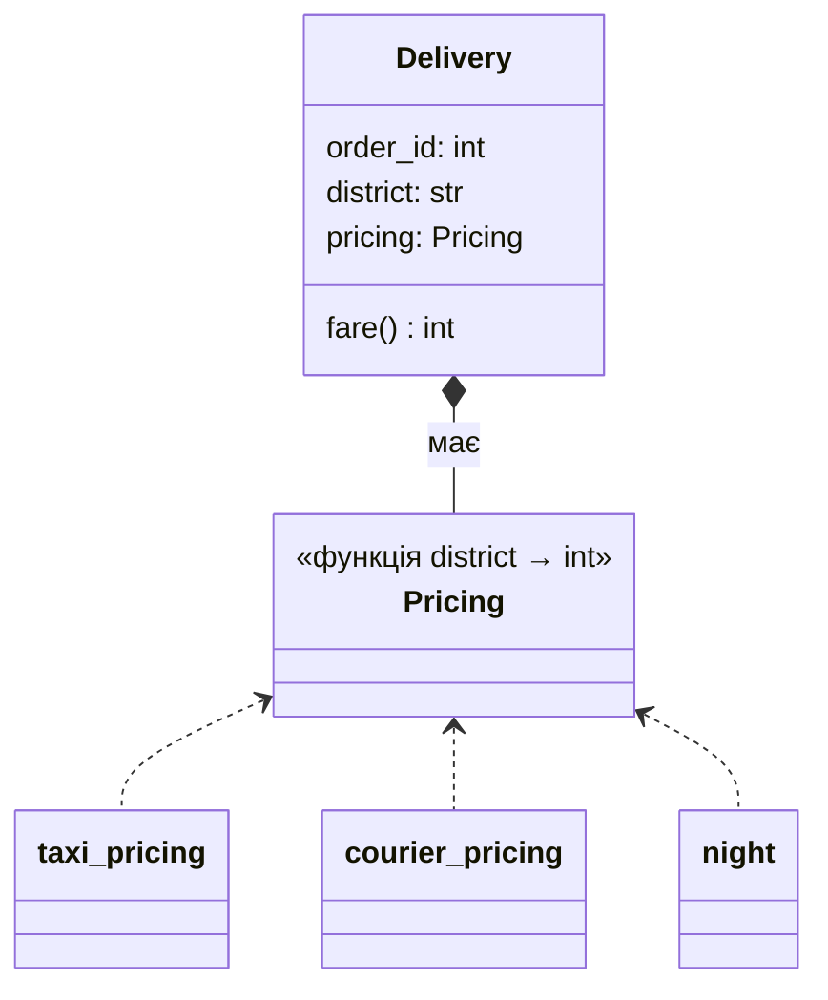

# Урок 20. Наслідування, поліморфізм

Сервіс «Смачно + Таксі» доставляв лише таксі. Та замовлень побільшало, і з'явилися нові способи. **Кур'єр-пішохід** бере 40 грн, але ходить лише Подолом. **Самовивіз** безкоштовний. А вночі таксі коштує дорожче. У кожного способу своя ціна, свій час і свої правила, але звіт однаковий: номер замовлення, район, ціна, скільки чекати.

Як це записати? Можна додати в клас `Delivery` з уроку 19 поле `kind` і в кожному методі писати `if kind == "taxi" … elif kind == "courier" …`. Можна зробити окремий клас на кожен спосіб і навчити їх відповідати на **однакові питання** — `fare()`, `eta()` — кожен по-своєму. Це і є **наслідування** та **поліморфізм**.

Наприкінці уроку, у розділі «Архітектура», порівняємо три рішення: `if` за типом, ієрархію класів і **композицію**. Побачимо, чому досвідчені розробники часто кажуть «віддавай перевагу композиції».

**Що потрібно з попередніх уроків:** функції як об'єкти й фабрики (урок 18), класи, атрибути класу й екземпляра, `isinstance` (урок 19).

**Після уроку ти зможеш:**

- створювати підкласи, перевизначати методи й розширювати їх через `super()`;
- пояснювати, як Python шукає метод по MRO, у тому числі при множинному наслідуванні;
- писати поліморфний код: один виклик — різна поведінка, без `if` за типом;
- розпізнавати качину типізацію, пастки несумісних сигнатур і «нащадка, що ламає батька»;
- обирати між наслідуванням і композицією за правилом «є» (is-a) проти «має» (has-a).

**Задача розділу.** Звіт за доставками різних типів, в якому сервіс не знає, які саме типи існують. Повний код — у розділі [«Практика»](#practice).

**Ноутбук заняття:** [`note_lesson_20_inheritance.ipynb`](https://github.com/NikoriakViktot/PY-Course-Victor-Nikoriak-22-09-2026/blob/main/module_2/lessons/lesson_20_inheritance_polymorphism/note_lesson_20_inheritance.ipynb) [](https://colab.research.google.com/github/NikoriakViktot/PY-Course-Victor-Nikoriak-22-09-2026/blob/main/module_2/lessons/lesson_20_inheritance_polymorphism/note_lesson_20_inheritance.ipynb)

## Пригадай

1. Де Python шукає `first.FEES`, якщо в екземплярі такого атрибута немає?
2. Що повертає `isinstance(True, int)` і чому?
3. Що таке фабрика функцій з уроку 18?

??? success "Відповіді"

    1. У класі. Спершу екземпляр, потім клас.
    2. `True`: `bool` — нащадок `int`. Сьогодні розберемо, що це означає.
    3. Функція, яка створює й повертає іншу функцію, налаштовану параметрами: `make_discount(10)`.

## Спільне — в батьківському класі

Усі доставки мають номер замовлення й район, і всі вміють описати себе. Це спільне — у **базовому** (батьківському) класі:

```python
class Delivery:
    """Будь-яка доставка: номер замовлення, район, ціна, час."""

    kind = "Доставка"

    def __init__(self, order_id, district):
        self.order_id = order_id
        self.district = district

    def fare(self):
        raise NotImplementedError(f"{type(self).__name__} має визначити fare()")

    def eta(self):
        return 30

    def describe(self):
        return f"{self.kind} №{self.order_id}: {self.district}, {self.fare()} грн, ~{self.eta()} хв"
```

`fare()` базовий клас не знає — ціна залежить від способу доставки. Тож він піднімає `NotImplementedError`: «нащадок, визнач мене». `eta()` має типове значення, яке нащадок може змінити. А `describe()` уже написаний і користується `fare()` та `eta()` — **якими б вони не були**.

**Нащадок** (підклас) вказує батька в дужках і отримує все, що в того є:

```python
class Pickup(Delivery):
    kind = "Самовивіз"

    def fare(self):
        return 0

    def eta(self):
        return 15


pickup = Pickup(3, "кафе")
print(pickup.describe())
print(isinstance(pickup, Pickup), isinstance(pickup, Delivery))
```

```text
Самовивіз №3: кафе, 0 грн, ~15 хв
True True
```

У `Pickup` немає ні `__init__`, ні `describe` — вони знайдені в `Delivery`. А `fare`, `eta` і `kind` — власні: нащадок їх **перевизначив**. Самовивіз **є** доставкою (is-a), тому `isinstance(pickup, Delivery)` — `True`.

### Як Python шукає метод: MRO

`pickup.describe()` — Python шукає `describe` по ланцюжку класів. Цей ланцюжок називається **MRO** (method resolution order, порядок пошуку методів):

```python
print([cls.__name__ for cls in Pickup.mro()])
```

```text
['Pickup', 'Delivery', 'object']
```



Головне — останній крок: `describe` написаний у `Delivery`, але `self` — це `pickup`, і `self.fare()` знаходить `Pickup.fare`. Базовий клас задає **сценарій**, нащадки підставляють **деталі**.

`object` в кінці ланцюжка — спільний предок усіх класів Python. Саме від нього кожен клас отримує, наприклад, типовий `__repr__`.

## super(): розширити, а не замінити

Таксі потребує ще й водія. Новий `__init__` нащадка **заміняє** батьківський, тому спершу треба викликати батьківський через `super()`, а потім додати своє:

```python
class TaxiDelivery(Delivery):
    kind = "Таксі"
    FEES = {"Поділ": 60, "Оболонь": 80, "Печерськ": 90}

    def __init__(self, order_id, district, driver):
        super().__init__(order_id, district)
        self.driver = driver

    def fare(self):
        return self.FEES[self.district]

    def eta(self):
        return 25

    def describe(self):
        return super().describe() + f", водій {self.driver}"


taxi = TaxiDelivery(1, "Оболонь", "D-3")
print(taxi.describe())
print(taxi.__dict__)
```

```text
Таксі №1: Оболонь, 80 грн, ~25 хв, водій D-3
{'order_id': 1, 'district': 'Оболонь', 'driver': 'D-3'}
```

`super()` — це «наступний клас за MRO». `super().__init__(…)` заповнив `order_id` і `district`, а `super().describe()` зібрав спільний опис, до якого таксі дописало водія. Без `super().__init__` в об'єкті не було б `order_id`, і `describe` впав би з `AttributeError`.

## Поліморфізм: один виклик — різна поведінка

Кур'єр — третій спосіб:

```python
class CourierDelivery(Delivery):
    kind = "Кур'єр"
    AREA = {"Поділ"}

    def __init__(self, order_id, district):
        if district not in self.AREA:
            raise ValueError(f"кур'єр не ходить у район {district}")
        super().__init__(order_id, district)

    def fare(self):
        return 40

    def eta(self):
        return 45
```

А тепер звіт, якому байдуже, що за доставка перед ним:

```python
deliveries = [TaxiDelivery(1, "Оболонь", "D-3"), CourierDelivery(2, "Поділ"), Pickup(3, "кафе")]

for delivery in deliveries:
    print(delivery.describe())
print("Разом за доставку:", sum(delivery.fare() for delivery in deliveries), "грн")
```

```text
Таксі №1: Оболонь, 80 грн, ~25 хв, водій D-3
Кур'єр №2: Поділ, 40 грн, ~45 хв
Самовивіз №3: кафе, 0 грн, ~15 хв
Разом за доставку: 120 грн
```

Той самий рядок `delivery.describe()` робить три різні речі. Це **поліморфізм** («багато форм»): код звертається до спільного **інтерфейсу** — набору методів `fare`, `eta`, `describe`, — а кожен клас відповідає по-своєму. У циклі немає жодного `if isinstance(...)`. Новий спосіб доставки — новий клас, а звіт не змінюється.

### Качина типізація

Python не питає, **від кого** походить об'єкт, — лише чи **вміє** він потрібне. «Якщо воно ходить як качка і крякає як качка — це качка». Партнерська служба має свою бібліотеку, класи якої не наслідують наш `Delivery`. Але якщо в її об'єктів є `fare()` і `describe()`, звіт працює:

```python
class PartnerCourier:
    """Клас з бібліотеки партнера — не наслідує Delivery."""

    def __init__(self, order_id, price):
        self.order_id = order_id
        self.price = price

    def fare(self):
        return self.price

    def describe(self):
        return f"Партнер №{self.order_id}: {self.price} грн"


mixed = deliveries + [PartnerCourier(4, 95)]
print(sum(delivery.fare() for delivery in mixed))
print(mixed[-1].describe(), isinstance(mixed[-1], Delivery))
```

```text
215
Партнер №4: 95 грн False
```

Наслідування — один спосіб отримати спільний інтерфейс, але не єдиний. `len()` працює для рядків, списків і словників, хоча спільного предка з методом `__len__` у них немає. Це та сама качина типізація. У модулі 2 до неї ще повернемося.

## Множинне наслідування і міксини

Уночі таксі дорожче на 30 %. Ця надбавка стосується **будь-якої** доставки, тому зручно винести її в окремий маленький клас — **міксин** (mixin). Він не описує самостійну річ, лише додає поведінку. Клас може мати кілька батьків:

```python
class NightMixin:
    """Нічна надбавка 30 % до ціни будь-якої доставки."""

    def fare(self):
        return round(super().fare() * 1.3)

    def describe(self):
        return super().describe() + " (ніч)"


class NightTaxi(NightMixin, TaxiDelivery):
    pass


night = NightTaxi(5, "Печерськ", "D-2")
print(night.describe())
print([cls.__name__ for cls in NightTaxi.mro()])
```

```text
Таксі №5: Печерськ, 117 грн, ~25 хв, водій D-2 (ніч)
['NightTaxi', 'NightMixin', 'TaxiDelivery', 'Delivery', 'object']
```

Порядок батьків у дужках — порядок MRO. `NightMixin.fare` викликає `super().fare()`, і це **не** `object`: наступний клас у MRO **екземпляра** — `TaxiDelivery`. Тому міксин працює з будь-якою доставкою: `class NightCourier(NightMixin, CourierDelivery)` дасть 52 грн.



!!! warning "Кожен у ланцюжку має викликати super()"
    Якщо один клас у ланцюжку MRO не викликає `super()` — наприклад, міксин з `__init__` без `super().__init__()`, — естафета обривається, і класи після нього мовчки не ініціалізуються. У кооперативному множинному наслідуванні **кожен** метод, що бере участь у ланцюжку, передає виклик далі.

## Пастки наслідування

### Несумісні сигнатури

Сервіс створює доставку за назвою типу — таблиця класів, як таблиця команд в уроці 18:

```python
KINDS = {"taxi": TaxiDelivery, "courier": CourierDelivery, "pickup": Pickup}

for name, cls in KINDS.items():
    try:
        print(cls(7, "Поділ").describe())
    except TypeError as error:
        print(name, "→", error)
```

```text
taxi → TaxiDelivery.__init__() missing 1 required positional argument: 'driver'
Кур'єр №7: Поділ, 40 грн, ~45 хв
Самовивіз №7: Поділ, 0 грн, ~15 хв
```

`TaxiDelivery` вимагає більше аргументів, ніж батько, тож код, який створює доставки «за шаблоном батька», ламається лише на ній. Коли класи в ієрархії мають працювати взаємозамінно, їхні конструктори теж мають бути сумісні: водія можна зробити необов'язковим (`driver=None`) або передавати окремим методом.

### Нащадок, що ламає батька

Колега вирішила, що самовивіз має показувати не `0`, а слово:

```python
class FriendlyPickup(Pickup):
    def fare(self):
        return "безкоштовно"


try:
    print(sum(delivery.fare() for delivery in deliveries + [FriendlyPickup(6, "кафе")]))
except TypeError as error:
    print(error)
```

```text
unsupported operand type(s) for +: 'int' and 'str'
```

Звіт, який працював з **усіма** доставками, зламався на новому нащадку. Батько обіцяв: `fare()` повертає число. Нащадок цю обіцянку порушив. Правило, яке це формулює, — **принцип підстановки Лісков** (LSP): об'єкт нащадка має працювати всюди, де очікують батька. Перевизначаючи метод, не змінюй, **що** він повертає і **які** винятки піднімає — лише **як** він це обчислює.

## Архітектура: як моделювати різні способи доставки { #architecture }

Задача: три способи доставки, і будь-який може бути нічним. Три рішення.

**А. Один клас і `if` за типом.** `Delivery(kind="taxi")`, а в `fare()` — `if self.kind == "taxi": … elif …`. Просто, поки способів два. Кожен новий спосіб — правки в кожному методі, де є `if`, і легко забути один.

**Б. Ієрархія класів** — те, що ми щойно зробили:



Стрілка з порожнім трикутником `<|--` — **наслідування**: «NightTaxi є TaxiDelivery». Новий спосіб — новий клас, решта коду не змінюється. Але ознаки **множаться**: три способи × день/ніч — уже шість класів. Додай «з промокодом» — дванадцять. Це **вибух класів**.

**В. Композиція.** Доставка не **є** нічною чи таксі — вона **має** правило ціни. Правило — окремий об'єкт чи функція (урок 18), яку передають у доставку:



Ромб `*--` — **композиція**: «доставка має правило ціни». Правила комбінуються як конвеєр з уроку 18: `night(taxi_pricing)`. Три способи й нічна надбавка — чотири маленькі функції, а не шість класів.

| | А. `if` за типом | Б. Ієрархія класів | В. Композиція |
|---|---|---|---|
| Новий спосіб доставки | правки в кожному `if` | новий клас | нова функція-правило |
| Комбінації ознак (ніч, промо) | ще більше `if` | вибух класів або міксини | `night(promo(taxi_pricing))` |
| Зв'язність | усе в одному місці | нащадки залежать від батька | частини незалежні |
| Коли доречно | 2 типи, які не зростатимуть | стабільне «є»: самовивіз **є** доставкою | змінні правила, комбінації |

Правило вибору просте. Якщо природно сказати «X **є** Y» і так буде завжди — наслідування. Якщо «X **має** Y» або «X поводиться як Y, але правила змінюються» — композиція. На практиці їх поєднують: `Delivery` з підкласами для **різних сутностей** і з композицією для **змінних правил**.

## Практика { #practice }

### Розібраний приклад: звіт, що не знає типів доставок

```python linenums="1" hl_lines="2 6 7 10 11 12 13"
def delivery_report(deliveries):
    by_kind = {}
    for delivery in deliveries:
        by_kind.setdefault(delivery.kind, []).append(delivery)
    lines = []
    for kind, group in by_kind.items():
        total = sum(delivery.fare() for delivery in group)
        lines.append(f"{kind}: {len(group)} шт., {total} грн")
    fastest = min(deliveries, key=lambda delivery: delivery.eta())
    lines.append(f"Найшвидша: {fastest.describe()}")
    return "\n".join(lines)


shift = [TaxiDelivery(1, "Оболонь", "D-3"), CourierDelivery(2, "Поділ"), Pickup(3, "кафе"),
         NightTaxi(4, "Печерськ", "D-2"), TaxiDelivery(5, "Поділ", "D-1")]
print(delivery_report(shift))
```

```text
Таксі: 3 шт., 257 грн
Кур'єр: 1 шт., 40 грн
Самовивіз: 1 шт., 0 грн
Найшвидша: Самовивіз №3: кафе, 0 грн, ~15 хв
```

Що відбувається в ключових рядках:

- **рядок 2** — групи за атрибутом класу `kind`: кожен підклас визначає свій, `NightTaxi` успадковує «Таксі» від `TaxiDelivery`;
- **рядки 6–7** — `fare()` у кожної доставки своя, і для нічного таксі це 117 з надбавкою. Звіт про це не знає;
- **рядки 10–13** — `min` з `key=` з уроку 18 порівнює `eta()` доставок різних класів. `describe()` найшвидшої — теж поліморфний виклик;
- жодного `isinstance` і жодного `if` за типом: новий клас доставки потрапить у звіт без змін у `delivery_report`.

### Зміни приклад: доставка дроном

Сервіс тестує **дрон**: 120 грн, 10 хвилин, лише на Оболонь. Додай клас `DroneDelivery(Delivery)` і додай дрон у зміну. Очікуваний рядок у звіті:

```text
Дрон: 1 шт., 120 грн
```

**Критерії перевірки:**

- `delivery_report` не змінюється;
- дрон на Поділ → `ValueError` у конструкторі, як у кур'єра;
- найшвидшою в звіті тепер стає доставка дроном;
- `NightDrone(NightMixin, DroneDelivery)` працює без нового коду в міксині: 156 грн.

??? tip "Підказка"
    Скопіюй будову `CourierDelivery`: атрибути класу `kind` і `AREA`, перевірка району в `__init__` перед `super().__init__`, `fare()` і `eta()`.

### Спробуй самостійно: те саме композицією

Перепиши доставки **без підкласів**: один клас `Delivery(order_id, district, pricing, kind)`, де `pricing` — функція «район → ціна». Напиши:

- `taxi_pricing(district)` — ціни з `FEES`;
- `courier_pricing(district)` — 40 грн, лише Поділ, інакше `ValueError`;
- `night(pricing)` — **фабрика** з уроку 18: повертає нову функцію, що додає 30 % до ціни `pricing`.

```text
Delivery(4, "Печерськ", night(taxi_pricing), "Таксі").fare()  →  117
Delivery(2, "Поділ", night(courier_pricing), "Кур'єр").fare()  →  52
```

**Правила:**

- `Delivery.fare()` лише викликає `self.pricing(self.district)`;
- жодного `if` за типом доставки і жодного підкласу;
- порівняй: скільки класів знадобилося б в ієрархії для «таксі / кур'єр × день / ніч × з промокодом / без»? А скільки функцій у композиції?

## Підсумок

| Поняття | Що запам'ятати |
|---|---|
| Наслідування | `class Taxi(Delivery)` — нащадок отримує атрибути й методи батька, може їх перевизначити |
| MRO | порядок пошуку методу: `Клас.mro()`; `self.fare()` завжди шукається з класу екземпляра |
| `super()` | наступний клас за MRO; розширити батьківський метод, а не переписати |
| Поліморфізм | один виклик `d.fare()` — різна поведінка; нові класи без змін у коді, що їх використовує |
| Качина типізація | важить, що об'єкт уміє, а не від кого походить |
| Міксин | маленький клас з поведінкою для множинного наслідування; кожен викликає `super()` |
| LSP | нащадок працює всюди, де батько: той самий тип результату й ті самі винятки |
| Is-a / has-a | «є» — наслідування; «має», змінні правила — композиція |

### Самоперевірка

1. У `Pickup` немає `describe`. Звідки він береться і чому всередині нього `self.fare()` повертає 0?
2. Що станеться, якщо в `TaxiDelivery.__init__` забути `super().__init__(order_id, district)`?
3. Чому цикл зі звітом не містить жодного `if isinstance(...)`? Що це дає?
4. `PartnerCourier` не наслідує `Delivery`. Чому звіт з ним працює?
5. Чому в `NightMixin.fare()` вираз `super().fare()` веде до `TaxiDelivery`, а не до `object`?
6. Чим поганий `FriendlyPickup`, хоча він «просто повертає текст»?
7. Три способи доставки × день/ніч × з промокодом / без: скільки класів в ієрархії і скільки функцій у композиції?

??? success "Відповіді"

    1. `describe` знайдено в `Delivery` за MRO. `self` — об'єкт `Pickup`, тому `self.fare()` шукається знову з `Pickup` і знаходить `Pickup.fare`.
    2. В об'єкті не буде `order_id` і `district`; перший же `describe()` впаде з `AttributeError`.
    3. Кожен клас сам відповідає на `fare()`, `eta()`, `describe()`. Новий тип доставки не вимагає змін у звіті.
    4. Качина типізація: звіт лише викликає `fare()` і `describe()`, а вони в об'єкта є.
    5. `super()` бере наступний клас у MRO **екземпляра** `NightTaxi`: після `NightMixin` іде `TaxiDelivery`.
    6. Порушує обіцянку батька «`fare()` повертає число» (LSP): будь-який код, що рахує суму, падає на ньому з `TypeError`.
    7. В ієрархії — 3 × 2 × 2 = 12 класів, у композиції — 3 правила ціни + 2 обгортки (`night`, `promo`) = 5 функцій, які комбінуються.

### Що далі

- Ноутбук заняття: [`note_lesson_20_inheritance.ipynb`](https://github.com/NikoriakViktot/PY-Course-Victor-Nikoriak-22-09-2026/blob/main/module_2/lessons/lesson_20_inheritance_polymorphism/note_lesson_20_inheritance.ipynb) [](https://colab.research.google.com/github/NikoriakViktot/PY-Course-Victor-Nikoriak-22-09-2026/blob/main/module_2/lessons/lesson_20_inheritance_polymorphism/note_lesson_20_inheritance.ipynb) — доставки різних типів: прогнози, вправи з перевірками, пастки міксинів і сигнатур.
- Практикум на реальних даних: [`lab_lesson_20_titanic_inheritance.ipynb`](https://github.com/NikoriakViktot/PY-Course-Victor-Nikoriak-22-09-2026/blob/main/module_2/lessons/lesson_20_inheritance_polymorphism/lab_lesson_20_titanic_inheritance.ipynb) [](https://colab.research.google.com/github/NikoriakViktot/PY-Course-Victor-Nikoriak-22-09-2026/blob/main/module_2/lessons/lesson_20_inheritance_polymorphism/lab_lesson_20_titanic_inheritance.ipynb) — «Жінки та діти — першими»: ієрархія пасажирів «Титаніка», MRO як маршрут, композиція проти наслідування.
- Наступне заняття — урок 21 «Інкапсуляція, область видимості»: як не дати коду ззовні записати в доставку від'ємну ціну.

## Документація і джерела

- Туторіал Python: [Inheritance](https://docs.python.org/3/tutorial/classes.html#inheritance), [Multiple Inheritance](https://docs.python.org/3/tutorial/classes.html#multiple-inheritance)
- [`super()`](https://docs.python.org/3/library/functions.html#super); [The Python 2.3 Method Resolution Order](https://docs.python.org/3/howto/mro.html) — як будується MRO
- Глосарій: [duck-typing](https://docs.python.org/3/glossary.html#term-duck-typing)
- Raymond Hettinger, [Python's super() considered super!](https://rhettinger.wordpress.com/2011/05/26/super-considered-super/) — кооперативне множинне наслідування
- Для охочих: MIT 6.0001, [лекція 9 «Python Classes and Inheritance»](https://ocw.mit.edu/courses/6-0001-introduction-to-computer-science-and-programming-in-python-fall-2016/resources/lecture-9-python-classes-and-inheritance/).
