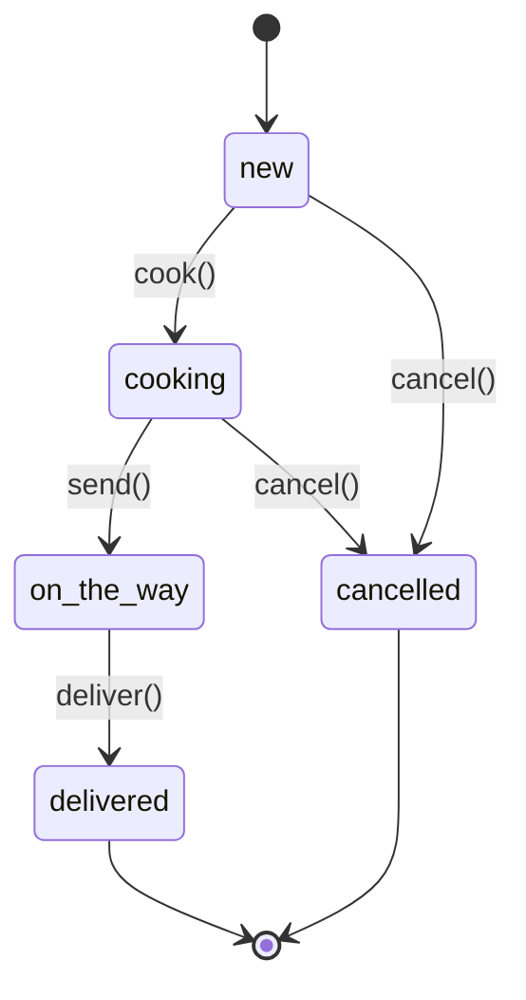
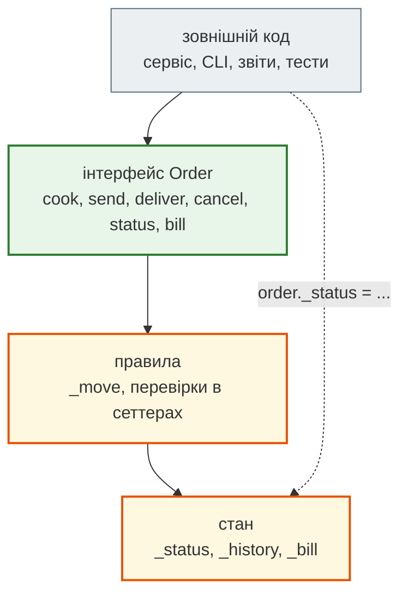
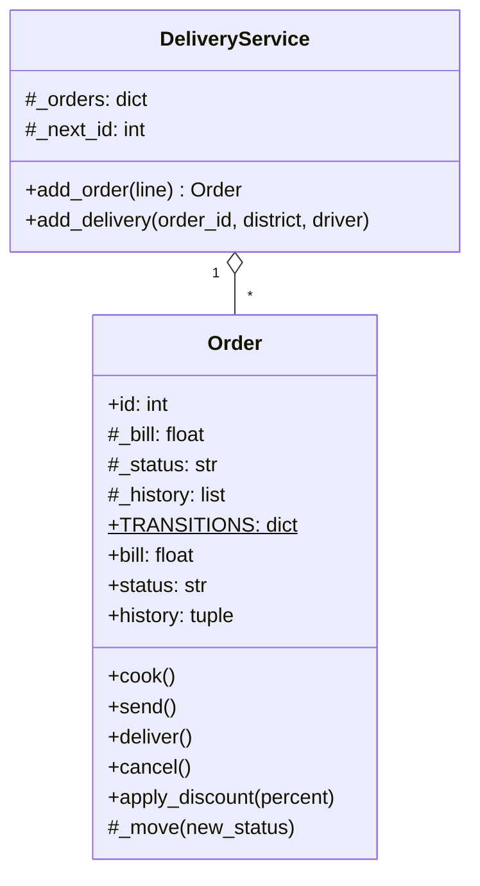

# Урок 21. Інкапсуляція, область видимості

В уроці 19 `Order` перевіряв суму чека в `__init__`: замовлення на −120 грн створити неможливо. Але тиждень потому бухгалтер знайшла в звіті від'ємний виторг. Виявилося, що скрипт знижок писав прямо в атрибут: `order.bill = order.bill - 600`. Перевірка в `__init__` спрацювала один раз, при створенні, а потім у стан міг писати будь-хто.

Той самий скрипт виставляв замовленням статус `"delivered"`, хоча кухня ще й не почала готувати. Звіт кухні показував порожні черги, а клієнти чекали годинами.

**Інкапсуляція** — це про те, щоб у стан об'єкта вели лише **правильні двері**: методи, які перевіряють правила. Об'єкт тоді сам гарантує, що ніколи не опиниться в неможливому стані, хоч би хто й звідки з ним працював. А **область видимості** — про те саме на рівні функцій і модулів: чим менше коду може змінити змінну, тим менше місць, де її можна зламати.

**Що потрібно з попередніх уроків:** винятки (урок 13), LEGB і `nonlocal` (урок 18), класи й атрибути (урок 19), наслідування й `super()` (урок 20).

**Після уроку ти зможеш:**

- формулювати інваріанти класу й захищати їх методами, а не домовленостями;
- розрізняти `name`, `_name` і `__name`, пояснювати name mangling і коли він справді потрібен;
- будувати скінченний автомат статусів із дозволеними переходами;
- давати доступ до стану лише для читання через `@property` і перевіряти запис у сеттері;
- пояснювати, чим небезпечний `global`, і тримати змінні в найменшій потрібній області видимості;
- вирішувати, яке правило має жити в моделі, а яке — в сервісі.

**Задача розділу.** `Order`, у якого сума змінюється лише через знижку з перевіркою, а статус — лише за дозволеними переходами, з історією змін. Повний код — у розділі [«Практика»](#practice).

**Ноутбук заняття:** [`note_lesson_21_encapsulation.ipynb`](https://github.com/NikoriakViktot/PY-Course-Victor-Nikoriak-22-09-2026/blob/main/module_2/lessons/lesson_21_encapsulation_scope/note_lesson_21_encapsulation.ipynb) [](https://colab.research.google.com/github/NikoriakViktot/PY-Course-Victor-Nikoriak-22-09-2026/blob/main/module_2/lessons/lesson_21_encapsulation_scope/note_lesson_21_encapsulation.ipynb)

## Пригадай

1. Де в `Order` з уроку 19 стояла перевірка `bill > 0` і коли вона виконувалась?
2. Навіщо в уроці 18 знадобився `nonlocal`?
3. Чому в уроці 20 нащадок, який повертає з `fare()` рядок, зламав звіт?

??? success "Відповіді"

    1. У `__init__`, тобто один раз — при створенні об'єкта.
    2. Щоб змінити змінну оточуючої функції: присвоєння без нього створює локальну змінну.
    3. Він порушив обіцянку батька «`fare()` повертає число» — принцип підстановки Лісков.

## Інваріант і як його зламати

**Інваріант** — правило, яке має бути правдою **завжди**, протягом усього життя об'єкта:

- сума чека більша за 0;
- статус змінюється лише за маршрутом «нове → готується → в дорозі → доставлено»;
- кількість використань промокоду не від'ємна.

Перевірка в `__init__` захищає лише **народження** об'єкта:

```python
class Order:
    def __init__(self, order_id, bill):
        if bill <= 0:
            raise ValueError(f"сума чека має бути більшою за 0, а маємо {bill}")
        self.id = order_id
        self.bill = bill


order = Order(1, 540.0)
order.bill = order.bill - 600
print(order.bill)
```

```text
-60.0
```

Ні помилки, ні попередження. `bill` — відкритий атрибут, і записати в нього може кожен рядок будь-якого модуля. Інваріант порушено, і дізнаємося ми про це аж зі звіту бухгалтера.

## Конвенції доступу: _name і __name

Python не має ключових слів `private` чи `public`, як Java чи C#. Замість них — **домовленості в іменах**:

| Ім'я | Що означає | Чи захищає |
|---|---|---|
| `bill` | публічний атрибут: частина інтерфейсу | ні |
| `_bill` | внутрішній: «не чіпай ззовні, це деталь реалізації» | домовленість, Python не заважає |
| `__bill` | Python перейменовує в `_Order__bill` (name mangling) | від випадкових збігів імен у нащадках |

```python
class Order:
    def __init__(self, order_id, bill):
        self.id = order_id
        self._bill = bill
        self.__kitchen_note = "без цибулі"


order = Order(1, 540.0)
print(order.__dict__)
print(order._bill)

try:
    print(order.__kitchen_note)
except AttributeError as error:
    print("AttributeError:", error)
```

```text
{'id': 1, '_bill': 540.0, '_Order__kitchen_note': 'без цибулі'}
540.0
AttributeError: 'Order' object has no attribute '__kitchen_note'
```

`_bill` читається без проблем: підкреслення — лише сигнал для людей, IDE й лінтерів. А `__kitchen_note` усередині класу Python записав як `_Order__kitchen_note`. Звернутися до нього все одно можна — `order._Order__kitchen_note`, — тож це не замок, а захист від **випадковостей**.

### Навіщо __: колізія імен у нащадках

Випадковість, від якої захищає `__`, — конфлікт імен між батьком і нащадком:

```python
class Delivery:
    def __init__(self, order_id):
        self.order_id = order_id
        self._status = "нова"

    def status(self):
        return self._status


class TrackedDelivery(Delivery):
    def __init__(self, order_id, gps):
        super().__init__(order_id)
        self._status = f"GPS {gps}"


tracked = TrackedDelivery(7, "50.45,30.52")
print(tracked.status())
```

```text
GPS 50.45,30.52
```

Автор `TrackedDelivery` не знав, що в батька вже є `_status`, і назвав так своє поле. Він **затер** стан батька, і `status()` повертає нісенітницю. З двома підкресленнями імена не перетинаються:

```python
class Delivery:
    def __init__(self, order_id):
        self.order_id = order_id
        self.__status = "нова"

    def status(self):
        return self.__status


class TrackedDelivery(Delivery):
    def __init__(self, order_id, gps):
        super().__init__(order_id)
        self.__status = f"GPS {gps}"


tracked = TrackedDelivery(7, "50.45,30.52")
print(tracked.status())
print(tracked.__dict__)
```

```text
нова
{'order_id': 7, '_Delivery__status': 'нова', '_TrackedDelivery__status': 'GPS 50.45,30.52'}
```

Два різні атрибути — `_Delivery__status` і `_TrackedDelivery__status`. Кожен клас бачить свій.

!!! tip "Коли яке підкреслення"
    За замовчуванням — одне: `_bill`. Воно чесно каже «це внутрішнє» і не заважає нащадкам. Два — лише для атрибутів класу, який **задумано** як базовий для чужих нащадків, щоб їхні поля випадково не затерли твої. [PEP 8](https://peps.python.org/pep-0008/#designing-for-inheritance) радить саме так.

## Методи — двері в стан

Сховати `bill` за підкресленням мало: треба дати **правильний спосіб** її змінити. Знижку дає не той, хто викликає, віднімаючи число, а сам об'єкт — методом з перевіркою:

```python
class Order:
    MAX_DISCOUNT = 50

    def __init__(self, order_id, bill):
        if bill <= 0:
            raise ValueError(f"сума чека має бути більшою за 0, а маємо {bill}")
        self.id = order_id
        self._bill = bill

    def bill(self):
        return self._bill

    def apply_discount(self, percent):
        if not 0 < percent <= self.MAX_DISCOUNT:
            raise ValueError(f"знижка має бути від 1 до {self.MAX_DISCOUNT} %, а маємо {percent}")
        self._bill = round(self._bill * (100 - percent) / 100, 2)


order = Order(1, 540.0)
order.apply_discount(10)
print(order.bill())

try:
    order.apply_discount(111)
except ValueError as error:
    print(error)
print(order.bill())
```

```text
486.0
знижка має бути від 1 до 50 %, а маємо 111
486.0
```

Зовнішній код більше не **обчислює** нову суму сам — він **просить** об'єкт: «застосуй знижку 10 %». Правило «не більше 50 %» живе в одному місці, і обійти його випадково вже не вийде. Цей принцип називають **«Tell, don't ask»**: кажи об'єкту, що зробити, замість того щоб читати його стан, рахувати й записувати назад.

## Статуси замовлення: скінченний автомат

Статус — найнебезпечніше поле: від нього залежать кухня, водії й звіти. Замовлення проходить чіткий маршрут, і не кожен перехід дозволено:



Така схема — **скінченний автомат** (finite state machine): є скінченний набір станів і список дозволених переходів між ними. Скасувати можна, поки водій не виїхав. Доставлене замовлення вже нікуди не рухається.

Автомат переноситься в код майже дослівно: словник «стан → дозволені наступні стани» і один внутрішній метод, через який проходить **кожна** зміна:

```python
class Order:
    TRANSITIONS = {
        "new": {"cooking", "cancelled"},
        "cooking": {"on_the_way", "cancelled"},
        "on_the_way": {"delivered"},
        "delivered": set(),
        "cancelled": set(),
    }

    def __init__(self, order_id, bill):
        if bill <= 0:
            raise ValueError(f"сума чека має бути більшою за 0, а маємо {bill}")
        self.id = order_id
        self._bill = bill
        self._status = "new"
        self._history = ["new"]

    def _move(self, new_status):
        if new_status not in self.TRANSITIONS[self._status]:
            raise ValueError(f"замовлення №{self.id}: не можна {self._status} → {new_status}")
        self._status = new_status
        self._history.append(new_status)

    def cook(self):
        self._move("cooking")

    def send(self):
        self._move("on_the_way")

    def deliver(self):
        self._move("delivered")

    def cancel(self):
        self._move("cancelled")


order = Order(1, 540.0)
order.cook()
order.send()
try:
    order.cancel()
except ValueError as error:
    print(error)
order.deliver()
print(order._history)
```

```text
замовлення №1: не можна on_the_way → cancelled
['new', 'cooking', 'on_the_way', 'delivered']
```

Скасування в дорозі відхилено, і стан лишився правильним. Публічні методи `cook`, `send`, `deliver`, `cancel` — це **інтерфейс** замовлення. `_move`, `_status` і `_history` — внутрішня кухня, про яку зовнішньому коду знати не треба.

## @property: читати можна, писати — лише через правила

Методи `bill()` і доступ до `order._history` зсередини — незручно. Хочеться читати стан як звичайний атрибут, `order.status`, але не дозволяти запис. Для цього є **`@property`**: метод, до якого звертаються як до атрибута.

```python
class Order(Order):
    @property
    def status(self):
        return self._status

    @property
    def history(self):
        return tuple(self._history)


order = Order(2, 320.0)
order.cook()
print(order.status, order.history)

try:
    order.status = "delivered"
except AttributeError as error:
    print(type(error).__name__)
```

```text
cooking ('new', 'cooking')
AttributeError
```

`order.status` виглядає як атрибут, а насправді викликає метод. Сеттера немає — запис дає `AttributeError`. Статус змінюється лише методами автомата. А `history` повертає **кортеж-копію**: якби він повертав сам список `_history`, зовнішній код міг би дописати в нього що завгодно.

Якщо запис дозволений, але з правилами, до `@property` додають **сеттер**. Тоді звичайне присвоєння запускає перевірку:

```python
class Order(Order):
    @property
    def bill(self):
        return self._bill

    @bill.setter
    def bill(self, value):
        if value <= 0:
            raise ValueError(f"сума чека має бути більшою за 0, а маємо {value}")
        self._bill = value


order = Order(3, 980.0)
order.bill = 900.0
try:
    order.bill = order.bill - 1000
except ValueError as error:
    print(error)
print(order.bill)
```

```text
сума чека має бути більшою за 0, а маємо -100.0
900.0
```

Той самий рядок, що на початку уроку зламав звіт, тепер зупиняється з поясненням. Зовнішній код не змінився — `order.bill = …`, — а інваріант захищено. Усе про `@property`, сеттери й дескриптори — в уроці 23.

!!! note "`class Order(Order)`"
    У прикладах вище ми нарощуємо клас частинами, щоб не повторювати весь код: кожен новий `Order` наслідує попередній. У справжньому проєкті всі ці методи живуть в одному класі.

## Область видимості: чим менше, тим безпечніше

Інкапсуляція класу — окремий випадок ширшої ідеї: **кожна змінна має бути видимою в найменшій потрібній області**. В уроці 18 ми розібрали LEGB — як Python **шукає** ім'я. Тепер про те, де його **тримати**.

### global: змінна, яку може змінити будь-хто

Перша версія сервісу рахувала замовлення в глобальній змінній:

```python
total_orders = 0


def add_order_broken():
    total_orders += 1


try:
    add_order_broken()
except UnboundLocalError as error:
    print(type(error).__name__)
```

```text
UnboundLocalError
```

Та сама пастка, що з `nonlocal` в уроці 18: присвоєння робить `total_orders` локальною змінною. «Виправлення» через `global` працює:

```python
def add_order():
    global total_orders
    total_orders += 1
    return total_orders


add_order()
add_order()
print(total_orders)
```

```text
2
```

Але тепер **будь-яка** функція будь-якого модуля може змінити `total_orders`. А коли кафе відкриває друге відділення, обидва рахують в одну змінну:

```python
podil_first = add_order()
obolon_first = add_order()
print(podil_first, obolon_first)
```

```text
3 4
```

Перше замовлення Оболоні отримало №4, бо лічильник спільний на весь модуль. Щоб знайти, хто і де змінює глобальну змінну, треба прочитати **весь** код. Лічильник у класі (урок 19) чи в замиканні (урок 18) видно лише там, де він потрібен, і кожне відділення отримує свій:

```python
class Branch:
    def __init__(self, name):
        self.name = name
        self._next_id = 1

    def add_order(self):
        order_id = self._next_id
        self._next_id += 1
        return order_id


podil, obolon = Branch("Поділ"), Branch("Оболонь")
print(podil.add_order(), podil.add_order(), obolon.add_order())
```

```text
1 2 1
```

| Де тримати змінну | Хто може змінити | Коли |
|---|---|---|
| локальна змінна функції | лише ця функція | проміжні обчислення — за замовчуванням |
| атрибут об'єкта `self._x` | методи об'єкта | стан, що живе між викликами |
| змінна модуля | будь-який код, що імпортує модуль | константи: `FEES`, `DAYS`, `MAX_DISCOUNT` — **не змінюються** |
| `global` | будь-хто | майже ніколи |

!!! warning "Константи — так, змінний глобальний стан — ні"
    `FEES = {...}` на рівні модуля — нормально, якщо його ніхто не змінює. Великими літерами (PEP 8) пишуть саме такі значення. Змінний стан — лічильники, списки замовлень, кеші — тримай в об'єктах.

### Межа модуля: _helper і __all__

Ті самі домовленості діють для модулів з уроку 12. Функція з підкресленням — внутрішня для модуля:

```python title="pricing.py"
__all__ = ["fare_for"]

FEES = {"Поділ": 60, "Оболонь": 80}


def _round_to_ten(value):
    return round(value / 10) * 10


def fare_for(district, night=False):
    fare = FEES[district]
    return _round_to_ten(fare * 1.3) if night else fare
```

- `from pricing import *` імпортує лише імена з `__all__`, тобто `fare_for`. Без `__all__` — усі імена без підкреслення;
- `_round_to_ten` лишається доступною як `pricing._round_to_ten`, але підкреслення каже: «це не частина інтерфейсу модуля, завтра її можуть перейменувати».

## Архітектура: публічний інтерфейс і внутрішній стан { #architecture }

Інкапсуляція ділить клас на дві частини: **інтерфейс**, на який можуть спиратися інші, і **реалізацію**, яку можна змінювати, нікого не попереджаючи.



Суцільні стрілки — дозволений шлях: через інтерфейс і правила до стану. Пунктир — обхідний шлях, який Python технічно не забороняє. Домовленість `_` робить його **помітним**: і на рев'ю, і в лінтері, і в IDE.

На діаграмі класів видимість позначають символами: `+` — публічне, `-` — приватне (`__`), `#` — захищене (`_`):



### Скільки захисту потрібно

| Рівень | Як | Ціна | Коли |
|---|---|---|---|
| 1. Відкриті атрибути | `order.bill = …` | нуль коду; правила тримаються на дисципліні | прості контейнери даних без правил: `NamedTuple`, конфіг |
| 2. `_` + методи | `_bill`, `apply_discount()` | трохи більше коду; явні дії з назвами | стан змінюється **діями**: знижка, статус, оплата |
| 3. `@property` + сеттер | `order.bill = …` з перевіркою | магія: присвоєння, що може кинути виняток | зовні зручно працювати як з атрибутом, а правило просте |

Не кожен клас потребує рівня 3. `Delivery` з уроку 20 чи `RawOrder` з модуля 1 — прості дані, їм досить рівня 1. Захист окупається там, де є **інваріант**, який дорого порушити.

### Де живе правило: у моделі чи в сервісі

| Правило | Де | Чому |
|---|---|---|
| сума чека > 0 | `Order` | стосується лише одного об'єкта — його перевіряє сам об'єкт |
| переходи статусів | `Order` | стан одного замовлення |
| одна доставка на замовлення | `DeliveryService` | зв'язок між **різними** об'єктами: замовлення не знає про чужі доставки |
| номери замовлень унікальні | `DeliveryService` | знає про всі замовлення одразу |

Просте правило: інваріант одного об'єкта — в його класі; правило між об'єктами — в тому, хто тримає їх усіх. Саме так ролі розподілено на схемі шарів з уроку 19.

## Практика { #practice }

### Розібраний приклад: замовлення, яке себе захищає

Зберемо все в один клас:

```python linenums="1" hl_lines="2 13 17 21 23 26 28 30 32 33 34 35 36"
class SafeOrder:
    TRANSITIONS = Order.TRANSITIONS
    MAX_DISCOUNT = 50

    def __init__(self, order_id, bill):
        if bill <= 0:
            raise ValueError(f"сума чека має бути більшою за 0, а маємо {bill}")
        self.id = order_id
        self._bill = bill
        self._status = "new"
        self._history = ["new"]

    @property
    def bill(self):
        return self._bill

    @property
    def status(self):
        return self._status

    @property
    def history(self):
        return tuple(self._history)

    def apply_discount(self, percent):
        if self._status != "new":
            raise ValueError(f"знижку можна дати лише новому замовленню, а статус {self._status}")
        if not 0 < percent <= self.MAX_DISCOUNT:
            raise ValueError(f"знижка має бути від 1 до {self.MAX_DISCOUNT} %, а маємо {percent}")
        self._bill = round(self._bill * (100 - percent) / 100, 2)

    def _move(self, new_status):
        if new_status not in self.TRANSITIONS[self._status]:
            raise ValueError(f"замовлення №{self.id}: не можна {self._status} → {new_status}")
        self._status = new_status
        self._history.append(new_status)

    def cook(self):
        self._move("cooking")

    def send(self):
        self._move("on_the_way")

    def deliver(self):
        self._move("delivered")

    def cancel(self):
        self._move("cancelled")


order = SafeOrder(1, 540.0)
order.apply_discount(10)
order.cook()
for action in (lambda: order.apply_discount(5), order.deliver, lambda: setattr(order, "bill", 1.0)):
    try:
        action()
    except (ValueError, AttributeError) as error:
        print(type(error).__name__, "—", error if isinstance(error, ValueError) else "запис заборонено")
order.send()
order.deliver()
print(order.bill, order.status, order.history)
```

```text
ValueError — знижку можна дати лише новому замовленню, а статус cooking
ValueError — замовлення №1: не можна cooking → delivered
AttributeError — запис заборонено
486.0 delivered ('new', 'cooking', 'on_the_way', 'delivered')
```

Що відбувається в ключових рядках:

- **рядок 2** — правила переходів — дані в атрибуті класу, а не розкидані `if` по методах;
- **рядки 13–23** — три властивості лише для читання: `bill`, `status`, `history`. Записати напряму не можна, а `history` віддає копію;
- **рядки 26–30** — знижка перевіряє **два** правила: статус і розмір знижки. Готувати замовлення зі зміненою сумою кухня не повинна;
- **рядки 32–36, `_move`** — єдине місце, де змінюється статус; кожен публічний метод лише називає потрібний перехід;
- три спроби порушити правила закінчились винятками, а стан лишився правильним: сума 486.0, чесна історія переходів.

### Зміни приклад: повернення

Клієнт може **повернути** доставлене замовлення, якщо щось не так. Додай у `SafeOrder` стан `"returned"`:

- перехід можливий лише з `"delivered"`;
- метод `return_order(reason)` зберігає причину в `_return_reason`, а властивість `return_reason` її читає;
- порожня причина → `ValueError`.

```text
order.return_order("холодна піца")
order.status         →  'returned'
order.return_reason  →  'холодна піца'
order.history[-2:]   →  ('delivered', 'returned')
```

**Критерії перевірки:**

- новий перехід — рядок у `TRANSITIONS`, а не новий `if` у `_move`;
- повернути `"cooking"` чи `"cancelled"` не можна;
- `order.return_reason = "інше"` → `AttributeError`.

### Спробуй самостійно: захищений промокод

Візьми клас `Promo` з уроку 19 і захисти його стан:

- кількість використань — у `__left` (name mangling);
- `left` — властивість лише для читання;
- `apply(bill)` — єдині двері, які зменшують `__left`;
- `promo.left = 999` → `AttributeError`, а `promo.__dict__` показує `_Promo__left`.

Потім зроби `VipPromo(Promo)` з власним полем `__left` для VIP-бонусів і переконайся, що батьківський лічильник від цього не постраждав.

### Знайди помилку

```python
# 1
DISCOUNT = 10
def set_discount(value):
    global DISCOUNT
    DISCOUNT = value

# 2
class Order:
    def __init__(self):
        self._history = []

    @property
    def history(self):
        return self._history

# 3
order._Order__status = "delivered"
```

??? success "Відповіді"

    1. `DISCOUNT` виглядає як константа, але її змінює будь-хто через `set_discount`. Знижка для всіх замовлень залежить від того, хто останнім викликав функцію. Знижка — стан замовлення або параметр виклику, не глобальна змінна.
    2. Властивість повертає **сам** список: `order.history.append("delivered")` оминає автомат статусів. Треба повертати копію — `tuple(self._history)`.
    3. Name mangling — не замок: так «зламати» стан можна, але це свідоме порушення, яке видно на рев'ю. Інкапсуляція в Python захищає від **помилок**, а не від зловмисників.

## Підсумок

| Поняття | Що запам'ятати |
|---|---|
| Інваріант | правило, що завжди правда; `__init__` захищає лише народження об'єкта |
| `_name` | «внутрішнє, не чіпай» — домовленість |
| `__name` | name mangling `_Клас__name`; захист від збігу імен у нащадках |
| Методи-двері | стан змінюють методи з перевірками; «Tell, don't ask» |
| Скінченний автомат | словник дозволених переходів + один метод `_move` |
| `@property` | читання як атрибута; без сеттера — лише читання; сеттер перевіряє запис |
| Область видимості | локальна → атрибут об'єкта → модуль (лише константи); `global` — майже ніколи |
| Модель чи сервіс | інваріант одного об'єкта — в моделі; правило між об'єктами — в сервісі |

### Самоперевірка

1. Чому перевірки в `__init__` недостатньо, щоб сума чека завжди була додатною?
2. Чим `_bill` відрізняється від `__bill`? Чи можна прочитати `__bill` ззовні?
3. Навіщо `TrackedDelivery` потрібні два підкреслення?
4. Навіщо автомату статусів словник `TRANSITIONS` і один метод `_move`?
5. Чому `history` повертає `tuple(self._history)`, а не сам список?
6. Чому два відділення з глобальним лічильником отримали номери 3 і 4?
7. Де має жити правило «одна доставка на замовлення» і чому не в `Order`?

??? success "Відповіді"

    1. `__init__` виконується один раз. Далі відкритий атрибут може змінити будь-який код; захищає лише доступ через методи чи сеттер.
    2. `_bill` — домовленість, читається як завгодно. `__bill` Python перейменовує в `_Order__bill`; ззовні — лише за цим повним іменем.
    3. Щоб поле нащадка не затерло однойменне поле батька: `_Delivery__status` і `_TrackedDelivery__status` — різні атрибути.
    4. Правила — дані в одному місці, перевірка — в одному методі. Новий перехід — рядок у словнику, і жоден метод не може змінити статус в обхід перевірки.
    5. Список можна змінити ззовні й дописати в історію будь-що. Кортеж — незмінна копія.
    6. Лічильник у `global` один на весь модуль: обидва відділення рахують у ту саму змінну.
    7. У сервісі: правило стосується зв'язку між замовленнями й доставками, а замовлення про чужі доставки не знає.

### Що далі

- Ноутбук заняття: [`note_lesson_21_encapsulation.ipynb`](https://github.com/NikoriakViktot/PY-Course-Victor-Nikoriak-22-09-2026/blob/main/module_2/lessons/lesson_21_encapsulation_scope/note_lesson_21_encapsulation.ipynb) [](https://colab.research.google.com/github/NikoriakViktot/PY-Course-Victor-Nikoriak-22-09-2026/blob/main/module_2/lessons/lesson_21_encapsulation_scope/note_lesson_21_encapsulation.ipynb) — сервіс доставки: прогнози, вправи з перевірками, автомат статусів.
- Практикум на реальних даних: [`lab_lesson_21_cars_oop.ipynb`](https://github.com/NikoriakViktot/PY-Course-Victor-Nikoriak-22-09-2026/blob/main/module_2/lessons/lesson_21_encapsulation_scope/lab_lesson_21_cars_oop.ipynb) [](https://colab.research.google.com/github/NikoriakViktot/PY-Course-Victor-Nikoriak-22-09-2026/blob/main/module_2/lessons/lesson_21_encapsulation_scope/lab_lesson_21_cars_oop.ipynb) — «Автомобілі як об'єкти»: інкапсуляція на даних про авто, а заодно поліморфізм (урок 20) і dunder-методи (урок 23).
- Наступне заняття — урок 22, практикум П4: рекурсія, «розділяй і володарюй», перебір з поверненням.
- Урок 23 — `@property`, декоратори класів і dunder-методи докладно.

## Документація і джерела

- Туторіал Python: [Private Variables](https://docs.python.org/3/tutorial/classes.html#private-variables), [Python Scopes and Namespaces](https://docs.python.org/3/tutorial/classes.html#python-scopes-and-namespaces)
- [`global`](https://docs.python.org/3/reference/simple_stmts.html#the-global-statement), [`nonlocal`](https://docs.python.org/3/reference/simple_stmts.html#the-nonlocal-statement), [`property`](https://docs.python.org/3/library/functions.html#property)
- PEP 8: [Designing for Inheritance](https://peps.python.org/pep-0008/#designing-for-inheritance) — коли `_`, коли `__`
- [Mermaid: State diagrams](https://mermaid.js.org/syntax/stateDiagram.html)
- Для охочих: Martin Fowler, [TellDontAsk](https://martinfowler.com/bliki/TellDontAsk.html).
