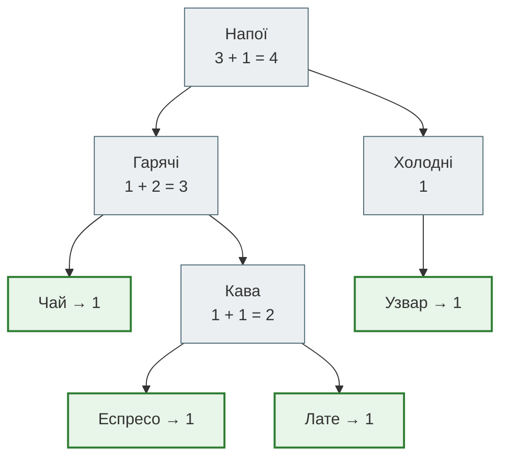
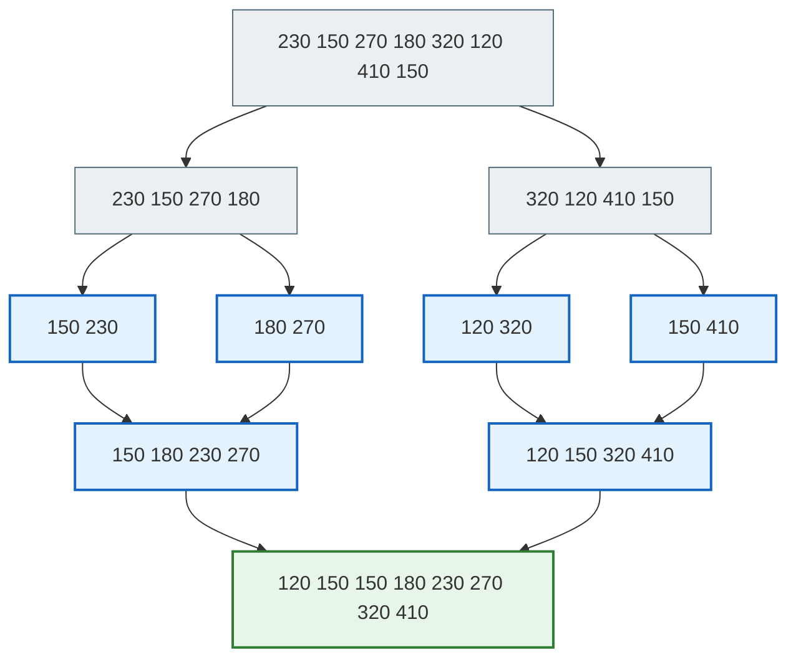
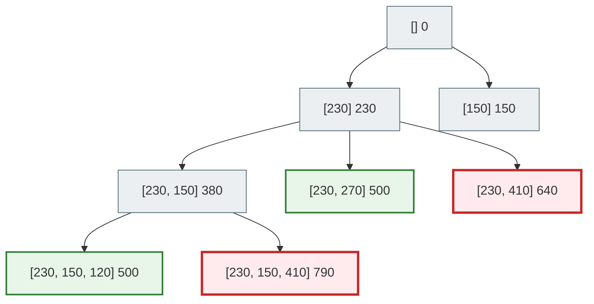
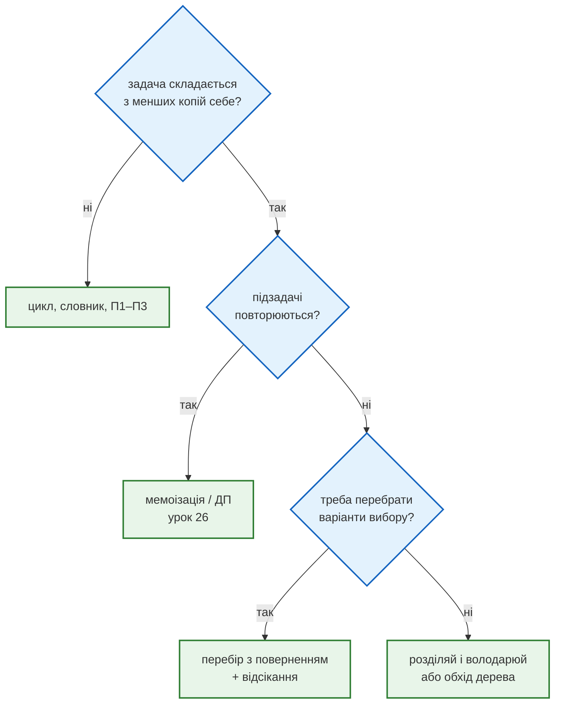

# Урок 22. Практикум П4. Рекурсія, «розділяй і володарюй», перебір з поверненням

Три практикуми модуля 1 навчили диспетчерську **оцінювати** рішення (П1), **обирати** стратегію за властивостями даних (П2) і **змінювати представлення** даних (П3). Сьогодні — четверте вміння: розбивати задачу на **менші копії самої себе**.

Три питання з роботи сервісу «Смачно + Таксі»:

1. Меню кафе вкладене: «Кухня» → «Перші страви» → «Борщ», а в «Напоях» є «Гарячі» й «Холодні», і глибину ніхто не обмежував. Скільки всього страв? Де лежить «Узвар»?
2. Доставки за день треба відсортувати за ціною. Сортування вставкою з П1 на тисячах доставок задуже повільне.
3. Ваучер з П3 тепер покриває не дві поїздки, а **скільки завгодно**. Які поїздки дають рівно 500 грн?

У всіх трьох задачах відповідь для цілого збирається з відповідей для частин. Це три обличчя **рекурсії**: функції, яка викликає сама себе.

**Що потрібно з попередніх уроків:** функції й `return` (урок 7), Big O і лічильники кроків (урок 8), бінарний пошук (урок 11), Two Sum (урок 16), `lru_cache` (урок 9).

**Після уроку ти зможеш:**

- писати рекурсивну функцію з базовим і рекурсивним випадком і пояснювати, як працює стек викликів;
- обходити вкладені структури — дерева — рекурсією;
- застосовувати «розділяй і володарюй»: сортування злиттям за `O(n log n)`;
- розв'язувати задачі перебору з поверненням (backtracking) і відсікати безнадійні гілки;
- обирати між рекурсією та циклом і розпізнавати, коли рекурсія повторює роботу.

**Задача розділу.** Звіт за вкладеним меню, сортування доставок і пошук комбінацій поїздок для ваучера. Повний код — у розділі [«Практика»](#practice).

**Ноутбук заняття:** [`note_lesson_22_recursion.ipynb`](https://github.com/NikoriakViktot/PY-Course-Victor-Nikoriak-22-09-2026/blob/main/module_2/lessons/lesson_22_practicum_recursion/note_lesson_22_recursion.ipynb) [](https://colab.research.google.com/github/NikoriakViktot/PY-Course-Victor-Nikoriak-22-09-2026/blob/main/module_2/lessons/lesson_22_practicum_recursion/note_lesson_22_recursion.ipynb)

## Пригадай

1. Скільки кроків робить бінарний пошук на 1 000 000 записів і чому?
2. Два вказівники з П2 шукали пару за `O(n)`, а Two Sum з П3 — на невідсортованих даних. А якщо чисел у сумі може бути скільки завгодно?
3. Що робить `@lru_cache` з уроку 9?

??? success "Відповіді"

    1. Близько 20: кожен крок відкидає половину, а 2²⁰ ≈ 1 000 000.
    2. Пари вже не досить: потрібні комбінації будь-якого розміру. Сьогодні — перебір з поверненням.
    3. Запам'ятовує результати функції для аргументів, з якими її вже викликали.

## Рекурсія: функція, що викликає сама себе

Меню кафе — вкладені словники. Лист — страва з ціною, вузол — категорія:

```python
MENU = {
    "Кухня": {
        "Перші страви": {"Борщ": 95, "Юшка": 85},
        "Основні": {"Вареники": 80, "Деруни": 75},
    },
    "Напої": {
        "Гарячі": {"Чай": 30, "Кава": {"Еспресо": 40, "Лате": 55}},
        "Холодні": {"Узвар": 35},
    },
    "Хліб": 10,
}
```

Скільки страв у меню? Цикл `for` не допоможе: невідомо, скільки рівнів вкладень. Зате відповідь легко сформулювати **через саму себе**: страв у категорії — це сума страв у кожній її частині. А частина — або страва (1), або знову категорія.

```python
def count_dishes(node):
    if not isinstance(node, dict):
        return 1
    return sum(count_dishes(child) for child in node.values())


print(count_dishes(MENU))
print(count_dishes(MENU["Напої"]))
print(count_dishes(95))
```

```text
9
4
1
```

Кожна рекурсивна функція має дві частини:

- **базовий випадок** — задача настільки мала, що відповідь відома одразу: страва — це 1. Тут рекурсія **зупиняється**;
- **рекурсивний випадок** — задачу зводимо до **менших** задач того самого виду й збираємо їхні відповіді: категорія — сума по частинах.

Без базового випадку функція викликала б себе вічно. Без «менших» задач — теж.

### Стек викликів

Кожен виклик функції — окремий **кадр** (frame) з власними локальними змінними. Кадри складаються в **стек**: новий кладеться зверху, а коли функція повертає результат, її кадр знімається. Для `count_dishes(MENU["Напої"])`:



Зелені — базові випадки: там стек перестає рости. Відповіді піднімаються знизу вгору: «Кава» = 2, «Гарячі» = 1 + 2 = 3, «Напої» = 3 + 1 = 4. Найглибше в усьому меню — п'ять кадрів один над одним: Меню → Напої → Гарячі → Кава → Лате.

### Рекурсія, що повертає шлях

Де в меню «Узвар»? Функція повертає шлях категорій або `None`, якщо страви немає:

```python
def find_path(node, dish, path=()):
    if not isinstance(node, dict):
        return None
    for name, child in node.items():
        if name == dish:
            return path + (name,)
        found = find_path(child, dish, path + (name,))
        if found:
            return found
    return None


print(find_path(MENU, "Узвар"))
print(find_path(MENU, "Лате"))
print(find_path(MENU, "Піца"))
```

```text
('Напої', 'Холодні', 'Узвар')
('Напої', 'Гарячі', 'Кава', 'Лате')
None
```

Шлях передається **параметром**: кожен рівень додає своє ім'я до кортежу й передає новий кортеж глибше. Кортеж, а не список, — щоб гілки не псували шлях одна одній (урок 7, змінювані значення за замовчуванням).

### Межа глибини

Кожен кадр займає пам'ять, тож Python обмежує глибину стеку:

```python
import sys


def countdown(n):
    if n == 0:
        return 0
    return countdown(n - 1)


print(sys.getrecursionlimit())
print(countdown(500))
try:
    countdown(100_000)
except RecursionError as error:
    print(type(error).__name__)
```

```text
1000
0
RecursionError
```

Меню, дерево папок, JSON з API — вкладеність там рідко сягає сотні рівнів, і рекурсія доречна. А «пройти список з 100 000 доставок» рекурсією — погана ідея: для лінійних даних є цикл.

## Розділяй і володарюй: сортування злиттям

В П1 ми бачили: алгоритм, що порівнює кожен елемент з кожним, росте як `O(n²)`. Сортування вставкою — саме таке. **Розділяй і володарюй** (divide and conquer) пропонує інше:

1. **розділити** список навпіл;
2. **відсортувати** кожну половину — рекурсивно, тим самим алгоритмом;
3. **злити** дві відсортовані половини в одну.

Базовий випадок — список з 0 чи 1 елемента вже відсортований. Уся робота — у злитті:

```python
def merge(left, right, counter):
    result = []
    i = j = 0
    while i < len(left) and j < len(right):
        counter[0] += 1
        if left[i] <= right[j]:
            result.append(left[i])
            i += 1
        else:
            result.append(right[j])
            j += 1
    return result + left[i:] + right[j:]


def merge_sort(items, counter):
    if len(items) <= 1:
        return list(items)
    middle = len(items) // 2
    left = merge_sort(items[:middle], counter)
    right = merge_sort(items[middle:], counter)
    return merge(left, right, counter)


fares = [230, 150, 270, 180, 320, 120, 410, 150]
counter = [0]
print(merge_sort(fares, counter), counter[0])
```

```text
[120, 150, 150, 180, 230, 270, 320, 410] 16
```

`counter` — список з одного числа, бо лічильник треба ділити між усіма рекурсивними викликами. Число всередині `merge` змінити не вийшло б: це локальна змінна (урок 18).



Верхня половина схеми — поділ, нижня — злиття. Рівнів поділу `log₂ n`: для 8 доставок — 3. На кожному рівні злиття разом переглядає всі n елементів. Разом — `n · log n`.

Дослід подвоєння з П1, порівняння з сортуванням вставкою:

```python
def insertion_sort(items, counter):
    result = list(items)
    for k in range(1, len(result)):
        j = k
        while j > 0:
            counter[0] += 1
            if result[j - 1] <= result[j]:
                break
            result[j - 1], result[j] = result[j], result[j - 1]
            j -= 1
    return result


for n in [1000, 2000, 4000]:
    data = list(range(n, 0, -1))
    slow, fast = [0], [0]
    insertion_sort(data, slow)
    merge_sort(data, fast)
    print(n, slow[0], fast[0])
```

```text
1000 499500 5044
2000 1999000 11088
4000 7998000 24176
```

Для списку у зворотному порядку (найгірший випадок вставки) подвоєння дає ×4 для вставки (`O(n²)`) і трохи більше ніж ×2 для злиття (`O(n log n)`). На 4000 доставок — 8 мільйонів порівнянь проти 24 тисяч. Вбудований `sorted()` — це Timsort, нащадок сортування злиттям: у житті сортуй ним, а `merge_sort` пишемо, щоб зрозуміти ідею.

!!! tip "Бінарний пошук — теж «розділяй і володарюй»"
    Бінарний пошук з П2 ділить задачу навпіл і йде лише в **одну** половину. Рекурсивно: `search(items, target)` → перевір середину → `search(ліва або права половина)`. Сортування злиттям іде в **обидві** половини й потім зливає. Обидва — `log n` рівнів поділу.


## Перебір з поверненням: ваучер на будь-яку кількість поїздок

У П3 ваучер покривав **дві** поїздки, і словник знаходив пару за один прохід. Тепер ваучер на 500 грн можна розділити між **скількома завгодно** поїздками зміни. Які набори поїздок дають рівно 500?

Кожна поїздка або входить у набір, або ні. **Перебір з поверненням** (backtracking) будує набір крок за кроком: «беру цю поїздку й дивлюся далі». Потім **повертається** на крок назад — прибирає поїздку — і пробує наступну. Параметр `start` каже, що далі розглядаємо лише поїздки після поточної: так кожен набір з'являється один раз.

```python
def voucher_sets(fares, target):
    found = []
    calls = [0]

    def explore(start, chosen, total):
        calls[0] += 1
        if total == target:
            found.append(list(chosen))
            return
        for i in range(start, len(fares)):
            chosen.append(fares[i])
            explore(i + 1, chosen, total + fares[i])
            chosen.pop()

    explore(0, [], 0)
    return found, calls[0]


trip_fares = [230, 150, 270, 180, 120, 410]
print(voucher_sets(trip_fares, 500))
```

```text
([[230, 150, 120], [230, 270]], 56)
```

Два набори: три поїздки на 230 + 150 + 120 і дві на 230 + 270. Друга — та сама пара, яку знайшов Two Sum у П3, а перша — те, чого пара знайти не могла.

- `chosen.append` — крок уперед: беремо поїздку;
- рекурсивний виклик досліджує все, що може піти після неї;
- `chosen.pop()` — **повернення**: прибираємо поїздку, щоб спробувати іншу на її місці.

Дерево рішень для перших кроків:



Червоні вузли — сума вже більша за 500. Але наша функція не знає, що далі буде лише гірше, і перебирає їхніх нащадків до кінця.

### Відсікання

Якщо відсортувати поїздки за зростанням, то, щойно чергова поїздка перевищує залишок, **усі наступні** перевищать теж. Ці гілки можна не досліджувати зовсім — це **відсікання** (pruning):

```python
def voucher_sets_pruned(fares, target):
    fares = sorted(fares)
    found = []
    calls = [0]

    def explore(start, chosen, total):
        calls[0] += 1
        if total == target:
            found.append(list(chosen))
            return
        for i in range(start, len(fares)):
            if total + fares[i] > target:
                break
            chosen.append(fares[i])
            explore(i + 1, chosen, total + fares[i])
            chosen.pop()

    explore(0, [], 0)
    return found, calls[0]


print(voucher_sets_pruned(trip_fares, 500))

big_shift = [230, 150, 270, 180, 120, 410, 95, 60, 310, 200, 140, 175]
print(voucher_sets(big_shift, 500)[1], voucher_sets_pruned(big_shift, 500)[1])
```

```text
([[120, 150, 230], [230, 270]], 19)
3454 150
```

На 6 поїздках — 19 викликів замість 56, на 12 — 150 замість 3454. Набори ті самі, лише записані за зростанням. Без відсікання перебір усіх підмножин n поїздок — до `2ⁿ` викликів: кожна поїздка «є» чи «немає». Відсікання не змінює найгіршого випадку, але на реальних даних прибирає більшість гілок.

!!! note "Коли перебір — єдиний вихід"
    Для пари словник з П3 дає `O(n)`. Для наборів будь-якого розміру швидкого загального алгоритму немає: задача про підмножину із заданою сумою (subset sum) — класична «важка» задача. Перебір з відсіканням — чесне рішення для десятків елементів. Для великих сум з цілими числами є динамічне програмування — тема практикуму П5 (урок 26).

## Коли рекурсія повторює роботу

Рекурсія природна, коли підзадачі **незалежні**: ліва й права половина злиття, різні категорії меню. Але якщо ті самі підзадачі трапляються знову і знову, рекурсія перераховує їх щоразу. Класичний приклад — числа Фібоначчі:

```python
calls = [0]


def fib(n):
    calls[0] += 1
    if n < 2:
        return n
    return fib(n - 1) + fib(n - 2)


print(fib(20), calls[0])
```

```text
6765 21891
```

21 891 виклик, щоб отримати 20-те число: `fib(18)` рахується двічі, `fib(17)` — тричі і так далі. `@lru_cache` з уроку 9 запам'ятовує вже пораховані результати:

```python
from functools import lru_cache


@lru_cache(maxsize=None)
def fib_memo(n):
    if n < 2:
        return n
    return fib_memo(n - 1) + fib_memo(n - 2)


print(fib_memo(20), fib_memo.cache_info().misses)
```

```text
6765 21
```

21 справжнє обчислення замість 21 891. Це **мемоізація** — перший крок до динамічного програмування (урок 26).

## Архітектура: рекурсія чи цикл { #architecture }

Кожну рекурсію можна переписати циклом з **явним стеком** — списком, у який кладемо «що ще треба обробити». Той самий підрахунок страв:

```python
def count_dishes_iterative(menu):
    stack = [menu]
    count = 0
    while stack:
        node = stack.pop()
        if isinstance(node, dict):
            stack.extend(node.values())
        else:
            count += 1
    return count


print(count_dishes_iterative(MENU))
```

```text
9
```

| | Рекурсія | Цикл з явним стеком |
|---|---|---|
| Читабельність | повторює визначення задачі: «сума по частинах» | стек і цикл видно явно, ідея — менше |
| Глибина | обмежена ~1000 кадрів (`RecursionError`) | обмежена лише пам'яттю |
| Повернення з кроку | природне: стек викликів сам пам'ятає, де ми | треба зберігати стан у стеку вручну |
| Коли | дерева, вкладені структури, «розділяй і володарюй», перебір | лінійні дані, дуже глибокі структури, продакшн-обхід великих дерев |

Як обрати техніку для задачі:



## Практика { #practice }

### Розібраний приклад: звіт за вкладеним меню

Три відповіді — три маленькі рекурсії одного шаблону «базовий випадок — страва, рекурсивний — категорія»:

```python linenums="1" hl_lines="2 3 4 8 9 10 14 15 16 17"
def total_price(node):
    if not isinstance(node, dict):
        return node
    return sum(total_price(child) for child in node.values())


def cheapest(node):
    if not isinstance(node, dict):
        return node
    return min(cheapest(child) for child in node.values())


def depth(node):
    if not isinstance(node, dict):
        return 0
    return 1 + max(depth(child) for child in node.values())


print("Страв:", count_dishes(MENU), "| усе меню:", total_price(MENU), "грн")
print("Найдешевша страва кухні:", cheapest(MENU["Кухня"]), "грн")
print("Рівнів вкладеності:", depth(MENU))
```

```text
Страв: 9 | усе меню: 505 грн
Найдешевша страва кухні: 75 грн
Рівнів вкладеності: 4
```

Що відбувається в ключових рядках:

- **рядки 2–4, 8–10, 14–16** — однаковий каркас. Базовий випадок повертає значення страви, рекурсивний — **згортку** відповідей частин: `sum`, `min`, `max`. Це reducer з уроку 7, застосований до дерева;
- **рядок 17** — глибина: категорія на один рівень глибша за свою найглибшу частину. Для меню це Меню → Напої → Гарячі → Кава → страва, 4 рівні категорій;
- жодна функція не знає, скільки рівнів у меню. Додай категорію «Десерти → Торти → Шоколадні» — код не зміниться.

### Зміни приклад: усі страви зі шляхами

Напиши **генератор** `dishes(node, path=())` (урок 10), який видає пари `(шлях, ціна)` для кожної страви меню:

```text
next(dishes(MENU))              →  (('Кухня', 'Перші страви', 'Борщ'), 95)
len(list(dishes(MENU)))         →  9
```

**Критерії перевірки:**

- генератор рекурсивний: для категорії — `yield from dishes(child, path + (name,))`;
- `count_dishes` можна переписати через нього одним рядком: `sum(1 for _ in dishes(node))`;
- страви «Кава» мають шлях з чотирьох частин: `('Напої', 'Гарячі', 'Кава', 'Лате')`.

??? tip "Підказка"
    Базовий випадок: якщо `node` — не словник, `yield path, node` і `return`. Інакше для кожної пари `name, child` — `yield from` рекурсивного виклику з довшим шляхом.

### Спробуй самостійно: обід на рівну суму

Клієнт хоче обід рівно на **150 грн** зі страв меню, кожна не більше одного разу. Напиши `lunch_sets(menu, budget)`, що повертає всі такі набори назв страв. Для 150 грн їх шість:

```text
['Борщ', 'Лате']
['Юшка', 'Чай', 'Узвар']
['Юшка', 'Лате', 'Хліб']
['Вареники', 'Чай', 'Еспресо']
['Деруни', 'Чай', 'Узвар', 'Хліб']
['Деруни', 'Еспресо', 'Узвар']
```

**Правила:**

- спершу розгорни меню у список `(назва, ціна)` генератором зі «Зміни приклад» — порядок страв як у меню;
- перебір з поверненням: `chosen.append` → рекурсія → `chosen.pop()`;
- відсікання: гілку, де сума вже більша за бюджет, не досліджувати;
- порахуй виклики з відсіканням і без: у скільки разів менше?

## Підсумок

| Поняття | Що запам'ятати |
|---|---|
| Рекурсія | функція викликає себе для меншої задачі; базовий випадок зупиняє |
| Стек викликів | кожен виклик — кадр; глибина ~1000 → `RecursionError` |
| Дерева | вкладені структури природно обходити рекурсією: «значення листа» + «згортка частин» |
| Розділяй і володарюй | поділити → розв'язати частини → зібрати; сортування злиттям `O(n log n)` |
| Перебір з поверненням | крок уперед → рекурсія → крок назад (`pop`); до `2ⁿ` варіантів |
| Відсікання | не досліджувати гілки, що не можуть дати відповідь; сортування допомагає |
| Мемоізація | підзадачі повторюються → `lru_cache`, далі ДП |
| Рекурсія чи цикл | дерева й перебір — рекурсія; лінійні й дуже глибокі дані — цикл і явний стек |

### Самоперевірка

1. Що буде з функцією без базового випадку? А якщо рекурсивний виклик не зменшує задачу?
2. Чому `find_path` передає шлях кортежем `path + (name,)`, а не списком з `append`?
3. Чому сортування злиттям — `O(n log n)`? Звідки `log n`?
4. Що в переборі з поверненням робить `chosen.pop()`? Що буде без нього?
5. Чому відсікання `break` правильне лише для **відсортованого** списку?
6. Чому `fib(20)` робить 21 891 виклик і що змінює `lru_cache`?
7. Меню з 5 рівнями вкладеності й список з 100 000 доставок: де рекурсія доречна, а де ні?

??? success "Відповіді"

    1. Функція викликатиме себе, доки не впаде з `RecursionError`. Те саме, якщо задача не зменшується: базового випадку не досягнемо.
    2. Кожен рівень створює **новий** кортеж, і гілки не діляться одним об'єктом. Спільний список, у який усі дописують, накопичував би імена з різних гілок.
    3. Поділ навпіл дає `log₂ n` рівнів, і на кожному рівні злиття разом проходить усі n елементів.
    4. Прибирає останню взяту поїздку, щоб на її місці спробувати наступну. Без нього `chosen` накопичував би поїздки з усіх гілок.
    5. `break` означає «наступні теж не влізуть». Це правда, лише якщо наступні не менші за поточну — тобто список відсортований за зростанням.
    6. Ті самі `fib(k)` обчислюються знову й знову. `lru_cache` рахує кожне `k` один раз, далі бере з пам'яті: 21 обчислення.
    7. Меню — дерево з невеликою глибиною: рекурсія природна. 100 000 доставок — лінійні дані: цикл; рекурсія впала б на тисячному рівні.

### Що далі

- Ноутбук заняття: [`note_lesson_22_recursion.ipynb`](https://github.com/NikoriakViktot/PY-Course-Victor-Nikoriak-22-09-2026/blob/main/module_2/lessons/lesson_22_practicum_recursion/note_lesson_22_recursion.ipynb) [](https://colab.research.google.com/github/NikoriakViktot/PY-Course-Victor-Nikoriak-22-09-2026/blob/main/module_2/lessons/lesson_22_practicum_recursion/note_lesson_22_recursion.ipynb) — меню, сортування і ваучер: прогнози, лічильники викликів, вправи з перевірками.
- Наступне заняття — урок 23 «`@property`, декоратори класів, dunder»: як зробити так, щоб `sorted(deliveries)` і `len(menu)` працювали для наших класів.
- Практикум П5 (урок 26): динамічне програмування — коли підзадачі повторюються.

## Документація і джерела

- Туторіал Python: [Defining Functions](https://docs.python.org/3/tutorial/controlflow.html#defining-functions); [`sys.getrecursionlimit`](https://docs.python.org/3/library/sys.html#sys.getrecursionlimit), [`RecursionError`](https://docs.python.org/3/library/exceptions.html#RecursionError), [`functools.lru_cache`](https://docs.python.org/3/library/functools.html#functools.lru_cache)
- [Sorting Techniques](https://docs.python.org/3/howto/sorting.html) — чому в житті `sorted()`
- Для охочих:
    - MIT 6.0001, [лекція 6 «Recursion and Dictionaries»](https://ocw.mit.edu/courses/6-0001-introduction-to-computer-science-and-programming-in-python-fall-2016/resources/lecture-6-recursion-and-dictionaries/);
    - Harvard CS50x, [тиждень 3 «Algorithms»](https://cs50.harvard.edu/x/weeks/3/) — рекурсія й сортування злиттям.
