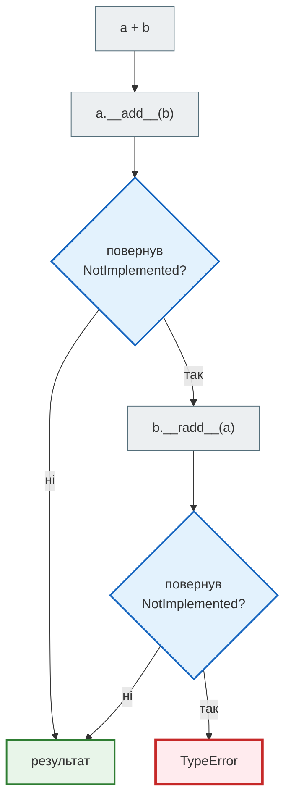
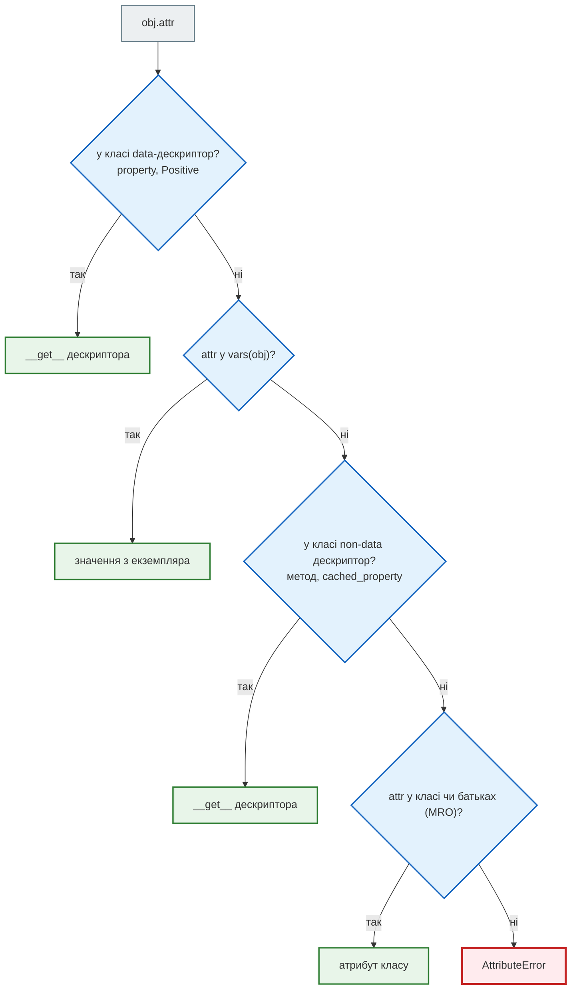
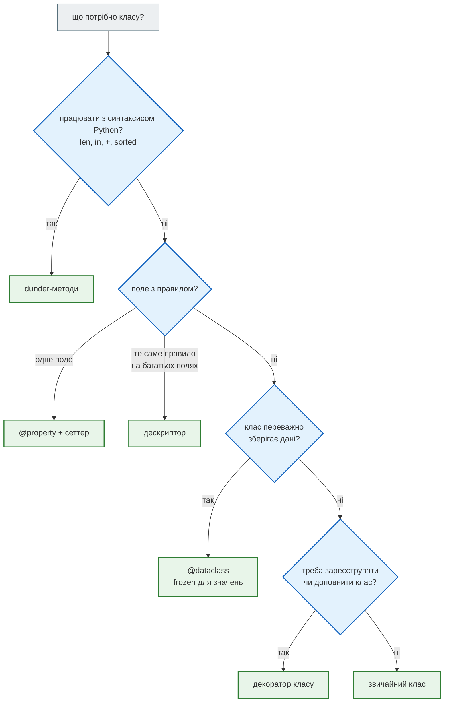
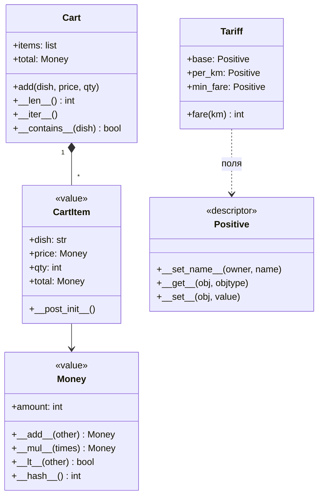

# Урок 23. @property, декоратори класів, dunder

Сервіс «Смачно + Таксі» отримав мобільний застосунок. Його розробник пише код поверх наших класів так, як пише звичайний Python: `sorted(deliveries)`, `len(cart)`, `"Борщ" in cart`, `price + fee`. І перший же рядок падає:

```python
class Delivery:
    def __init__(self, order_id, minutes):
        self.order_id = order_id
        self.minutes = minutes


deliveries = [Delivery(1, 35), Delivery(2, 20), Delivery(3, 50)]
try:
    sorted(deliveries)
except TypeError as error:
    print(error)
print(Delivery(1, 35) == Delivery(1, 35))
```

```text
'<' not supported between instances of 'Delivery' and 'Delivery'
False
```

Список чисел Python сортує, а список доставок — ні: він не знає, що означає «одна доставка менша за іншу». А дві однакові доставки для нього різні, бо `==` за замовчуванням порівнює **ідентичність** — чи це той самий об'єкт.

Є ще дві проблеми. Тариф таксі має три поля, і кожне має бути додатним. Три пари `@property` із сеттерами — це тричі та сама перевірка. А класи, які просто зберігають дані, обростають однаковими `__init__`, `__repr__` і `__eq__`.

Сьогодні вчимо класи **говорити мовою Python**: dunder-методи підключають об'єкт до вбудованого синтаксису, дескриптори дають одну перевірку на багато полів, а декоратори класів пишуть шаблонний код за нас.

**Що потрібно з попередніх уроків:** декоратори функцій (урок 9), хешування (урок 16), функції як об'єкти й `key=` (урок 18), класи й `__repr__` (урок 19), качина типізація (урок 20), `@property` і сеттер (урок 21).

**Після уроку ти зможеш:**

- пояснювати, який dunder-метод викликає Python для `len`, `in`, `for`, `+`, `<`, `==`, `hash`;
- робити власні класи-контейнери й об'єкти-значення (гроші), що працюють з `sorted`, `sum`, `set`;
- пояснювати, чому `__eq__` без `__hash__` робить об'єкт непридатним для множини;
- писати обчислювані властивості й уникати рекурсії в сеттері;
- писати дескриптор, який перевіряє багато полів одним класом;
- застосовувати декоратори класів: власні, `@total_ordering`, `@dataclass`;
- відрізняти об'єкт-значення від сутності й обирати інструмент під задачу.

**Задача розділу.** Кошик замовлення з грошима як об'єктом-значенням: `len(cart)`, `"Узвар" in cart`, `cart.total` і позиції, які неможливо створити з нульовою кількістю. Повний код — у розділі [«Практика»](#practice).

**Ноутбук заняття:** [`note_lesson_23_property_dunder.ipynb`](https://github.com/NikoriakViktot/PY-Course-Victor-Nikoriak-22-09-2026/blob/main/module_2/lessons/lesson_23_property_decorators_dunder/note_lesson_23_property_dunder.ipynb) [](https://colab.research.google.com/github/NikoriakViktot/PY-Course-Victor-Nikoriak-22-09-2026/blob/main/module_2/lessons/lesson_23_property_decorators_dunder/note_lesson_23_property_dunder.ipynb)

## Пригадай

1. Що приймає і що повертає декоратор функції з уроку 9?
2. Яке правило про хеш і рівність ключів словника ми бачили в уроці 16?
3. Що робить `@property` без сеттера?
4. Чому функцію з `fare()` можна викликати для будь-якої доставки, не знаючи її класу (урок 20)?

??? success "Відповіді"

    1. Приймає функцію й повертає функцію — зазвичай обгортку.
    2. Рівні ключі мусять мати однаковий хеш, інакше словник шукатиме ключ не в тій комірці.
    3. Дає читати метод як атрибут; запис падає з `AttributeError`.
    4. Качина типізація: важливо, що об'єкт **вміє**, а не який у нього клас.

## Dunder-методи: як Python розмовляє з об'єктом

Коли Python бачить `len(cart)`, він не шукає функцію `len` усередині кошика. Він викликає **спеціальний метод** класу: `type(cart).__len__(cart)`. Таких методів — із двома підкресленнями з обох боків, **dunder** (double underscore) — десятки. Разом вони утворюють **протоколи**: реалізував потрібні методи — і твій об'єкт працює з вбудованим синтаксисом, як список чи число.

| Вираз | Що викликає Python | Протокол |
|---|---|---|
| `len(x)` | `x.__len__()` | розмір |
| `item in x` | `x.__contains__(item)` | належність |
| `for item in x` | `x.__iter__()` | ітерація |
| `x[key]` | `x.__getitem__(key)` | доступ за ключем |
| `bool(x)`, `if x:` | `x.__bool__()`, інакше `x.__len__()` | істинність |
| `a + b` | `a.__add__(b)`, інакше `b.__radd__(a)` | арифметика |
| `a == b`, `a < b` | `a.__eq__(b)`, `a.__lt__(b)` | порівняння |
| `hash(x)` | `x.__hash__()` | хешування |
| `repr(x)`, `str(x)` | `x.__repr__()`, `x.__str__()` | подання |
| `x(arg)` | `x.__call__(arg)` | виклик |

Це качина типізація з уроку 20, доведена до кінця: `len` не питає, чи ти список, — лише чи вмієш ти `__len__`.

### Кошик як контейнер

```python
class Cart:
    def __init__(self):
        self._items = {}

    def add(self, dish, qty=1):
        self._items[dish] = self._items.get(dish, 0) + qty

    def __len__(self):
        return sum(self._items.values())

    def __contains__(self, dish):
        return dish in self._items

    def __iter__(self):
        return iter(self._items.items())

    def __getitem__(self, dish):
        return self._items[dish]

    def __repr__(self):
        return f"Cart({self._items})"


cart = Cart()
cart.add("Борщ", 2)
cart.add("Узвар")
print(len(cart), "Борщ" in cart, cart["Борщ"])
for dish, qty in cart:
    print(dish, qty)
```

```text
3 True 2
Борщ 2
Узвар 1
```

`_items` лишився внутрішнім (урок 21), а зовнішній код користується кошиком як звичайною колекцією. `len` рахує порції, а не рядки: це наше рішення, і його видно в одному методі.

Методу `__bool__` ми не писали. Як гадаєш, що надрукує цей код?

```python
print(bool(Cart()), bool(cart))
```

```text
False True
```

Без `__bool__` Python бере `__len__`: нульова довжина — хибність. Тому `if cart:` читається природно — «якщо в кошику щось є».

### Гроші: об'єкт-значення з арифметикою

Ціни як голі числа легко переплутати: хвилини, кілометри й гривні — усе `int`. Клас `Money` робить одиницю явною і дозволяє складати лише гроші з грошима.

```python
class Money:
    def __init__(self, amount):
        self.amount = amount

    def __add__(self, other):
        if not isinstance(other, Money):
            return NotImplemented
        return Money(self.amount + other.amount)

    def __eq__(self, other):
        if not isinstance(other, Money):
            return NotImplemented
        return self.amount == other.amount

    def __repr__(self):
        return f"Money({self.amount})"

    def __str__(self):
        return f"{self.amount} грн"


bill = Money(95) + Money(60)
print(bill, repr(bill), bill == Money(155))
try:
    Money(95) + 60
except TypeError as error:
    print(error)
```

```text
155 грн Money(155) True
unsupported operand type(s) for +: 'Money' and 'int'
```

`__repr__` — для розробника (однозначно, як створити об'єкт), `__str__` — для людини; `print` бере `__str__`. А `NotImplemented` — не помилка, а сигнал «я не вмію з цим типом». Python тоді дає шанс іншому операнду і лише потім кидає `TypeError`:



Звідси пастка з `sum`: він починає рахувати з `0`, тобто перший крок — `0 + Money(95)`. Число не вміє додавати гроші, а `__radd__` у нас немає:

```python
prices = [Money(95), Money(60), Money(40)]
try:
    sum(prices)
except TypeError as error:
    print(error)
print(sum(prices, Money(0)))
```

```text
unsupported operand type(s) for +: 'int' and 'Money'
195 грн
```

Два виходи: передати `sum` стартове значення `Money(0)` або навчити гроші «правого» додавання:

```python
class Money(Money):
    def __radd__(self, other):
        if other == 0:
            return self
        return NotImplemented


print(sum([Money(95), Money(60), Money(40)]))
```

```text
195 грн
```

!!! note "`class Money(Money)`"
    Як і в уроці 21, нарощуємо клас частинами: кожен новий `Money` наслідує попередній. У справжньому проєкті всі методи живуть в одному класі.

### `__eq__` і `__hash__`: пара, яку не розривають

Спробуймо покласти гроші в множину:

```python
try:
    {Money(95), Money(95)}
except TypeError as error:
    print(error)
print(Money.__hash__)
```

```text
unhashable type: 'Money'
None
```

Щойно клас визначає `__eq__`, Python **прибирає** успадкований `__hash__`. Причина — правило з уроку 16: рівні об'єкти мусять мати однаковий хеш. Стандартний хеш рахується з ідентичності об'єкта, тож два рівні `Money(95)` отримали б різні хеші, і множина вважала б їх різними. Python волів відмовити, ніж тихо помилятися. Якщо об'єкт має бути ключем, хеш рахують із тих самих полів, що й рівність:

```python
class Money(Money):
    def __hash__(self):
        return hash(self.amount)


print(len({Money(95), Money(95), Money(60)}), Money(95) in {Money(95)})
```

```text
2 True
```

Але хеш від **змінюваного** поля — міна. Об'єкт лежить у комірці множини, що відповідає старому хешу:

```python
wallet = {Money(95)}
coin = next(iter(wallet))
coin.amount = 100
print(Money(100) in wallet, coin in wallet)
```

```text
False False
```

Монета в множині є, але знайти її неможливо ні за старим, ні за новим значенням. Висновок: хешованим має бути лише **незмінний** об'єкт. Як зробити `Money` незмінним одним рядком — у розділі про `@dataclass`.

### Порівняння і сортування

Для `sorted` досить одного методу — `__lt__`:

```python
class Delivery:
    def __init__(self, order_id, minutes):
        self.order_id = order_id
        self.minutes = minutes

    def __lt__(self, other):
        return self.minutes < other.minutes

    def __repr__(self):
        return f"Delivery(№{self.order_id}, {self.minutes} хв)"


deliveries = [Delivery(1, 35), Delivery(2, 20), Delivery(3, 50)]
print(sorted(deliveries))
print(max(deliveries))
try:
    Delivery(1, 35) <= Delivery(2, 20)
except TypeError as error:
    print(error)
```

```text
[Delivery(№2, 20 хв), Delivery(№1, 35 хв), Delivery(№3, 50 хв)]
Delivery(№3, 50 хв)
'<=' not supported between instances of 'Delivery' and 'Delivery'
```

`max` порівнює через `>`, і Python сам перевернув його на `b < a`. А для `<=` дзеркальної пари з `__lt__` немає — треба або дописати ще методи, або скористатися `@total_ordering` (нижче).

Але спершу архітектурне питання: яка доставка «менша»? Швидша? Дешевша? Раніша за номером? Сьогодні звіт сортує за часом, завтра — за ціною. **Природного** порядку в доставок немає, тому надійніше передати порядок явно, як в уроці 18:

```python
print(sorted(deliveries, key=lambda delivery: delivery.order_id, reverse=True))
```

```text
[Delivery(№3, 50 хв), Delivery(№2, 20 хв), Delivery(№1, 35 хв)]
```

!!! tip "Коли писати `__lt__`"
    Лише коли порядок один і очевидний: гроші, час, версії. Якщо сортувати можна по-різному — `key=`.

### `__call__`: об'єкт, що поводиться як функція

У вечірні години тариф множиться на коефіцієнт. Коефіцієнт — це налаштування, а застосувати його треба як функцію:

```python
class Surge:
    def __init__(self, factor):
        self.factor = factor

    def __call__(self, fare):
        return round(fare * self.factor)


evening = Surge(1.5)
print(evening(120), callable(evening))
print(list(map(evening, [100, 80])))
```

```text
180 True
[150, 120]
```

`evening` можна передати туди, де чекають функцію, — у `map`, `sorted(key=…)`, у стратегію з уроку 18. Замикання (урок 18) робить те саме; клас із `__call__` зручніший, коли налаштувань кілька або їх треба показати в `repr`.

## @property докладніше

В уроці 21 `@property` захищав запис. Друге його призначення — **обчислювані атрибути**: значення, яке не зберігається, а рахується щоразу, коли його читають.

```python
PRICES = {"Борщ": 95, "Вареники": 110, "Узвар": 40}


class Cart(Cart):
    @property
    def total(self):
        return sum(PRICES[dish] * qty for dish, qty in self)


cart = Cart()
cart.add("Борщ", 2)
cart.add("Узвар")
print(cart.total)
cart.add("Вареники")
print(cart.total)
```

```text
230
340
```

Якби `add` оновлював поле `self.total`, кожен новий метод (прибрати страву, змінити кількість) мусив би не забути його оновити. Обчислювана властивість **не може застаріти**: її джерело правди — лише `_items`. І зверни увагу: `total` перебирає `self`, тобто користується нашим же `__iter__`.

### Пастка: сеттер, що викликає сам себе

```python
class Courier:
    def __init__(self, name, rating):
        self.name = name
        self.rating = rating

    @property
    def rating(self):
        return self.rating

    @rating.setter
    def rating(self, value):
        if not 1 <= value <= 5:
            raise ValueError("рейтинг має бути від 1 до 5")
        self.rating = value


try:
    Courier("Олег", 4.8)
except RecursionError as error:
    print(type(error).__name__)
```

```text
RecursionError
```

`self.rating = value` у сеттері — це знову присвоєння властивості, тобто знову виклик сеттера, і так до переповнення стеку (урок 22). Значення зберігають в **іншому** імені — `self._rating`. А ось у `__init__` писати саме `self.rating = rating` правильно: так перевірка спрацює і при створенні об'єкта.

### `cached_property`: порахувати один раз

Довжина маршруту рахується довго, а маршрут після створення не змінюється. `functools.cached_property` обчислює значення при першому читанні й кладе результат в атрибут екземпляра:

```python
from functools import cached_property


class Route:
    def __init__(self, stops):
        self.stops = stops

    @cached_property
    def length(self):
        print("рахую маршрут…")
        return sum(abs(b - a) for a, b in zip(self.stops, self.stops[1:]))


route = Route([0, 4, 1, 7])
print(route.length)
print(route.length)
```

```text
рахую маршрут…
13
13
```

Ціна — застарілість: якщо змінити `route.stops`, `length` лишиться старим. Тому `cached_property` — лише для даних, що не змінюються.

## Дескриптори: одна перевірка на багато полів

Тариф таксі: подача, ціна кілометра і мінімальна вартість — усі мають бути більшими за нуль. Через `@property` це три геттери й три сеттери з однаковим `if value <= 0` — близько 25 рядків повторів. Повтор — сигнал винести правило в окремий об'єкт. Такий об'єкт — **дескриптор**: клас із методами `__get__` і `__set__`, екземпляр якого лежить в атрибуті **класу**.

```python
class Positive:
    def __set_name__(self, owner, name):
        self.name = "_" + name

    def __get__(self, obj, objtype=None):
        if obj is None:
            return self
        return getattr(obj, self.name)

    def __set__(self, obj, value):
        if value <= 0:
            raise ValueError(f"{self.name[1:]} має бути більшим за 0, а маємо {value}")
        setattr(obj, self.name, value)


class Tariff:
    base = Positive()
    per_km = Positive()
    min_fare = Positive()

    def __init__(self, base, per_km, min_fare):
        self.base = base
        self.per_km = per_km
        self.min_fare = min_fare

    def fare(self, km):
        return max(self.min_fare, self.base + self.per_km * km)


day = Tariff(40, 12, 80)
print(day.fare(2), day.fare(10))
try:
    day.per_km = -5
except ValueError as error:
    print(error)
print(vars(day))
```

```text
80 160
per_km має бути більшим за 0, а маємо -5
{'_base': 40, '_per_km': 12, '_min_fare': 80}
```

Що відбувається:

1. Коли Python створює клас `Tariff`, він викликає `__set_name__` для кожного дескриптора — так `Positive()` дізнається, що його звуть `per_km`, і зберігатиме значення в `_per_km`.
2. `day.per_km = -5` — Python бачить у **класі** об'єкт із `__set__` і замість запису в екземпляр викликає `Positive.__set__(дескриптор, day, -5)`.
3. `day.per_km` — так само викликається `__get__`. Умова `obj is None` — для звернення через клас, `Tariff.per_km`: тоді повертаємо сам дескриптор.

Один дескриптор — три поля, і правило живе в одному місці. Новий тариф чи новий клас з додатними полями — ще один рядок `поле = Positive()`.

### Порядок пошуку атрибута

`@property` — теж дескриптор, просто вбудований:

```python
print(type(vars(Tariff)["base"]).__name__, hasattr(property, "__set__"))
```

```text
Positive True
```

Дескриптори бувають двох видів: **data** (є `__set__`: `property`, `Positive`) і **non-data** (лише `__get__`: звичайні методи, `cached_property`). Від виду залежить, хто виграє, коли в класі є дескриптор, а в екземплярі — однойменний атрибут:



Звідси два факти, які ми вже бачили. `property` стоїть **перед** словником екземпляра — тому обійти сеттер записом в атрибут не можна. А `cached_property` стоїть **після** — тому, поклавши результат у `vars(route)`, він більше не викликається: наступне читання знаходить значення в екземплярі.

## Декоратори класів

Декоратор функції (урок 9) приймає функцію й повертає функцію. **Декоратор класу** приймає клас і повертає клас — той самий, доповнений, або новий. Найпростіше застосування — реєстр: кожен клас сам записується в довідник, щойно його оголосили.

```python
PAYMENTS = {}


def payment(code):
    def register(cls):
        PAYMENTS[code] = cls
        return cls
    return register


@payment("card")
class CardPayment:
    def pay(self, amount):
        return f"картка: {amount} грн"


@payment("cash")
class CashPayment:
    def pay(self, amount):
        return f"готівка кур'єру: {amount} грн"


print(PAYMENTS)
print(PAYMENTS["cash"]().pay(340))
```

```text
{'card': <class '__main__.CardPayment'>, 'cash': <class '__main__.CashPayment'>}
готівка кур'єру: 340 грн
```

Застосунок обирає спосіб оплати за кодом із запиту: `PAYMENTS[code]().pay(amount)`. Новий спосіб — новий клас із декоратором; жоден `if/elif` правити не треба. Це поліморфізм з уроку 20 плюс автоматична реєстрація.

### `@total_ordering`: решту порівнянь допише Python

`functools.total_ordering` — декоратор класу зі стандартної бібліотеки. Даєш йому `__eq__` і один із `__lt__`, `__le__`, `__gt__`, `__ge__` — він дописує решту:

```python
from functools import total_ordering


@total_ordering
class Money(Money):
    def __lt__(self, other):
        if not isinstance(other, Money):
            return NotImplemented
        return self.amount < other.amount


print(Money(95) > Money(60), Money(60) <= Money(60), max([Money(95), Money(40)]))
```

```text
True True 95 грн
```

Для грошей порядок природний — це якраз той випадок, коли порівняння мають жити в класі.

### `@dataclass`: клас-дані без шаблонного коду

`Money` уже має `__init__`, `__repr__`, `__eq__`, `__hash__`, `__lt__` — і всі вони механічні: беруть поля й роблять з ними очевидне. `dataclasses.dataclass` читає **анотації полів** і генерує ці методи сам:

```python
from dataclasses import dataclass


@dataclass(frozen=True, order=True)
class Money:
    amount: int

    def __add__(self, other):
        if not isinstance(other, Money):
            return NotImplemented
        return Money(self.amount + other.amount)

    def __str__(self):
        return f"{self.amount} грн"


a = Money(95)
print(repr(a), a == Money(95), a < Money(100), len({a, Money(95)}))
print([name for name in ("__init__", "__repr__", "__eq__", "__lt__", "__hash__") if name in vars(Money)])
try:
    a.amount = 100
except AttributeError as error:
    print(type(error).__name__)
```

```text
Money(amount=95) True True 1
['__init__', '__repr__', '__eq__', '__lt__', '__hash__']
FrozenInstanceError
```

- `@dataclass` згенерував `__init__`, `__repr__`, `__eq__` з полів;
- `order=True` — порівняння `<`, `<=`, `>`, `>=` (порівнюються кортежі полів);
- `frozen=True` — присвоєння полю падає з `FrozenInstanceError` (нащадок `AttributeError`), а раз об'єкт незмінний, генерується й `__hash__`. Пастка з монетою, що «загубилася» в множині, тепер неможлива.

Свої методи (`__add__`, `__str__`) пишемо як завжди: `@dataclass` не перезаписує `__init__`, `__repr__` чи `__eq__`, якщо вони вже є в класі. Виняток — порівняння: з `order=True` власний `__lt__` дає `TypeError`, тож обирай щось одне.

Перевірка полів у датакласі — у методі `__post_init__`, який викликається одразу після згенерованого `__init__`. Його ми використаємо в практиці.

## Архітектура: значення, сутності й вибір інструменту { #architecture }

### Об'єкт-значення і сутність

У сервісі є два різні види об'єктів, і dunder-методи для них різні.

| | Об'єкт-значення | Сутність |
|---|---|---|
| Приклади | `Money`, `CartItem`, координати | `Order`, `Courier`, `Delivery` |
| Що таке «рівні» | однакові поля: `Money(95) == Money(95)` | той самий об'єкт або той самий `id`: два замовлення з однаковими стравами — різні замовлення |
| Змінюваність | незмінний: «змінити» — створити новий | змінюється з часом: статус, рейтинг |
| Хеш | з полів; можна в `set` і ключем `dict` | за замовчуванням (ідентичність) або за незмінним `id` |
| Інструмент | `@dataclass(frozen=True)` | звичайний клас, `@property`, методи-двері (урок 21) |

Помилка, якої варто уникати: `@dataclass` без `frozen` для сутності з хешем за змінюваними полями — це та сама «загублена монета», лише з замовленням.

### Який інструмент обрати



Інструменти поєднуються: у практиці нижче `@dataclass` дає поля, `@property` — обчислювану суму, а dunder-методи — `len` і `in`.

### Схема класів кошика



### Компроміси: як описати клас-дані

| Варіант | Плюси | Мінуси | Коли |
|---|---|---|---|
| `dict` | нуль коду | опечатка в ключі — тихий баг; немає методів | тимчасові дані, JSON на вході (урок 14) |
| `NamedTuple` | незмінний, розпаковується як кортеж | поля лише за позицією/ім'ям, мало гнучкості | прості записи, рядки з файлу |
| `@dataclass` | методи з анотацій, `frozen`, `order`, `__post_init__` | перевірки — вручну в `__post_init__` | більшість класів-даних сервісу |
| ручний клас | повний контроль | шаблонний код, легко забути `__hash__` | сутності з поведінкою й правилами |

## Практика { #practice }

### Розібраний приклад: кошик із грошима

```python linenums="1" hl_lines="4 20 26 27 28 30 37 42 45 48 51 53"
from dataclasses import dataclass, field


@dataclass(frozen=True, order=True)
class Money:
    amount: int

    def __add__(self, other):
        if not isinstance(other, Money):
            return NotImplemented
        return Money(self.amount + other.amount)

    def __mul__(self, times):
        return Money(self.amount * times)

    def __str__(self):
        return f"{self.amount} грн"


@dataclass(frozen=True)
class CartItem:
    dish: str
    price: Money
    qty: int = 1

    def __post_init__(self):
        if self.qty < 1:
            raise ValueError(f"кількість має бути від 1, а маємо {self.qty}")

    @property
    def total(self):
        return self.price * self.qty


@dataclass
class Cart:
    items: list = field(default_factory=list)

    def add(self, dish, price, qty=1):
        self.items.append(CartItem(dish, Money(price), qty))

    def __len__(self):
        return sum(item.qty for item in self.items)

    def __iter__(self):
        return iter(self.items)

    def __contains__(self, dish):
        return any(item.dish == dish for item in self.items)

    @property
    def total(self):
        return sum((item.total for item in self.items), Money(0))


cart = Cart()
cart.add("Борщ", 95, 2)
cart.add("Узвар", 40)
print(len(cart), "Узвар" in cart, cart.total)
print(max(cart, key=lambda item: item.total))
try:
    cart.add("Вареники", 110, 0)
except ValueError as error:
    print(error)
print(len(cart))
```

```text
3 True 230 грн
CartItem(dish='Борщ', price=Money(amount=95), qty=2)
кількість має бути від 1, а маємо 0
3
```

Що тут працює:

- `Money` і `CartItem` — об'єкти-значення: `frozen=True`, рівність за полями, хеш.
- `__post_init__` перевіряє кількість — позицію з `qty=0` неможливо навіть створити, тому вона не потрапила в кошик, і `len(cart)` лишився 3.
- `__mul__` дає `price * qty` → `Money`; `sum(…, Money(0))` стартує з грошей, тож `__radd__` не потрібен.
- `field(default_factory=list)` — кожен кошик отримує **свій** список (чому не `items: list = []` — у «Знайди помилку»).
- `max(cart, key=…)` працює, бо є `__iter__`; `print` показує `repr`, згенерований датакласом.

!!! note "Поля датакласу публічні"
    `cart.items.append(…)` обійде перевірки `add`. Для кошика це прийнятно; де потрібен сильний інваріант — ховаємо стан за `_` і методами, як в уроці 21.

### Зміни приклад: об'єднати кошики

Сім'я замовляє з двох телефонів. Додай `Cart.__add__`, щоб `family = cart_mom + cart_son` повертав **новий** кошик з усіма позиціями, не змінюючи жодного з вихідних.

??? tip "Підказка"

    ```python
    def __add__(self, other):
        if not isinstance(other, Cart):
            return NotImplemented
        return Cart(self.items + other.items)
    ```

    `self.items + other.items` створює новий список. А позиції `CartItem` незмінні, тож ділити їх між кошиками безпечно.

### Спробуй самостійно: рейтинг кур'єра

Напиши дескриптор `Range(low, high)`, який пропускає лише значення з проміжку `[low, high]`, і клас `Courier` з полями `rating = Range(1, 5)` та `experience = Range(0, 50)` (роки). Перевір:

- `Courier("Олег", 4.8, 3).rating == 4.8`;
- `Courier("Ірина", 7, 2)` падає з `ValueError`;
- у `vars(courier)` значення лежать під `_rating` і `_experience`;
- список кур'єрів сортується за рейтингом через `key=`.

??? tip "Підказка"

    Відмінність від `Positive` — лише `__init__(self, low, high)`, що запам'ятовує межі, і умова в `__set__`: `if not self.low <= value <= self.high`.

### Знайди помилку

```python
# 1
class Money:
    def __init__(self, amount):
        self.amount = amount

    def __add__(self, other):
        self.amount += other.amount
        return self

# 2
from dataclasses import dataclass

@dataclass
class Order:
    order_id: int
    dishes: list = []

# 3
class Money:
    def __init__(self, amount):
        self.amount = amount

    def __eq__(self, other):
        return self.amount == other.amount
```

??? success "Відповіді"

    1. `__add__` змінює лівий операнд: після `total = price + fee` змінилася і сама `price`. Оператор має повертати **новий** об'єкт: `return Money(self.amount + other.amount)`.
    2. Датаклас узагалі не створиться: `ValueError: mutable default <class 'list'> for field dishes is not allowed: use default_factory`. Спільний список за замовчуванням — та сама пастка, що й змінюваний аргумент за замовчуванням в уроці 7. Правильно: `dishes: list = field(default_factory=list)`.
    3. `Money(5) == 5` падає з `AttributeError`, бо в числа немає `amount`. Треба `if not isinstance(other, Money): return NotImplemented` — тоді Python чесно поверне `False`. І ще: після `__eq__` зник `__hash__`, тож такі гроші не покладеш у множину.

## Підсумок

| Поняття | Що запам'ятати |
|---|---|
| Dunder-методи | Python викликає їх сам: `len` → `__len__`, `in` → `__contains__`, `+` → `__add__` |
| `NotImplemented` | «не вмію з цим типом» — Python спробує інший операнд, потім `TypeError` |
| `__radd__` | потрібен, коли лівий операнд не наш: `0 + Money(…)` у `sum` |
| `__eq__` + `__hash__` | `__eq__` прибирає `__hash__`; хеш — з тих самих полів і лише для незмінних об'єктів |
| `__lt__` чи `key=` | `__lt__` — коли порядок один і природний; інакше `key=` |
| `__call__` | об'єкт із налаштуваннями, що викликається як функція |
| Обчислювана властивість | рахується при читанні, не може застаріти |
| Сеттер | зберігає в `_name`, інакше рекурсія |
| Дескриптор | `__set_name__`, `__get__`, `__set__`; одне правило — багато полів |
| Декоратор класу | приймає клас, повертає клас: реєстр, `@total_ordering`, `@dataclass` |
| `@dataclass` | `__init__`, `__repr__`, `__eq__`; `order`, `frozen`, `__post_init__`, `default_factory` |
| Значення і сутність | значення — рівність за полями, незмінне; сутність — ідентичність, змінюється |

### Самоперевірка

1. Що викликає Python для `if cart:`, якщо в класі немає `__bool__`?
2. Навіщо `__add__` повертає `NotImplemented`, а не кидає `TypeError` сам?
3. Чому `sum([Money(95), Money(60)])` без `__radd__` падає, а `Money(95) + Money(60)` — ні?
4. Чому після визначення `__eq__` об'єкт не можна покласти в множину? Чому хеш від змінюваного поля небезпечний?
5. Чому `self.rating = value` у сеттері `rating` призводить до `RecursionError`?
6. Чому `cached_property` спрацьовує лише один раз, а `property` — щоразу?
7. Що робить `__set_name__` і коли його викликають?
8. Чим `Money` має відрізнятися від `Order` щодо `__eq__`, `__hash__` і змінюваності?

??? success "Відповіді"

    1. `__len__`: нульова довжина — хибність.
    2. Щоб Python спробував другий операнд (`__radd__`). Якщо і той не вміє — `TypeError` кине сам Python.
    3. `sum` починає з `0`, тобто рахує `0 + Money(95)`: `int` не вміє додавати гроші, а `Money.__radd__` немає. У другому виразі лівий операнд — `Money`, і його `__add__` працює.
    4. Python прибирає `__hash__`, щоб рівні об'єкти не мали різних хешів. Якщо поле, з якого рахується хеш, змінити, об'єкт лишиться в комірці старого хешу, і множина його не знайде.
    5. Присвоєння властивості викликає сеттер, який знову присвоює властивості, — нескінченна рекурсія. Значення треба зберігати в `self._rating`.
    6. `property` — data-дескриптор, він перед словником екземпляра. `cached_property` — non-data, після словника: записавши результат в екземпляр, він більше не викликається.
    7. Повідомляє дескриптору ім'я атрибута, в який його поклали. Python викликає його один раз — під час створення класу.
    8. `Money` — значення: рівність за сумою, незмінний (`frozen`), хеш з полів. `Order` — сутність: рівність за ідентичністю чи `id`, змінюється (статус), не хешується за змінюваними полями.

### Що далі

- Ноутбук заняття: [`note_lesson_23_property_dunder.ipynb`](https://github.com/NikoriakViktot/PY-Course-Victor-Nikoriak-22-09-2026/blob/main/module_2/lessons/lesson_23_property_decorators_dunder/note_lesson_23_property_dunder.ipynb) [](https://colab.research.google.com/github/NikoriakViktot/PY-Course-Victor-Nikoriak-22-09-2026/blob/main/module_2/lessons/lesson_23_property_decorators_dunder/note_lesson_23_property_dunder.ipynb) — прогнози й вправи з перевірками: кошик, гроші, дескриптор `Range`, реєстр способів оплати.
- Практикум на реальних даних: [`lab_lesson_23_cars_descriptors.ipynb`](https://github.com/NikoriakViktot/PY-Course-Victor-Nikoriak-22-09-2026/blob/main/module_2/lessons/lesson_23_property_decorators_dunder/lab_lesson_23_cars_descriptors.ipynb) [](https://colab.research.google.com/github/NikoriakViktot/PY-Course-Victor-Nikoriak-22-09-2026/blob/main/module_2/lessons/lesson_23_property_decorators_dunder/lab_lesson_23_cars_descriptors.ipynb) — автомобілі з уроку 21: від `set_mpg()` до `@property` і дескриптора `PositiveNumber` на датасеті `mpg`.
- Наступне заняття — урок 24 «Ітератори advanced»: сьогодні `__iter__` повертав готовий ітератор списку, а далі — власний `__next__`, генератори з `.send()` і конвеєри з `itertools`.
- Урок 25 — тестування з `pytest`: перевірки на кшталт наших `assert` стануть справжніми тестами.

## Документація і джерела

- Довідник мови: [Data model — Special method names](https://docs.python.org/3/reference/datamodel.html#special-method-names)
- [Descriptor HowTo Guide](https://docs.python.org/3/howto/descriptor.html) — дескриптори, порядок пошуку атрибутів, як влаштовані `property` і методи
- [`dataclasses`](https://docs.python.org/3/library/dataclasses.html), [`functools.total_ordering`](https://docs.python.org/3/library/functools.html#functools.total_ordering), [`functools.cached_property`](https://docs.python.org/3/library/functools.html#functools.cached_property), [`property`](https://docs.python.org/3/library/functions.html#property)
- [Mermaid: Class diagrams](https://mermaid.js.org/syntax/classDiagram.html)
- Harvard CS50P: [Lecture 8 — Object-Oriented Programming](https://cs50.harvard.edu/python/notes/8/) — `@property`, `__str__`, перевантаження операторів
- Для охочих: Martin Fowler, [Value Object](https://martinfowler.com/bliki/ValueObject.html) — чому гроші й точки мають бути незмінними значеннями.
