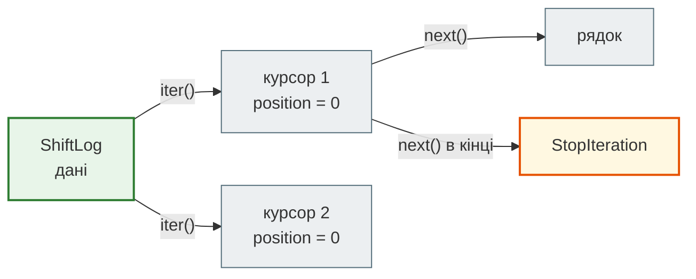
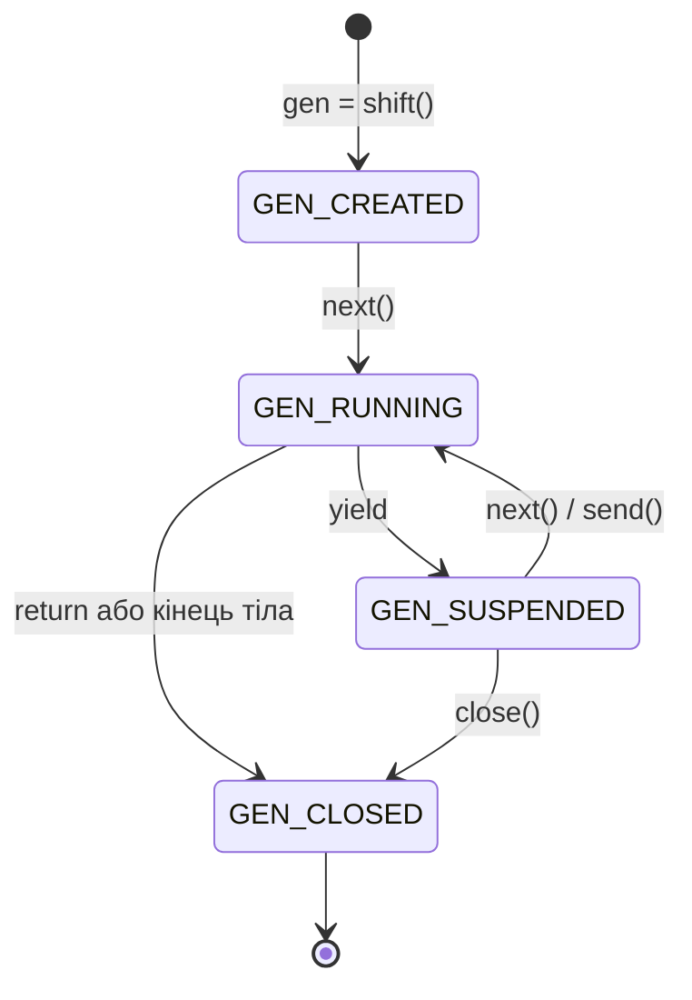
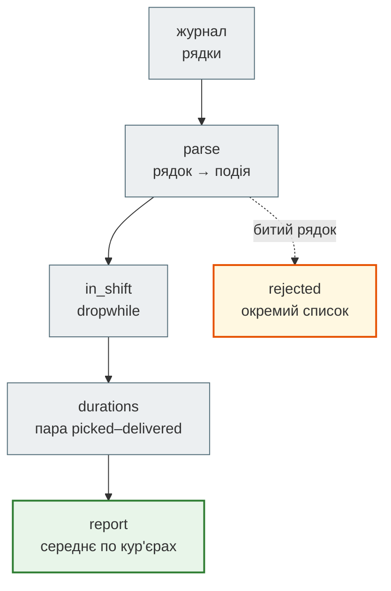
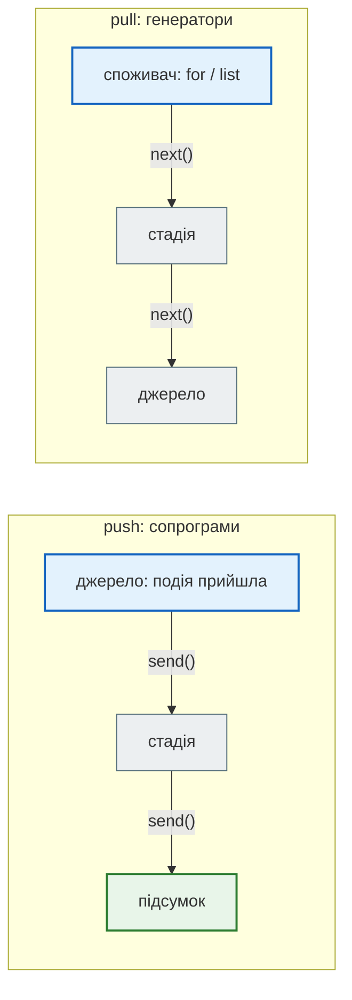

# Урок 24. Ітератори advanced

Застосунок кур'єрів «Смачно + Таксі» шле в диспетчерську потік подій: кур'єр забрав замовлення (`picked`), кур'єр доставив (`delivered`). Кожна подія — рядок «час кур'єр замовлення подія». Так виглядає журнал вечірньої зміни:

```python
LOG = [
    "17:52 D-2 98 delivered",
    "17:58 D-1 97 delivered",
    "18:03 D-1 101 picked",
    "18:05 D-2 102 picked",
    "18:07 D-3 103 picked",
    "18:21 D-1 101 delivered",
    "18:24 ?? зламаний рядок",
    "18:29 D-2 102 delivered",
    "18:31 D-1 104 picked",
    "18:44 D-3 103 delivered",
    "18:52 D-1 104 delivered",
]
print(len(LOG))
```

```text
11
```

Тут усе, з чим стикається справжній потік: події попередньої зміни (до 18:00), битий рядок, доставки різних кур'єрів упереміш. А диспетчерській потрібно:

- середній час доставки **на льоту**, після кожної події, а не наприкінці дня;
- звіт по кур'єрах;
- лише події поточної зміни;
- список битих рядків, щоб розібратися з ними, а не губити мовчки.

В уроці 10 ми навчилися будувати конвеєри з генераторів. Сьогодні — наступний рівень: власні ітератори-класи, генератори, які **приймають** дані через `.send()`, генератор як скінченний автомат і «алгебра» `itertools`.

**Що потрібно з попередніх уроків:** ітератори, `yield`, конвеєри й `islice` (урок 10), декоратори (урок 9), скінченний автомат статусів (урок 21), `__iter__` (урок 23), перебір з поверненням (урок 22).

**Після уроку ти зможеш:**

- писати клас-ітератор з `__iter__` і `__next__` і відокремлювати ітерабельне від ітератора;
- пояснювати стани генератора, `return` у генераторі, `close()` і `finally`;
- передавати дані в генератор через `.send()` і запускати його декоратором;
- будувати скінченний автомат на генераторі;
- використовувати `yield from` для делегування й отримання результату;
- обирати інструмент `itertools`: `dropwhile`, `takewhile`, `groupby`, `pairwise`, `accumulate`, `combinations`;
- проєктувати ETL-конвеєр зі стадіями, які легко тестувати, і окремим списком відхилених записів.

**Задача розділу.** Конвеєр «журнал → розбір → зміна → тривалості → звіт», що рахує середній час доставки кожного кур'єра й збирає биті рядки окремо. Повний код — у розділі [«Практика»](#practice).

**Ноутбук заняття:** [`note_lesson_24_iterators_advanced.ipynb`](https://github.com/NikoriakViktot/PY-Course-Victor-Nikoriak-22-09-2026/blob/main/module_2/lessons/lesson_24_iterators_advanced/note_lesson_24_iterators_advanced.ipynb) [](https://colab.research.google.com/github/NikoriakViktot/PY-Course-Victor-Nikoriak-22-09-2026/blob/main/module_2/lessons/lesson_24_iterators_advanced/note_lesson_24_iterators_advanced.ipynb)

## Пригадай

1. Що робить `for` з об'єктом, перш ніж узяти перший елемент?
2. Чому другий `list()` від того самого генератора порожній?
3. Як в уроці 21 автомат статусів вирішував, чи дозволений перехід?
4. Що повертав `__iter__` кошика в уроці 23?

??? success "Відповіді"

    1. Викликає `iter()` і отримує ітератор, а далі — `next()`, доки не прийде `StopIteration`.
    2. Генератор одноразовий: перший `list()` дійшов до кінця.
    3. Шукав пару «поточний статус → новий» у словнику `TRANSITIONS`.
    4. Готовий ітератор словника: `iter(self._items.items())`.

## Клас-ітератор: `__iter__` і `__next__`

В уроці 10 ми бачили протокол ззовні: `iter()`, потім `next()`, доки не `StopIteration`. Щоб наш клас сам був ітератором, треба два методи: `__next__` віддає наступний елемент або кидає `StopIteration`, а `__iter__` повертає сам ітератор. Перша спроба — журнал зміни, що перебирає власні рядки:

```python
class ShiftLog:
    def __init__(self, lines):
        self.lines = lines
        self.position = 0

    def __iter__(self):
        return self

    def __next__(self):
        if self.position >= len(self.lines):
            raise StopIteration
        line = self.lines[self.position]
        self.position += 1
        return line


log = ShiftLog(LOG[2:5])
print(list(log))
print(list(log))
```

```text
['18:03 D-1 101 picked', '18:05 D-2 102 picked', '18:07 D-3 103 picked']
[]
```

Працює — один раз. Курсор `position` живе в самому журналі, тож після першого проходу журнал «порожній», хоча рядки нікуди не ділися. Так само зламаються вкладені цикли по тому самому журналу: внутрішній цикл вичерпає курсор для зовнішнього.

Проблема в тому, що ми змішали дві ролі:

- **ітерабельне** (журнал) — знає дані й на кожен `iter()` видає **новий** ітератор;
- **ітератор** (курсор) — пам'ятає позицію, одноразовий.



Розділяємо ролі на два класи:

```python
class ShiftLogIterator:
    def __init__(self, lines):
        self._lines = lines
        self._position = 0

    def __iter__(self):
        return self

    def __next__(self):
        if self._position >= len(self._lines):
            raise StopIteration
        line = self._lines[self._position]
        self._position += 1
        return line


class ShiftLog:
    def __init__(self, lines):
        self.lines = list(lines)

    def __iter__(self):
        return ShiftLogIterator(self.lines)


log = ShiftLog(LOG[2:5])
print(len(list(log)), len(list(log)))
print(len([(a, b) for a in log for b in log]))
```

```text
3 3
9
```

Кожен `for` отримує свій курсор: два проходи по 3 рядки, вкладений цикл — 3 × 3 пар. А `__iter__` ітератора повертає `self` для того, щоб ітератор теж можна було передати в `for`.

Писати окремий клас-курсор доводиться рідко. Якщо `__iter__` — генератор, Python сам створює новий курсор на кожен виклик:

```python
class ShiftLog:
    def __init__(self, lines):
        self.lines = list(lines)

    def __iter__(self):
        for line in self.lines:
            yield line


log = ShiftLog(LOG[2:5])
print(len(list(log)), len(list(log)))
```

```text
3 3
```

!!! tip "Коли потрібен справжній клас-ітератор"
    Коли курсор має **власний інтерфейс**: наприклад, `peek()` — подивитися наступний елемент, не забираючи його, чи `position` для відновлення читання після збою. Для простого перебору досить генератора в `__iter__`.

## Генератор зсередини

Генераторна функція при виклику не виконується, а створює об'єкт-генератор. Модуль `inspect` показує, в якому стані цей об'єкт:

```python
from inspect import getgeneratorstate


def shift():
    print("зміна почалась")
    yield "перша подія"
    print("між подіями")
    yield "друга подія"
    print("зміна закінчилась")
    return "звіт готовий"


gen = shift()
print(getgeneratorstate(gen))
print(next(gen))
print(getgeneratorstate(gen))
print(next(gen))
try:
    next(gen)
except StopIteration as stop:
    print("StopIteration:", stop.value)
print(getgeneratorstate(gen))
```

```text
GEN_CREATED
зміна почалась
перша подія
GEN_SUSPENDED
між подіями
друга подія
зміна закінчилась
StopIteration: звіт готовий
GEN_CLOSED
```



Три речі, яких не було в уроці 10:

- кожен `next()` виконує тіло **від попереднього `yield` до наступного** — тому «між подіями» друкується лише з другим `next()`;
- `return` у генераторі не віддає значення в `for`, а кладе його в `StopIteration.value`. `for` це значення ігнорує; нижче побачимо, хто його забирає;
- закритий генератор уже нічого не віддасть.

### `close()` і `finally`: прибирання за собою

Генератор, що читає з мережі чи файлу, мусить закрити з'єднання, навіть якщо споживач узяв лише частину даних:

```python
def read_events(lines):
    print("відкрили з'єднання")
    try:
        for line in lines:
            yield line
    finally:
        print("закрили з'єднання")


events = read_events(LOG)
print(next(events))
events.close()
print(getgeneratorstate(events))
```

```text
відкрили з'єднання
17:52 D-2 98 delivered
закрили з'єднання
GEN_CLOSED
```

`close()` кидає всередину генератора, на місці паузи, спеціальний виняток `GeneratorExit`. Спрацьовує `finally`, і генератор завершується. CPython робить те саме автоматично, коли на генератор більше немає посилань, але явне закриття — надійніше.

## `.send()`: генератор, що приймає дані

Досі дані текли **з** генератора. Метод `.send(value)` передає значення **в** генератор: воно стає результатом виразу `yield`. Середній час доставки, що оновлюється після кожної доставки:

```python
def running_average():
    total = 0
    count = 0
    average = None
    while True:
        minutes = yield average
        total += minutes
        count += 1
        average = round(total / count, 1)


avg = running_average()
print(next(avg))
for minutes in [18, 24, 37, 21]:
    print(avg.send(minutes))
```

```text
None
18.0
21.0
26.3
25.0
```

Рядок `minutes = yield average` робить дві речі: віддає назовні поточне середнє й ставить функцію на паузу, **чекаючи** на наступне число. Стан — `total` і `count` — живе в локальних змінних призупиненої функції, без класу й без глобальних змінних.

Перший `next(avg)` **запускає** генератор: доводить його до першого `yield`, де вже є кому прийняти значення. Без запуску:

```python
fresh = running_average()
try:
    fresh.send(18)
except TypeError as error:
    print(error)
```

```text
can't send non-None value to a just-started generator
```

Щоб не забувати запуск, його ховають у декоратор — той самий прийом, що в уроці 9:

```python
from functools import wraps


def primed(func):
    @wraps(func)
    def wrapper(*args, **kwargs):
        gen = func(*args, **kwargs)
        next(gen)
        return gen
    return wrapper


@primed
def running_average():
    total = 0
    count = 0
    average = None
    while True:
        minutes = yield average
        total += minutes
        count += 1
        average = round(total / count, 1)


avg = running_average()
print(avg.send(18), avg.send(24))
```

```text
18.0 21.0
```

Такий генератор, що отримує дані через `send`, називають **сопрограмою** (coroutine).

### Генератор як скінченний автомат

В уроці 21 автомат статусів жив у класі `Order`. Той самий автомат можна записати генератором: стан — локальна змінна, подія приходить через `send`, новий стан віддається через `yield`.

```python
COURIER_TRANSITIONS = {
    ("вільний", "picked"): "везе",
    ("везе", "delivered"): "вільний",
}


@primed
def courier_state():
    state = "вільний"
    while True:
        event = yield state
        new_state = COURIER_TRANSITIONS.get((state, event))
        if new_state is None:
            print(f"  подія {event} у стані «{state}» — пропускаю")
        else:
            state = new_state


courier = courier_state()
for event in ["picked", "delivered", "delivered", "picked"]:
    print(event, "→", courier.send(event))
```

```text
picked → везе
delivered → вільний
  подія delivered у стані «вільний» — пропускаю
delivered → вільний
picked → везе
```

Генератор чи клас? Генератор коротший, коли автомат має **один вхід і один вихід**: подія → стан. Клас кращий, коли станом цікавиться багато коду (`order.status`), є кілька дій з різними іменами (`cook()`, `cancel()`) чи історія змін. Для `Order` з уроку 21 клас правильний; для лічильника стану кур'єра в потоці подій — генератор.

### `yield from`: делегування й результат

В уроці 10 `yield from` просто віддавав елементи іншого ітерабельного. Але він робить більше: передає `send` і `close` вкладеному генератору, а коли той завершується — **повертає його `return`-значення**. Так генератор-стадія може віддавати дані й наприкінці ще й звітувати:

```python
def valid_events(lines):
    broken = 0
    for line in lines:
        parts = line.split()
        if len(parts) != 4 or not parts[2].isdigit():
            broken += 1
            continue
        yield parts
    return broken


def with_report(lines):
    broken = yield from valid_events(lines)
    print(f"битих рядків: {broken}")


events = list(with_report(LOG))
print(len(events), events[2])
```

```text
битих рядків: 1
10 ['18:03', 'D-1', '101', 'picked']
```

`with_report` для зовнішнього коду — звичайний генератор із 10 подіями, а всередині він дізнався, скільки рядків відкинуто. Саме з `yield from` і сопрограм на генераторах виросли `async` / `await` — про них в уроці 27.

## Алгебра `itertools`

Модуль `itertools` — набір «цеглинок», з яких збирають конвеєри без ручних циклів. В уроці 10 були `count`, `chain`, `islice`. Далі — ті, що розв'язують задачі диспетчерської.

### `dropwhile` і `takewhile`: межі потоку

Журнал упорядкований за часом. Треба відкинути події до початку зміни й узяти першу половину зміни:

```python
from itertools import dropwhile, takewhile

shift_events = dropwhile(lambda line: line < "18:00", LOG)
print(next(shift_events))

first_half = takewhile(lambda line: line < "18:30", dropwhile(lambda line: line < "18:00", LOG))
print(len(list(first_half)))
```

```text
18:03 D-1 101 picked
6
```

Рядки порівнюються як текст, а формат «ГГ:ХХ» сортується так само, як час. Чим це відрізняється від `filter`:

- `dropwhile` відкидає елементи, **доки** умова правдива, а потім пропускає все, вже не перевіряючи;
- `takewhile` бере елементи, **доки** умова правдива, і на першому хибному **зупиняє** потік.

Тому `takewhile` працює і з нескінченним потоком, а `filter` на ньому ніколи не закінчиться. Ціна — обидва покладаються на **упорядкованість**: подія 18:10, що запізнилася й прийшла після 18:31, буде відкинута `takewhile` разом із рештою.

### `groupby`: групи сусідів

`groupby(дані, key)` збирає в групу **сусідні** елементи з однаковим ключем. Як гадаєш, скільки груп дадуть події, згруповані за кур'єром?

```python
from itertools import groupby

groups = [(courier, len(list(group))) for courier, group in groupby(events, key=lambda event: event[1])]
print(len(groups), groups[:4])
```

```text
9 [('D-2', 1), ('D-1', 2), ('D-2', 1), ('D-3', 1)]
```

Дев'ять груп на трьох кур'єрів: щойно кур'єр змінюється, починається нова група. `groupby` схожий на `uniq` з командного рядка — він не шукає однакові ключі по всьому потоку. Щоб отримати по групі на кур'єра, дані спершу сортують за тим самим ключем:

```python
by_courier = sorted(events, key=lambda event: event[1])
print([(courier, len(list(group))) for courier, group in groupby(by_courier, key=lambda event: event[1])])
```

```text
[('D-1', 5), ('D-2', 3), ('D-3', 2)]
```

Але сортування потребує **всіх** даних у пам'яті й `O(n log n)`. Для потоку зі змішаними ключами словник або `Counter` з уроку 6 — один прохід і пам'ять лише на ключі. `groupby` доречний, коли дані **вже** прийшли згруповані: журнал, відсортований за днем, файл, розбитий за кур'єром.

### `pairwise` і `accumulate`: сусідні пари й наростаючий підсумок

Найдовша пауза між подіями — сигнал, що застосунок втрачав зв'язок. `pairwise` (Python 3.10+) віддає пари сусідніх елементів:

```python
from itertools import accumulate, pairwise


def minutes(hhmm):
    hours, mins = hhmm.split(":")
    return int(hours) * 60 + int(mins)


times = [minutes(event[0]) for event in events]
gaps = [later - earlier for earlier, later in pairwise(times)]
print(gaps, max(gaps))

delivered = [1 if event[3] == "delivered" else 0 for event in events]
print(list(accumulate(delivered)))
```

```text
[6, 5, 2, 2, 14, 8, 2, 13, 8] 14
[1, 2, 2, 2, 2, 3, 4, 4, 5, 6]
```

`accumulate` — наростаючий підсумок: після кожної події видно, скільки доставок уже виконано. Це той самий «підсумок на льоту», що й `running_average`, лише для суми.

### `combinations`: перебір без вкладених циклів

В уроці 22 ми шукали набори поїздок на ваучер 500 грн перебором з поверненням. Для наборів фіксованого розміру є готовий перебір:

```python
from itertools import combinations

fares = [230, 150, 270, 180, 120, 410]
print([pair for pair in combinations(fares, 2) if sum(pair) == 500])
print([trio for trio in combinations(fares, 3) if sum(trio) == 500])
print(sum(1 for size in range(1, len(fares) + 1) for _ in combinations(fares, size)))
```

```text
[(230, 270)]
[(230, 150, 120)]
63
```

Ті самі два набори, що в уроці 22. Але `combinations` перебирає **всі** 63 непорожні підмножини — без відсікання. Для 6 поїздок це дрібниця; для 40 — понад трильйон. `combinations` і `product` замінюють вкладені цикли, коли перебрати треба все; коли гілки можна відсікати — потрібен перебір з поверненням.

!!! note "Інші корисні цеглинки"
    `zip_longest` — `zip`, що не обрізає довший потік; `chain.from_iterable` — сплющити потік списків; `tee` — розгалузити один ітератор на кілька (з буфером у пам'яті); `batched(дані, n)` — пачки по n (з Python 3.12; для старіших версій напишемо самі в практиці).

## Архітектура: ETL-конвеєр подій { #architecture }

Задачу диспетчерської зручно побудувати як **ETL** (extract — transform — load): витягти дані, перетворити, завантажити результат. Кожна стадія — функція «ітерабельне → ітерабельне», і стадії з'єднуються як труби:



### Хто штовхає, а хто тягне

У конвеєрі з генераторів дані **тягне** споживач: `report` просить наступну тривалість, `durations` — наступну подію, і так до джерела. Сопрограми з `.send()` працюють навпаки — дані **штовхає** джерело:



Pull природний, коли дані можна **попросити**: файл, список, база. Push — коли дані **приходять самі** й треба реагувати на кожну: повідомлення від застосунку, дані з датчика. Середній час після кожної доставки — задача push; звіт наприкінці зміни — pull.

### Компроміси

| Підхід | Пам'ять | Проходів | Хто керує | Коли |
|---|---|---|---|---|
| списки між стадіями | весь проміжний результат | скільки завгодно | код, що викликає стадії | мало даних, треба кілька проходів чи індекси |
| конвеєр генераторів | один елемент на стадію | один | споживач (pull) | великі файли, потоки, звіти |
| клас-ітератор | як генератор | один на курсор | споживач | курсор з власними методами: `peek`, позиція |
| сопрограма `.send()` | стан сопрограми | — | джерело (push) | реакція на кожну подію, автомат, ковзні підсумки |

### Помилки й тести

- **Биті дані не губимо мовчки** (Zen of Python: «помилки не мають минати непомітно»). Стадія розбору відкладає биті рядки в окремий список — у промисловому ETL це «dead letter queue». Альтернатива — лічильник через `return` і `yield from`, як у `valid_events`.
- **Кожна стадія тестується окремо**: вона приймає будь-яке ітерабельне, тож для перевірки досить списку з двох-трьох рядків. Саме так ми писатимемо тести в уроці 25.

## Практика { #practice }

### Розібраний приклад: середній час доставки по кур'єрах

```python linenums="1" hl_lines="5 8 12 16 19 21 28 32"
def parse(lines, rejected):
    for line in lines:
        parts = line.split()
        if len(parts) != 4 or not parts[2].isdigit():
            rejected.append(line)
            continue
        time, courier, order, kind = parts
        yield {"time": minutes(time), "courier": courier, "order": int(order), "kind": kind}


def in_shift(events, start):
    return dropwhile(lambda event: event["time"] < start, events)


def durations(events):
    picked = {}
    for event in events:
        if event["kind"] == "picked":
            picked[event["order"]] = event["time"]
        elif event["kind"] == "delivered" and event["order"] in picked:
            yield event["courier"], event["time"] - picked.pop(event["order"])


def report(pairs):
    by_courier = {}
    for courier, spent in pairs:
        by_courier.setdefault(courier, []).append(spent)
    return {courier: round(sum(spent) / len(spent), 1) for courier, spent in sorted(by_courier.items())}


rejected = []
pipeline = durations(in_shift(parse(LOG, rejected), minutes("18:00")))
print(report(pipeline))
print(rejected)
```

```text
{'D-1': 19.5, 'D-2': 24.0, 'D-3': 37.0}
['18:24 ?? зламаний рядок']
```

Що тут працює:

- `parse` — генератор-стадія: перетворює рядок на словник-подію, биті рядки відкладає в `rejected`.
- `in_shift` — одна `dropwhile`: події попередньої зміни (доставки 97 і 98) не потрапляють далі.
- `durations` пам'ятає лише **відкриті** замовлення — ті, що забрали, але ще не доставили. Доставлене замовлення виходить зі словника через `pop`, тож пам'ять не росте разом з потоком.
- `report` — єдине місце, де дані накопичуються, і лише як тривалості по кур'єрах.
- Рядок 32 нічого не обчислює: він лише з'єднує труби. Робота починається, коли `report` просить першу тривалість.

`D-1` доставив два замовлення: 101 за 18 хв і 104 за 21 хв — середнє 19.5.

### Зміни приклад: запізнення

Додай стадію `late(pairs, limit)`, що пропускає далі лише доставки, довші за `limit` хвилин, і виведи їх для `limit=30`. Стадію став між `durations` і `list`, не змінюючи інших функцій.

??? tip "Підказка"

    ```python
    def late(pairs, limit):
        for courier, spent in pairs:
            if spent > limit:
                yield courier, spent
    ```

    `list(late(durations(in_shift(parse(LOG, []), minutes("18:00"))), 30))` дасть `[('D-3', 37)]`.

### Спробуй самостійно: пачки й ковзне середнє

1. Напиши генератор `batched(iterable, n)`, що віддає кортежі по `n` елементів (останній може бути коротшим): `list(batched(range(7), 3))` → `[(0, 1, 2), (3, 4, 5), (6,)]`. Він має працювати з **нескінченним** потоком: `next(batched(count(), 2))` → `(0, 1)`.
2. Напиши генератор `moving_average(values, k)` — середнє останніх `k` значень для кожної позиції, починаючи з `k`-ї: `list(moving_average([18, 24, 37, 21], 2))` → `[21.0, 30.5, 29.0]`. Не перераховуй суму вікна щоразу — ковзне вікно з уроку 11.

??? tip "Підказка"

    1. Бери пачку через `tuple(islice(iterator, n))` з **одного** ітератора `it = iter(iterable)`; порожня пачка — сигнал зупинитися.
    2. Тримай `window_sum`: додай нове значення, відніми те, що випало з вікна (`values[i - k]`), або тримай вікно в `collections.deque(maxlen=k)`.

### Знайди помилку

```python
# 1 — звіт по кур'єрах
from itertools import groupby

counts = {courier: len(list(group)) for courier, group in groupby(events, key=lambda event: event[1])}

# 2 — дві цифри з одного розбору
parsed = parse(LOG, [])
total = sum(1 for _ in parsed)
result = report(durations(parsed))

# 3 — середнє на льоту
def running_average():
    total, count, average = 0, 0, None
    while True:
        minutes = yield average
        total += minutes
        count += 1
        average = total / count

avg = running_average()
print(avg.send(18))
```

??? success "Відповіді"

    1. Дані не відсортовані за кур'єром: `groupby` дає кілька груп на одного кур'єра, і в словнику лишиться лише **остання** група кожного. Треба спершу `sorted(events, key=…)` — або рахувати `Counter(event[1] for event in events)`.
    2. `sum` вичерпав генератор `parsed`; `report` отримає порожній потік і поверне `{}`. Або створити конвеєр заново, або — якщо даних мало — один раз зробити `list(parse(…))`.
    3. Генератор не запущено: `send(18)` падає з `TypeError: can't send non-None value to a just-started generator`. Треба спершу `next(avg)` або декоратор `@primed`.

## Підсумок

| Поняття | Що запам'ятати |
|---|---|
| Клас-ітератор | `__next__` віддає елемент або `StopIteration`; `__iter__` повертає `self` |
| Ітерабельне й ітератор | ітерабельне на кожен `iter()` дає **новий** курсор; найпростіше — генератор у `__iter__` |
| Стани генератора | `GEN_CREATED` → `GEN_SUSPENDED` ⇄ `GEN_RUNNING` → `GEN_CLOSED` |
| `return` у генераторі | значення йде в `StopIteration.value`; забирає його `yield from` |
| `close()` і `finally` | прибирання ресурсів, навіть якщо споживач зупинився раніше |
| `.send()` | значення стає результатом `yield`; спершу запустити `next()` або `@primed` |
| Генератор-автомат | стан у локальній змінній; добре для «подія → стан» |
| `dropwhile` / `takewhile` | межі впорядкованого потоку; `takewhile` зупиняє і нескінченний потік |
| `groupby` | групує лише **сусідів** — спершу сортувати за тим самим ключем |
| `pairwise`, `accumulate` | сусідні пари; наростаючий підсумок |
| `combinations` | повний перебір наборів фіксованого розміру, без відсікання |
| ETL-конвеєр | стадії «ітерабельне → ітерабельне», биті записи — окремо, кожна стадія тестується окремо |
| Pull і push | генератори тягнуть дані, сопрограми отримують їх через `send` |

### Самоперевірка

1. Чому другий `list(log)` для першої версії `ShiftLog` порожній? Як це виправити двома способами?
2. Що друкує генератор `shift()` між першим і другим `next()` і чому саме тоді?
3. Куди потрапляє значення `return` генератора? Хто його може отримати?
4. Навіщо в `read_events` блок `finally`?
5. Що робить рядок `minutes = yield average`? Чому перед першим `send` потрібен `next`?
6. Коли автомат краще писати генератором, а коли — класом?
7. Чим `takewhile` відрізняється від `filter` на нескінченному потоці?
8. Чому `groupby` дав 9 груп на трьох кур'єрів?
9. Чому `durations` не накопичує всі події зміни в пам'яті?

??? success "Відповіді"

    1. Курсор `position` живе в самому журналі й після першого проходу стоїть у кінці. Виправлення: окремий клас-курсор, який `__iter__` створює щоразу, або генератор у `__iter__`.
    2. «між подіями» — бо кожен `next()` виконує тіло від попереднього `yield` до наступного.
    3. У `StopIteration.value`. Його отримує `yield from` як значення виразу, або код, що сам ловить `StopIteration`.
    4. Щоб з'єднання закрилося, навіть коли споживач не дочитав до кінця й викликав `close()`.
    5. Віддає `average` назовні й чекає; значення з `send` стає результатом `yield`. До першого `next` генератор ще не дійшов до `yield`, тож приймати значення нікому.
    6. Генератор — коли вхід один (подія) і вихід один (стан). Клас — коли стан читає багато коду, є кілька дій з іменами чи історія.
    7. `takewhile` зупиняє потік на першому хибному елементі; `filter` перевіряє всі елементи й на нескінченному потоці не закінчиться.
    8. Він групує лише сусідні елементи, а кур'єри в журналі йдуть упереміш.
    9. Він тримає лише відкриті замовлення й видаляє кожне через `pop`, щойно воно доставлене.

### Що далі

- Ноутбук заняття: [`note_lesson_24_iterators_advanced.ipynb`](https://github.com/NikoriakViktot/PY-Course-Victor-Nikoriak-22-09-2026/blob/main/module_2/lessons/lesson_24_iterators_advanced/note_lesson_24_iterators_advanced.ipynb) [](https://colab.research.google.com/github/NikoriakViktot/PY-Course-Victor-Nikoriak-22-09-2026/blob/main/module_2/lessons/lesson_24_iterators_advanced/note_lesson_24_iterators_advanced.ipynb) — прогнози й вправи з перевірками: курсор з `peek`, сопрограма-лічильник, `batched`, ковзне середнє, звіт по кур'єрах.
- Наступне заняття — урок 25 «Тестування з pytest»: стадії нашого конвеєра — ідеальні кандидати на перші тести.
- Урок 27 — потоки, `multiprocessing` і `asyncio`: `async` / `await` — нащадки `.send()` і `yield from`.

## Документація і джерела

- Туторіал: [Iterators](https://docs.python.org/3/tutorial/classes.html#iterators), [Generators](https://docs.python.org/3/tutorial/classes.html#generators)
- Довідник мови: [Generator-iterator methods](https://docs.python.org/3/reference/expressions.html#generator-iterator-methods) — `__next__`, `send`, `throw`, `close`
- [`itertools`](https://docs.python.org/3/library/itertools.html) — усі цеглинки й «рецепти» з прикладами; [`inspect.getgeneratorstate`](https://docs.python.org/3/library/inspect.html#inspect.getgeneratorstate)
- [PEP 342 — Coroutines via Enhanced Generators](https://peps.python.org/pep-0342/) (`send`, `close`); [PEP 380 — Syntax for Delegating to a Subgenerator](https://peps.python.org/pep-0380/) (`yield from`)
- Для охочих: Dave Beazley, [«A Curious Course on Coroutines and Concurrency»](https://www.dabeaz.com/coroutines/) — сопрограми на генераторах, конвеєри з `send`, від простого до власного планувальника задач.
