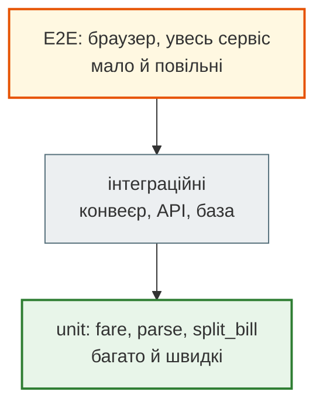
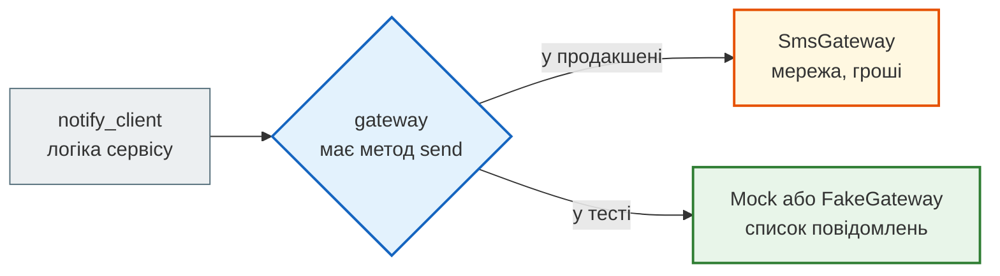

# Урок 25. Тестування з pytest (+ валідація AI-коду)

У п'ятницю ввечері розробник «трохи підчистив» функцію тарифу таксі в сервісі «Смачно + Таксі». Код став коротшим, застосунок запустився, поїздка на 10 км коштувала ті самі 160 грн — він перевірив і пішов додому. Лише в понеділок бухгалтерія помітила, що всі короткі поїздки за вихідні коштували 46–76 грн замість мінімальних 80. Під час чистки зник `max(tariff.min_fare, …)`.

Розробник не був недбалим: він перевірив, як умів, — **руками й один випадок**. Ручна перевірка не повторюється після кожної зміни, і вона завжди перевіряє те, що ми й так думали, що працює.

**Тест** — це перевірка, записана кодом: її можна запускати тисячу разів, після кожної зміни, за секунду. Сьогодні вчимося писати такі перевірки з **pytest** — найпоширенішим інструментом тестування в Python — і застосовувати їх до коду, який написали не ми, зокрема до коду від AI-асистентів.

**Що потрібно з попередніх уроків:** винятки (урок 13), модулі й пакети (урок 12), тести й `check.py` з командного проєкту (урок 15), `@dataclass` і `Money` (урок 23), конвеєр подій (урок 24).

**Після уроку ти зможеш:**

- пояснювати, що тести дають і чого не дають; формулювати тест за схемою Arrange — Act — Assert;
- писати й запускати тести pytest, читати звіт про падіння;
- перевіряти межі, винятки (`pytest.raises`) і дробові числа (`pytest.approx`);
- описувати багато випадків одним тестом через `@pytest.mark.parametrize`;
- готувати дані через fixtures, `conftest.py`, фабрики й `tmp_path`;
- читати тести в стилі `unittest`;
- підміняти зовнішні залежності через `Mock` і `patch` і знати правило «patch where used»;
- вимірювати покриття й розуміти, чому 100% — не мета;
- перевіряти AI-згенерований код тестами на інваріанти.

**Задача розділу.** Набір тестів для тарифів, конвеєра подій і SMS-сповіщень сервісу — у проєкті [`delivery_tests/`](https://github.com/NikoriakViktot/PY-Course-Victor-Nikoriak-22-09-2026/tree/main/module_2/lessons/lesson_25_pytest_testing/delivery_tests). Повний розбір — у розділі [«Практика»](#practice).

**Ноутбук заняття:** [`note_lesson_25_pytest.ipynb`](https://github.com/NikoriakViktot/PY-Course-Victor-Nikoriak-22-09-2026/blob/main/module_2/lessons/lesson_25_pytest_testing/note_lesson_25_pytest.ipynb) [](https://colab.research.google.com/github/NikoriakViktot/PY-Course-Victor-Nikoriak-22-09-2026/blob/main/module_2/lessons/lesson_25_pytest_testing/note_lesson_25_pytest.ipynb)

!!! note "Встановлення"
    pytest — стороння бібліотека: `pip install pytest pytest-cov` в активованому середовищі (урок 2). У Colab pytest уже є.

## Пригадай

1. Що робить `assert умова, "повідомлення"`, якщо умова хибна?
2. Як у командному проєкті уроку 15 кожен учасник перевіряв свою функцію, не чекаючи на інших?
3. Чому стадії конвеєра з уроку 24 легко перевіряти окремо?

??? success "Відповіді"

    1. Кидає `AssertionError` з повідомленням; якщо умова правдива — нічого не робить.
    2. Тести його задачі підставляли готові заглушки замість функцій інших учасників (`helpers.replaced`).
    3. Кожна стадія приймає будь-яке ітерабельне: для перевірки досить списку з кількох рядків.

## Навіщо тести: впевненість, а не доведення

Тести **не доводять**, що в програмі немає помилок: випадків нескінченно багато, а тестів — скінченна кількість. Вони дають інше — **впевненість змінювати код**. Без тестів кожна правка лякає: «а раптом щось зламалось там, куди я не дивився?». Через цей страх код не чистять, і він поступово гниє.

Три корисні образи:

- **сигналізація** — не будує стін і не ловить усіх, але голосно кричить, коли порушено важливе;
- **експеримент** — підготували умови, виконали дію, звірили результат з гіпотезою;
- **жива документація** — тест показує, як функцію викликати і що вона обіцяє, і на відміну від коментаря не застаріває: застарілий тест падає.

Помилку, що повернулася після виправлення, називають **регресією**. Найцінніший тест — той, що з'явився разом із виправленням бага: він не дасть цьому багу повернутися.

## Перший тест

Функція тарифу — така, якою вона була до п'ятниці:

```python
from dataclasses import dataclass


@dataclass(frozen=True)
class Tariff:
    base: int       # подача, грн
    per_km: int     # грн за кілометр
    min_fare: int   # мінімальна вартість поїздки, грн


def fare(km, tariff):
    """Вартість поїздки на km кілометрів, не менша за мінімальну."""
    if km < 0:
        raise ValueError(f"відстань не може бути від'ємною: {km}")
    return max(tariff.min_fare, round(tariff.base + tariff.per_km * km))


day = Tariff(base=40, per_km=12, min_fare=80)
print(fare(10, day), fare(0.5, day))
```

```text
160 80
```

Тест для pytest — звичайна функція з назвою `test_…` у файлі `test_….py`, усередині — звичайний `assert`:

```python
def test_long_trip_is_base_plus_distance():
    # Arrange — підготувати дані
    tariff = Tariff(base=40, per_km=12, min_fare=80)
    # Act — виконати дію
    price = fare(10, tariff)
    # Assert — перевірити результат
    assert price == 160


def test_short_trip_costs_min_fare():
    assert fare(0.5, Tariff(base=40, per_km=12, min_fare=80)) == 80
```

Запуск з папки проєкту:

```bash
python -m pytest
```

```text
collected 32 items

tests/test_events.py ........                                            [ 25%]
tests/test_notify.py ...                                                 [ 34%]
tests/test_pricing.py .................                                  [ 87%]
tests/test_services.py .                                                 [ 90%]
tests/test_unittest_style.py ...                                         [100%]

============================== 32 passed in 0.07s ==============================
```

Кожна крапка — пройдений тест. pytest сам знаходить тести:

- файли `test_*.py` або `*_test.py` (у нашому проєкті — в папці `tests/`, це задано в `pytest.ini`);
- функції `test_*` і методи `test_*` у класах `Test*`;
- жодної реєстрації, жодного `main()`.

Три частини тесту — **Arrange, Act, Assert** (AAA) — варто тримати навіть там, де коментарів немає: один тест — одна дія й перевірка її результату. Тест, який робить п'ять дій і перевіряє все одразу, при падінні не скаже, що саме зламалось.

### Читаємо падіння

Повернімо п'ятничну «чистку»: `return round(tariff.base + tariff.per_km * km)` без `max`. Запуск тестів тарифу:

```bash
python -m pytest tests/test_pricing.py
```

```text
tests/test_pricing.py .FFF..F..........                                  [100%]

=================================== FAILURES ===================================
________________________ test_short_trip_costs_min_fare ________________________

day_tariff = Tariff(base=40, per_km=12, min_fare=80)

    def test_short_trip_costs_min_fare(day_tariff):
>       assert fare(0.5, day_tariff) == 80
E       assert 46 == 80
E        +  where 46 = fare(0.5, Tariff(base=40, per_km=12, min_fare=80))

tests/test_pricing.py:16: AssertionError
...
=========================== short test summary info ============================
FAILED tests/test_pricing.py::test_short_trip_costs_min_fare - assert 46 == 80
FAILED tests/test_pricing.py::test_fare_table[zero] - assert 40 == 80
FAILED tests/test_pricing.py::test_fare_table[below-min] - assert 76 == 80
FAILED tests/test_pricing.py::test_fare_table[fraction] - assert 67 == 80
4 failed, 13 passed in 0.03s
```

Як читати звіт:

- `F` — провалений тест, `.` — пройдений; рядок `>` — де саме впало;
- `E assert 46 == 80` — pytest **розібрав** звичайний `assert` і показав обидва значення, а рядок `where` — звідки взялося 46. У `unittest` для цього потрібні спеціальні методи; pytest робить це сам;
- останній блок — короткий список: який тест і чому.

А тепер головне: тест `test_long_trip_is_base_plus_distance` (поїздка на 10 км) **пройшов** на зламаному коді — саме цей випадок розробник і перевірив руками. Баг зловили тести **на межах**: 0 км, 3 км, 0.5 км. Час виконання в останньому рядку в тебе буде іншим.

## Межі, винятки, дробові числа

Помилки живуть на **межах**: нуль, порожній список, рівно мінімум, на одиницю більше. Для тарифу межа — точка, де `base + per_km × km` зрівнюється з мінімумом (40 + 12 × 3⅓ = 80):

| Випадок | Чому важливий |
|---|---|
| 0 км | найменше можливе значення |
| 3 км → 76 < 80 | трохи нижче межі — має спрацювати мінімум |
| 3.5 км → 82 | трохи вище межі — мінімум уже не діє |
| −1 км | неможливе значення — має бути виняток |

Виняток перевіряють контекстним менеджером `pytest.raises`; `match` — регулярний вираз, який шукається в тексті помилки:

```python
import pytest


def test_negative_distance_is_rejected():
    with pytest.raises(ValueError, match="від'ємною"):
        fare(-1, Tariff(base=40, per_km=12, min_fare=80))
```

Якщо `fare(-1, …)` не кине `ValueError`, тест упаде з `Failed: DID NOT RAISE`. Усередині `with` має бути лише рядок, який **повинен** кинути виняток, — інакше тест пройде, навіть якщо виняток кинув зовсім інший рядок.

Дробові числа не можна порівнювати через `==`:

```python
checks = [340, 305, 410]
print(0.1 + 0.2 == 0.3, sum(checks) / len(checks))
```

```text
False 351.6666666666667
```

`pytest.approx` порівнює з допуском:

```python
def test_average_check_is_approximately_right():
    checks = [340, 305, 410]
    assert sum(checks) / len(checks) == pytest.approx(351.67, abs=0.01)
```

## `parametrize`: один тест — таблиця випадків

П'ять майже однакових тестів для п'яти відстаней — копіпаста. `@pytest.mark.parametrize` описує випадки таблицею, а pytest запускає тест для кожного рядка окремо:

```python
@pytest.mark.parametrize(
    "km, expected",
    [
        (0, 80),       # нуль кілометрів — усе одно мінімум
        (3, 80),       # 40 + 36 = 76 < 80
        (3.5, 82),     # 40 + 42 = 82 — вже більше за мінімум
        (10, 160),
        (2.25, 80),    # 40 + 27 = 67
    ],
    ids=["zero", "below-min", "just-above-min", "long", "fraction"],
)
def test_fare_table(km, expected, day_tariff):
    assert fare(km, day_tariff) == expected
```

```bash
python -m pytest -v tests/test_pricing.py -k fare_table
```

```text
tests/test_pricing.py::test_fare_table[zero] PASSED                      [ 20%]
tests/test_pricing.py::test_fare_table[below-min] PASSED                 [ 40%]
tests/test_pricing.py::test_fare_table[just-above-min] PASSED            [ 60%]
tests/test_pricing.py::test_fare_table[long] PASSED                      [ 80%]
tests/test_pricing.py::test_fare_table[fraction] PASSED                  [100%]
======================= 5 passed, 12 deselected in 0.02s =======================
```

Кожен рядок — окремий тест зі своїм іменем з `ids`; падіння одного не зупиняє решту. `-v` показує імена, `-k fare_table` запускає лише тести, в імені яких є цей фрагмент. Новий випадок — новий рядок таблиці.

## Fixtures: дані для тестів

Тест вище приймає параметр `day_tariff`, якого ніхто не передає. Це **fixture** — функція, яку pytest викликає перед тестом і передає результат за **іменем параметра**:

```python
@pytest.fixture
def day_tariff():
    return Tariff(base=40, per_km=12, min_fare=80)
```

- кожен тест отримує **свіжий** результат fixture — тести не впливають один на одного;
- fixtures, потрібні в кількох файлах, кладуть у `tests/conftest.py` — pytest знаходить цей файл сам, імпортувати його не треба;
- fixture може приймати інші fixtures, як тест.

### Фабрика: лише важливі поля

Тестам конвеєра потрібні події, але кожному тесту важливі різні поля. Fixture-**фабрика** повертає функцію з розумними значеннями за замовчуванням:

```python
@pytest.fixture
def make_event():
    """Фабрика: створює подію, у якій треба вказати лише важливі для тесту поля."""
    def factory(order=1, kind="picked", time="18:00", courier="D-1"):
        return f"{time} {courier} {order} {kind}"
    return factory


def test_durations_pairs_picked_and_delivered(make_event):
    lines = [
        make_event(order=1, kind="picked", time="18:00"),
        make_event(order=2, kind="picked", time="18:05", courier="D-2"),
        make_event(order=1, kind="delivered", time="18:20"),
        make_event(order=3, kind="delivered", time="18:30"),   # без picked — пропускаємо
    ]
    assert list(durations(parse(lines, []))) == [("D-1", 20)]
```

Читач тесту бачить **лише те, що важливо** для перевірки: номери замовлень, типи подій і час. Коли формат подій зміниться, правити доведеться одну фабрику, а не сорок тестів.

### Прибирання після тесту: `yield` і `tmp_path`

Fixture з `yield` ділиться на дві частини: до `yield` — підготовка, після — прибирання. Прибирання виконується, **навіть якщо тест упав**:

```python
@pytest.fixture
def shift_log(tmp_path):
    path = tmp_path / "shift.log"
    file = open(path, "w", encoding="utf-8")
    print("\nвідкрив журнал")
    yield file
    file.close()
    print("закрив журнал")


def test_write_event(shift_log):
    shift_log.write("18:03 D-1 101 picked\n")
    print("пишу подію")
    assert not shift_log.closed
```

```bash
python -m pytest -q -s test_yield.py
```

```text
відкрив журнал
пишу подію
.закрив журнал

1 passed in 0.01s
```

`-s` вимикає перехоплення `print`. `tmp_path` — вбудована fixture pytest: окрема тимчасова папка для кожного тесту (об'єкт `pathlib.Path`). Тести не пишуть у справжні файли проєкту й не заважають одне одному.

Fixtures мають **scope** — як часто їх створювати: `function` (за замовчуванням — для кожного тесту), `module`, `session`. Ширший scope пришвидшує дорогу підготовку (з'єднання з базою), але спільний **змінюваний** об'єкт робить тести залежними від порядку запуску. Для даних — майже завжди `function`.

## `unittest`: тести в стилі класів

У стандартній бібліотеці є модуль `unittest` — тести як методи класу-нащадка `TestCase`, перевірки — методами `assert…`:

```python
import unittest


class FareTest(unittest.TestCase):
    def setUp(self):
        self.tariff = Tariff(base=40, per_km=12, min_fare=80)

    def test_long_trip(self):
        self.assertEqual(fare(10, self.tariff), 160)

    def test_negative_distance(self):
        with self.assertRaises(ValueError):
            fare(-1, self.tariff)
```

`setUp` виконується перед кожним тестом — як fixture. Цей стиль зустрінеш у старих проєктах і в Django (урок 33): `django.test.TestCase` — нащадок `unittest.TestCase`. pytest запускає й такі тести, тож обирати не доводиться. Для нового коду pytest зручніший: звичайний `assert`, fixtures за іменем, `parametrize`.

## Mock і patch: підміна зовнішнього світу

Коли кур'єр забирає замовлення, клієнт отримує SMS. Справжній шлюз ходить у мережу й бере гроші за кожне повідомлення. Тест, що надсилає справжні SMS, повільний, платний і падає, коли немає інтернету, — хоча наш код правильний. Такі залежності — **межі системи** — у тестах підміняють.

Найпростіше підміняти, коли залежність приходить **параметром**:

```python
def notify_client(order_id, phone, minutes, gateway):
    """Надсилає клієнту час доставки. Повертає True, якщо SMS пішло."""
    text = f"Замовлення №{order_id} буде за {minutes} хв"
    try:
        gateway.send(phone, text)
    except ConnectionError:
        return False
    return True
```

`unittest.mock.Mock` — об'єкт, у якого є **будь-який** метод. Він приймає будь-які аргументи й запам'ятовує кожен виклик:

```python
from unittest.mock import Mock

gateway = Mock()
print(notify_client(101, "+380501234567", 25, gateway))
print(gateway.send.call_count, gateway.send.call_args)

gateway.send.side_effect = ConnectionError("шлюз не відповідає")
print(notify_client(102, "+380501234567", 30, gateway))
```

```text
True
1 call('+380501234567', 'Замовлення №101 буде за 25 хв')
False
```

- `call_count`, `call_args` — що з mock-ом робили; у тестах зручніше `gateway.send.assert_called_once_with(…)`;
- `return_value` — що повертає виклик;
- `side_effect` — виняток (чи функція), що спрацює під час виклику. Так перевіряють сценарій «шлюз упав»: замовлення не має губитися через недоставлене SMS.

Тест з файлу `tests/test_notify.py`:

```python
def test_sms_text_and_phone():
    gateway = Mock()
    assert notify_client(101, "+380501234567", 25, gateway) is True
    gateway.send.assert_called_once_with("+380501234567", "Замовлення №101 буде за 25 хв")
```

### `patch`: коли залежність імпортовано всередині модуля

Не весь код приймає залежності параметром. Модуль `delivery/services.py` імпортує функцію напряму:

```python
# delivery/services.py
from delivery.sms import send_sms


def confirm_order(order_id, phone):
    send_sms(phone, f"Замовлення №{order_id} прийнято")
    return "confirmed"
```

`unittest.mock.patch` тимчасово замінює ім'я в модулі на mock. Головне правило — **patch where used**: підміняти ім'я там, де його **використовують**, а не там, де його визначили.

```python
from unittest.mock import patch


def test_confirm_order_sends_sms():
    with patch("delivery.services.send_sms") as fake_send:
        assert confirm_order(101, "+380501234567") == "confirmed"
    fake_send.assert_called_once_with("+380501234567", "Замовлення №101 прийнято")
```

Чому не `patch("delivery.sms.send_sms")`? Рядок `from delivery.sms import send_sms` вже **скопіював посилання** на функцію в простір імен `delivery.services` (урок 12). Підміна в `delivery.sms` цього посилання не змінює — і тест викликає справжню функцію:

```text
>       raise ConnectionError("справжня мережа недоступна в навчальному проєкті")
E       ConnectionError: справжня мережа недоступна в навчальному проєкті
delivery/sms.py:5: ConnectionError
1 failed in 0.04s
```

!!! warning "Коли mock шкодить"
    Мокати варто **межі системи**: мережу, платежі, SMS, пошту, час, випадковість. Якщо мокати власні функції, тест перевіряє не поведінку, а те, **як** код написано: будь-який рефакторинг ламає тести, хоча програма працює. А тест, у якому замокано все, проходить, навіть коли реальні частини одна з одною не стикуються.

Замість `Mock` можна написати **fake** — маленький клас, що поводиться як справжній шлюз, але пише повідомлення в список (є в `tests/test_notify.py`). Fake читається простіше, коли залежність має стан.

## Coverage: що тести не зачепили

`pytest-cov` показує, які рядки коду виконувалися під час тестів:

```bash
python -m pytest --cov=delivery --cov-report=term-missing
```

```text
Name                   Stmts   Miss  Cover   Missing
----------------------------------------------------
delivery/__init__.py       0      0   100%
delivery/events.py        32      0   100%
delivery/notify.py        10      1    90%   8
delivery/pricing.py       14      0   100%
delivery/services.py       4      0   100%
delivery/sms.py            2      1    50%   5
----------------------------------------------------
TOTAL                     62      2    97%
```

Непокриті рядки — `notify.py:8` і `sms.py:5` — це саме справжні виклики мережі, які ми свідомо підмінили. Так coverage корисний: він показує **незачеплені місця**, і кожне треба пояснити.

А от 100% нічого не гарантує. Рядок вважається покритим, якщо він **виконався**, навіть коли жоден `assert` не перевірив результат. Тест `fare(0.5, day)` без `assert` дав би ті самі 100% для `pricing.py` — і пропустив би п'ятничний баг. Якість тестів — у перевірках, а не у відсотку.

## Валідація AI-коду

AI-асистенти пишуть код швидко й упевнено — і так само впевнено помиляються: на межах, на порожніх даних, в округленні. Код від AI — як код від нового колеги: **приймаємо лише після перевірки**. Попросимо «функцію, що ділить рахунок компанії порівну між людьми»:

```python
def split_bill(total, people):
    """Згенеровано AI: «розділи рахунок порівну між людьми»."""
    share = round(total / people)
    return [share] * people


print(split_bill(300, 3), split_bill(100, 3), sum(split_bill(100, 3)))
```

```text
[100, 100, 100] [33, 33, 33] 99
```

На «зручному» прикладі все гаразд, а на 100 грн на трьох загубилася гривня. Щоб не шукати такі випадки навмання, спершу записуємо **специфікацію** — властивості, що мусять виконуватися для **будь-яких** входів:

1. частин стільки, скільки людей;
2. сума частин дорівнює рахунку — жодна гривня не губиться й не з'являється;
3. частини відрізняються щонайбільше на 1 грн;
4. нуль людей — `ValueError`, а не падіння з `ZeroDivisionError`.

Перевіряємо ці властивості на сотнях комбінацій:

```python
def check_split(split):
    problems = []
    for total in range(0, 301, 7):
        for people in range(1, 8):
            shares = split(total, people)
            if len(shares) != people:
                problems.append(f"{total} на {people}: частин {len(shares)}")
            elif sum(shares) != total:
                problems.append(f"{total} на {people}: сума {sum(shares)}")
            elif max(shares) - min(shares) > 1:
                problems.append(f"{total} на {people}: різниця {max(shares) - min(shares)}")
    try:
        split(100, 0)
        problems.append("0 людей: помилки немає")
    except ValueError:
        pass
    except ZeroDivisionError:
        problems.append("0 людей: ZeroDivisionError замість ValueError")
    return problems


problems = check_split(split_bill)
print(len(problems))
print(problems[:3])
print(problems[-1])
```

```text
151
['7 на 2: сума 8', '7 на 3: сума 6', '7 на 4: сума 8']
0 людей: ZeroDivisionError замість ValueError
```

151 порушення на 301 комбінації рахунку й кількості людей. Правильна версія розподіляє остачу по одній гривні:

```python
def split_bill(total, people):
    if people < 1:
        raise ValueError(f"людей має бути щонайменше 1, а маємо {people}")
    share, rest = divmod(total, people)
    return [share + 1] * rest + [share] * (people - rest)


print(split_bill(100, 3), check_split(split_bill))
```

```text
[34, 33, 33] []
```

Такі тести називають **тестами властивостей** (property-based): замість «на вході 100 і 3 — на виході [34, 33, 33]» вони перевіряють правила, що не залежать від конкретних чисел. Бібліотека [Hypothesis](https://hypothesis.readthedocs.io/) генерує входи сама й шукає найменший приклад, що ламає властивість.

### Тести від AI теж перевіряють

Попроси AI «напиши тести для `fare`» — і часто отримаєш таке:

```python
def test_fare_formula(day_tariff):
    km = 3
    assert fare(km, day_tariff) == max(day_tariff.min_fare, round(day_tariff.base + day_tariff.per_km * km))
```

Тест **повторює формулу реалізації**. Якщо формула неправильна, очікуване значення неправильне так само, і тест проходить. Очікувані значення мають братися з **вимог**, а не з коду: «поїздка на 3 км коштує 80 грн, бо це мінімум».

!!! tip "Чекліст для AI-коду"
    1. Спершу специфікація: що функція обіцяє, які входи допустимі, що робити з недопустимими.
    2. Тести на межі: 0, 1, порожній вхід, від'ємне, дуже велике, рівно на межі.
    3. Інваріанти, що мають виконуватися для будь-яких входів (сума, кількість, порядок).
    4. Перевір, що тест **падає** на неправильному коді: зламай рядок і запусти. Тест, який проходить на зламаному коді, — не тест.
    5. Очікувані значення — з вимог, не з реалізації.
    6. Код, який ти не можеш пояснити, не йде в `main`, хоч би хто його написав.

## Архітектура: тестованість — властивість дизайну { #architecture }

### Піраміда тестів



- **Unit-тести** — основа: сотні штук, мілісекунди, точно вказують на місце помилки.
- **Інтеграційні** перевіряють, що частини стикуються: `test_whole_pipeline` проганяє журнал через усі стадії конвеєра одразу.
- **E2E** (end-to-end) проходять шлях користувача в справжньому браузері: найвища впевненість, але повільні й крихкі — лише для критичних сценаріїв.

Тестування Django-застосунків — моделей, форм, view, прав доступу — буде в уроках 33–34 разом із самим Django; тести HTTP API — в уроці 41; автоматичний запуск тестів на кожен push через GitHub Actions — в уроці 50.

### Залежності — параметром

Функцію, яка сама ходить у мережу, у базу й у годинник, тестувати важко: кожен тест тягне за собою весь світ. Функцію, яка отримує залежності **параметрами**, — легко: у тесті передаємо fake чи mock.



Це **впровадження залежностей** (dependency injection): функція не вирішує сама, куди слати SMS, — їй це передають. Та сама ідея, що в конвеєрі з уроку 24: стадія не відкриває файл, а приймає ітерабельне. Код, який легко тестувати, майже завжди має й кращу архітектуру: чіткі межі, малі частини, явні залежності.

### Що тестувати й як

| Що | Рівень | Як |
|---|---|---|
| чисті функції: `fare`, `apply_promo`, `split_bill` | unit | `parametrize` по межах, `pytest.raises` |
| стадії конвеєра | unit | списки з кількох рядків, фабрика подій |
| конвеєр цілком | інтеграційний | журнал через усі стадії, `tmp_path` для файлу |
| SMS, платежі, мережа | межа системи | `Mock` / fake через параметр, або `patch` там, де використовується |
| AI-код і чужий код | unit + властивості | специфікація → інваріанти → перевірка, що тест падає на зламаному коді |

## Практика { #practice }

### Розібраний приклад: проєкт `delivery_tests`

```text
delivery_tests/
├── pytest.ini              ← testpaths = tests, pythonpath = .
├── delivery/
│   ├── pricing.py          ← Tariff, fare, apply_promo
│   ├── events.py           ← конвеєр подій з уроку 24 + read_log
│   ├── notify.py           ← notify_client(…, gateway)
│   ├── sms.py, services.py ← приклад для patch
└── tests/
    ├── conftest.py         ← day_tariff, log_lines, make_event
    ├── test_pricing.py     ← AAA, parametrize, raises, approx
    ├── test_events.py      ← стадії окремо + увесь конвеєр + tmp_path
    ├── test_notify.py      ← Mock, side_effect, fake
    ├── test_services.py    ← patch where used
    └── test_unittest_style.py
```

Запуск: `cd delivery_tests`, потім `python -m pytest -v`. Зверни увагу на кілька тестів з `test_events.py`:

```python
def test_parse_is_lazy():
    rejected = []
    stream = parse(["зовсім не подія"], rejected)
    assert rejected == []          # генератор ще нічого не читав
    assert list(stream) == []
    assert rejected == ["зовсім не подія"]


def test_whole_pipeline(log_lines):
    rejected = []
    result = report(durations(in_shift(parse(log_lines, rejected), minutes("18:00"))))
    assert result == {"D-1": 18.0, "D-2": 24.0}
    assert len(rejected) == 1


def test_read_log_from_file(tmp_path, log_lines):
    path = tmp_path / "shift.log"
    path.write_text("\n".join(log_lines) + "\n\n", encoding="utf-8")
    assert list(read_log(path)) == log_lines
```

- `test_parse_is_lazy` фіксує **поведінку**, яку легко зламати непомітно: генератор не читає дані, доки їх не попросять (урок 10). Якщо хтось перепише `parse` на список, тест це покаже.
- `test_whole_pipeline` — інтеграційний: усі стадії разом на даних з fixture `log_lines`.
- `test_read_log_from_file` — файл у тимчасовій папці; порожні рядки наприкінці мають відкидатися.

Окремо в папці уроку лежить [`basics/`](https://github.com/NikoriakViktot/PY-Course-Victor-Nikoriak-22-09-2026/tree/main/module_2/lessons/lesson_25_pytest_testing/basics) — п'ять файлів-практикумів від простого до складного: перший тест, `unittest.TestCase`, довідник assert-методів, fixtures, `parametrize`. Кожен файл — тести з докладними коментарями; запуск: `python -m pytest -v` у цій папці (105 тестів).

### Зміни приклад: нічний тариф

Нічний тариф: подача 60 грн, 15 грн/км, мінімум 120 грн. Додай у `test_pricing.py` параметризований тест `test_night_fare_table` з випадками на обох боках межі мінімуму. Спершу порахуй межу: при скількох кілометрах `60 + 15 × km` дорівнює 120?

??? tip "Підказка"

    Межа — 4 км. Випадки: `(0, 120)`, `(4, 120)`, `(4.5, 128)`, `(10, 210)`. Тариф зручно зробити ще однією fixture `night_tariff` у `conftest.py`.

### Спробуй самостійно: тести для уроку 24

Напиши тести для `batched(iterable, n)` і `moving_average(values, k)` з уроку 24:

- `parametrize` для звичайних випадків і меж: порожній вхід, `n` більше за довжину, `k` дорівнює довжині;
- нескінченний потік для `batched`: `next(batched(count(), 2))`;
- **перевір свої тести**: зламай реалізацію (наприклад, забудь останню неповну пачку) — хоча б один тест мусить упасти.

### Знайди помилку

```python
# 1
def test_short_trip(day_tariff):
    fare(0.5, day_tariff) == 80

# 2
def test_negative_distance(day_tariff):
    with pytest.raises(ValueError):
        tariff = Tariff(base=40, per_km=-12, min_fare=80)
        fare(-1, tariff)

# 3
def test_confirm_order():
    with patch("delivery.sms.send_sms") as fake_send:
        confirm_order(101, "+380501234567")
    fake_send.assert_called_once()

# 4
@pytest.fixture(scope="module")
def rejected():
    return []

def test_parse_one(rejected):
    list(parse(["bad"], rejected))
    assert rejected == ["bad"]

def test_parse_two(rejected):
    list(parse(["bad too"], rejected))
    assert rejected == ["bad too"]
```

??? success "Відповіді"

    1. Немає `assert`: порівняння обчислюється й викидається, тест проходить завжди. Він дає покриття, але нічого не перевіряє.
    2. У `with` два рядки. Якщо колись створення `Tariff` почне кидати `ValueError` через від'ємну ціну кілометра, тест пройде, хоча `fare` вже нічого не перевіряє. У `with` — лише один рядок, що має кинути виняток.
    3. Patch не там, де ім'я використовується: `confirm_order` викличе справжню `send_sms` і тест упаде з `ConnectionError`. Правильно — `patch("delivery.services.send_sms")`.
    4. `scope="module"` — один список на всі тести модуля. Другий тест бачить `["bad", "bad too"]` і падає, а якщо запустити його окремо — проходить. Тести залежать від порядку. Для змінюваних даних — scope за замовчуванням (`function`).

## Підсумок

| Поняття | Що запам'ятати |
|---|---|
| Тест | перевірка кодом: впевненість змінювати, а не доведення безпомилковості |
| AAA | Arrange — Act — Assert; один тест — одна дія |
| pytest | файли `test_*.py`, функції `test_*`, звичайний `assert` з розбором значень |
| Межі | 0, порожнє, рівно на межі, ±1; баги живуть там |
| `pytest.raises`, `approx` | виняток — лише для одного рядка; дробові — з допуском |
| `parametrize` | таблиця випадків, кожен — окремий тест з `ids` |
| Fixture | дані за іменем параметра; `conftest.py`; фабрики; `yield` для прибирання; `tmp_path` |
| `unittest` | `TestCase`, `setUp`, `assertEqual`; pytest запускає і його |
| Mock | підміна меж системи; `return_value`, `side_effect`, `assert_called_once_with` |
| `patch` | підміняти там, де ім'я **використовується** |
| Coverage | показує незачеплене; 100% без `assert` нічого не варті |
| AI-код | специфікація → межі й інваріанти → тест мусить падати на зламаному коді |
| Архітектура | піраміда: багато unit, менше інтеграційних, мало E2E; залежності — параметром |

### Самоперевірка

1. Чому тести не доводять відсутності помилок, але все одно потрібні?
2. Чому п'ятничний баг не зловив тест на 10 км, а зловили тести на 0, 0.5 і 3 км?
3. Що показує pytest у рядку `where` при падінні `assert`?
4. Що не так із `pytest.raises` навколо кількох рядків?
5. Як pytest дізнається, яку fixture передати в тест?
6. Навіщо fixture-фабрика, якщо можна створити подію рядком прямо в тесті?
7. Чому `patch("delivery.sms.send_sms")` не підміняє функцію в `delivery.services`?
8. Чому 100% покриття не гарантує якісних тестів?
9. Чим небезпечний тест, що повторює формулу реалізації?
10. Навіщо перевіряти, що тест падає на зламаному коді?

??? success "Відповіді"

    1. Випадків нескінченно багато, тестів — скінченно. Але тести повторюються після кожної зміни, ловлять регресії й дають впевненість змінювати код.
    2. На 10 км мінімум не діє, тож прибраний `max` нічого не змінив. Баг проявляється лише нижче межі мінімуму.
    3. Звідки взялося значення: виклик функції з аргументами, що дав цей результат.
    4. Тест пройде, навіть якщо виняток кинув не той рядок, який ми перевіряємо.
    5. За іменем параметра тестової функції.
    6. Тест показує лише важливі поля, а зміна формату подій правиться в одному місці.
    7. `from … import` скопіював посилання в `delivery.services`; підміна в `delivery.sms` цього посилання не змінює.
    8. Покриття рахує виконані рядки, а не перевірені результати.
    9. Помилка у формулі потрапляє і в очікуване значення — тест проходить на неправильному коді.
    10. Тест, що проходить на будь-якому коді, нічого не перевіряє.

### Що далі

- Ноутбук заняття: [`note_lesson_25_pytest.ipynb`](https://github.com/NikoriakViktot/PY-Course-Victor-Nikoriak-22-09-2026/blob/main/module_2/lessons/lesson_25_pytest_testing/note_lesson_25_pytest.ipynb) [](https://colab.research.google.com/github/NikoriakViktot/PY-Course-Victor-Nikoriak-22-09-2026/blob/main/module_2/lessons/lesson_25_pytest_testing/note_lesson_25_pytest.ipynb) — тести пишуться у файли й запускаються pytest прямо з ноутбука: промокод, баг на межі, конвеєр подій, mock SMS-шлюзу, перевірка AI-коду.
- Практикум викладача: [`basics/`](https://github.com/NikoriakViktot/PY-Course-Victor-Nikoriak-22-09-2026/tree/main/module_2/lessons/lesson_25_pytest_testing/basics) — 5 файлів з тестами від першого `assert` до `parametrize`.
- Наступне заняття — урок 26, практикум П5: динамічне програмування. Тести з сьогоднішнього уроку допоможуть переконатися, що швидке рішення дає ту саму відповідь, що й повільне.
- Далі в курсі: тестування Django (уроки 33–34), тести HTTP API з `httpx` (урок 41), запуск тестів у CI через GitHub Actions (урок 50).

## Документація і джерела

- pytest: [Get Started](https://docs.pytest.org/en/stable/getting-started.html), [How to use fixtures](https://docs.pytest.org/en/stable/how-to/fixtures.html), [How to parametrize](https://docs.pytest.org/en/stable/how-to/parametrize.html), [`tmp_path`](https://docs.pytest.org/en/stable/how-to/tmp_path.html), [`pytest.raises` і `approx`](https://docs.pytest.org/en/stable/how-to/assert.html)
- [pytest-cov](https://pytest-cov.readthedocs.io/)
- Стандартна бібліотека: [`unittest`](https://docs.python.org/3/library/unittest.html), [`unittest.mock`](https://docs.python.org/3/library/unittest.mock.html), [Where to patch](https://docs.python.org/3/library/unittest.mock.html#where-to-patch)
- Harvard CS50P: [Lecture 5 — Unit Tests](https://cs50.harvard.edu/python/notes/5/) — `assert`, pytest, тестування меж
- Для охочих: Martin Fowler, [Test Pyramid](https://martinfowler.com/bliki/TestPyramid.html); [Hypothesis](https://hypothesis.readthedocs.io/) — тести властивостей.
